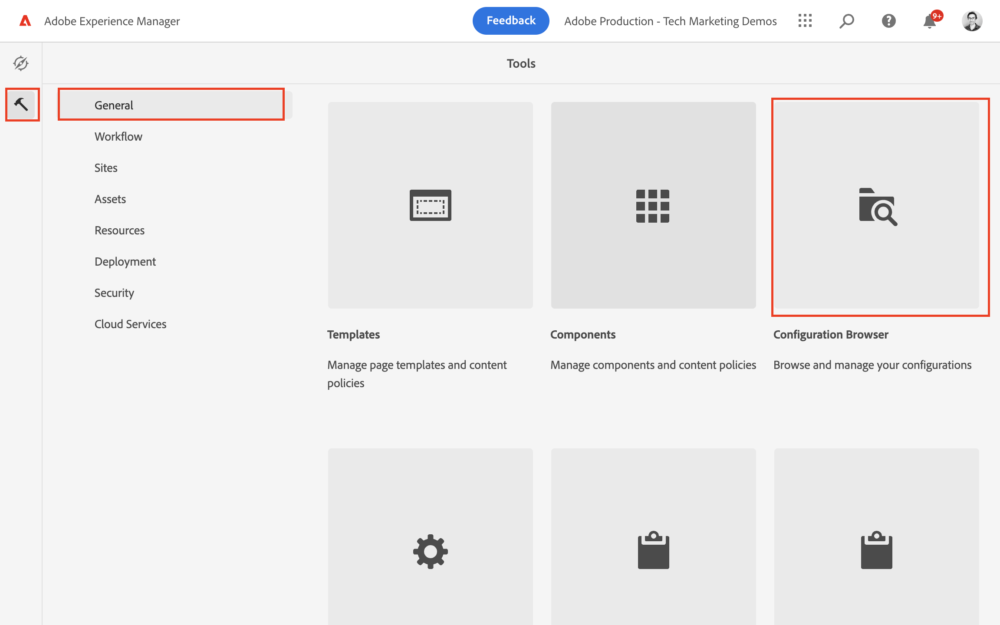
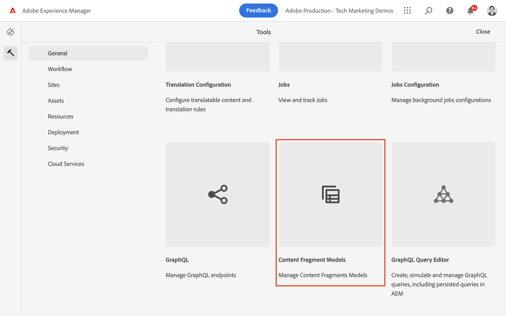
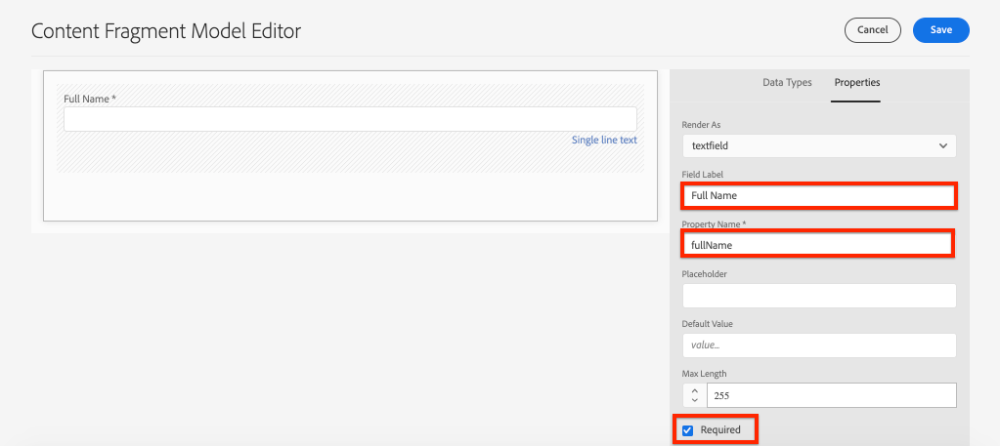
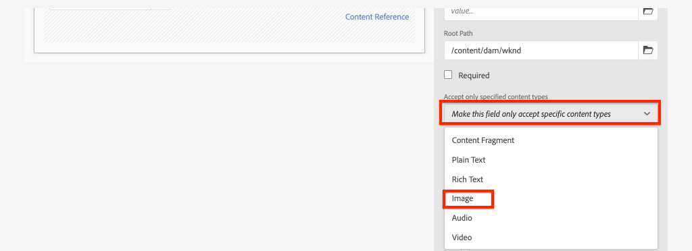
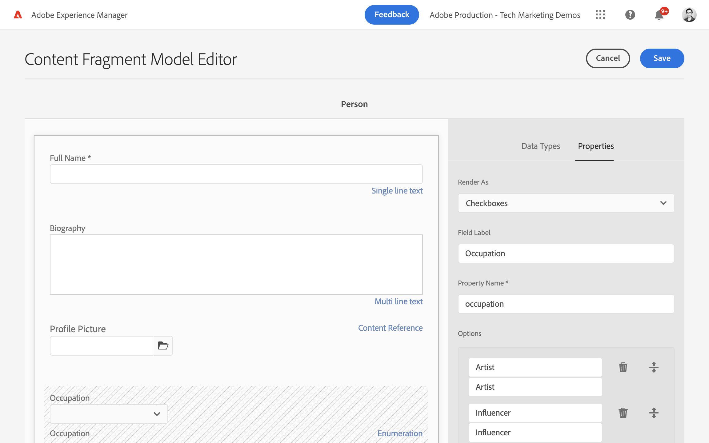
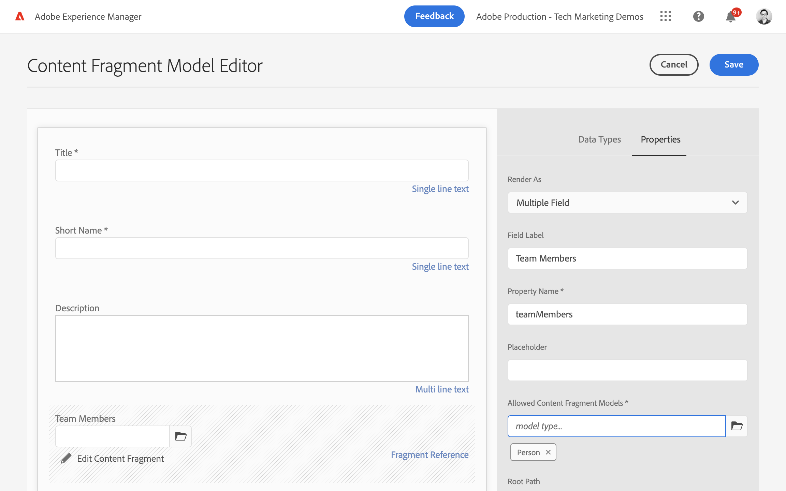
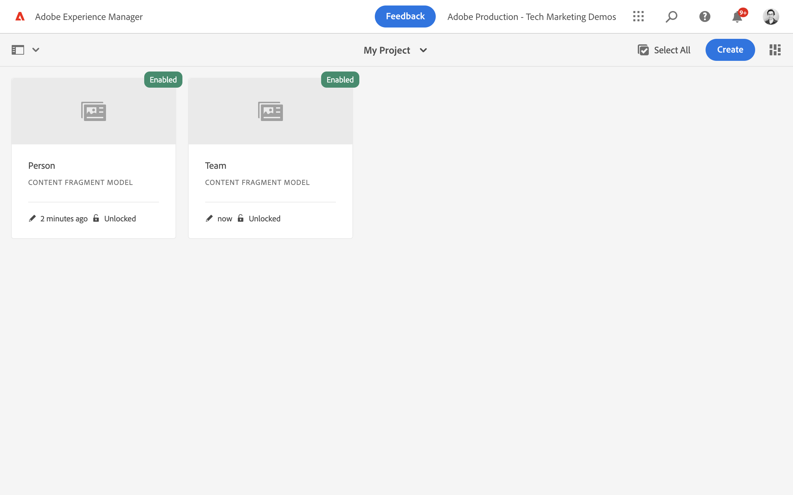
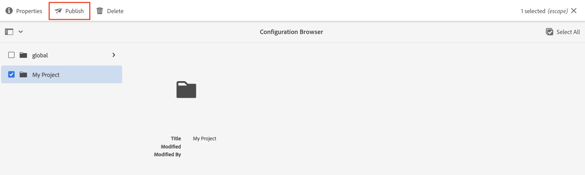
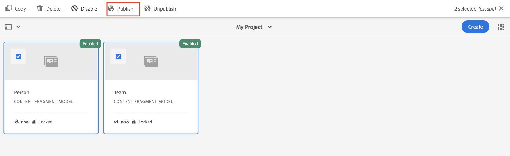

# Defining Content Fragment Models {#content-fragment-models}

In this chapter learn how to model content and build a schema with **Content Fragment Models**. You will learn about the different data types that can be used to define a schema as part of the model.

In this chapter two simple models will be created, **Team** and **Person**. The **Team** data model has name, short name and description and references the **Person** data model, which has fullname, bio details, profile picture and occupations list.

You are also welcome to create your own model following the basic steps and tweak the respective steps like GraphQL queries, and React App code or simply follow the steps outlined in these chapters.

## Prerequisites {#prerequisites}

This is a multi-part tutorial and it is assumed that an [AEM author environment is available](./overview.md#prerequisites)

## Objectives {#objectives}

* Create a new Content Fragment Model.
* Identify available data types and validation options for building models.
* Understand how the Content Fragment Model defines **both** the data schema and the authoring template for a Content Fragment.

## Create a new project configuration

A project configuration contains all of the Content Fragment models associated with a particular project and provides a means of organizing models. At least one project must be created **before** creating new Content Fragment Model.

1. Login to the AEM **Author** environment (ex. `https://author-pYYYY-eXXXX.adobeaemcloud.com/`)
1. From the AEM Start screen, navigate to **Tools** > **General** > **Configuration Browser**.

    
1. Click **Create**.
1. In the resulting dialog enter:

    * Title*: **My Project**
    * Name*: **my-project** (prefer to use all lowercase using hyphens to separate words. This string will influence the unique GraphQL endpoint that client applications will perform requests against.)
    * Check **Content Fragment Models**
    * Check **GraphQL Persistent Queries**

    

## Create Content Fragment Models

Next, create two models for a **Team** and a **Person**.

### Create the Person Model

Create a new model for a **Person**, which is the data model representing a person that is part of a team.

1. From the AEM Start screen, navigate to **Tools** > **General** > **Content Fragment Models**.

    

1. Navigate into the **My Project** folder.
1. Tap **Create** in the upper right corner to bring up the **Create Model** wizard.
1. For **Model Title** enter: **Person** and tap **Create**.

    Tap **Open** in the resulting dialog, to open the newly created model.

1. Drag and Drop a **Single line text** element on to the main panel. Enter the following properties on the **Properties** tab:

    * **Field Label**: **Full Name**
    * **Property Name**: `fullName`
    * Check **Required**

    

    The **Property Name** defines the name of the property that is persisted to AEM. The **Property Name** also defines the **key** name for this property as part of the data schema. This **key** will be used when the Content Fragment data is exposed via GraphQL APIs.

1. Tap the **Data Types** tab and drag and drop a **Multi line text** field beneath the **Full Name** field. Enter the following properties:

    * **Field Label**: **Biography**
    * **Property Name**: `biographyText`
    * **Default Type**: **Rich Text**

1. Click the **Data Types** tab and drag and drop a **Content Reference** field. Enter the following properties:

    * **Field Label**: **Profile Picture**
    * **Property Name**: `profilePicture`
    * **Root Path**: `/content/dam`

    When configuring the **Root Path** you can click the **folder** icon to bring up a modal to select the path. This will restrict which folders authors can use to populate the path. `/content/dam` is the root in which all AEM assets (images, videos, other Content Fragments) are stored.

1. Add a validation to the **Picture Reference** so that only content types of **Images** can be used to populate the field.

    

1. Click the **Data Types** tab and drag and drop an **Enumeration**  data type beneath the **Picture Reference** field. Enter the following properties:

    * **Render As**: **Checkboxes**
    * **Field Label**: **Occupation**
    * **Property Name**: `occupation`

1. Add several **Options** using the **Add a option** button. Use the same value for **Option Label** and **Option Value**:

    **Artist**, **Influencer**, **Photographer**, **Traveler**, **Writer**, **YouTuber**

1. The final **Person** model should look like the following:

    

1. Click **Save** to save the changes.

### Create the Team Model

Create a new model for a **Team**, which is the data model for a team of people. The Team model will reference the Person model to represent the members of the team.

1. In the **My Project** folder, tap **Create** in the upper right corner to bring up the **Create Model** wizard.
1. For **Model Title** enter: **Team** and tap **Create**.

    Tap **Open** in the resulting dialog, to open the newly created model.

1. Drag and Drop a **Single line text** element on to the main panel. Enter the following properties on the **Properties** tab:

    * **Field Label**: **Title**
    * **Property Name**: `title`
    * Check **Required**

1. Tap the **Data Types** tab and drag and Drop a **Single line text** element on to the main panel. Enter the following properties on the **Properties** tab:

    * **Field Label**: **Short Name**
    * **Property Name**: `shortName`
    * Check **Required**
    * Check **Unique**
    * Under **Validation Type** > choose **Custom**
    * Under **Custom Validation Regex** > enter `^[a-z0-9\-_]{5,40}$` - this will ensure that only lowercase alphanumeric values and dashes between 5 and 40 characters can be entered.

    The `shortName` property will provide us a way to query an individual team based on a shortened path. The **Unique** setting ensures that the value will always be unique per Content Fragment of this model.

1. Tap the **Data Types** tab and drag and drop a **Multi line text** field beneath the **Short Name** field. Enter the following properties:

    * **Field Label**: **Description**
    * **Property Name**: `description`
    * **Default Type**: **Rich Text**

1. Click the **Data Types** tab and drag and drop a **Fragment Reference** field. Enter the following properties:

    * **Render As**: **Multiple Field**
    * **Field Label**: **Team Members**
    * **Property Name**: `teamMembers`
    * **Allowed Content Fragment Models**: Use the folder icon to select the **Person** model.

1. The final **Team** model should look like the following:

    

1. Click **Save** to save the changes.

1. You should now have two models to work from:

    

## Publish Project Configuration & Content Fragment Models

Upon review and verification, publish the `Project Configuration` & `Content Fragment Model`

1. From the AEM Start screen, navigate to **Tools** > **General** > **Configuration Browser**.

1. Tap the checkbox next to **My Project** and tap **Publish**

    

1. From the AEM Start screen, navigate to **Tools** > **General** > **Content Fragment Models**.

1. Navigate into the **My Project** folder.

1. Tap **Person** and **Team** models and tap **Publish**

    

## Congratulations! {#congratulations}

Congratulations, you just created your first Content Fragment Models!

## Next Steps {#next-steps}

In the next chapter, [Authoring Content Fragment Models](author-content-fragments.md), you will create and edit a new Content Fragment based on a Content Fragment Model. You will also learn how to create variations of Content Fragments.

## Related Documentation

* [Content Fragment Models](https://experienceleague.adobe.com/docs/experience-manager-cloud-service/content/assets/content-fragments/content-fragments-models.html)

