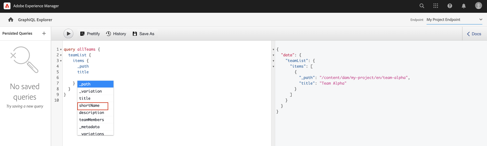

# Explore GraphQL APIs {#explore-graphql-apis}

The GraphQL API of AEM provides a powerful query language to expose data of Content Fragments to downstream applications. Content Fragment models define the data schema that is used by Content Fragments. Whenever a Content Fragment Model is created or updated, the schema is translated and added to the "graph" that makes up the GraphQL API.

In this chapter, let's explore some common GraphQL queries to gather content using an IDE called [GraphiQL](https://github.com/graphql/graphiql). The GraphiQL IDE allows you to quickly test and refine the queries and data returned. It also provides easy access to the documentation, making it easy to learn and understand what methods are available.

## Prerequisites {#prerequisites}

This is a multi-part tutorial and it is assumed that the steps outlined in the [Authoring Content Fragments](./author-content-fragments.md) have been completed.

## Objectives {#objectives}

* Learn to use the GraphiQL tool to construct a query using GraphQL syntax.
* Learn how to query a list of Content Fragments and a single Content Fragment.
* Learn how to filter and request specific data attributes.
* Learn how to join a query of multiple Content Fragment models
* Learn how to Persist GraphQL query.

## Enable GraphQL Endpoint {#enable-graphql-endpoint}

A GraphQL endpoint must be configured to enable GraphQL API queries for Content Fragments.

1.  From the AEM Start screen, navigate to **Tools** > **General** > **GraphQL**.

    

1.  Tap **Create** in the top-right corner, in the resulting dialog enter the following values:

    * Name*: **My Project Endpoint**.
    * Use GraphQL schema provided by ... *: **My Project**

    

    Tap **Create** to save the endpoint.

    The GraphQL endpoints created based on a project configuration only enable queries against models belonging to that project. In this case, the only queries against the **Person** and **Team** models can be used.

    >[!NOTE]
    >
    > A Global endpoint can also be created to enable queries against models across multiple configurations. This should be used with caution as it may open the environment to additional security vulnerabilities, and add to overall complexity in managing AEM.

1.  You should now see one GraphQL endpoint enabled on your environment.

    

## Using the GraphiQL IDE

The [GraphiQL](https://experienceleague.adobe.com/docs/experience-manager-cloud-service/content/headless/graphql-api/graphiql-ide.html) tool enables developers to create and test queries against content on the current AEM environment. The GraphiQL tool also enables users to **persist or save** queries to be used by client applications in a production setting.

Next, explore the power of AEM's GraphQL API using the built-in GraphiQL IDE.

1.  From the AEM Start screen, navigate to **Tools** > **General** > **GraphQL Query Editor**.

    

    >[!NOTE]
    >
    > In, the older versions of AEM the GraphiQL IDE may not be built in. It can be installed manually following these [instructions](#install-graphiql).

1.  In the top-right corner, make sure that the Endpoint is set to **My Project Endpoint**.

    

  This will scope all queries to models created in the **My Project** project.

### Query a list of Content Fragments {#query-list-cf}

A common requirement is to query for multiple Content Fragments.

1.  Paste the following query in the main panel (replacing the list of comments):

    ```graphql
    query allTeams {
      teamList {
        items {
          _path
          title
        }
      }
    } 
    ```

1.  Press the **Play** button in the top menu to execute the query. You should see the results of the content fragments from the previous chapter:

    

1.  Position the cursor beneath the `title` text and enter **CTRL+Space** to trigger code hinting. Add `shortname` and `description` to the query.

    

1.  Execute the query again by pressing the **Play** button and you should see that the results include the additional properties of `shortname` and `description`.

    

    The `shortname` is a simple property and `description` is a multi-line text field and the GraphQL API allows us to choose various formats for the results like `html`, `markdown`, `json`, or `plaintext`.

### Query for nested fragments

Next, experiment with querying is retrieving nested fragments, recall that the **Team** model references the **Person** model.

1.  Update the query to include the `teamMembers` property. Recall that this is a **Fragment Reference** field to the Person Model. Properties of the Person model can be returned:

    ```graphql
    query allTeams {
        teamList {
            items {
                _path
                title
                shortName
                description {
                    plaintext
                }
                teamMembers {
                    fullName
                    occupation
                }
            }
        }
    }
    ```

    JSON Response:

    ```json
    {
        "data": {
            "teamList": {
            "items": [
                {
                "_path": "/content/dam/my-project/en/team-alpha",
                "title": "Team Alpha",
                "shortName": "team-alpha",
                "description": {
                    "plaintext": "This is a description of Team Alpha!"
                },
                "teamMembers": [
                    {
                    "fullName": "John Doe",
                    "occupation": [
                        "Artist",
                        "Influencer"
                    ]
                    },
                    {
                    "fullName": "Alison Smith",
                    "occupation": [
                        "Photographer"
                    ]
                    }
                  ]
            }
            ]
            }
        }
    }
    ```

    The ability to query against nested fragments is a powerful feature of the AEM GraphQL API. In this simple example, the nesting is only two levels deep. However it's possible to nest fragments even further. For example, if there was an **Address** model associated with a **Person** it would be possible to return data from all three models in a single query.

### Filter a List of Content Fragments {#filter-list-cf}

Next, let's look at how it is possible to filter the results to a subset of Content Fragments based on a property value.

1.  Enter the following query in the GraphiQL UI:

    ```graphql
    query personByName($name:String!){
      personList(
        filter:{
          fullName:{
            _expressions:[{
              value:$name
              _operator:EQUALS
            }]
          }
        }
      ){
        items{
          _path
          fullName
          occupation
        }
      }
    }  
    ```

    The above query performs a search against all Person fragments in the system. The added filter to the beginning of the query performs a comparison on the `name` field and the variable string `$name`.

1.  In the **Query Variables** panel enter the following:

    ```json
    {"name": "John Doe"}
    ```

1.  Execute the query, it is expected that only **Persons** Content Fragment is returned with a value of `John Doe`.

    

    There are many other options for filtering and creating complex queries, see [Learning to use GraphQL with AEM - Sample Content and Queries](https://experienceleague.adobe.com/docs/experience-manager-cloud-service/content/headless/graphql-api/sample-queries.html).

1.  Enhance above query to fetch profile picture

    ```graphql
    query personByName($name:String!){
      personList(
        filter:{
          fullName:{
            _expressions:[{
              value:$name
              _operator:EQUALS
            }]
          }
        }
      ){
        items{  
          _path
          fullName
          occupation
          profilePicture{
            ... on ImageRef{
              _path
              _authorUrl
              _publishUrl
              height
              width
              
            }
          }
        }
      }
    } 
    ```

    The `profilePicture` is a content reference and it is expected to be an image, therefore built-in `ImageRef` object is used. This allows us to request additional data about the image being reference, like the `width` and `height`.

### Query a single Content Fragment {#query-single-cf}

It is also possible to directly query a single Content Fragment. Content in AEM is stored in a hierarchical manner and the unique identifier for a fragment is based on the fragment's path.

1.  Enter the following query in the GraphiQL editor:

    ```graphql
    query personByPath($path: String!) {
        personByPath(_path: $path) {
            item {
            fullName
            occupation
            }
        }
    }
    ```

1.  Enter the following for the **Query Variables**:

    ```json
    {"path": "/content/dam/my-project/en/alison-smith"}
    ```

1.  Execute the query and observe that the single result is returned.

## Persist Queries {#persist-queries}

Once a developer is happy with the query and result data returned from the query, the next step is to store or persist the query to AEM. The [Persisted queries](https://experienceleague.adobe.com/docs/experience-manager-cloud-service/content/headless/graphql-api/persisted-queries.html) are the preferred mechanism for exposing the GraphQL API to client applications. Once a query has been persisted, it can be requested using a GET request and cached at the Dispatcher and CDN layers. The performance of the persisted queries is much better. In addition to performance benefits, persisted queries ensure that extra data is not accidentally exposed to client applications. More details about [Persisted queries can be found here](https://experienceleague.adobe.com/docs/experience-manager-cloud-service/content/headless/graphql-api/persisted-queries.html).

Next, persist two simple queries, they are used in the next chapter.

1.  Enter the following query in the GraphiQL IDE:

    ```graphql
    query allTeams {
        teamList {
            items {
                _path
                title
                shortName
                description {
                    plaintext
                }
                teamMembers {
                    fullName
                    occupation
                }
            }
        }
    }
    ```

    Verify that the query works.

1.  Next tap **Save As** and enter `all-teams` as the **Query Name**.

    The query should be shown under **Persisted Queries** in the left rail.

    
1.  Next tap the ellipses **...** next to the persistent query and tap **Copy URL** to copy the path to your clipboard.

    

1.  Open a new tab and paste the copied path in your browser:

    ```plain
    https://$YOUR-AEMasCS-INSTANCEID$.adobeaemcloud.com/graphql/execute.json/my-project/all-teams
    ```

    It should look similar to the above path. You should see that the JSON results of the query returned.

    Breaking down the above URL:

    | Name | Description |
    | ---------|---------- |
    | `/graphql/execute.json` | Persistent query endpoint |
    | `/my-project` | Project configuration for `/conf/my-project` |
    | `/all-teams` | Name of the persisted query |

1.  Return to the GraphiQL IDE and use the plus button **+** to persist the NEW query

    ```graphql
    query personByName($name: String!) {
      personList(
        filter: {
          fullName:{
            _expressions: [{
              value: $name
              _operator:EQUALS
            }]
          }
        }){
        items {
          _path
          fullName
          occupation
          biographyText {
            json
          }
          profilePicture {
            ... on ImageRef {
              _path
              _authorUrl
              _publishUrl
              width
              height
            }
          }
        }
      }
    }
    ```

1.  Save the query as: `person-by-name`.
1.  You should have two persisted queries saved:

    


## Publish GraphQL Endpoint & Persisted Queries

Upon review and verification, publish the `GraphQL Endpoint` & `Persisted Queries`

1.  From the AEM Start screen, navigate to **Tools** > **General** > **GraphQL**.

1.  Tap the checkbox next to **My Project Endpoint** and tap **Publish**

    

1.  From the AEM Start screen, navigate to **Tools** > **General** > **GraphQL Query Editor**

1.  Tap the **all-teams** query from Persisted Queries panel and tap **Publish**

    

1.  Repeat above step for `person-by-name` query

## Solution Files {#solution-files}

Download the content, models, and persisted queries created in the last three chapters: [basic-tutorial-solution.content.zip](assets/explore-graphql-api/basic-tutorial-solution.content.zip) 

## Additional Resources

Learn more about the GraphQL queries at [Learning to use GraphQL with AEM - Sample Content and Queries](https://experienceleague.adobe.com/docs/experience-manager-cloud-service/content/headless/graphql-api/sample-queries.html).

## Congratulations! {#congratulations}

Congratulations, you created and executed several GraphQL queries!

## Next Steps {#next-steps}

In the next chapter, [Build React app](./graphql-and-react-app.md), you explore how an external application can query AEM's GraphQL endpoints and use these two persisted queries. You are also introduced to some basic error handling during GraphQL query execution.

## Install the GraphiQL Tool (Optional) {#install-graphiql}

In, some versions of AEM (6.X.X) the GraphiQL IDE tool needs to be manually installed, use the [instructions from here](../how-to/install-graphiql-aem-6-5.md).

