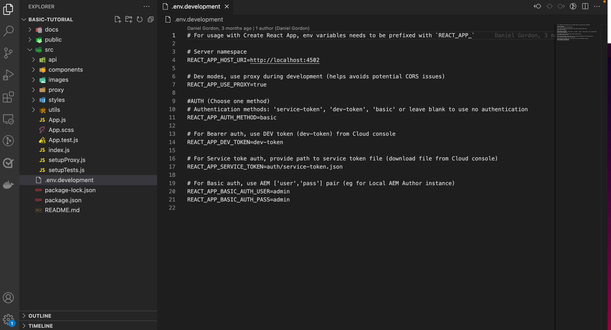
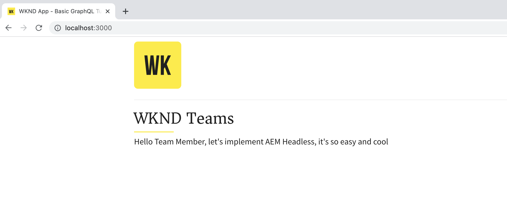
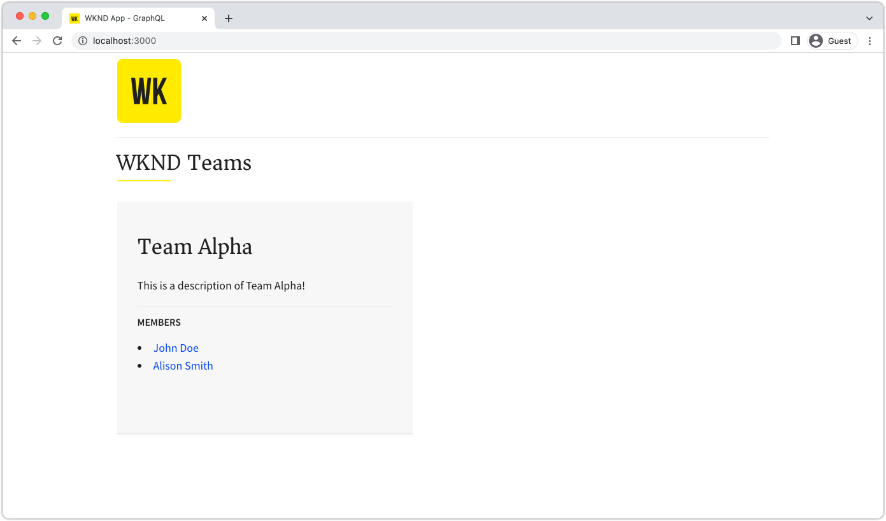
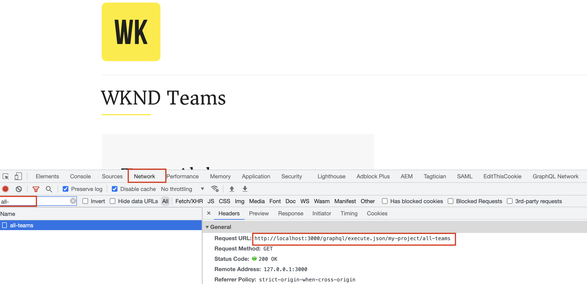

# Build a React app that use AEM's GraphQL APIs

In this chapter, you explore how AEM's GraphQL APIs can drive the experience in an external application.

A simple React app is used to query and display **Team** and **Person** content exposed by AEM's GraphQL APIs. The use of React is largely unimportant, and the consuming external application could be written in any framework for any platform.

## Prerequisites

It is assumed that the steps outlined in the previous parts of this multi-part tutorial have been completed, or [tutorial-solution-content.zip](assets/explore-graphql-api/tutorial-solution-content.zip) is installed on your AEM as a Cloud Service Author and Publish services.

_IDE screenshots in this chapter come from [Visual Studio Code](https://code.visualstudio.com/)_

The following software must be installed:

- [Node.js v18](https://nodejs.org/)
- [Visual Studio Code](https://code.visualstudio.com/)

## Objectives

Learn how to:

- Download and start the example React app
- Query AEM's GraphQL end-points using the [AEM Headless JS SDK](https://github.com/adobe/aem-headless-client-js)
- Query AEM for a list of teams, and their referenced members
- Query AEM for a team member's details

## Get the sample React app

In this chapter, a stubbed-out sample React app is implemented with the code required to interact with AEM's GraphQL API, and display team and person data obtained from them.

The sample React app source code is available on Github.com at <https://github.com/adobe/aem-guides-wknd-graphql/tree/main/basic-tutorial>

To get the React app:

1. Clone the sample WKND GraphQL React app from [Github.com](https://github.com/adobe/aem-guides-wknd-graphql).

   ```shell
   $ cd ~/Code
   $ git clone git@github.com:adobe/aem-guides-wknd-graphql.git
   ```

1. Navigate to `basic-tutorial` folder and open it in your IDE.

   ```shell
   $ cd ~/Code/aem-guides-wknd-graphql/basic-tutorial
   $ code .
   ```

   

1. Update `.env.development` to connect to AEM as a Cloud Service Publish service.

    - Set `REACT_APP_HOST_URI`'s value to be your AEM as a Cloud Service's Publish URL (ex. `REACT_APP_HOST_URI=https://publish-p123-e456.adobeaemcloud.com`) and `REACT_APP_AUTH_METHOD`'s value to `none`

    >[!NOTE]
    >
    > Make sure you have published project configuration, Content Fragment models, authored Content Fragments, GraphQL endpoints and persisted queries from previous steps.
    >
    > If you performed above steps on local AEM Author SDK, you can point to `http://localhost:4502` and `REACT_APP_AUTH_METHOD`'s value to `basic`.


1. From the command line, go to the `aem-guides-wknd-graphql/basic-tutorial` folder

1. Start the React app

   ```shell
   $ cd ~/Code/aem-guides-wknd-graphql/basic-tutorial
   $ npm install
   $ npm start
   ```   

1. The React app starts in development mode on [http://localhost:3000/](http://localhost:3000/). Changes made to the React app throughout the tutorial, are reflected immediately.

  

>[!IMPORTANT]
>
>   This React app is partially implemented. Following the steps in this tutorial to complete the implementation. The JavaScript files that need implementation work have the following comment, make sure you add/update the code in those files with the code specified in this tutorial.
>
>
> //*********************************
>
>  // TODO :: Implement this by following the steps from AEM Headless Tutorial 
>
>  //*********************************
>

## Anatomy of the React app

The sample React app has three main parts:

1.  The `src/api` folder contains files used to make GraphQL queries to AEM.
    - `src/api/aemHeadlessClient.js` initializes and exports the AEM Headless Client used to communicate with AEM
    - `src/api/usePersistedQueries.js` implements [custom React hooks](https://react.dev/docs/hooks-custom.html) return data from AEM GraphQL to the `Teams.js` and `Person.js` view components.

1.  The `src/components/Teams.js` file displays a list of teams and their members, by using a list query.
1.  The `src/components/Person.js` file displays the details of a single person, using a parameterized, single-result query.

## Review the AEMHeadless object

Review the `aemHeadlessClient.js` file for how to create the `AEMHeadless` object used to communicate with AEM.

1.  Open `src/api/aemHeadlessClient.js`.

1.  Review the lines 1-40:

    -   The import `AEMHeadless` declaration from the [AEM Headless Client for JavaScript](https://github.com/adobe/aem-headless-client-js), line 11.

    -   The configuration of authorization based on variables defined in `.env.development`, line 14-22, and, the arrow function expression `setAuthorization`, line 31-40. 
    
    -   The `serviceUrl` setup for the included [development proxy](https://github.com/adobe/aem-guides-wknd-graphql/tree/main/react-app#proxy-api-requests) configuration, line 27.

1.  Lines 42-49, are most important, as they instantiate the `AEMHeadless` client and export it for use throughout the React app.

   ```javascript
   // Initialize the AEM Headless Client and export it for other files to use
   const aemHeadlessClient = new AEMHeadless({
     serviceURL: serviceURL,
     endpoint: REACT_APP_GRAPHQL_ENDPOINT,
     auth: setAuthorization(),
   });

   export default aemHeadlessClient;
   ```

## Implement to run AEM GraphQL persisted queries

To implement the generic `fetchPersistedQuery(..)` function to run the AEM GraphQL persisted queries open the `usePersistedQueries.js` file. The `fetchPersistedQuery(..)` function uses the `aemHeadlessClient` object's `runPersistedQuery()` function to run query asynchronously, promise-based behavior.

Later, custom React `useEffect` hook calls this function to retrieve specific data from AEM.

1. In `src/api/usePersistedQueries.js` **update** `fetchPersistedQuery(..)`, line 35, with the code below.

```javascript
/**
 * Private, shared function that invokes the AEM Headless client.
 *
 * @param {String} persistedQueryName the fully qualified name of the persisted query
 * @param {*} queryParameters an optional JavaScript object containing query parameters
 * @returns the GraphQL data or an error message
 */
async function fetchPersistedQuery(persistedQueryName, queryParameters) {
  let data;
  let err;

  try {
    // AEM GraphQL queries are asynchronous, either await their return or use Promise-based syntax
    const response = await aemHeadlessClient.runPersistedQuery(
      persistedQueryName,
      queryParameters
    );
    // The GraphQL data is stored on the response's data field
    data = response?.data;
  } catch (e) {
    // An error occurred, return the error messages
    err = e
      .toJSON()
      ?.map((error) => error.message)
      ?.join(", ");
    console.error(e.toJSON());
  }

  // Return the GraphQL and any errors
  return { data, err };
}
```

## Implement Teams functionality

Next, build out the functionality to display the Teams and their members on the React app's main view. This functionality requires:

- A new [custom React useEffect hook](https://react.dev/docs/hooks-custom.html) in `src/api/usePersistedQueries.js` that invokes the `my-project/all-teams` persisted query, returning a list of Team Content Fragments in AEM.
- A React component at `src/components/Teams.js` that invokes the new custom React `useEffect` hook, and renders the teams data.

Once complete, the app's main view populates with the teams data from AEM.

  

### Steps

1. Open `src/api/usePersistedQueries.js`.

1. Locate the function `useAllTeams()`

1. To create a `useEffect` hook that invokes the persisted query `my-project/all-teams` via `fetchPersistedQuery(..)`, add the following code. The hook also only returns the relevant data from the AEM GraphQL response at `data?.teamList?.items`, allowing the React view components to be agnostic of the parent JSON structures.

   ```javascript
   /**
    * Custom hook that calls the 'my-project/all-teams' persisted query.
    *
    * @returns an array of Team JSON objects, and array of errors
    */
   export function useAllTeams() {
     const [teams, setTeams] = useState(null);
     const [error, setError] = useState(null);

     // Use React useEffect to manage state changes
     useEffect(() => {
       async function fetchData() {
         // Call the AEM GraphQL persisted query named "my-project/all-teams"
         const { data, err } = await fetchPersistedQuery(
           "my-project/all-teams"
         );
         // Sets the teams variable to the list of team JSON objects
         setTeams(data?.teamList?.items);
         // Set any errors
         setError(err);
       }
       // Call the internal fetchData() as per React best practices
       fetchData();
     }, []);

     // Returns the teams and errors
     return { teams, error };
   }
   ```

1. Open `src/components/Teams.js`

1. In the `Teams` React component, fetch the list of teams from AEM using the `useAllTeams()` hook.

   ```javascript
   import { useAllTeams } from "../api/usePersistedQueries";
   ...
   function Teams() {
     // Get the Teams data from AEM using the useAllTeams
     const { teams, error } = useAllTeams();
     ...
   }
   ```


1. Perform the view-based data validation, displaying an error message or loading indicator based on the returned data.

   ```javascript

   function Teams() {
     const { teams, error } = useAllTeams();

     // Handle error and loading conditions
     if (error) {
       // If an error ocurred while executing the GraphQL query, display an error message
       return <Error errorMessage={error} />;
     } else if (!teams) {
       // While the GraphQL request is executing, show the Loading indicator
       return <Loading />;
     }
     ...
   }
   ```

1. Finally, render the teams data. Each team returned from the GraphQL query is rendered using the provided `Team` React subcomponent.

   ```javascript
   import React from "react";
   import { Link } from "react-router-dom";
   import { useAllTeams } from "../api/usePersistedQueries";
   import Error from "./Error";
   import Loading from "./Loading";
   import "./Teams.scss";

   function Teams() {
     const { teams, error } = useAllTeams();

     // Handle error and loading conditions
     if (error) {
       return <Error errorMessage={error} />;
     } else if (!teams) {
       return <Loading />;
     }

     // Teams have been populated by AEM GraphQL query. Display the teams.
     return (
       <div className="teams">
         {teams.map((team, index) => {
           return <Team key={index} {...team} />;
         })}
       </div>
     );
   }

   // Render single Team
   function Team({ title, shortName, description, teamMembers }) {
     // Must have title, shortName and at least 1 team member
     if (!title || !shortName || !teamMembers) {
       return null;
     }

     return (
       <div className="team">
         <h2 className="team__title">{title}</h2>
         <p className="team__description">{description.plaintext}</p>
         <div>
           <h4 className="team__members-title">Members</h4>
           <ul className="team__members">
             {/* Render the referenced Person models associated with the team */}
             {teamMembers.map((teamMember, index) => {
               return (
                 <li key={index} className="team__member">
                   <Link to={`/person/${teamMember.fullName}`}>
                     {teamMember.fullName}
                   </Link>
                 </li>
               );
             })}
           </ul>
         </div>
       </div>
     );
   }

   export default Teams;
   ```


## Implement Person functionality

With the [Teams functionality](#implement-teams-functionality) complete, let's implement the functionality to handle the display on a team member's, or person's, details.

This functionality requires:

-   A new [custom React useEffect hook](https://react.dev/docs/hooks-custom.html) in `src/api/usePersistedQueries.js` that invokes the parameterized `my-project/person-by-name` persisted query, and returns a single person record.

-   A React component at `src/components/Person.js` that uses a person's full name as a query parameter, invokes the new custom React `useEffect` hook, and renders the person data.

Once complete, selecting a person's name in the Teams view, renders the person view.


1. Open `src/api/usePersistedQueries.js`.

1. Locate the function `usePersonByName(fullName)`

1. To create a `useEffect` hook that invokes the persisted query `my-project/all-teams` via `fetchPersistedQuery(..)`, add the following code. The hook also only returns the relevant data from the AEM GraphQL response at `data?.teamList?.items`, allowing the React view components to be agnostic of the parent JSON structures.

   ```javascript
   /**
    * Calls the 'my-project/person-by-name' and provided the {fullName} as the persisted query's `name` parameter.
    *
    * @param {String!} fullName the full
    * @returns a JSON object representing the person
    */
   export function usePersonByName(fullName) {
     const [person, setPerson] = useState(null);
     const [errors, setErrors] = useState(null);

     useEffect(() => {
       async function fetchData() {
         // The key is the variable name as defined in the persisted query, and may not match the model's field name
         const queryParameters = { name: fullName };

         // Invoke the persisted query, and pass in the queryParameters object as the 2nd parameter
         const { data, err } = await fetchPersistedQuery(
           "my-project/person-by-name",
           queryParameters
         );

         if (err) {
           // Capture errors from the HTTP request
           setErrors(err);
         } else if (data?.personList?.items?.length === 1) {
           // Set the person data after data validation
           setPerson(data.personList.items[0]);
         } else {
           // Set an error if no person could be found
           setErrors(`Cannot find person with name: ${fullName}`);
         }
       }
       fetchData();
     }, [fullName]);

     return { person, errors };
   }
   ```

1. Open `src/components/Person.js`
1. In the `Person` React component, parse the `fullName` route parameter, and fetch the person data from AEM using the `usePersonByName(fullName)` hook.

   ```javascript
   import { useParams } from "react-router-dom";
   import { usePersonByName } from "../api/usePersistedQueries";
   ...
   function Person() {
     // Read the person's `fullName` which is the parameter used to query for the person's details
     const { fullName } = useParams();

     // Query AEM for the Person's details, using the `fullName` as the filtering parameter
     const { person, error } = usePersonByName(fullName);
     ...
   }
   ```

1. Perform view-based data validation, displaying an error message or loading indicator based on the returned data.

   ```javascript

   function Person() {
     // Read the person's `fullName` which is the parameter used to query for the person's details
     const { fullName } = useParams();

     // Query AEM for the Person's details, using the `fullName` as the filtering parameter
     const { person, error } = usePersonByName(fullName);

     // Handle error and loading conditions
     if (error) {
       return <Error errorMessage={error} />;
     } else if (!person) {
       return <Loading />;
     }
     ...
   }
   ```

1. Finally, render the person data.

   ```javascript
   import React from "react";
   import { useParams } from "react-router-dom";
   import { usePersonByName } from "../api/usePersistedQueries";
   import { mapJsonRichText } from "../utils/renderRichText";
   import Error from "./Error";
   import Loading from "./Loading";
   import "./Person.scss";

   function Person() {
     // Read the person's `fullName` which is the parameter used to query for the person's details
     const { fullName } = useParams();

     // Query AEM for the Person's details, using the `fullName` as the filtering parameter
     const { person, error } = usePersonByName(fullName);

     // Handle error and loading conditions
     if (error) {
       return <Error errorMessage={error} />;
     } else if (!person) {
       return <Loading />;
     }

     // Render the person data
     return (
       <div className="person">
         
         <div className="person__occupations">
           {person.occupation.map((occupation, index) => {
             return (
               <span key={index} className="person__occupation">
                 {occupation}
               </span>
             );
           })}
         </div>
         <div className="person__content">
           <h1 className="person__full-name">{person.fullName}</h1>
           <div className="person__biography">
             {/* Use this utility to transform multi-line text JSON into HTML */}
             {mapJsonRichText(person.biographyText.json)}
           </div>
         </div>
       </div>
     );
   }

   export default Person;
   ```

## Try the app

Review the app [http://localhost:3000/](http://localhost:3000/) and click _Members_ links. Also you can add more teams and/ or members to the Team Alpha by adding Content Fragments in AEM.

## Under The Hood

Open the browser's **Developer Tools** > **Network** and _Filter_ for `all-teams` request. Notice the GraphQL API request `/graphql/execute.json/my-project/all-teams` is made against `http://localhost:3000` and **NOT** against the value of `REACT_APP_HOST_URI` (for example, <https://publish-p123-e456.adobeaemcloud.com>). The requests are made against the React app's domain because [proxy setup](https://create-react-app.dev/docs/proxying-api-requests-in-development/#configuring-the-proxy-manually) is enabled using `http-proxy-middleware` module. 





Review the main `../setupProxy.js` file and within `../proxy/setupProxy.auth.**.js` files notice how `/content` and `/graphql` paths are proxied and indicated it's not a static asset.

  ```javascript
  module.exports = function(app) {
    app.use(
      ['/content', '/graphql'],
    ...
  ```

Using the local proxy is not a suitable option for production deployment and more details can be found at _Production Deployment_ section.

## Congratulations!{#congratulations}

Congratulations! You've successfully create the React app to consume and display data from AEM's GraphQL APIs as part of basic tutorial!
