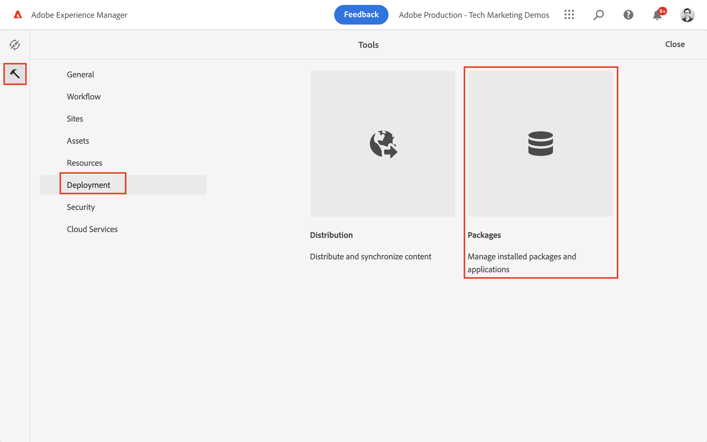
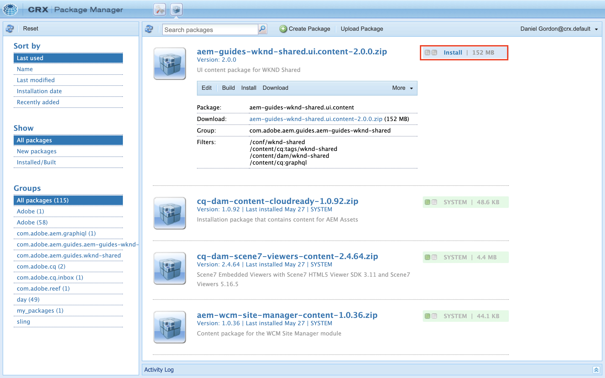

# Getting Started with AEM Headless - GraphQL

An end-to-end tutorial illustrating how to build-out and expose content using AEM's GraphQL APIs and consumed by an external app, in a headless CMS scenario.

This tutorial explores how AEM's GraphQL APIs and headless capabilities can be used to power the experiences surfaced in an external app.

This tutorial will cover the following topics:

* Create a new Project Configuration
* Create new Content Fragment Models to model data
* Create new Content Fragments based on the previously made models.
* Explore how Content Fragments in AEM can be queried using the integrated GraphiQL development tool.
* To store or persist the GraphQL queries to AEM
* Consume persisted GraphQL queries from a sample React app

## Prerequisites {#prerequisites}

The following are required to follow this tutorial:

* Basic HTML and JavaScript skills
* The following tools must be installed locally:
  * [Node.js v10+](https://nodejs.org/en/)
  * [npm 6+](https://www.npmjs.com/)
  * [Git](https://git-scm.com/)
  * An IDE (for example, [Microsoft® Visual Studio Code](https://code.visualstudio.com/))

### AEM Environment

An Adobe Experience Manager environment is required to complete this tutorial. Any of the following can be used (screenshots are recorded from an AEM as a Cloud Service environment):

* AEM as a Cloud Service environment with:
  * [Access to AEM as a Cloud Service and Cloud Manager](/help/cloud-service/accessing/overview.md)
    * **AEM Administrator** access to AEM as a Cloud Service
    * **Cloud Manager - Developer** access to Cloud Manager
* [Local AEM as a Cloud Service Quickstart SDK](/help/cloud-service/local-development-environment/aem-runtime.md).
* [AEM 6.5.13+](https://experienceleague.adobe.com/docs/experience-manager-65/release-notes/release-notes.html)

### Install sample content {#install-sample-content}

It can be helpful to have sample content already available on the AEM environment to be used as a reference.

1. Navigate to the [AEM WKND Shared Project](https://github.com/adobe/aem-guides-wknd-shared/releases).
1. Download the latest released asset: `aem-guides-wknd-shared.ui.content-x.x.x.zip`.
1. Login to the AEM author environment to be used for the tutorial.
1. From the AEM start screen, navigate to **Tools** > **Deployment** > **Packages**:

    
1. Tap **Upload Package** and choose the `aem-guides-wknd-shared.ui.content-x.x.x.zip` file downloaded previously. Tap **Ok** to upload.
1. Once the package has finished uploading, tap **Install** to install the content.

    

1. Sample Content Fragments, Content Fragment Models, images and more will be installed for the ficticious [WKND brand](https://wknd.site/). The sample content will be referenced later in the tutorial.

## Let's get started!

1. Start the tutorial with [Defining Content Fragment Models](content-fragment-models.md).

## GitHub Project

The source code, and content packages are available on the [AEM Guides - WKND GraphQL GitHub Project](https://github.com/adobe/aem-guides-wknd-graphql).

If you find an issue with the tutorial or the code, please leave a [GitHub issue](https://github.com/adobe/aem-guides-wknd-graphql/issues).

Sample Content Fragments, models, and queries can be found in the [AEM WKND Shared Project](https://github.com/adobe/aem-guides-wknd-shared)
