# Production deployment with an AEM Publish service

In this tutorial, you will set up a local environment to simulate content being distributed from an Author instance to a Publish instance. You will also generate production build of a React App configured to consume content from the AEM Publish environment using the GraphQL APIs. Along the way, you will learn how to effectively use environment variables and how to update the AEM CORS configurations.

## Prerequisites

This tutorial is part of a multi-part tutorial. It is assumed that the steps outlined in the previous parts have been completed.

## Objectives

Learn how to:

* Understand the AEM Author and Publish architecture.
* Learn best practices for managing environment variables.
* Learn how to properly configure AEM for Cross-Origin resource sharing (CORS).

## Author Publish deployment pattern {#deployment-pattern}

A full AEM environment is made up of an Author, Publish, and Dispatcher. The Author service is where internal users create, manage, and preview content. The Publish service is considered the "Live" environment and is typically what end users interact with. Content, after being edited and approved on the Author service, is distributed to the Publish service.

The most common deployment pattern with AEM headless applications is to have the production version of the application connect to an AEM Publish service.

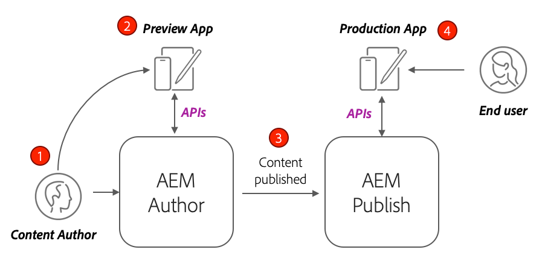

The diagram above depicts this common deployment pattern.

1. A **Content author** uses the AEM author service to create, edit, and manage content.
2. The **Content author** and other internal users can preview the content directly on the Author service. A Preview version of the application can be set up that connects to the Author service.
3. Once content has been approved, it can be **published** to the AEM Publish service.
4. **End users** interact with the Production version of the application. The Production application connects to the Publish service and use the GraphQL APIs to request and consume content.

The tutorial simulates the above deployment by adding an AEM Publish instance to the current setup. In previous chapters the React App acted as a preview by connecting directly to the Author instance. A production build of the React App is deployed to a static Node.js server that connects to the new Publish instance.

In the end, three local servers are running:

* http://localhost:4502 - Author instance
* http://localhost:4503 - Publish Instance
* http://localhost:5000 - React App in production mode, connecting to the Publish instance.

## Install AEM SDK - Publish mode {#aem-sdk-publish}

Currently we have a running instance of the SDK in **Author** mode. The SDK can also be started in **Publish** mode to simulate an AEM Publish environment.

A more detailed guide for setting up a local development environment [can be found here](https://experienceleague.adobe.com/docs/experience-manager-learn/cloud-service/local-development-environment-set-up/overview.html?lang=en#local-development-environment-set-up).

1. On your local file system, create a dedicated folder to install the Publish instance, i.e named `~/aem-sdk/publish`.
1. Copy the Quickstart jar file used for the Author instance in previous chapters and paste it in the `publish` directory. Alternatively navigate to the [Software Distribution Portal](https://experience.adobe.com/#/downloads/content/software-distribution/en/aemcloud.html) and download the latest SDK and extract the Quickstart jar file.
1. Rename the jar file to `aem-publish-p4503.jar`.

    The `publish` string specifies that the Quickstart jar starts in Publish mode. The `p4503` specifies that the Quickstart server runs on port 4503.

1. Open a new terminal window and navigate to the folder that contains the jar file. Install and start the AEM instance:

    ```shell
    $ cd ~/aem-sdk/publish
    $ java -jar aem-publish-p4503.jar
    ```

1. Provide an admin password as `admin`. Any admin password is acceptable, however it is recommended to use the default for local development to avoid extra configurations.
1. When the AEM instance has finished installing, a new browser window will open at [http://localhost:4503/content.html](http://localhost:4503/content.html)

    It is expected to return a 404 Not Found page. This is a brand new AEM instance and no content has been installed.

## Install sample content and GraphQL endpoints {#wknd-site-content-endpoints}

Just like on the Author instance, the Publish instance needs to have the GraphQL endpoints enabled and needs sample content. Next, install the WKND Reference Site on the Publish instance.

1. Download the latest compiled AEM Package for WKND Site: [aem-guides-wknd.all-x.x.x.zip](https://github.com/adobe/aem-guides-wknd/releases/latest).

    >[!NOTE]
    >
    > Make sure to download the standard version compatible with AEM as a Cloud Service and **not** the `classic` version.

1. Log in to the Publish instance by navigating directly to: [http://localhost:4503/libs/granite/core/content/login.html](http://localhost:4503/libs/granite/core/content/login.html) with the user name `admin` and password `admin`.
1. Next, navigate to Package Manager at [http://localhost:4503/crx/packmgr/index.jsp](http://localhost:4503/crx/packmgr/index.jsp).
1. Click **Upload Package** and choose the WKND package downloaded in the prior step. Click **Install** to install the package.
1. After installing the package, the WKND reference site is now available at [http://localhost:4503/content/wknd/us/en.html](http://localhost:4503/content/wknd/us/en.html).
1. Sign out as the `admin` user by clicking the "Sign out" button in the menu bar.

    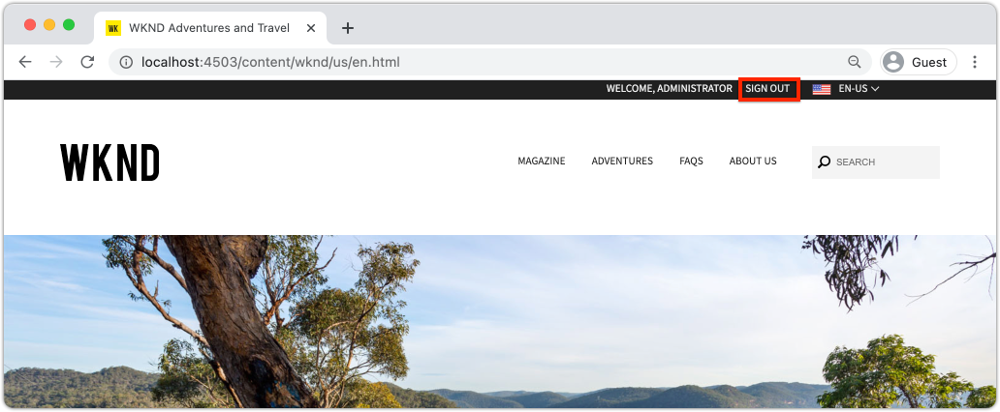

    Unlike the AEM Author instance, the AEM Publish instances default to anonymous read-only access. We want to simulate the experience of an anonymous user when running the React application.

## Update Environment variables to point the Publish instance {#react-app-publish}

Next, update the environment variables used by the React application to point to the Publish instance. The React App should **only** connect to the Publish instance in production mode.

Next, add a new file `.env.production.local` to simulate the production experience.

1. Open the WKND GraphQL React app in your IDE.

1. Beneath `aem-guides-wknd-graphql/react-app`, add a file named `.env.production.local`.
1. Populate `.env.production.local` with the following:

    ```plain
    REACT_APP_HOST_URI=http://localhost:4503
    REACT_APP_GRAPHQL_ENDPOINT=/content/graphql/global/endpoint.json
    ```

    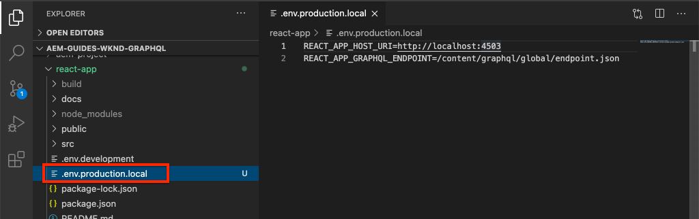

    Using environment variables makes it easy to toggle the GraphQL endpoint between an Author or Publish environment without adding extra logic inside the application code. More information about [custom environment variables for React can be found here](https://create-react-app.dev/docs/adding-custom-environment-variables).

    >[!NOTE]
    >
    > Observe that no authentication information is included since Publish environments provide anonymous access to content by default.

## Deploy a static Node server {#static-server}

The React app can be started by using the webpack server, but this is for development only. Next, simulate a production deployment by using [serve](https://github.com/vercel/serve) to host a production build of the React app using Node.js.

1. Open a new terminal window and navigate to the `aem-guides-wknd-graphql/react-app` directory

    ```shell
    $ cd aem-guides-wknd-graphql/react-app
    ```

1. Install [serve](https://github.com/vercel/serve) with the following command:

    ```shell
    $ npm install serve --save-dev
    ```

1. Open the file `package.json` at `react-app/package.json`. Add a script named `serve`:

    ```diff
     "scripts": {
        "start": "react-scripts start",
        "build": "react-scripts build",
        "test": "react-scripts test",
        "eject": "react-scripts eject",
    +   "serve": "npm run build && serve -s build"
    },
    ```

    The `serve` script performs two actions. First, a production build of the React App is generated. Second, the Node.js server starts and uses the production build.

1. Return to the terminal and enter the command to start the static server:

    ```shell
    $ npm run serve

    ┌────────────────────────────────────────────────────┐
    │                                                    │
    │   Serving!                                         │
    │                                                    │
    │   - Local:            http://localhost:5000        │
    │   - On Your Network:  http://192.168.86.111:5000   │
    │                                                    │
    │   Copied local address to clipboard!               │
    │                                                    │
    └────────────────────────────────────────────────────┘
    ```

1. Open a new browser and navigate to [http://localhost:5000/](http://localhost:5000/). You should see the React App being served.

    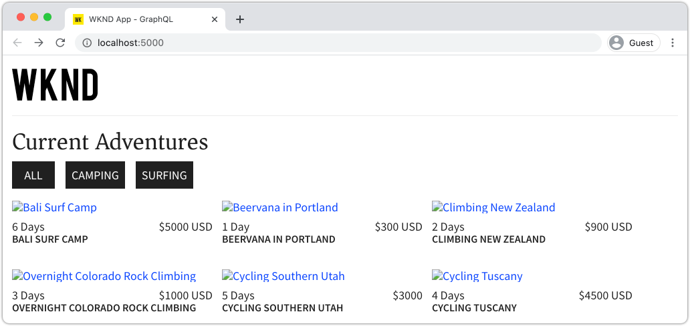

    Notice that the GraphQL query is working on the home page. Inspect the **XHR** request using your developer tools. Observe that the GraphQL POST is to the Publish instance at `http://localhost:4503/content/graphql/global/endpoint.json`.

    However, all the images are broken on the home page!

1. Click into one of the Adventure Detail pages.

    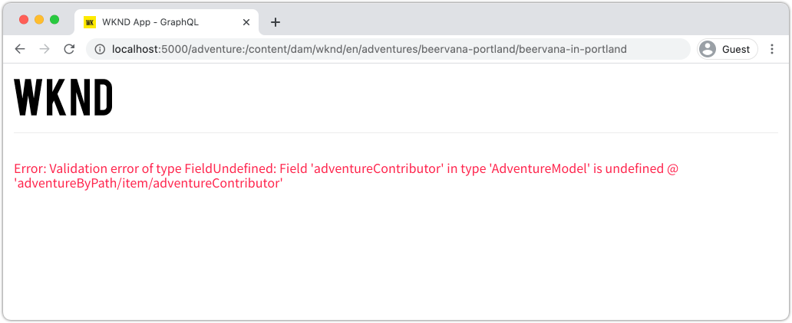

    Observe that a GraphQL error is thrown for `adventureContributor`. In the next exercises, the broken images and the `adventureContributor` issues are fixed.

## Absolute Image references {#absolute-image-references}

The images appear broken because the `` tag:

    ```diff
    - 
    + 
    ```

1. Open the file `AdventureDetail.js` at `react-app/src/components/AdventureDetail.js`.
1. Repeat the same steps to modify the GraphQL query and add the `_publishUrl` property for the Adventure

    ```diff
     adventureByPath (_path: "${_path}") {
        item {
            _path
            adventureTitle
            adventureActivity
            adventureType
            adventurePrice
            adventureTripLength
            adventureGroupSize
            adventureDifficulty
            adventurePrice
            adventurePrimaryImage {
                ... on ImageRef {
                _path
    +           _publishUrl
                mimeType
                width
                height
                }
            }
            adventureDescription {
                html
            }
            adventureItinerary {
                html
            }
            adventureContributor {
                fullName
                occupation
                pictureReference {
                    ...on ImageRef {
                        _path
    +                   _publishUrl
                    }
                }
            }
        }
        }
    } 
    ```

1. Modify the two `` tags for the Adventure Primary Image and the Contributor Picture reference in `AdventureDetail.js`:

    ```diff
    /* AdventureDetail.js */
    ...
    
    ...
    pictureReference =  
    ```

1. Return to the terminal and start the static server:

    ```shell
    $ npm run serve
    ```

1. Navigate to [http://localhost:5000/](http://localhost:5000/) and observe that images appear and that the `` attribute points to `http://localhost:4503`.

    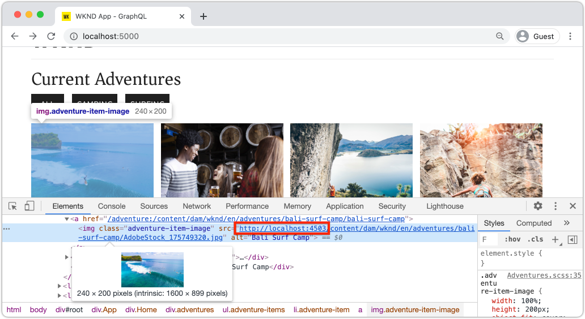

## Simulate content publishing {#content-publish}

Recall that a GraphQL error is thrown for `adventureContributor` when an Adventure Details page is requested. The **Contributor** Content Fragment Model does not yet exist on the Publish instance. Updates made to the **Adventure** Content Fragment Model are also not available on the Publish instance. These changes were made directly to the Author instance and need to be distributed to the Publish instance.

This is something to consider when rolling out new updates to an application that relies on updates to a Content Fragment or a Content Fragment Model.

Next, lets simulate content publishing between the local Author and Publish instances.

1. Start the Author instance (if not already started) and navigate to Package Manager at [http://localhost:4502/crx/packmgr/index.jsp](http://localhost:4502/crx/packmgr/index.jsp)
1. Download the package [EnableReplicationAgent.zip](./assets/publish-deployment/EnableReplicationAgent.zip) and install it using Package Manager.

    This package installs a configuration that enables the Author instance to publish content to the Publish instance. Manual steps for [this configuraiton can be found here](https://experienceleague.adobe.com/docs/experience-manager-learn/cloud-service/local-development-environment-set-up/aem-runtime.html?lang=en#content-distribution).

    >[!NOTE]
    >
    > In an AEM as a Cloud Service environment the Author tier is automatically set up to distribute content to the Publish tier.

1. From the **AEM Start** menu, navigate to **Tools** > **Assets** > **Content Fragment Models**.

1. Click into the **WKND Site** folder.

1. Select all three models and click **Publish**:

    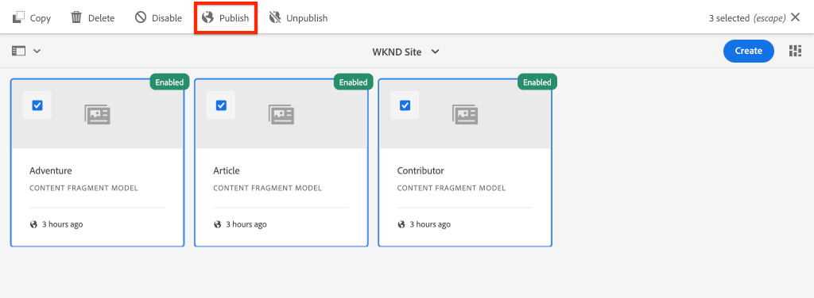

    A confirmation dialog appears, click **Publish**.

1. Navigate to the Bali Surf Camp Content Fragment at [http://localhost:4502/editor.html/content/dam/wknd/en/adventures/bali-surf-camp/bali-surf-camp](http://localhost:4502/editor.html/content/dam/wknd/en/adventures/bali-surf-camp/bali-surf-camp).

1. Click the **Publish** button in the top menu bar.

    

1. The Publish wizard shows any dependent assets that should be published. In this case, the referenced fragment **stacey-roswells** is listed and several images are also referenced. The referenced assets are published along with the fragment.

    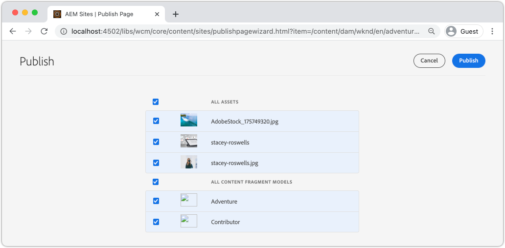

    Click the **Publish** button again to publish the Content Fragment and dependent assets.

1. Return to the React App running at [http://localhost:5000/](http://localhost:5000/). You can now click into the Bali Surf Camp to see the adventure details.

1. Switch back to the AEM Author instance at [http://localhost:4502/editor.html/content/dam/wknd/en/adventures/bali-surf-camp/bali-surf-camp](http://localhost:4502/editor.html/content/dam/wknd/en/adventures/bali-surf-camp/bali-surf-camp) and update the **Title** of the fragment. **Save & Close** the fragment. Then **publish** the fragment.
1. Return to [http://localhost:5000/adventure:/content/dam/wknd/en/adventures/bali-surf-camp/bali-surf-camp](http://localhost:5000/adventure:/content/dam/wknd/en/adventures/bali-surf-camp/bali-surf-camp) and observe the published changes.

    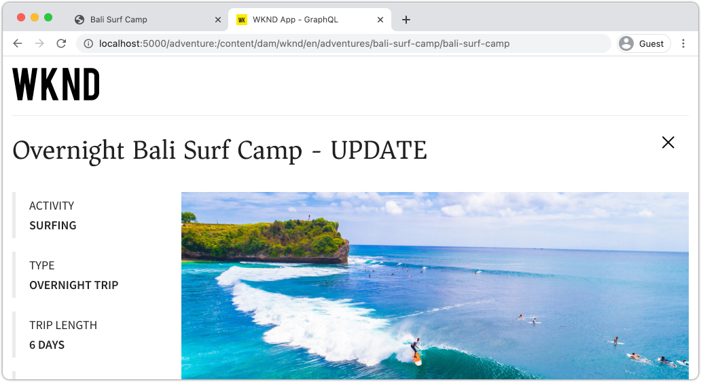

## Update CORs configuration

AEM is secure by default and does not allow non-AEM web properties to make client-side calls. AEM's Cross-Origin Resource Sharing (CORS) configuration can allow specific domains to make calls to AEM.

Next, experiment with the CORS configuration of the AEM Publish instance.

1. Return to the terminal window where the React App is running with the command `npm run serve`:

    ```shell
    ┌────────────────────────────────────────────────────┐
    │                                                    │
    │   Serving!                                         │
    │                                                    │
    │   - Local:            http://localhost:5000        │
    │   - On Your Network:  http://192.168.86.205:5000   │
    │                                                    │
    │   Copied local address to clipboard!               │
    │                                                    │
    └────────────────────────────────────────────────────┘
    ```

    Observe that two URLs are provided. One using `localhost` and another using the local network IP address.

1. Navigate to the address starting with [http://192.168.86.XXX:5000](http://192.168.86.XXX:5000). The address is slightly different for each local computer. Observe that there is a CORS error when fetching the data. This is because the current CORS configuration is only allowing requests from `localhost`.

    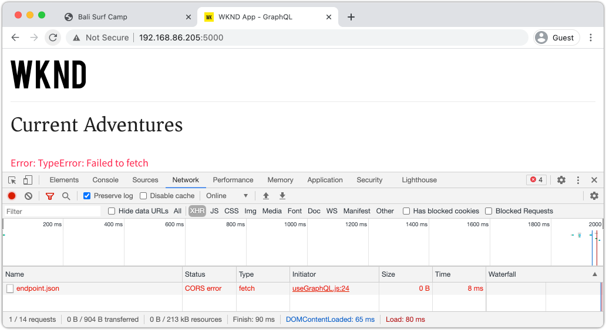

    Next, update the AEM Publish CORS configuration to allow requests from the network IP address.

1. Navigate to [http://localhost:4503/content/wknd/us/en/errors/sign-in.html](http://localhost:4503/content/wknd/us/en/errors/sign-in.html) and sign in with the user name `admin` and password `admin`.

1. Navigate to [http://localhost:4503/system/console/configMgr](http://localhost:4503/system/console/configMgr) and find the WKND GraphQL configuration at `com.adobe.granite.cors.impl.CORSPolicyImpl~wknd-graphql`.

1. Update the **Allowed Origins** field to include the network IP address:

    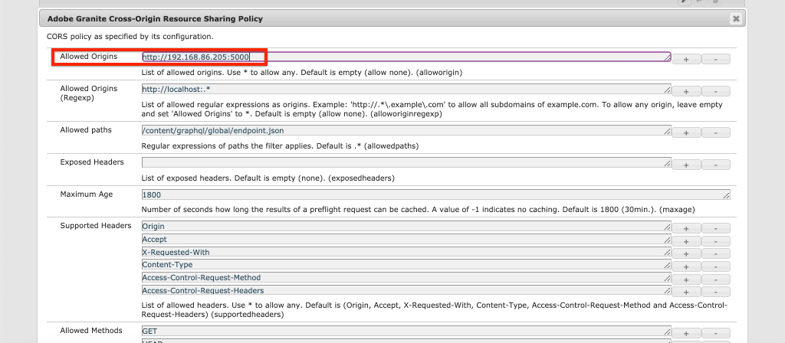

    It is also possible to include a regular expression to allow all requests from a specific sub domain. Save the changes.

1. Search for **Apache Sling Referrer Filter** and review the configuration. The **Allow Empty** configuration is also needed to enable GraphQL requests from an external domain.

    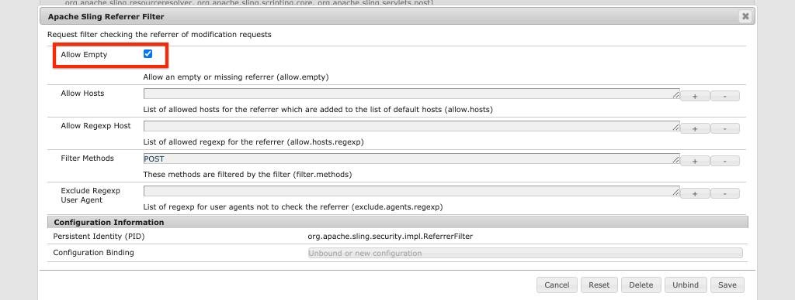

    These have been configured as part of the WKND reference site. You can view the full set of OSGi configurations via [the GitHub repository](https://github.com/adobe/aem-guides-wknd/tree/master/ui.config/src/main/content/jcr_root/apps/wknd/osgiconfig).

    >[!NOTE]
    >
    > OSGi configurations are managed in an AEM project that is committed to source control. An AEM Project can be deployed to AEM as Cloud Service environments using Cloud Manager. The [AEM Project Archetype](https://github.com/adobe/aem-project-archetype) can help generate a project for a specific implementation.

1. Return to the React App starting with [http://192.168.86.XXX:5000](http://192.168.86.XXX:5000) and observe that the application no longer throws a CORS error.

    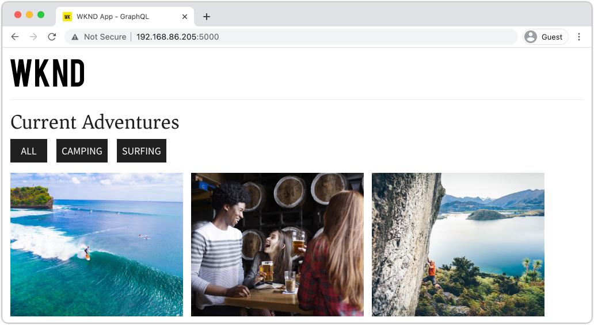

## Congratulations! {#congratulations}

Congratulations! You've now simulated a full production deployment using an AEM Publish environment. You also learned how to use the CORS configuration in AEM.

## Other Resources

For more details about Content Fragments and GraphQL see the following resources:

* [Headless Content Delivery using Content Fragments with GraphQL](https://experienceleague.adobe.com/docs/experience-manager-cloud-service/assets/content-fragments/content-fragments-graphql.html)
* [AEM GraphQL API for use with Content Fragments](https://experienceleague.adobe.com/docs/experience-manager-cloud-service/assets/admin/graphql-api-content-fragments.html)
* [Token-Based Authentication](https://experienceleague.adobe.com/docs/experience-manager-learn/getting-started-with-aem-headless/authentication/overview.html?lang=en#authentication)
* [Deploying code to AEM as a Cloud Service](https://experienceleague.adobe.com/docs/experience-manager-learn/cloud-service/cloud-manager/devops/deploy-code.html?lang=en#cloud-manager)
