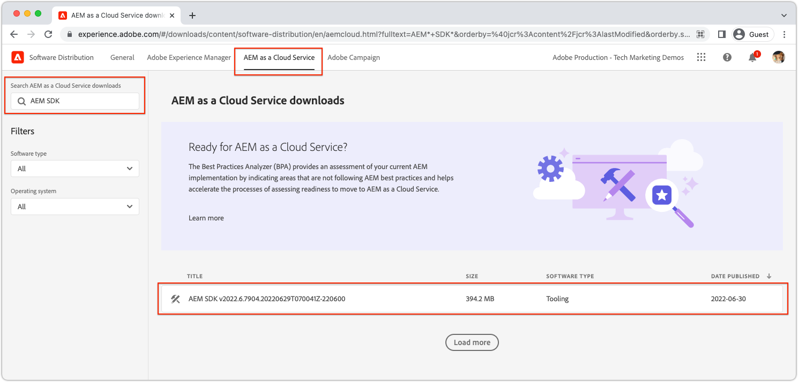
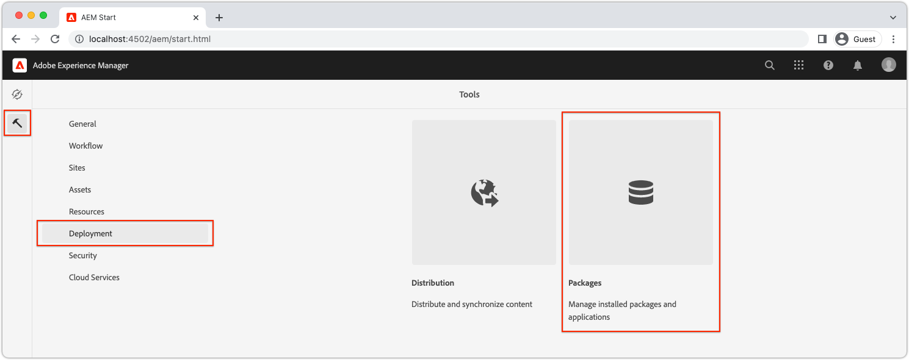
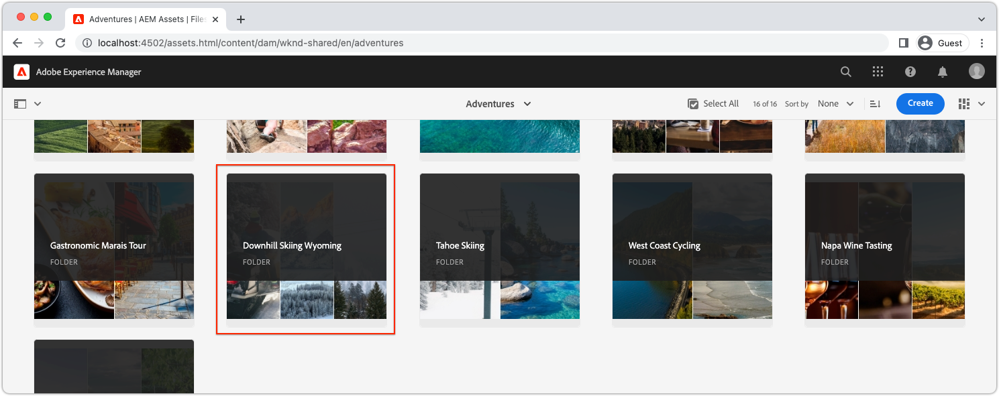
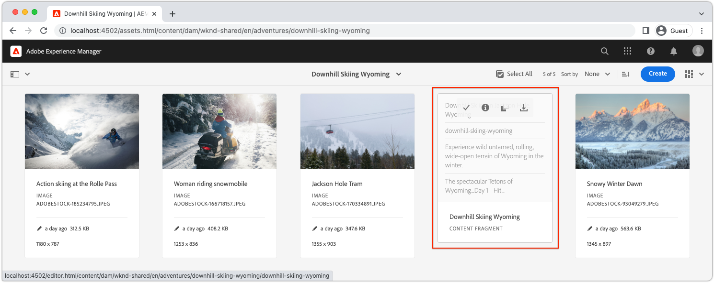
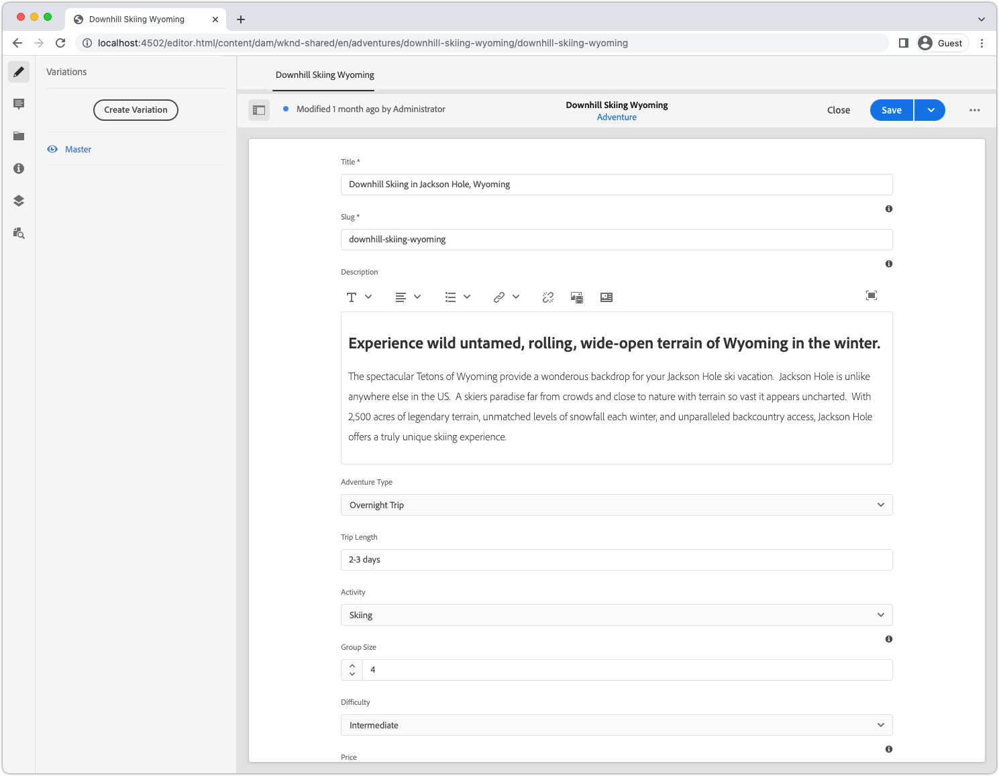
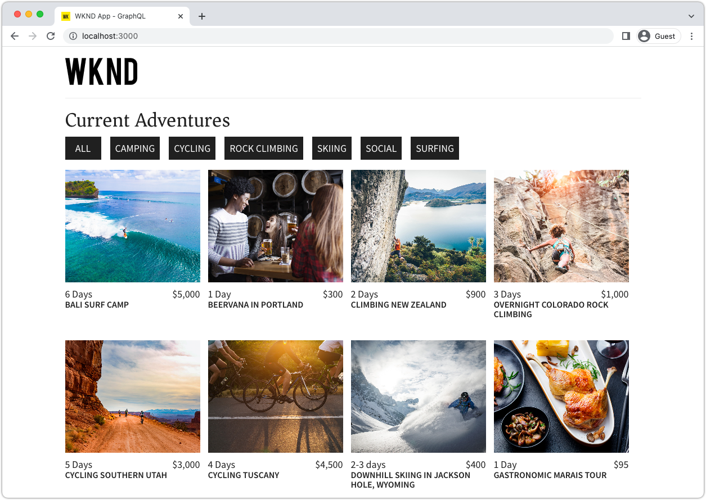
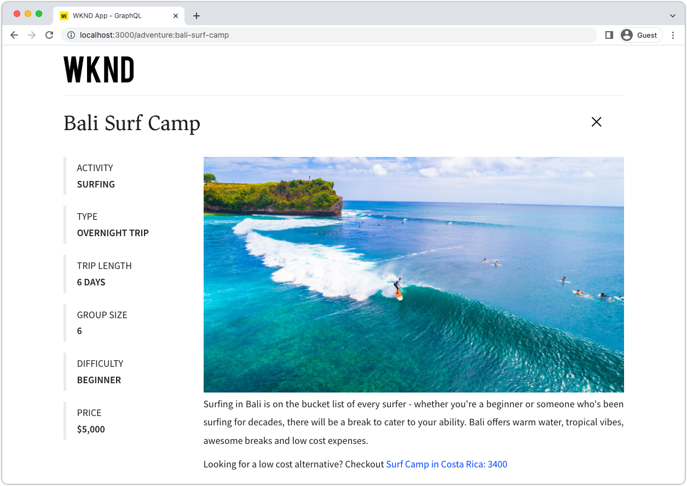
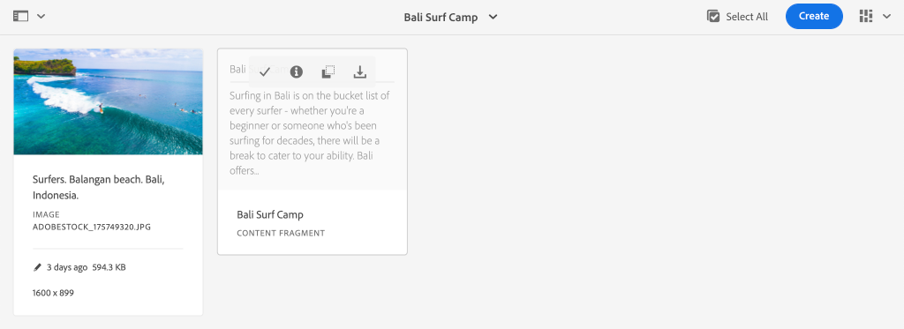
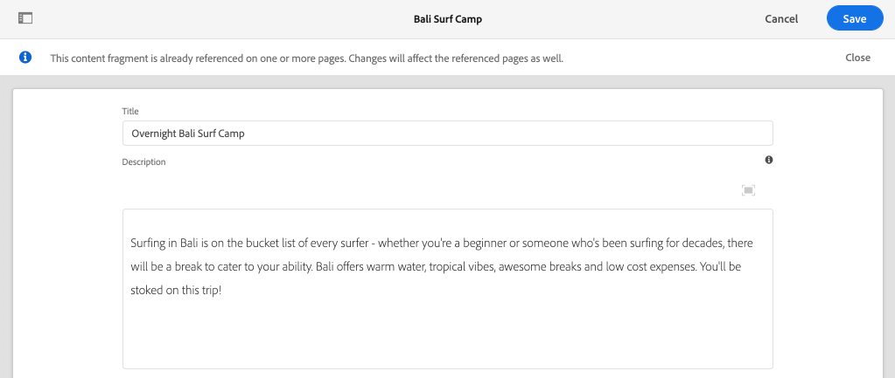
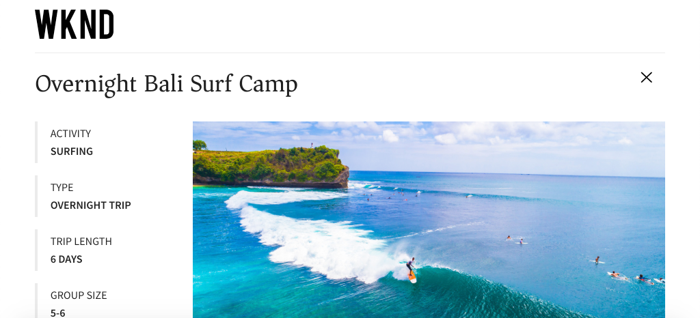

# AEM Headless quick setup using the local SDK {#setup}

The AEM Headless quick setup gets you hands-on with AEM Headless using content from the WKND Site sample project, and a sample React App (a SPA) that consumes the content over AEM Headless GraphQL APIs. This guide uses the [AEM as a Cloud Service SDK](https://experienceleague.adobe.com/docs/experience-manager-cloud-service/content/implementing/developing/aem-as-a-cloud-service-sdk.html).

## Prerequisites {#prerequisites}

The following tools should be installed locally:

* [JDK 11](https://experience.adobe.com/#/downloads/content/software-distribution/en/general.html?1_group.propertyvalues.property=.%2Fjcr%3Acontent%2Fmetadata%2Fdc%3AsoftwareType&1_group.propertyvalues.operation=equals&1_group.propertyvalues.0_values=software-type%3Atooling&fulltext=Oracle%7E+JDK%7E+11%7E&orderby=%40jcr%3Acontent%2Fjcr%3AlastModified&orderby.sort=desc&layout=list&p.offset=0&p.limit=14)
* [Node.js v10+](https://nodejs.org/en/)
* [npm 6+](https://www.npmjs.com/)
* [Git](https://git-scm.com/)

## 1. Install the AEM SDK {#aem-sdk}

This setup uses the [AEM as a Cloud Service SDK](https://experienceleague.adobe.com/docs/experience-manager-cloud-service/implementing/developing/aem-as-a-cloud-service-sdk.html?#aem-as-a-cloud-service-sdk) to explore AEM's GraphQL APIs. This section provides a quick guide to installing the AEM SDK and running it in Author mode. A more detailed guide for setting up a local development environment [can be found here](https://experienceleague.adobe.com/docs/experience-manager-learn/cloud-service/local-development-environment-set-up/overview.html#local-development-environment-set-up). 

>[!NOTE]
>
> It is also possible to follow the tutorial with an [AEM as a Cloud Service environment](./cloud-service.md). Additional notes for using a Cloud environment are included throughout the tutorial.

1. Navigate to the **[Software Distribution Portal](https://experience.adobe.com/#/downloads/content/software-distribution/en/aemcloud.html?fulltext=AEM*+SDK*&orderby=%40jcr%3Acontent%2Fjcr%3AlastModified&orderby.sort=desc&layout=list&p.offset=0&p.limit=1)** > **AEM as a Cloud Service** and download the latest version of the **AEM SDK**.

    

1. Unzip the download and copy the Quickstart jar (`aem-sdk-quickstart-XXX.jar`) to a dedicated folder, i.e `~/aem-sdk/author`.
1. Rename the jar file to `aem-author-p4502.jar`.

    The `author` name specifies that the Quickstart jar starts in Author mode. The `p4502` specifies the Quickstart runs on port 4502.

1. To install and start the AEM instance, open a command prompt at the folder that contains the jar file, and run the following command :

    ```shell
    $ cd ~/aem-sdk/author
    $ java -jar aem-author-p4502.jar
    ```

1. Provide an admin password as `admin`. Any admin password is acceptable, however it is recommend to use `admin` for local development to reduce the need to reconfigure.
1. When the AEM service finishes installing, a new browser window should open at [http://localhost:4502](http://localhost:4502). 
1. Login with the username `admin` and the password selected during AEM's initial start-up (usually `admin`).

## 2. Install sample content {#install-sample-content}

Sample content from the **WKND Reference site** is used to accelerate the tutorial. The WKND is a fictitious life-style brand, often used with AEM training.

The WKND site includes configurations required to expose a [GraphQL endpoint](https://experienceleague.adobe.com/docs/experience-manager-cloud-service/content/headless/graphql-api/content-fragments.html). In a real-world implementation, follow the documented steps to [include the GraphQL endpoints](https://experienceleague.adobe.com/docs/experience-manager-cloud-service/content/headless/graphql-api/content-fragments.html) in your customer project. A [CORS](#cors-config) has also been packaged as part of the WKND Site. A CORS configuration is required to grant access to an external application, more information about [CORS](#cors-config) can be found below.

1. Download the latest compiled AEM Package for WKND Site: [aem-guides-wknd.all-x.x.x.zip](https://github.com/adobe/aem-guides-wknd/releases/latest). 

    >[!NOTE]
    >
    > Make sure to download the standard version compatible with AEM as a Cloud Service and **not** the `classic` version.

1. From the **AEM Start** menu, navigate to **Tools** > **Deployment** > **Packages**.

    

1. Click **Upload Package** and choose the WKND package downloaded in the prior step. Click **Install** to install the package.

1. From the **AEM Start** menu, navigate to **Assets** > **Files** > **WKND Shared** > **English** > **Adventures**.

    

    This is a folder of all the assets that comprise the various Adventures promoted by the WKND brand. This includes traditional media types like images and video, and media specific to AEM like **Content Fragments**.

1. Click into the **Downhill Skiing Wyoming** folder and click the **Downhill Skiing Wyoming Content Fragment** card:

    

1. The Content Fragment editor opens for the Downhill Skiing Wyoming adventure.

    

    Observe that various fields like **Title**, **Description**, and **Activity** define the fragment.

    **Content Fragments** are one of the ways content can be managed in AEM. Content Fragment are reusable, presentation-agnostic content composed of structured data elements such as text, rich text, dates, or references to other Content Fragments. Content Fragments are explored in greater detail later in the quick setup.

1. Click **Cancel** to close the fragment. Feel free to navigate into some of the other folders and explore the other Adventure content.

>[!NOTE]
>
> If using a Cloud Service environment see the documentation for how to [deploy a code base like the WKND Reference site to a Cloud Service environment](https://experienceleague.adobe.com/docs/experience-manager-cloud-service/implementing/deploying/overview.html#coding-against-the-right-aem-version).

## 3. Download and run WKND React app {#sample-app}

One of the goals of this tutorial is to show how to consume AEM content from an external application using the GraphQL APIs. This tutorial uses an example React App. The React app is intentionally simple, to focus on the integration with AEM's GraphQL APIs.

1. Open a new command prompt and clone the sample React app from GitHub:

    ```shell
    $ git clone git@github.com:adobe/aem-guides-wknd-graphql.git
    $ cd aem-guides-wknd-graphql/react-app
    ```

1. Open the React app in `aem-guides-wknd-graphql/react-app` in your IDE of choice.
1. In the IDE, open the file `.env.development` at `/.env.development`. Verify the `REACT_APP_AUTHORIZATION` line is uncommented and the file declares the following variables:

    ```plain
    REACT_APP_HOST_URI=http://localhost:4502
    REACT_APP_GRAPHQL_ENDPOINT=/content/graphql/global/endpoint.json
    # Use Authorization when connecting to an AEM Author environment
    REACT_APP_AUTHORIZATION=admin:admin
    ```

    Ensure `REACT_APP_HOST_URI` points to your local AEM SDK. For convenience, this quick start connects the React app to  **AEM Author**. **Author** services require authentication, so the app uses the `admin` user to establish its connection. Connecting an app to AEM Author is a common practice during development, as it facilitates quickly iterating on content without the need to publish changes.

    >[!NOTE]
    >
    > In a production scenario the App will connect to an AEM **Publish** environment. This is covered in more detail in the _Production Deployment_ section.


1. Install and start the React app:

    ```shell
    $ cd aem-guides-wknd-graphql/react-app
    $ npm install
    $ npm start
    ```

1. A new browser window automatically opens the app on [http://localhost:3000](http://localhost:3000).

    

    A list of the adventure content from AEM is displayed.

1. Click one of the adventure images to view the adventure detail. A request is made to AEM to return the detail for an adventure.

    

1. Use the browser's developer tools to inspect the **Network** requests. View the **XHR** requests and observe multiple GET requests to `/graphql/execute.json/...`. This path prefix invokes AEM's persisted query endpoint, selecting the persisted query to execute using the name and encoded parameters following the prefix.

    

## 4. Edit content in AEM

With the React app is running, make an update to the content in AEM and see that the change reflected in the app.

1. Navigate to AEM [http://localhost:4502](http://localhost:4502).
1. Navigate to **Assets** > **Files** > **WKND Shared** > **English** > **Adventures** > **[Bali Surf Camp](http://localhost:4502/assets.html/content/dam/wknd-shared/en/adventures/bali-surf-camp)**.

    

1. Click into the **Bali Surf Camp** content fragment to open the Content Fragment editor.
1. Modify the **Title** and the **Description** of the adventure.

    

1. Click **Save** to save the changes.
1. Refresh the React app at [http://localhost:3000](http://localhost:3000) to see your changes:

    

## 5. Explore GraphiQL {#graphiql}

1. Open [GraphiQL](http://localhost:4502/aem/graphiql.html) by navigating to **Tools** > **General** > **GraphQL Query editor**
1. Select existing persisted queries on the left, and run them to see the results.

    >[!NOTE]
    >
    > The GraphiQL tool and GraphQL API is [explored in more detail later in the tutorial](../multi-step/explore-graphql-api.md).

## Congratulations!{#congratulations}

Congratulations, you now have an external application consuming AEM content with GraphQL. Feel free to inspect the code in the React app and continue to experiment with modifying existing Content Fragments.

### Next Steps

* [Start the AEM Headless tutorial](../multi-step/overview.md)
