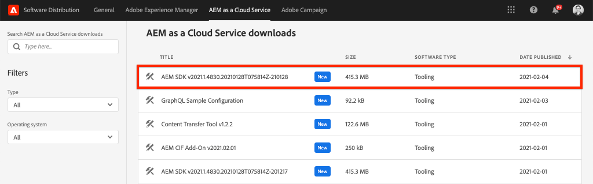
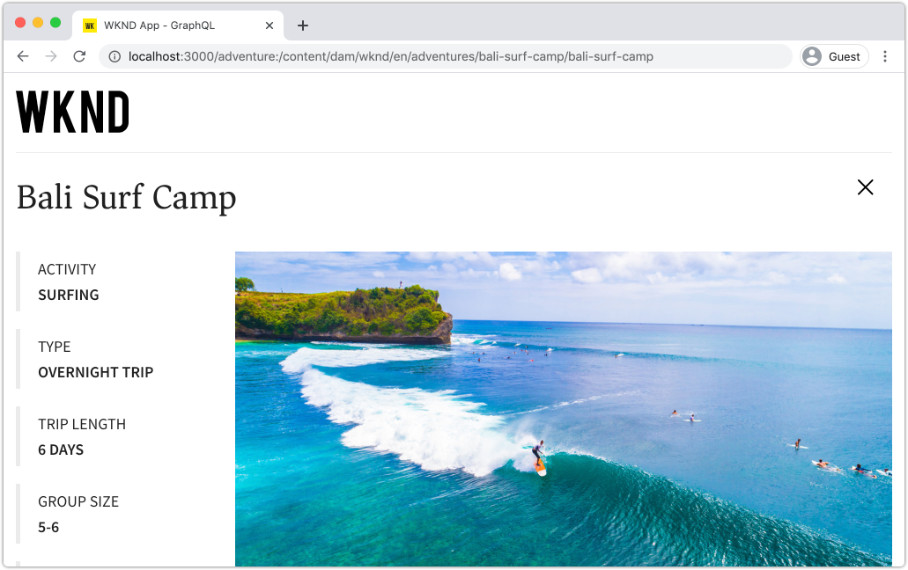
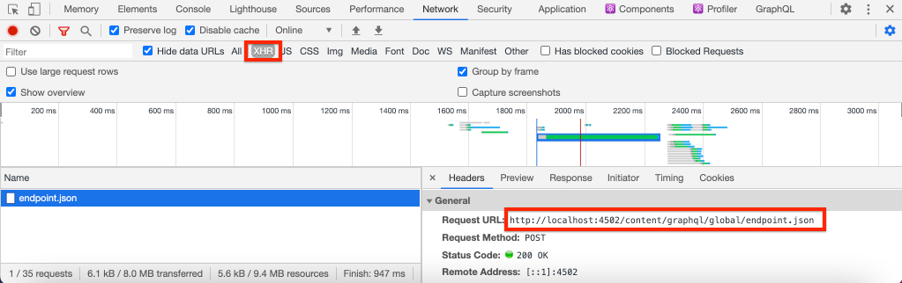
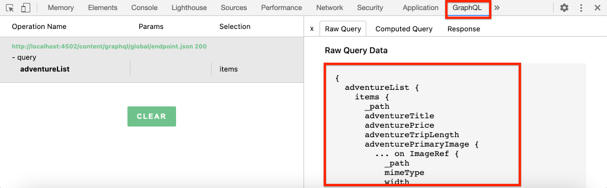
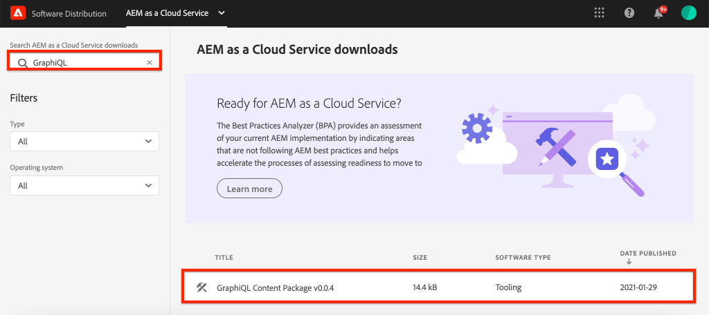
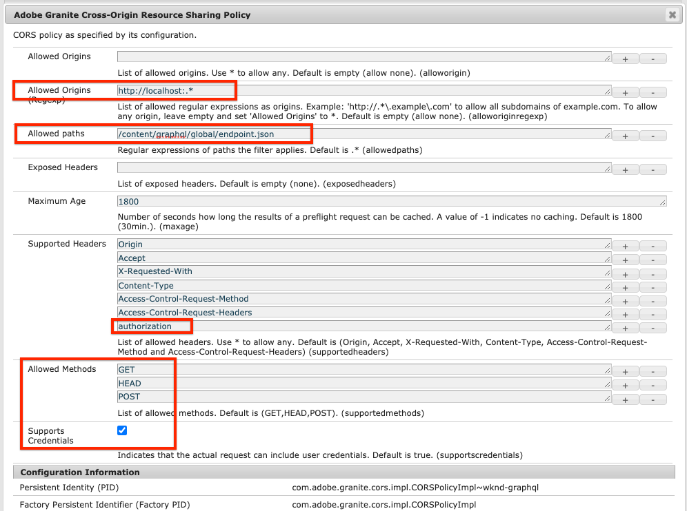

# Quick Setup {#setup}

This chapter offers a quick setup of a local environment to see an external application consume content from AEM using AEM's GraphQL APIs. Later chapters in the tutorial will build off of this setup.

## Prerequisites {#prerequisites}

The following tools should be installed locally:

* [JDK 11](https://experience.adobe.com/#/downloads/content/software-distribution/en/general.html?1_group.propertyvalues.property=.%2Fjcr%3Acontent%2Fmetadata%2Fdc%3AsoftwareType&1_group.propertyvalues.operation=equals&1_group.propertyvalues.0_values=software-type%3Atooling&fulltext=Oracle%7E+JDK%7E+11%7E&orderby=%40jcr%3Acontent%2Fjcr%3AlastModified&orderby.sort=desc&layout=list&p.offset=0&p.limit=14)
* [Node.js v10+](https://nodejs.org/en/)
* [npm 6+](https://www.npmjs.com/)
* [Git](https://git-scm.com/)

## Objectives {#objectives}

1. Download and install the AEM SDK.
1. Download and install sample content from the WKND Reference site.
1. Download and install a sample app to consume content using the GraphQL APIs.

## Install the AEM SDK {#aem-sdk}

This tutorial uses the [AEM as a Cloud Service SDK](https://experienceleague.adobe.com/docs/experience-manager-cloud-service/implementing/developing/aem-as-a-cloud-service-sdk.html?lang=en#aem-as-a-cloud-service-sdk) to explore AEM's GraphQL APIs. This section provides a quick guide to installing the AEM SDK and running it in Author mode. A more detailed guide for setting up a local development environment [can be found here](https://experienceleague.adobe.com/docs/experience-manager-learn/cloud-service/local-development-environment-set-up/overview.html?lang=en#local-development-environment-set-up). 

>[!NOTE]
>
> It is also possible to follow the tutorial with an AEM as a Cloud Service environment. Additional notes for using a Cloud environment are included throughout the tutorial.

1. Navigate to the **[Software Distribution Portal](https://experience.adobe.com/#/downloads/content/software-distribution/en/aemcloud.html)** > **AEM as a Cloud Service** and download the latest version of the **AEM SDK**.

    

    >[!CAUTION]
    >
    > The GraphQL feature is enabled by default only on the AEM SDK from 2021-02-04 or newer.

1. Unzip the download and copy the Quickstart jar (`aem-sdk-quickstart-XXX.jar`) to a dedicated folder, i.e `~/aem-sdk/author`.
1. Re-name the jar file to `aem-author-p4502.jar`.

    The `author` name specifies that the Quickstart jar will start in Author mode. The `p4502` specifies that the Quickstart server will run on port 4502.

1. Open a new terminal window and navigate to the folder that contains the jar file. Run the following command to install and start the AEM instance:

    ```shell
    $ cd ~/aem-sdk/author
    $ java -jar aem-author-p4502.jar
    ```

1. Provide an admin password as `admin`. Any admin password is acceptable, however its recommend to use the default for local development to reduce the need to re-configure.
1. After a few minutes the AEM instance will finish installing and a new browser window should open at [http://localhost:4502](http://localhost:4502). 
1. Login with the username `admin` and password `admin`.

## Install sample content and GraphQL endpoints {#wknd-site-content-endpoints}

Sample content from the **WKND Reference site** will be installed to accelerate the tutorial. The WKND is a fictitious life-style brand, often used in conjunction with AEM training.

The WKND Reference site includes configurations needed to expose a [GraphQL endpoint](https://experienceleague.adobe.com/docs/experience-manager-cloud-service/assets/admin/graphql-api-content-fragments.html?lang=en#graphql-aem-endpoint). In a real-world implementation follow the documented steps to [include the GraphQL endpoints](https://experienceleague.adobe.com/docs/experience-manager-cloud-service/assets/admin/graphql-api-content-fragments.html?lang=en#graphql-aem-endpoint) in your customer project. A [CORS](#cors-config) has also been packaged as part of the WKND Site. A CORS configuration is needed to grant access to an external application, more information about [CORS](#cors-config) can be found below.

1. Download the latest compiled AEM Package for WKND Site: [aem-guides-wknd.all-x.x.x.zip](https://github.com/adobe/aem-guides-wknd/releases/latest). 

    >[!NOTE]
    >
    > Make sure to download the standard version compatible with AEM as a Cloud Service and **not** the `classic` version.

1. From the **AEM Start** menu navigate to **Tools** > **Deployment** > **Packages**.

    

1. Click **Upload Package** and choose the WKND package downloaded in the prior step. Click **Install** to install the package.

1. From the **AEM Start** menu navigate to **Assets** > **Files**.
1. Click through the folders to navigate to **WKND Site** > **English** > **Adventures**.

    

    This is a folder of all the assets that comprise the various Adventures promoted by the WKND brand. This includes traditional media types like images and video, as well as media specific to AEM like **Content Fragments**.

1. Click into the **Downhill Skiing Wyoming** folder and click the **Downhill Skiing Wyoming Content Fragment** card:

    

1. The Content Fragment Editor UI will open for the Downhill Skiing Wyoming adventure.

    

    Observe that various fields like **Title**, **Description**, and **Activity** define the fragment.

    **Content Fragments** are one of the ways content can be managed in AEM. Content Fragment are reusable, presentation-agnostic content composed of structured data elements such as text, rich text, dates or references to other Content Fragments. Content Fragments will be explored in greater detail later in the tutorial.

1. Click **Cancel** to close the fragment. Feel free to navigate into some of the other folders and explore the other Adventure content.

>[!NOTE]
>
> If using a Cloud Service environment see the documentation for how to [deploy a code base like the WKND Reference site to a Cloud Service environment](https://experienceleague.adobe.com/docs/experience-manager-cloud-service/implementing/deploying/overview.html?lang=en#deploying).

## Install the sample app{#sample-app}

One of the goals of this tutorial is to show how to consume AEM content from an external application using the GraphQL APIs. This tutorial uses an example React App that has been partially completed to accelerate the tutorial. The same lessons and concepts apply to apps built with iOS, Android or any other platform. The React app is intentionally simple, to avoid unnecessary complexity; it is not meant to be a reference implementation.

1. Open a new terminal window and clone tutorial starter branch using Git:

    ```shell
    $ git clone --branch tutorial/react git@github.com:adobe/aem-guides-wknd-graphql.git
    ```

1. In the IDE of your choice open the file `.env.development` at `aem-guides-wknd-graphql/react-app/.env.development`. Uncomment the `REACT_APP_AUTHORIZATION` line so that the file looks like the following:

    ```plain
    REACT_APP_HOST_URI=http://localhost:4502
    REACT_APP_GRAPHQL_ENDPOINT=/content/graphql/global/endpoint.json
    REACT_APP_AUTHORIZATION=admin:admin
    ```

    Ensure that `React_APP_HOST_URI` matches your local AEM instance. In this chapter we will connect the React App directly to the AEM **Author** environment. **Author** environments by default require authentication, so our app will connect as the `admin` user. This is a common practice during development, since it allows us to quickly make changes on the AEM environment and see them immediately reflected in the app.

    >[!NOTE]
    >
    > In a production scenario the App will connect to an AEM **Publish** environment. This is covered in more detail, later in the tutorial.

1. Navigate into the `aem-guides-wknd-graphql/react-app` folder. Install and start the app:

    ```shell
    $ cd aem-guides-wknd-graphql/react-app
    $ npm install
    $ npm start
    ```

1. A new browser window should automatically launch the app at [http://localhost:3000](http://localhost:3000).

    

    A list of the current Adventure content from AEM should be displayed.

1. Click one of the adventure images to view the adventure detail. A request is made to AEM to return the detail for an adventure.

    

1. Use the browser's developer tools to inspect the **Network** requests. View the **XHR** requests and observe multiple POST requests to `/content/graphql/global/endpoint.json`, the GraphQL endpoint configured for AEM.

    

1. You can also view the parameters and JSON response by inspecting the network request. It may be helpful to install a browser extension like [GraphQL Network](https://chrome.google.com/webstore/detail/graphql-network/igbmhmnkobkjalekgiehijefpkdemocm) for Chrome to get a better understanding of the query and response.

    

    *Using the Chrome extension GraphQL Network*

## Modify a Content Fragment

Now that the React app is running, make an update to the content in AEM and see the change reflected in the app.

1. Navigate to AEM [http://localhost:4502](http://localhost:4502).
1. Navigate to **Assets** > **Files** > **WKND Site** > **English** > **Adventures** > **[Bali Surf Camp](http://localhost:4502/assets.html/content/dam/wknd/en/adventures/bali-surf-camp)**.

    

1. Click into the **Bali Surf Camp** content fragment to open the Content Fragment Editor.
1. Modify the **Title** and the **Description** of the adventure

    

1. Click **Save** to save the changes.
1. Navigate back to the React app at [http://localhost:3000](http://localhost:3000) and refresh to see your changes:

    

## Install the GraphiQL Tool {#install-graphiql}

[GraphiQL](https://github.com/graphql/graphiql) is a development tool and needed only on lower-level environments like a development or local instance. The GraphiQL IDE allows you to quickly test and refine the queries and data returned. GraphiQL also provides easy access to the documentation, making it easy to learn and understand what methods are available.

1. Navigate to the **[Software Distribution Portal](https://experience.adobe.com/#/downloads/content/software-distribution/en/aemcloud.html)** > **AEM as a Cloud Service**.
1. Search for "GraphiQL" (be sure to include the **i** in **GraphiQL**.
1. Download the latest **GraphiQL Content Package v.x.x.x**

    

    The zip file is an AEM package that can be installed directly.

1. From the **AEM Start** menu navigate to **Tools** > **Deployment** > **Packages**.
1. Click **Upload Package** and choose the package downloaded in the prior step. Click **Install** to install the package.

    
1. Navigate to the GraphiQL IDE at [http://localhost:4502/content/graphiql.html](http://localhost:4502/content/graphiql.html) and begin exploring the GraphQL APIs.

    >[!NOTE]
    >
    > The GraphiQL tool and GraphQL API is [explored in more detail later in the tutorial](./explore-graphql-api.md).

## Congratulations! {#congratulations}

Congratulations, you now have an external application consuming AEM content with GraphQL. Feel free to inspect the code in the React app and continue to experiment with modifying existing Content Fragments.

## Next Steps {#next-steps}

In the next chapter, [Defining Content Fragment Models](content-fragment-models.md), learn how to model content and build a schema with **Content Fragment Models**. You will review existing models and create a new model. You will also learn about the different data types that can be used to define a schema as part of the model.

## (Bonus) CORS Configuration {#cors-config}

AEM, being secure by default, blocks cross-origin requests, preventing unauthorized applications from connecting to and surfacing its content.

To allow this tutorial's React app to interact with AEM's GraphQL API endpoints, a cross-origin resource sharing configuration has been defined in the WKND Site reference project.



To view the configuration deployed:

1. Navigate to AEM SDK's Web Console at [http://localhost:4502/system/console](http://localhost:4502/system/console).

    >[!NOTE]
    >
    > The Web Console is only available on the SDK. In an AEM as a Cloud Service environment this information can be viewed via [the Developer Console](https://experienceleague.adobe.com/docs/experience-manager-learn/cloud-service/debugging/debugging-aem-as-a-cloud-service/developer-console.html).

1. In the top menu click **OSGI** > **Configuration** to bring up all of the [OSGi Configurations](http://localhost:4502/system/console/configMgr).
1. Scroll down the page **Adobe Granite Cross-Origin Resource Sharing**.
1. Click on the configuration for `com.adobe.granite.cors.impl.CORSPolicyImpl~wknd-graphql`.
1. The following fields have been updated:
    * Allowed Origins (Regex): `http://localhost:.*`
        * Allows all local host connections.
    * Allowed Paths: `/content/graphql/global/endpoint.json`
        * This is the only GraphQL endpoint currently configured. As a best practice, CORs configurations should be as restrictive as possible.
    * Allowed Methods: `GET`, `HEAD`, `POST`
        * Only `POST` is required for GraphQL however the other methods can be useful when interacting with AEM in headless manner.
    * Supported Headers: **authorization** has been added to pass in basic authentication on the author environment.
    * Supports Credentials: `Yes`
        * This is required as our React app will communicate with the protected GraphQL end points on the AEM Author service.

This configuration and the GraphQL endpoints are a part of the AEM WKND project. You can view all the [OSGi configurations here](https://github.com/adobe/aem-guides-wknd/tree/master/ui.config/src/main/content/jcr_root/apps/wknd/osgiconfig).
