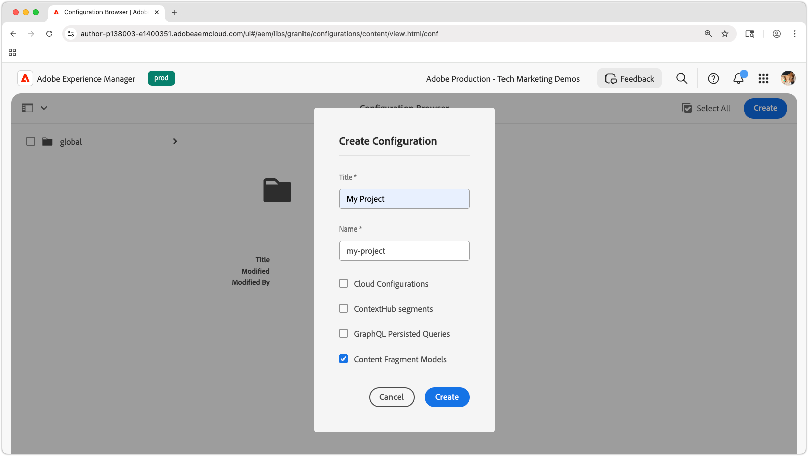
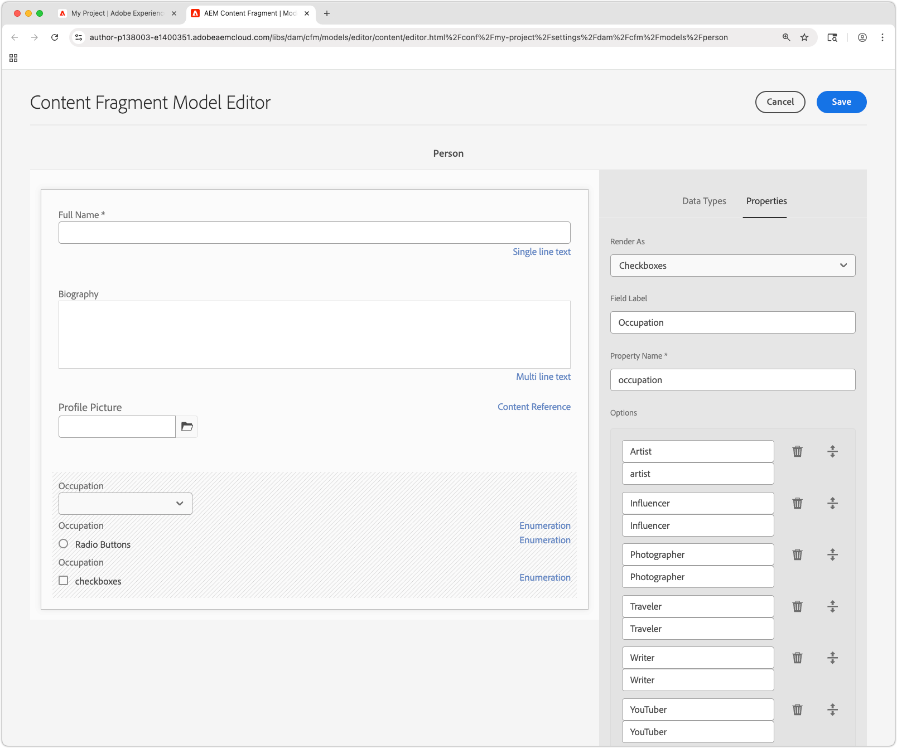
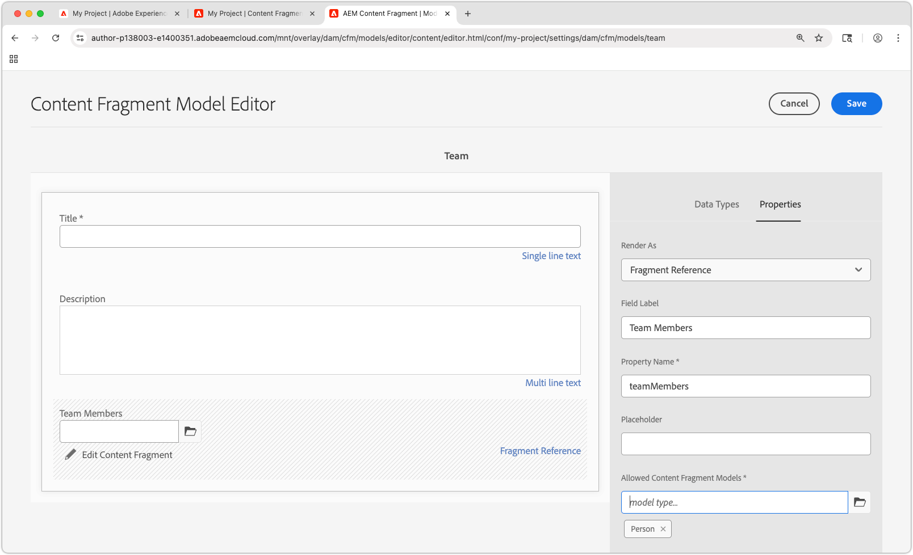

# Create Content Fragment Models

In this chapter, learn how to model content and build a schema with **Content Fragment Models**, and about the different data types that define a Content Fragment Model.

In this tutorial, you create two simple models, **Team** and **Person**. The **Team** data model has name, short name, and description and references the **Person** data model, which has full name, bio details, profile picture, and occupations list.

## Objectives

* Create a Content Fragment Model.
* Explore available data types and validation options for building models.
* Understand how Content Fragment Models define **both** the data schema and the authoring template for a Content Fragment.

## Create a project configuration

A project configuration contains all Content Fragment Models associated with a particular project and provides a means of organizing models. Create at least one project **before** creating Content Fragment Model.

1. Log in to the AEM **Author** environment (ex. `https://author-p<PROGRAM_ID>-e<ENVIRONMENT_ID>.adobeaemcloud.com/`)
1. From the AEM Start screen, navigate to **Tools** > **General** > **Configuration Browser**.
1. Click **Create** in the top action bar and enter the following configuration details:
    * Title: **My Project**
    * Name: **my-project**
    * Content Fragment Models: **Checked**

    

1. Select **Create** to create the project configuration.

## Create Content Fragment Models

Next, create Content Fragment Models for a **Team** and a **Person**. These will act as the data models, or schemas, representing a team, and a person that is part of a team, and define the interface for authors to create and edit Content Fragments based on these models.

### Create the Person Content Fragment Model

Create a Content Fragment Model for a **Person**, which is the data model, or schema, representing a person that is part of a team.

1.  From the AEM Start screen, navigate to **Tools** > **General** > **Content Fragment Models**.
1.  Navigate into the **My Project** folder.
1.  Select **Create** in the top-right corner to bring up the **Create Model** wizard.
1.  Create a Content Fragment Model with the following properties:

    * Model Title: **Person** 
    * Enable model: **Checked**
    
    Select **Create**. In the resulting dialog, select **Open**, to build the model.

1.  Drag and Drop a **Single line text** element on to the main panel. Enter the following properties on the **Properties** tab:

    * Field Label: **Full Name**
    * Property Name: `fullName`
    * Check **Required**

    The **Property Name** defines the name of the property where the authored value is stored in AEM. The **Property Name** also defines the **key** name for this property as part of the data schema, and used as the key in the JSON response when the Content Fragment is delivered via AEM's OpenAPIs.

1.  Select the **Data Types** tab and drag and drop a **Multi line text** field beneath the **Full Name** field. Enter the following properties:

    * Field Label: **Biography**
    * Property Name: `biographyText`
    * Default Type: **Rich Text**

1.  Click the **Data Types** tab and drag and drop a **Content Reference** field. Enter the following properties:

    * Field Label: **Profile Picture**
    * Property Name: `profilePicture`
    * Root Path: `/content/dam`

        When configuring the **Root Path**, you can click the **folder** icon to bring up a modal to select the path. This restricts which folders authors can use to populate the path. `/content/dam` is the root in which all AEM Assets (images, videos, other Content Fragments) are stored.

    * Accept only specific content types: **Image**

        Add a validation to the **Picture Reference** so that only content types of **Images** can be used to populate the field.

    * Show Thumbnail: **Checked**

1.  Click the **Data Types** tab and drag and drop an **Enumeration**  data type beneath the **Picture Reference** field. Enter the following properties:

    * Render As: **Checkboxes**
    * Field Label: **Occupation**
    * Property Name: `occupation`
    * Options: 
        * **Artist**
        * **Influencer**
        * **Photographer**
        * **Traveler**
        * **Writer**
        * **YouTuber**

    Set both the Option label and value to the same value.

1.  The final **Person** model should look like the following:

    

1. Click **Save** to save the changes.

### Create the Team Content Fragment Model

Create a Content Fragment Model for a **Team**, which is the data model for a team of people. The Team model references the Person Content Fragments, representing the members of the team.

1.  In the **My Project** folder, select **Create** in the upper right corner to bring up the **Create Model** wizard.
1.  In **Model Title** field, enter **Team** and select **Create**.

    Select **Open** in the resulting dialog, to open the newly created model.

1.  Drag and Drop a **Single line text** element on to the main panel. Enter the following properties on the **Properties** tab:

    * Field Label: **Title**
    * Property Name: `title`
    * Check **Required**

1.  Select the **Data Types** tab and drag and drop a **Multi line text** field beneath the **Short Name** field. Enter the following properties:

    * Field Label: **Description**
    * Property Name: `description`
    * Default Type: **Rich Text**

1.  Click the **Data Types** tab and drag and drop a **Fragment Reference** field. Enter the following properties:

    * Render As: **Multiple Field**
    * Minimum Number of Items: **2**
    * Field Label: **Team Members**
    * Property Name: `teamMembers`
    * Allowed Content Fragment Models: Use the folder icon to select the **Person** model.

1.  The final **Team** model should look like the following:

    

1.  Click **Save** to save the changes.

1.  You should now have two models to work from:

    

## Congratulations!

Congratulations, you just created your first Content Fragment Models!

## Next steps

In the next chapter, [Authoring Content Fragment Models](2-author-content-fragments.md), you create and edit a new Content Fragment based on a Content Fragment Model. You also learn how to create variations of Content Fragments.

## Related documentation

* [Content Fragment Models](https://experienceleague.adobe.com/docs/experience-manager-cloud-service/content/assets/content-fragments/content-fragments-models.html)

