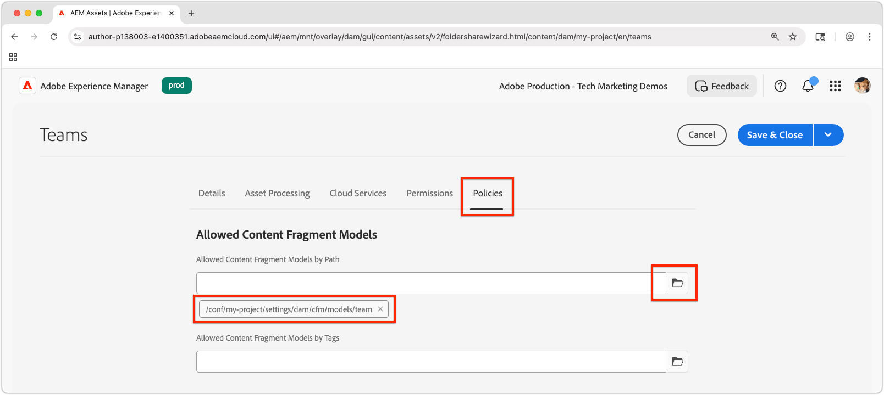
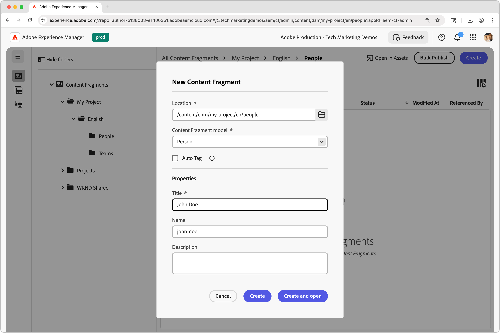
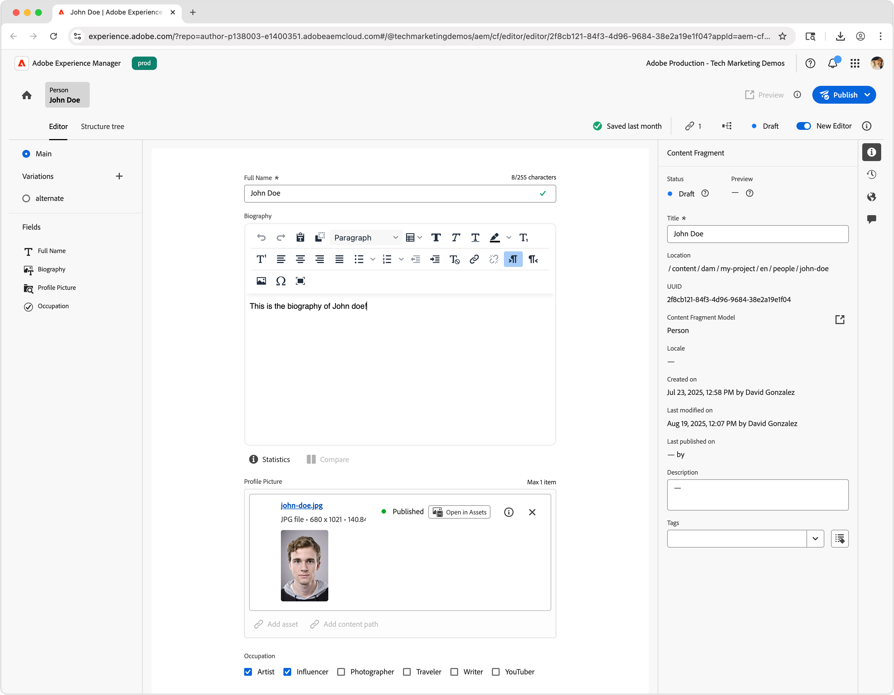
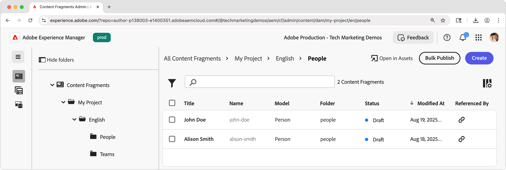
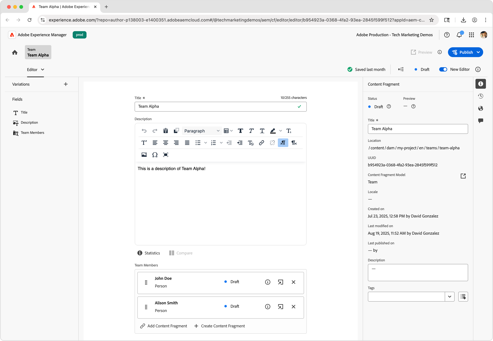
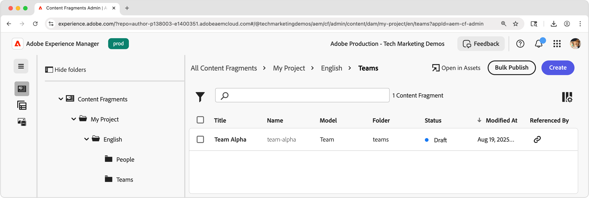
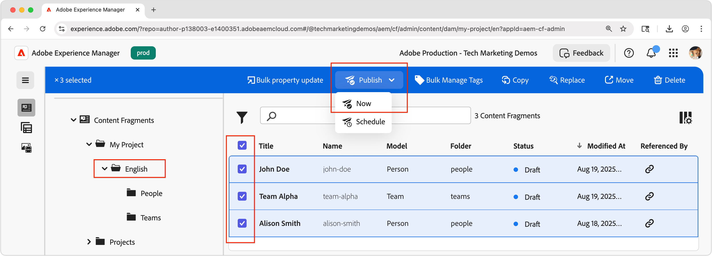
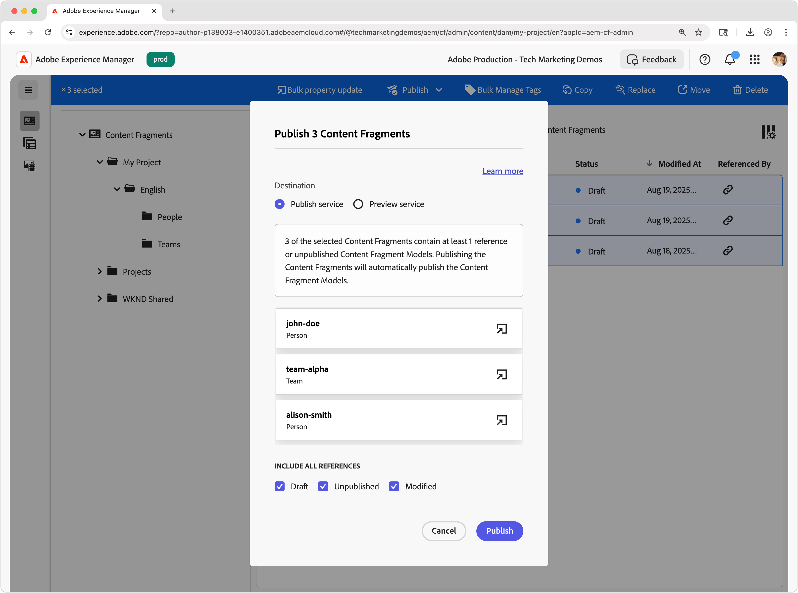

# Author Content Fragments

In this chapter, you create and edit new Content Fragments based on the [Team and Person Content Fragment Models](./1-content-fragment-models.md). These Content Fragments will be the content that is consumed by the React app using the AEM Content Fragment Delivery with OpenAPI APIs. 

## Prerequisites

This is a multi-part tutorial and it is assumed that the steps outlined in the [Defining Content Fragment Models](./1-content-fragment-models.md) have been completed.

## Objectives

* Create a Content Fragment based on a Content Fragment Model.
* Author a Content Fragment.
* Publish a Content Fragment.

## Create assets folders for Content Fragments

Content Fragments are stored in folders in AEM Assets. To create Content Fragments from the Content Fragment Models created in the previous chapter, a folder must exist to store them. A configuration is required on the folder to enable creation of Content Fragments from specific Content Fragment Models.

AEM supports "flat" folder organization, meaning Content Fragments of different Content Fragment Models are mixed together in a single folder. However, in this tutorial, a folder structure that aligns with the Content Fragment Models is used, in part, to explore the **List all Content Fragments by folder** API in the [next chapter](./3-explore-openapis.md). When determining your Content Fragment organization, consider both how you want to author and manage your Content Fragments, as well as how to deliver and consume them via the AEM Content Fragment Delivery with OpenAPI APIs.

1.  From the AEM Start screen, navigate to **Assets** > **Files**.
1.  Select **Create** in the top-right corner and select **Folder**. Enter:

    * Title: **My Project**
    * Name: **my-project**

    Select **Create** to create the folder.

1. Open the new **My Project** folder, and create a subfolder under the new **My Project** folder with the following values:

    * Title: **English**
    * Name: **en**

    A root language folder is created to position the project to support AEM's native localization capabilities. A best practice is to set up projects for multilingual support, even if you do not require localization today. See [the following docs page for more information](https://experienceleague.adobe.com/docs/experience-manager-cloud-service/content/assets/admin/translate-assets.html).

1. Create two subfolders under the new **My Project > English** folder with the following values:

    A `teams` folder that contains the **Team** Content Fragments

    * Title: **Teams**
    * Name: **teams**

    ... and a `people` folder that contains the **Person** Content Fragments.

    * Title: **People**
    * Name: **people**

1. Navigate back to **My Project > English** folder and ensure the two new folders are created.
1. Select the **Teams** folder and select **Properties** in the top action bar.
1. Select the **Policies** tab, and uncheck **Inherited from `/content/dam/my-project`**.
1. On the **Policies** tab, select the **Team** Content Fragment Model in the **Allowed Content Fragment Models by Path** field.

    

    These policies are inherited by sub-folders automatically but can be overridden. Content Fragment Models can be allowed by tags or enable Content Fragment Models from other project configurations. This mechanism provides a powerful way to manage your content hierarchy.

1. Select **Save & Close** to save the changes to the folder properties.
1. Update the **Policies** for the **People** folder in the same way, but select the **Person** Content Fragment Model instead.

## Create a person Content Fragment

Create Content Fragments based on the **Person** Content Fragment Model in the **My Project > English > People** folder.

1.  From the AEM Start Screen, select **Content Fragments** to open the Content Fragments Console.
1.  Select the **Show folder** button to open the folder browser.
1.  Select the **My Project > English > People** folder.
1.  Select **Create > Content Fragment** and enter the following values:

    * Location: `/content/dam/my-project/en/people`
    * Content Fragment model: **Person**
    * Title: **John Doe**
    * Name: `john-doe`

    Keep in mind these **Title**, **Name**, and **Description** fields in the **New Content Fragment** dialog are stored as metadata about the Content Fragment, and not part of the Content Fragment's data.

    

1. Select **Create and open**.
1. Fill out the fields for the **John Doe** fragment:

    * Full Name: **John Doe**
    * Biography: **John Doe loves social media and a travel enthusiast.**
    * Profile Picture: Select an image from `/content/dam` or upload a new one.
    * Occupation: **Influencer**, **Traveler**

    These fields and values define the Content Fragment's content that will be consumed via the AEM Content Fragment Delivery with OpenAPI APIs.

    

1.  Content Fragment changes are automatically saved, so there is no **Save** button.
1.  Return to the Content Fragment Console and select **My Project > English > Person** to see your new Content Fragment.

### Create additional person Content Fragments

Repeat the above steps to create additional **Person** fragments. 

1. Create a Person Content Fragment for **Alison Smith** with the following properties:

    * Location: `/content/dam/my-project/en/people`
    * Content Fragment model: **Person**
    * Title: **Alison Smith**
    * Name: `alison-smith`

    Select **Create and open** and author following values:

    * Full Name: **Alison Smith**
    * Biography: **Alison is a photographer and loves to write about her travels.**
    * Profile Picture: Select an image from `/content/dam` or upload a new one.
    * Occupation: **Photographer**, **Traveler**, **Writer**.

You should now have two Content Fragments in the **My Project > English > People** folder:

You can optionally make a few more Person Content Fragments to represent additional people.

## Create a team Content Fragment

Using the same approach, create a **Team** fragment based on the **Team** Content Fragment Model in the **My Project > English > Teams** folder.

1. Create a **Team** fragment representing **Team Alpha** with the following properties:

    * Location: `/content/dam/my-project/en`
    * Content Fragment Model: **Team**
    * Title: **Team Alpha**
    * Name: `team-alpha`

    Select **Create and open** and author following values:

    * Title: **Team Alpha**
    * Description: **Team Alpha is a travel content team that specializes in photography and travel writing.**
    * **Team Members**: Select the **John Doe** and **Alison Smith** Content Fragments to populate the **Team Members** field.

    

1.  Select **Create and open** to create the Team Content Fragment
1.  There should be one Content Fragment beneath **My Project > English > Team**:

You should now have a **Team Alpha** Content Fragment in the **My Project > English > Teams** folder:

Optionally, create a **Team Omega** with a different set of people.

## Publish Content Fragments

To make Content Fragments available via OpenAPIs, publish them. Publishing allows the Content Fragments to be accessed via the:

* **Publish service** - serves content to production applications
* **Preview service** - serves content to preview applications

Typically content is published first to the **Preview service** and reviewed on a preview application before being published to the **Publish service**. Publishing to the **Publish service** does not also publish to the **Preview service**. You must publish to the **Preview service** separately.

In this tutorial we will publish to AEM Publish service, however using AEM Preview service is as easy as changing the [AEM service's URL in the React app](./4-react-app.md)

1. In the Content Fragment Console, locate the **My Project > English** folder.
1. Select all the Content Fragments in the **English** folder - which displays all Content Fragments in all subfolder -- and select **Publish > Now** from the top action bar.

    

1.  Select the **Publish service**, under **Include all references** select **Unpublished** and **Modified**  and select **Publish**.

    

Now the Content Fragments, and all the Person Content Fragments referenced by the Team Content Fragments, and any referenced assets, are published to the **Publish service**. 

You can publish to the **Preview service** in the same way.

## Congratulations!

Congratulations, you have successfully authored Content Fragments based on Content Fragment Models in AEM. You created a **Person** Content Fragment Model, authored several **Person** Content Fragments, and created a **Team** Content Fragment that references multiple **Person** Content Fragments.

With the Content Fragments published, you can now access them via the AEM Content Fragment Delivery with OpenAPI APIs.

## Next steps

In the next chapter, [Explore OpenAPIs](3-explore-openapis.md), you will explore AEM Content Fragment Delivery with OpenAPI APIs using the **Try It** capability built into the API documentation.
