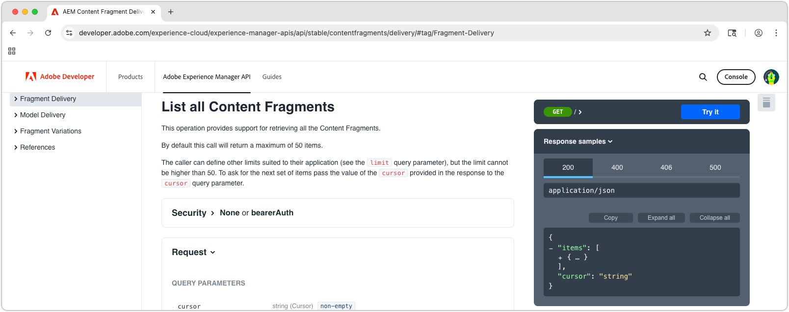
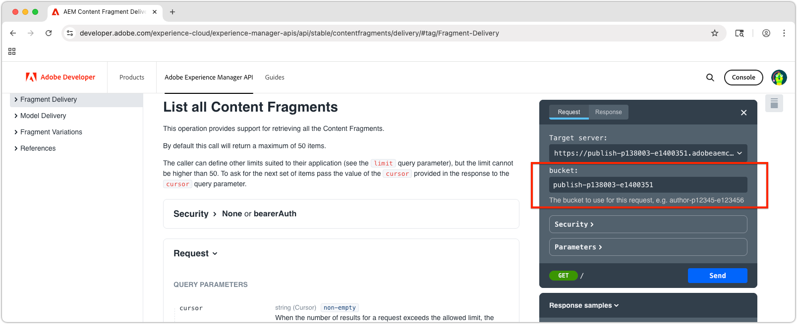
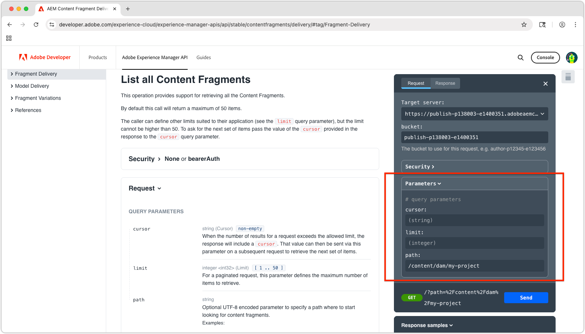
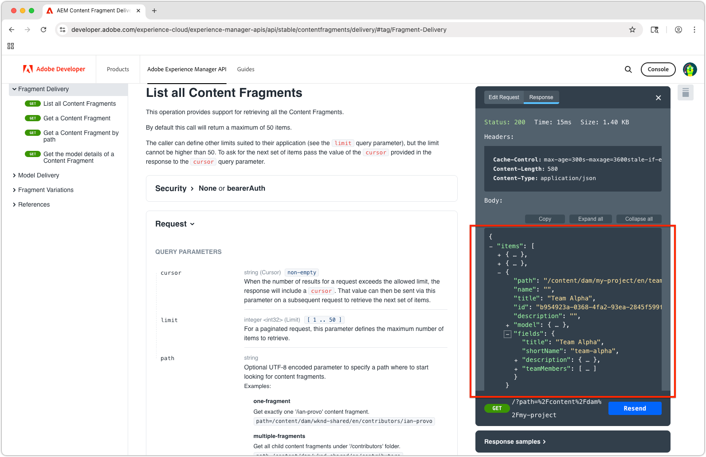

# Explore AEM OpenAPI-based Content Fragment Delivery APIs

The [AEM Content Fragment Delivery with OpenAPI APIs](https://developer.adobe.com/experience-cloud/experience-manager-apis/api/stable/contentfragments/delivery/) in AEM provide a powerful way to deliver structured content to any application or channel. In this chapter, we explore how to use the OpenAPIs to retrieve Content Fragments via the documentation's **Try It** functionality.

## Prerequisites {#prerequisites}

This is a multi-part tutorial and assumes the steps outlined in the [Authoring Content Fragments](./2-author-content-fragments.md) have been completed.

Make sure to have the following:

* The hostname of the AEM Publish service (e.g., `https://publish-<PROGRAM_ID>-e<ENVIRONMENT_ID >.adobeaemcloud.com/`) the [Content Fragments are published to](./2-author-content-fragments.md#publish-content-fragments). If you are publishing the a AEM Preview service, have that hostname available (e.g., `https://preview-<PROGRAM_ID>-e<ENVIRONMENT_ID>.adobeaemcloud.com/`).

## Objectives {#objectives}

* Familiarize with the [AEM Content Fragment Delivery with OpenAPI APIs](https://developer.adobe.com/experience-cloud/experience-manager-apis/api/stable/contentfragments/delivery/).
* Invoke the APIs using the API Docs' **Try It** capability.

## Delivery APIs  

The AEM Content Fragment Delivery with OpenAPI APIs provide a RESTful interface to retrieve Content Fragments. The APIs discussed in this tutorial are available only on the AEM Publish and Preview services, and not on the Author service. Other OpenAPIs exist for [interacting with Content Fragments on AEM Author service](https://developer.adobe.com/experience-cloud/experience-manager-apis/api/stable/sites/).

## Explore the APIs

[AEM Content Fragment Delivery with OpenAPI APIs documentation](https://developer.adobe.com/experience-cloud/experience-manager-apis/api/stable/contentfragments/delivery/) have a "Try It" feature that allows you to explore the APIs and test them directly from the browser. This is a great way to familiarize yourself with the API endpoints and their capabilities.

Open the [AEM Sites API docs](https://developer.adobe.com/experience-cloud/experience-manager-apis/api/stable/contentfragments/delivery/) in your browser. 

The APIs are listed on the left navigation under the **Fragment Delivery** section. You can expand this section to see the available APIs. Selecting an API displays the API details in the main panel, and a **Try It** section on the right-rail that allows you to test and explore the API directly from the browser.



## List Content Fragments

1. Open the [AEM Content Fragment Delivery with OpenAPI developer docs](https://developer.adobe.com/experience-cloud/experience-manager-apis/api/stable/contentfragments/delivery/) in your browser.
1. In the left navigation, expand the **Fragment Delivery** section and select the **List all Content Fragments** API

  This API allows you to retrieve a paginated list of all Content Fragments from AEM by folder. The simplest way to use this API is to provide the path to the folder containing the Content Fragments.

1. Select **Try It** in the top of the right-rail. 
1. Enter the identifier of the AEM Service the API will connect to to retrieve the Content Fragments. The bucket is the first part of the AEM Publish (or Preview) service URL, typically in the format: `publish-p<PROGRAM_ID>-e<ENVIRONMENT_ID>` or `preview-p<PROGRAM_ID>-e<ENVIRONMENT_ID>`.

Since we are using the AEM Publish service, set the bucket to the AEM Publish service identifier. For example:
    
* **bucket**: `publish-p138003-e1400351`



When the bucket is set, the **Target server** field automatically updates to the full API URL of the AEM Publish service, such as: `https://publish-p138003-e1400351.adobeaemcloud.com/adobe/contentFragments`
    
1. Expand the **Security** section and set **Security scheme** to **None**. This is because the AEM Publish service (and Preview service) does not require authentication for the AEM Content Fragment Delivery with OpenAPI APIs.

1. Expand the **Parameters** section to provide the details of the Content Fragment to get.

  * **cursor**: Leave empty, this is used for pagination and this is an initial request.
  * **limit**: Leave empty, this is used to limit the number of results returned per page of results.
  * **path**: `/content/dam/my-project/en`

    >[!TIP]
    > When entering a path, make sure its prefix is `/content/dam/` and does **not** end with a trailing slash `/`. 

    

1. Select the **Send** button to execute the API call.
1. In the **Response** tab in the **Try It** panel, you should see a JSON response containing a list of Content Fragments in the specified folder. The response will look similar to the following:

    

1. The response contains all Content Fragments under the `path` parameter's `/content/dam/my-project` folder, including sub-folders, including both **Person** and **Team** Content Fragments. 
1. Click through the `items` array and located the `Team Alpha` item's `id` value. The ID is used in next section to retrieve the details of single Content Fragment. 
1. Select **Edit request** in the top of the **Try it** panel and the various parameters in the API call to see how the response changes. For example, you can change the path to a different folder containing Content Fragments, or you can add query parameters to filter the results. For example, change `path` parameter to `/content/dam/my-project/teams` to only Content Fragments in that folder (and sub-folders).

## Get Content Fragment details

Similar to the **List all Content Fragments** API, the **Get a Content Fragment** API retrieves a single Content Fragment by its ID along with any optional references. To explore this API, we'll request the Team Content Fragment which references several Person Content Fragments.

1. Expand the **Fragment Delivery** section in the left rail, and select the **Get a Content Fragment** API.
1. Select **Try It** in the top of the right-rail.
1. Verify the `bucket` points to your AEM as a Cloud Service Publish or Preview service.
1. Expand the **Security** section and set **Security scheme** to **None**. This is because the AEM Publish service does not require authentication for the AEM Content Fragment Delivery with OpenAPI APIs.
1. Expand the **Parameters** section to provide the details of the Content Fragment to get:

In this example, use the ID of the Team Content Fragment retrieved in the previous section. For example, for this Content Fragment response in **List all Content Fragments**, use the value in the `id` field of `b954923a-0368-4fa2-93ea-2845f599f512`. (Your `id` will different from the value used in tutorial.)

```json 
{
    "path": "/content/dam/my-project/teams/team-alpha",
    "name": "",
    "title": "Team Alpha",
    "id": "50f28a14-fec7-4783-a18f-2ce2dc017f55", // This is the Content Fragment ID
    "description": "",
    "model": {},
    "fields": {} 
}
```

* **fragmentId**: `50f28a14-fec7-4783-a18f-2ce2dc017f55`
* **references**: `none`
* **depth**: Leave empty, the **references** parameter will dictate the depth of the referenced fragments.
* **hydrated**: Leave empty, the **references** parameter will dictate the hydration of the referenced fragments.
* **If-None-Match**: Leave empty

1. Select the **Send** button to execute the API call.
1. Review the response in the **Response** tab in the **Try It** panel. You should see a JSON response containing the details of the Content Fragment, including its properties and any references it has. 
1. Select **Edit request** in the top of the **Try it** panel and in the **Parameters** sections, adjust the `references` parameter to `all-hydrated`, making all referenced Content Fragment's content to be included in the API call.

    * **fragmentId**: `50f28a14-fec7-4783-a18f-2ce2dc017f55`
    * **references**: `all-hydrated`
    * **depth**: Leave empty, the **references** parameter will dictate the depth of the referenced fragments.
    * **hydrated**: Leave empty, the **references** parameter will dictate the hydration of the referenced fragments.
    * **If-None-Match**: Leave empty

1. Select the **Re-send** button to execute the API call again.
1. Review the response in the **Response** tab in the **Try It** panel. You should see a JSON response containing the details of the Content Fragment, including its properties and those of the referenced Person Content Fragments. 

Notice the `teamMembers` array now includes the details of the referenced Person Content Fragments. Hydrating references allows you to retrieve all the necessary data in a single API call, which is particularly useful for reducing the number of requests made by client applications.

## Congratulations!

Congratulations, you created and executed several AEM Content Fragment Delivery with OpenAPI API calls using the AEM documentation's **Try It** capability.

## Next Steps

In the next chapter, [Build a React app](./4-react-app.md), you explore how an external application can interact with AEM Content Fragment Delivery with OpenAPI APIs.

