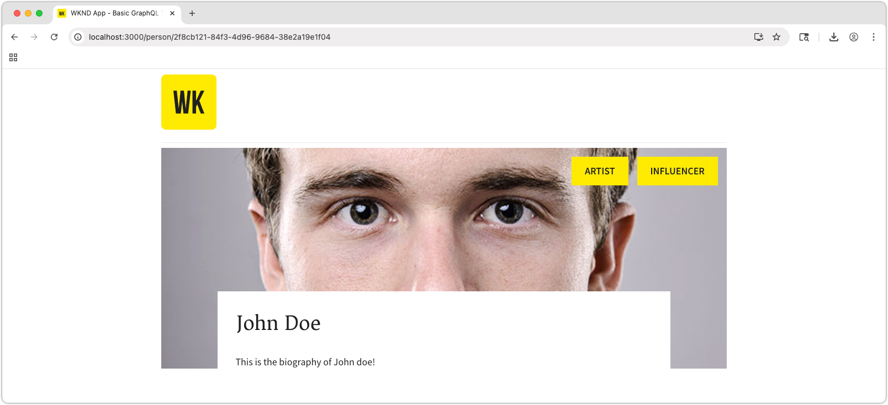

# Build a React app with AEM's Content Fragment Delivery OpenAPIs

In this chapter, you explore how AEM Content Fragment Delivery with OpenAPI APIs can drive the experience in external applications.

A simple React app is used to request and display **Team** and **Person** content exposed by AEM Content Fragment Delivery with OpenAPI APIs. The use of React is largely unimportant, and the consuming external application could be written in any framework for any platform, as long as it can make HTTP requests to AEM as a Cloud Service.

## Prerequisites

It is assumed that the steps outlined in the previous parts of this multi-part tutorial have been completed.

The following software must be installed:

* [Node.js v22+](https://nodejs.org/en)
* [Visual Studio Code](https://code.visualstudio.com/)

## Objectives

Learn how to:

* Download and start the example React app.
* Invoke AEM Content Fragment Delivery with OpenAPI APIs for a list of teams, and their referenced members.
* Invoke AEM Content Fragment Delivery with OpenAPI APIs to retrieve a team member's details.

## Set up CORS on AEM as a Cloud Service

This example React app runs locally (on `http://localhost:3000`) and connects to AEM Publish service's AEM Content Fragment Delivery with OpenAPI APIs. To allow this connection, CORS (Cross-Origin Resource Sharing) must be configured on the AEM Publish (or Preview) service.

Follow the [instructions on setting a SPA running on `http://localhost:3000` to allow CORS requests to the AEM Publish service](https://experienceleague.adobe.com/en/docs/experience-manager-learn/getting-started-with-aem-headless/deployments/spa#different-domains).

### Local CORS proxy

Alternatively, for development, run a [Local CORS Proxy](https://www.npmjs.com/package/local-cors-proxy) that facilities a CORS-friendly connection to AEM.

```bash
$ npm install --global lcp
$ lcp --proxyUrl https://publish-p<PROGRAM_ID>-e<ENVIRONMENT_ID>.adobeaemcloud.com
```

Update the `--proxyUrl` value to your AEM Publish (or Preview) URL.

With the Local CORS Proxy running, access the AEM Content Fragment Delivery APIs at `http://localhost:8010/proxy` to avoid CORS issues.

## Clone the sample React app

A stubbed-out sample React app is implemented with the code required to interact with AEM Content Fragment Delivery with OpenAPI APIs, and display team and person data obtained from them.

The sample React app source code is [available on Github.com](https://github.com/adobe/aem-tutorials/tree/main/headless/open-api/basic).

To get the React app:

1. Clone the sample WKND OpenAPI React app from [Github.com](https://github.com/adobe/aem-tutorials) from the [`headless_open-api_basic` tag](https://github.com/adobe/aem-tutorials/tree/headless_open-api_basic).

   ```shell
   $ cd ~/Code
   $ git clone git@github.com:adobe/aem-tutorials.git
   $ cd aem-tutorials  
   $ git fetch --tags
   $ git tag
   $ git checkout tags/headless_open-api_basic
   ```

1. Navigate to `headless/open-api/basic` folder and open it in your IDE.

   ```shell
   $ cd ~/Code/aem-tutorials/headless/open-api/basic
   $ code .
   ```

1. Update `.env` to connect to AEM as a Cloud Service Publish service, as this where our Content Fragments are published. This can point to AEM Preview service if you want to test the app with AEM Preview service (and the Content Fragments are published there).

    ```
    # AEM Publish (or Preview) service that provides Content Fragments
    REACT_APP_HOST_URI=https://publish-p123-e456.adobeaemcloud.com
    ```

    When using [Local CORS Proxy](#local-cors-proxy), set `REACT_APP_HOST_URI` to `http://localhost:8010/proxy`.

    ```
    # AEM Publish (or Preview) service that provides Content Fragments
    REACT_APP_HOST_URI=http://localhost:8010/proxy
    ```

1. Start the React app

   ```shell
   $ cd ~/Code/aem-tutorials/headless/open-api/basic
   $ npm install
   $ npm start
   ```   

1. The React app starts in development mode on [http://localhost:3000/](http://localhost:3000/). Changes made to the React app throughout the tutorial are reflected immediately in the web browser.

>[!IMPORTANT]
>
>   This React app is partially implemented. Follow the steps in this tutorial to complete the implementation. The JavaScript files that need implementation work have the following comment, make sure you add/update the code in those files with the code specified in this tutorial.
>
>
>  //*********************************
>  // TODO: Implement this by following the steps from AEM Headless Tutorial 
>  //*********************************
>

## Anatomy of the React app

The sample React app has three main parts that require updating.

1.  The `.env` file contains the AEM Publish (or Preview) service URL.
1.  The `src/components/Teams.js` displays a list of teams and their members.
1.  The `src/components/Person.js` displays the details of a single team member.

## Implement teams functionality

Build out the functionality to display the Teams and their members on the React app's main view. This functionality requires:

* A new [custom React useEffect hook](https://react.dev/reference/react/useEffect#useeffect) that invokes the **List all Content Fragments API** via a fetch request, and then gets the `fullName` value for each `teamMember` for display.

Once complete, the app's main view populates with the teams data from AEM.


1. Open `src/components/Teams.js`.

1. Implement the **Teams** component to fetch the list of teams from [List all Content Fragments API](https://developer.adobe.com/experience-cloud/experience-manager-apis/api/stable/contentfragments/delivery/#operation/fragments/getFragments), and render the teams content. This is broken into the following steps:

1. Create a `useEffect` hook that invokes AEM's **List all Content Fragments** API and stores the data into the React component's state.
1. For each **Team** Content Fragment returned, invoke the **Get a Content Fragment** API to fetch a the fully hydrated details of the team, including its members and their `fullNames`.
1. Render the teams data using the `Team` function.

    ```javascript
    import { useEffect, useState } from "react";
    import { Link } from "react-router-dom";
    import "./Teams.scss";

    function Teams() {

      // The teams folder is the only folder-tree that is allowed to contain Team Content Fragments.
      const TEAMS_FOLDER = '/content/dam/my-project/en/teams';
      
      // State to store the teams data
      const [teams, setTeams] = useState(null);

      useEffect(() => {
        /**
        * Fetches all teams and their associated member details
        * This is a two-step process:
        * 1. First, get all team content fragments from the specified folder
        * 2. Then, for each team, fetch the full details including hydrated references to get the team member names
        */
        const fetchData = async () => {
          try {
            // Step 1: Fetch all teams from the teams folder
            const response = await fetch(
              `${process.env.REACT_APP_HOST_URI}/adobe/contentFragments?path=${TEAMS_FOLDER}`
            );
            const allTeams = (await response.json()).items || [];

            // Step 2: Fetch detailed information for each team with hydrated references
            const hydratedTeams = [];
            for (const team of allTeams) {
              const hydratedTeamResponse = await fetch(
                `${process.env.REACT_APP_HOST_URI}/adobe/contentFragments/${team.id}?references=direct-hydrated`
              );
              hydratedTeams.push(await hydratedTeamResponse.json());
            }

            setTeams(hydratedTeams);
          } catch (error) {
            console.error("Error fetching content fragments:", error);
          }
        };

        fetchData();
      }, [TEAMS_FOLDER]);

      // Show loading state while teams data is being fetched
      if (!teams) {
        return <div>Loading teams...</div>;
      }

      // Render the teams
      return (
        <div className="teams">
          {teams.map((team, index) => {
            return (
              <Team 
                key={index} 
                {..team}
              />
            );
          })}
        </div>
      );
    }

    /**
    * Team component - renders a single team with its details and members
    * @param {string} fields - The authorable fields
    * @param {Object} references - Hydrated references containing member details such as fullName
    */
    function Team({ fields, references, path }) {
      if (!fields.title || !fields.teamMembers) {
        return null;
      }

      return (
        <div className="team">
          <h2 className="team__title">{fields.title}</h2>
          {/* Render description as HTML using dangerouslySetInnerHTML */}
          <p 
            className="team__description" 
            dangerouslySetInnerHTML={{ __html: fields.description.value }}
          />
          <div>
            <h4 className="team__members-title">Members</h4>
            <ul className="team__members">
              {/* Render each team member as a link to their detail page */}
              {fields.teamMembers.map((teamMember, index) => {
                return (
                  <li key={index} className="team__member">
                    <Link to={`/person/${teamMember}`}>
                      {/* Display the full name from the hydrated reference */}
                      {references[teamMember].value.fields.fullName}
                    </Link>
                  </li>
                );
              })}
            </ul>
          </div>
        </div>
      );
    }

    export default Teams;
    ```

## Implement person functionality

With the [Teams functionality](#implement-teams-functionality) complete, implement the functionality to handle the display on a team member's, or person's, details.



To do this:

1. Open `src/components/Person.js`
1. In the `Person` React component, parse the `id` route parameter. Note that the React app's Routes were previously set up to accept the `id` URL paramter (see `/src/App.js`).
1. Fetch the person data from AEM the [Get Content Fragment API](https://developer.adobe.com/experience-cloud/experience-manager-apis/api/stable/contentfragments/delivery/#operation/fragments/getFragment).
   
    ```javascript
    import "./Person.scss";
    import { useEffect, useState } from "react";
    import { useParams } from "react-router-dom";

    /**
    * Person component - displays detailed information about a single person
    * Fetches person data from AEM using the ID from the URL parameters
    */
    function Person() {
      // Get the person ID from the URL parameter
      const { id } = useParams();
      
      // State to store the person data
      const [person, setPerson] = useState(null);

      useEffect(() => {
        /**
        * Fetches person data from AEM Content Fragment Delivery API
        * Uses the ID from URL parameters to get the specific person's details
        */
        const fetchData = async () => {
          try {
            /* Hydrate references for access to profilePicture asset path */
            const response = await fetch(
              `${process.env.REACT_APP_HOST_URI}/adobe/contentFragments/${id}?references=direct-hydrated`
            );
            const json = await response.json();
            setPerson(json || null);
          } catch (error) {
            console.error("Error fetching person data:", error);
          }
        };
        fetchData();
      }, [id]); // Re-fetch when ID changes

      // Show loading state while person data is being fetched
      if (!person) {
        return <div>Loading person...</div>;
      }

      return (
        <div className="person">
          {/* Person profile image - Look up the profilePicture reference in the references object */}
          
          {/* Display person's occupations */}
          <div className="person__occupations">
            {person.fields.occupation.map((occupation, index) => {
              return (
                <span key={index} className="person__occupation">
                  {occupation}
                </span>
              );
            })}
          </div>
          
          {/* Person's main content: name and biography */}
          <div className="person__content">
            <h1 className="person__full-name">{person.fields.fullName}</h1>
            {/* Render biography as HTML content */}
            <div
              className="person__biography"
              dangerouslySetInnerHTML={{ __html: person.fields.biographyText.value }}
            />
          </div>
        </div>
      );  
    }

    export default Person;
    ```

### Get the completed code

The complete source code for this chapter is [available on Github.com](https://github.com/adobe/aem-tutorials/tree/headless_open-api_basic_4-end).

```bash
$ git fetch --tags
$ git tag
$ git checkout tags/headless_open-api_basic_4-end
```

## Try the app

Review the app [http://localhost:3000/](http://localhost:3000/) and click _Team member_ links. Also you can add more teams and/ or members to the Team Alpha by adding Content Fragments in AEM Author service and publishing them.

## Under the hood

Open the browser's **Developer Tools > Network** console and **Filter** for `/adobe/contentFragments` fetch requests as you interact with the React app.

## Congratulations!

Congratulations! You've successfully created a React app to consume and display Content Fragments from AEM Content Fragment Delivery with OpenAPI APIs.
