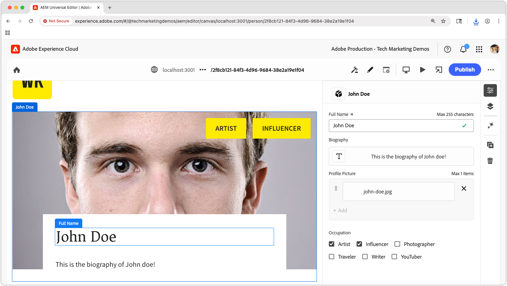
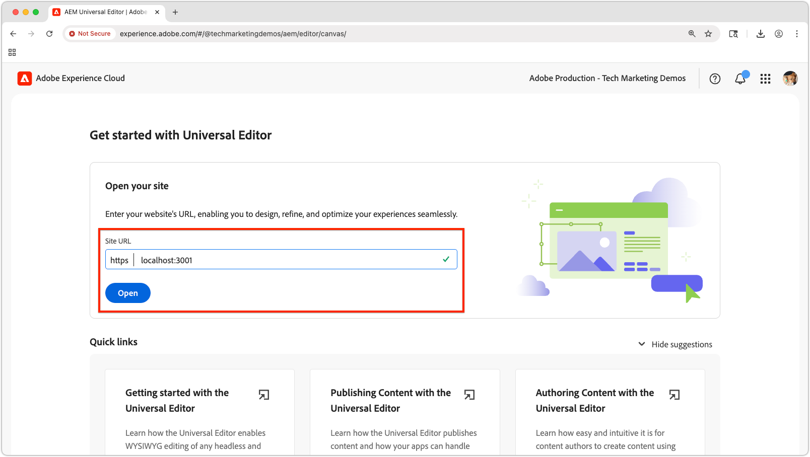
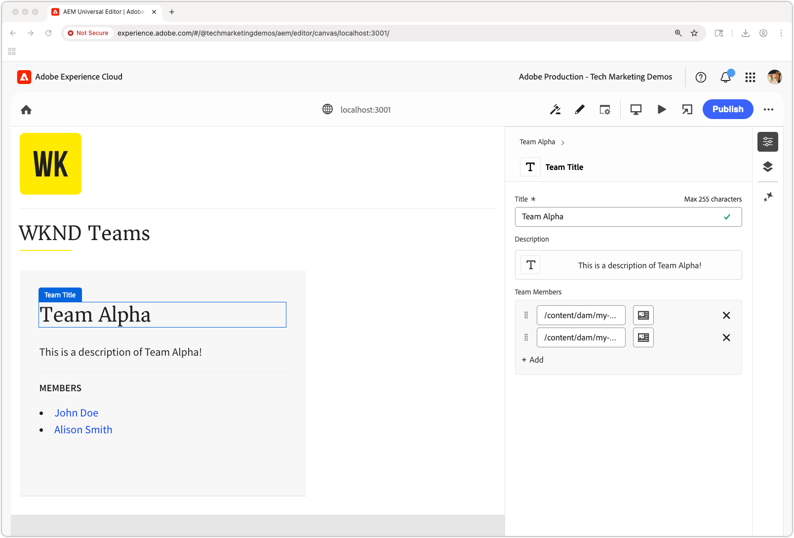

# Edit the React app with Universal Editor

In this chapter, you learn how to make the React app built in the [previous chapter](./4-react-app.md) editable using AEM Universal Editor. Universal Editor allows content authors to edit content directly within the context of the React app experience while maintaining the seamless experience of a headless application.



Universal Editor provides a powerful way to enable in-context editing for any web application, allowing authors to edit content without switching between different authoring interfaces.

## Prerequisites

* The previous steps of this tutorial have been completed, specifically [Build a React app that uses AEM's Content Fragment Delivery OpenAPIs](./4-react-app.md)
* A working knowledge of [how to use and implement Universal Editor](https://experienceleague.adobe.com/en/docs/experience-manager-cloud-service/content/implementing/developing/universal-editor/introduction).

## Objectives

Learn how to:

* Add Universal Editor instrumentation to the React app.
* Configure the React app for Universal Editor.
* Enable content editing directly within the React app interface using Universal Editor.

## Universal Editor instrumentation

Universal Editor requires [HTML attributes and meta tags](https://experienceleague.adobe.com/en/docs/experience-manager-cloud-service/content/implementing/developing/universal-editor/attributes-types) to identify editable content and establish the connection between the UI and AEM content.

### Add Universal Editor tags

First, add the necessary meta tags to identify the React app as Universal Editor compatible.

1. Open `public/index.html` in your React app.
1. Add the [Universal Editor meta tags and CORS script](https://experienceleague.adobe.com/en/docs/experience-manager-cloud-service/content/implementing/developing/universal-editor/getting-started) in the `<head>` section of the React app:

    ```html
    <!DOCTYPE html>
    <html lang="en">
    <head>
        <meta charset="utf-8" />
        <link rel="icon" href="%PUBLIC_URL%/favicon.ico" />
        <meta name="viewport" content="width=device-width, initial-scale=1" />
        <meta name="theme-color" content="#000000" />
        <meta name="description" content="WKND Teams React App" />
        
        <!-- Universal Editor meta tags and CORS script -->
        <meta name="urn:adobe:aue:system:aemconnection" content="aem:%REACT_APP_AEM_AUTHOR_HOST_URI%" />
        <script src="https://universal-editor-service.adobe.io/cors.js"></script>

        <link rel="apple-touch-icon" href="%PUBLIC_URL%/logo192.png" />
        <link rel="manifest" href="%PUBLIC_URL%/manifest.json" />
        <title>WKND Teams</title>
    </head>
    <body>
        <noscript>You need to enable JavaScript to run this app.</noscript>
        <div id="root"></div>
    </body>
    </html>
    ```

1. Update the React app's `.env` file to include the AEM Author service host to support write-backs in Universal Editor (used in the value of the `urn:adobe:aue:system:aemconnection` metat tag).

    ```bash
    # The AEM Publish (or Preview) service
    REACT_APP_HOST_URI=https://publish-p123-e456.adobeaemcloud.com
    
    # The AEM Author service
    REACT_APP_AEM_AUTHOR_HOST_URI=https://author-p123-e456.adobeaemcloud.com
    ```

### Instrument the teams component

Now add Universal Editor attributes to make the Teams component editable.

1. Open `src/components/Teams.js`.
1. Update the `Team` component to include [Universal Editor data attributes](https://experienceleague.adobe.com/en/docs/experience-manager-cloud-service/content/implementing/developing/universal-editor/attributes-types):

    When setting the `data-aue-resource` attribute, ensure the AEM path to the Content Fragment, as returned by the AEM Content Fragment Delivery with OpenAPI APIs, is postfixed with the sub-path to the Content Fragment variation; in this case `/jcr:content/data/master`.

    ```javascript
    import { useEffect, useState } from "react";
    import { Link } from "react-router-dom";
    import "./Teams.scss";

    function Teams() {

    // The teams folder is the only folder-tree that is allowed to contain Team Content Fragments.
    const TEAMS_FOLDER = '/content/dam/my-project/en/teams';

    // State to store the teams data
    const [teams, setTeams] = useState(null);

    useEffect(() => {
        /**
        * Fetches all teams and their associated member details
        * This is a two-step process:
        * 1. First, get all team content fragments from the specified folder
        * 2. Then, for each team, fetch the full details including hydrated references to get the team member names
        */
        const fetchData = async () => {
        try {
            // Step 1: Fetch all teams from the teams folder
            const response = await fetch(
            `${process.env.REACT_APP_HOST_URI}/adobe/contentFragments?path=${TEAMS_FOLDER}`
            );
            const allTeams = (await response.json()).items || [];

            // Step 2: Fetch detailed information for each team with hydrated references
            const hydratedTeams = [];
            for (const team of allTeams) {
                const hydratedTeamResponse = await fetch(
                    `${process.env.REACT_APP_HOST_URI}/adobe/contentFragments/${team.id}?references=direct-hydrated`
                );
                hydratedTeams.push(await hydratedTeamResponse.json());
            }

            setTeams(hydratedTeams);
        } catch (error) {
            console.error("Error fetching content fragments:", error);
        }
        };

        fetchData();
    }, [TEAMS_FOLDER]);

    // Show loading state while teams data is being fetched
    if (!teams) {
        return <div>Loading teams...</div>;
    }

    // Render the teams
    return (
        <div className="teams">
        {teams.map((team, index) => {
            return (
            <Team
                key={index}
                {...team}
            />
            );
        })}
        </div>
    );
    }

    /**
    * Team - renders a single team with its details and members
    * @param {Object} fields - The authored Content Fragment fields
    * @param {Object} references - Hydrated references containing member details such as fullName
    * @param {string} path - Path of the team content fragment
    */
    function Team({ fields, references, path }) {
    if (!fields.title || !fields.teamMembers) {
        return null;
    }

    return (
        <>
        {/* Specify the correct Content Fragment variation path suffix in the data-aue-resource attribute */}
        <div className="team"
            data-aue-resource={`urn:aemconnection:${path}/jcr:content/data/master`}
            data-aue-type="component"
            data-aue-label={fields.title}>

            <h2 className="team__title"
            data-aue-prop="title"
            data-aue-type="text"
            data-aue-label="Team Title">{fields.title}</h2>
            <p className="team__description"
            data-aue-prop="description"
            data-aue-type="richtext"
            data-aue-label="Team Description"
            dangerouslySetInnerHTML={{ __html: fields.description.value }}
            />
            <div>
            <h4 className="team__members-title">Members</h4>
            <ul className="team__members">
                {fields.teamMembers.map((teamMember, index) => {
                return (
                    <li key={index} className="team__member">
                    <Link to={`/person/${teamMember}`}>
                        {references[teamMember].value.fields.fullName}
                    </Link>
                    </li>
                );
                })}
            </ul>
            </div>
        </div>
        </>
    );
    }

    export default Teams;
    ```

### Instrument the person component

Similarly, add Universal Editor attributes to the Person component.

1. Open `src/components/Person.js`.
1. Update the component to include [Universal Editor data attributes](https://experienceleague.adobe.com/en/docs/experience-manager-cloud-service/content/implementing/developing/universal-editor/attributes-types):

    When setting the `data-aue-resource` attribute, ensure the AEM path to the Content Fragment, as returned by the AEM Content Fragment Delivery with OpenAPI APIs, is postfixed with the sub-path to the Content Fragment variation; in this case `/jcr:content/data/master`.

    ```javascript
    import "./Person.scss";
    import { useEffect, useState } from "react";
    import { useParams } from "react-router-dom";

    /**
    * Person component - displays detailed information about a single person
    * Fetches person data from AEM using the ID from the URL parameters
    */
    function Person() {
        const { id } = useParams();
        const [person, setPerson] = useState(null);

        useEffect(() => {
            const fetchData = async () => {
            try {
                const response = await fetch(
                `${process.env.REACT_APP_HOST_URI}/adobe/contentFragments/${id}?references=direct-hydrated`
                );
                const json = await response.json();
                setPerson(json || null);
            } catch (error) {
                console.error("Error fetching person data:", error);
            }
            };
            fetchData();
        }, [id]);

        if (!person) {
            return <div>Loading person...</div>;
        }

        /* Add the Universal Editor data-aue-* attirbutes to the rendered HTML */
        return (
            <div className="person"
                data-aue-resource={`urn:aemconnection:${person.path}/jcr:content/data/master`}
                data-aue-type="component"
                data-aue-label={person.fields.fullName}>
                
                <div className="person__occupations">
                    {person.fields.occupation.map((occupation, index) => {
                    return (
                        <span key={index} className="person__occupation">
                            {occupation}
                        </span>
                    );
                    })}
                </div>

                <div className="person__content">
                    <h1 className="person__full-name"
                        data-aue-prop="fullName"
                        data-aue-type="text"
                        data-aue-label="Full Name">
                        {person.fields.fullName}
                    </h1>
                    <div className="person__biography"
                        data-aue-prop="biographyText"
                        data-aue-type="richtext"
                        data-aue-label="Biography"
                        dangerouslySetInnerHTML={{ __html: person.fields.biographyText.value }}
                    />
                </div>
            </div>
        );
    }
    ```

### Get the completed code

The complete source code for this chapter is [available on Github.com](https://github.com/adobe/aem-tutorials/tree/headless_open-api_basic_5-end).


```bash
$ git fetch --tags
$ git tag
$ git checkout tags/headless_open-api_basic_5-end
```

## Test Universal Editor integration

Now test the Universal Editor compatibility updates by opening the React app in Universal Editor.

### Start the React app

1. Ensure your React app is running:

    ```bash
    $ cd ~/Code/aem-guides-wknd-openapi/basic-tutorial
    $ npm install
    $ npm start
    ```

1. Verify the app loads at `http://localhost:3000` and displays the teams and people content.

### Run local SSL proxy

Universal Editor requires the editable application to be loaded over HTTPS. 

1. To run the local React app over HTTPS, use the [local-ssl-proxy](https://www.npmjs.com/package/local-ssl-proxy) npm module from the command line.

    ```bash
    $ npm install -g local-ssl-proxy
    $ local-ssl-proxy --source 3001 --target 3000
    ```

1. Open `https://localhost:3001` in your web browser
1. Accept the self-signed certificate.
1. Verify the React app loads.

### Open in Universal Editor



1. Navigate to [Universal Editor](https://experience.adobe.com/#/@myOrg/aem/editor/canvas/).
1. In the **Site URL** field, enter the HTTPS React app URL: `https://localhost:3001`.
1. Select Click **Open**.

The Universal Editor should load your React app with editing capabilities enabled.

### Test editing functionality



1. In Universal Editor, hover over editable elements in your React app.

1. To navigate within the React app, toggle **Preview** mode on, and off again to edit. Remember, the **Preview** has nothing to do with the AEM Preview service, rather it toggles the edit chrome on and off in Universal Editor.

1. You should see editing indicators and be able to click the various editable elements of the React app.

1. Try editing a team title:
   * Click on a team title
   * Edit the text in the properties panel
   * Save the changes

1. Try editing a person's profile picture:
   * Click on a person's profile picture
   * Select a new image from the asset picker
   * Save the changes

1. Press **Publish** in the top-right of Universal Editor to publish edits to AEM Publish (or Preview) service, so they are reflected in the React app in Universal Editor.

## Universal Editor data attributes

For complete documentation on instrumenting an application for Universal Editor, refer to the [Universal Editor documentation](https://experience.adobe.com/#/@myOrg/aem/editor/canvas/).

## Congratulations!

Congratulations! You've successfully integrated Universal Editor with your React app. Content authors can now edit Content Fragments directly within the React app interface, providing a seamless authoring experience while maintaining the benefits of a headless architecture.

Remember, you can always get the final source code for this tutorial from the `main` branch of the [GitHub.com repository](https://github.com/adobe/aem-tutorials/tree/main).
