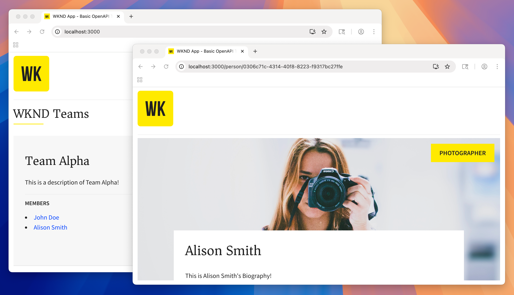

# Get started with AEM Content Fragment Delivery with OpenAPI APIs

Explore this tutorial illustrating how to build-out and expose AEM content using AEM's Content Fragment Delivery with OpenAPI APIs and consumed by an external app, in a headless CMS scenario. This explores these concepts by walking thought the creation of a React app that displays WKND teams and associated member details. Teams and Members are modeled using AEM Content Fragment Models, and consumed by the React app using AEM Content Fragment Delivery with OpenAPI APIs.   

This tutorial covers the following topics:

* Create a Project Configuration
* Create Content Fragment Models to model data
* Create Content Fragments based on the previously made models
* Explore how Content Fragments in AEM can be queried using the AEM Content Fragment Delivery with OpenAPI APIs documentation's "Try It" feature
* Consume Content Fragment data via AEM Content Fragment Delivery with OpenAPI API calls from a sample React app
* Enhance the React app to be editable in Universal Editor

## Prerequisites {#prerequisites}

The following are required to follow this tutorial:

* AEM Sites as a Cloud Service
* Basic HTML and JavaScript skills
* The following tools must be installed locally:
    * [Node.js v22+](https://nodejs.org/)
    * [Git](https://git-scm.com/)
    * An IDE (for example, [Microsoft&reg; Visual Studio Code](https://code.visualstudio.com/))

### AEM as a Cloud Service environment

To complete this tutorial, it is recommended that you have **AEM Administrator** access to an AEM as a Cloud Service environment. A **Development** environment, **Rapid Development Environment**, or an environment in a **Sandbox Program** can also be used.

## Let's get started!

Start the tutorial with [Defining Content Fragment Models](1-content-fragment-models.md).

## GitHub project

The source code, and content packages are available in the [AEM Headless tutorials](https://github.com/adobe/aem-tutorials) GitHub repository. 

The [`main` branch contains the final source code](https://github.com/adobe/aem-tutorials/tree/main/headless/open-api/basic) for this tutorial. 
Snapshots of the code at the end of each step are available as Git tags. 

* Start of chapter 4 - React app: [`headless_open-api_basic`](https://github.com/adobe/aem-tutorials/tree/headless_open-api_basic//headless/open-api/basic)
* End of chapter 4 - React app: [`headless_open-api_basic_4-end`](https://github.com/adobe/aem-tutorials/tree/headless_open-api_basic_4-end//headless/open-api/basic)
* End of chapter 5 - Universal Editor: [`headless_open-api_basic_5-end`](https://github.com/adobe/aem-tutorials/tree/headless_open-api_basic_5-end//headless/open-api/basic)

If you find an issue with the tutorial or the code, leave a [GitHub issue](https://github.com/adobe/aem-tutorials/issues).
