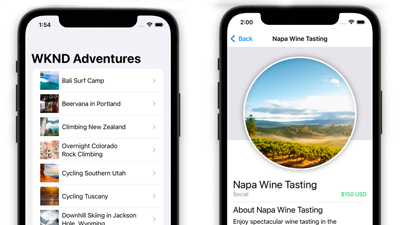
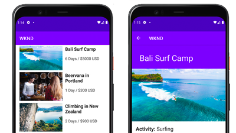
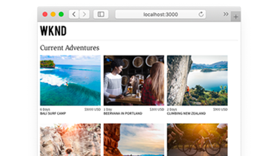

# AEM Headless Tutorials

Adobe Experience Manager (AEM) has multiple options for defining headless endpoints and delivering its content as JSON. Use hands-on tutorials to explore how to use the various options and chose what's right for you.

>[!TIP]
>
>This collection of tutorials are designed for those who prefer to **learn by doing**. If you prefer learning concepts from the ground up, check out the [AEM Headless Developer Journey](https://experienceleague.adobe.com/docs/experience-manager-cloud-service/content/headless/journeys/developer/overview.html). This set of tutorials and the journey complement each other.

## Tutorials by API

<table>
<tr>
  <td>
    
    

      <a href="https://experienceleague.adobe.com/docs/experience-manager-learn/getting-started-with-aem-headless/graphql/overview.html">
    <strong>GraphQL API</strong>
    </a>
    

    

    <em>Learn how an application can use AEM's GraphQL API to query content.</em>
    

  </td>
  <td>
    
    

    <a href="https://experienceleague.adobe.com/docs/experience-manager-learn/getting-started-with-aem-headless/authentication/overview.html">
    <strong>Token authentication</strong>
    </a>
    

    

    <em>Learn how an application can securely authenticate with AEM.</em>
    

  </td>
  <td>
    
     

      <a href="https://experienceleague.adobe.com/docs/experience-manager-learn/getting-started-with-aem-headless/content-services/overview.html">
        <strong>Content Services</strong>
      </a>
    

    

    <em>Learn how an application can use a REST API to consume content.</em>
    

  </td>
</tr>
</table>

## Example applications

Example applications are a great way to explore the headless capabilities of Adobe Experience Manager (AEM). Download and install these finished examples to get started right away.

<table>
<tr>
  <td>
    
    

      <a href="https://experienceleague.adobe.com/docs/experience-manager-learn/getting-started-with-aem-headless/graphql/example-apps/ios-swiftui-app.html">
    <strong>iOS SwiftUI Example</strong>
    </a>
    

    

    <em>An iOS application powered by AEM's GraphQL APIs.</em>
    

  </td>
  <td>
    
    

    <a href="https://experienceleague.adobe.com/docs/experience-manager-learn/getting-started-with-aem-headless/graphql/example-apps/android-app.html">
    <strong>Android&trade; Example</strong>
    </a>
    

    

    <em>An Android&trade; application powered by AEM's GraphQL APIs.</em>
    

  </td>
  <td>
    
     

      <a href="https://experienceleague.adobe.com/docs/experience-manager-learn/getting-started-with-aem-headless/graphql/example-apps/react-app.html">
        <strong>React Example</strong>
      </a>
    

    

    <em>A React application powered by AEM's GraphQL APIs.</em>
    

  </td>
</tr>
</table>

## Tutorials by framework

Browse the following tutorials based on the technology used. Learn how AEM can go beyond a pure headless use case, with options for in-context authoring and experience management.

<table>
<tr>
  <td>
    
    

      <a href="https://experienceleague.adobe.com/docs/experience-manager-learn/getting-started-with-aem-headless/graphql/overview.html">
    <strong>React - Headless</strong>
    </a>
    

    

    <em>Build a React JS app using GraphQL in a pure headless scenario.</em>
    

  </td>
  <td>
    
    

    <a href="https://experienceleague.adobe.com/docs/experience-manager-learn/getting-started-with-aem-headless/spa-editor/remote-spa/overview.html">
    <strong>React - Remote editor</strong>
    </a>
    

    

    <em>Author in-context a portion of a remotely hosted React application.</em>
    

  </td>
  <td>
    
     

      <a href="https://experienceleague.adobe.com/docs/experience-manager-learn/getting-started-with-aem-headless/spa-editor/react/overview.html">
        <strong>React - SPA Editor</strong>
      </a>
    

    

    <em>Use the AEM SPA editor to manage the complete React app experience.</em>
    

  </td>
</tr>
<tr>  
  <td>
    
    

    <a href="https://experienceleague.adobe.com/docs/experience-manager-learn/getting-started-with-aem-headless/content-services/overview.html">
    <strong>Android - Content Services</strong>
    </a>
    

    

    <em>Use Content Services and REST to power a mobile Android&trade; application.</em>
    

  </td>
  <td>
    
     

      <a href="https://experienceleague.adobe.com/docs/experience-manager-learn/getting-started-with-aem-headless/authentication/overview.html">
        <strong>Node.js - Authentication</strong>
      </a>
    

    

    <em>Build a Node.js app using developer and service tokens to authenticate.</em>
    

  </td>
  <td></td>
</tr>
</table>
