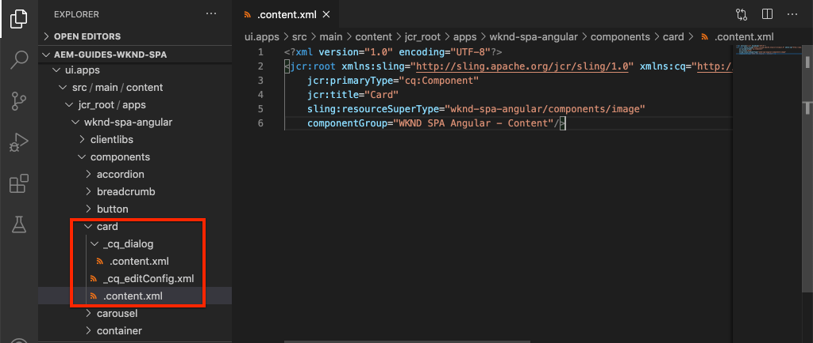
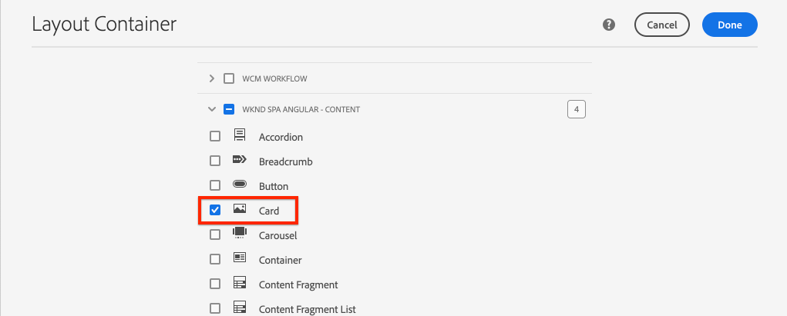
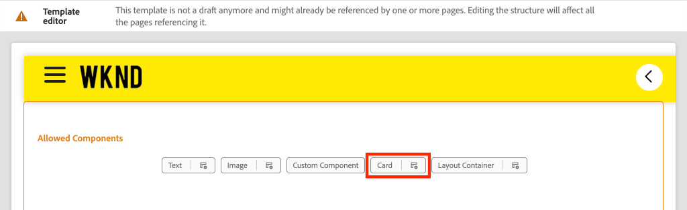
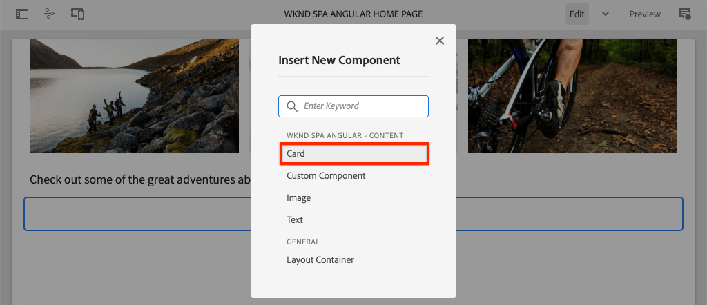
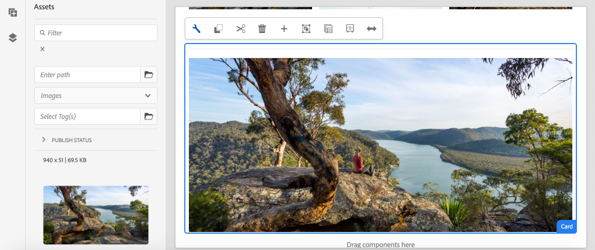
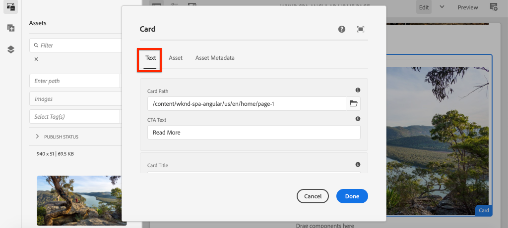
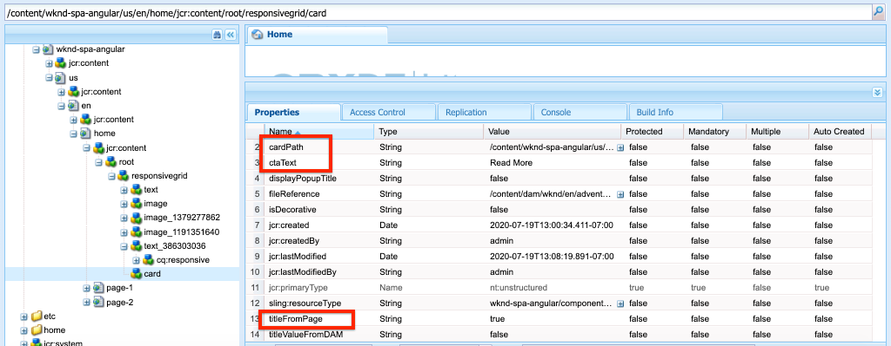
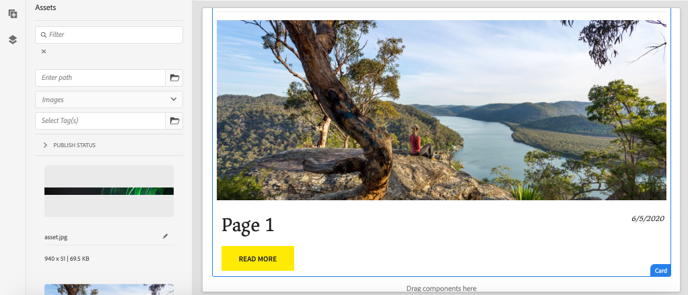

# Extend a Core Component {#extend-component}

Learn how to extend an existing Core Component to be used with the AEM SPA Editor. Understanding how to extend an existing component is a powerful technique to customize and expand the capabilities of an AEM SPA Editor implementation.

## Objective

1. Extend an existing Core Component with additional properties and content.
2. Understand the basic of Component Inheritance with the use of `sling:resourceSuperType`.
3. Learn how to use the [Delegation Pattern](https://github.com/adobe/aem-core-wcm-components/wiki/Delegation-Pattern-for-Sling-Models) for Sling Models to reuse existing logic and functionality.

## What you will build

In this chapter, a new `Card` component is created. The `Card` component extends the [Image Core Component](https://experienceleague.adobe.com/docs/experience-manager-core-components/using/components/image.html) adding additional content fields like a Title and a Call To Action button to perform the role of a teaser for other content within the SPA.


>[!NOTE]
>
> In a real-world implementation it may be more appropriate to simply use the [Teaser Component](https://experienceleague.adobe.com/docs/experience-manager-core-components/using/components/teaser.html) than extending the [Image Core Component](https://experienceleague.adobe.com/docs/experience-manager-core-components/using/components/image.html) to make a `Card` component depending on project requirements. It is always recommended to use [Core Components](https://experienceleague.adobe.com/docs/experience-manager-core-components/using/introduction.html) directly when possible.

## Prerequisites

Review the required tooling and instructions for setting up a [local development environment](overview.md#local-dev-environment).

### Get the code

1. Download the starting point for this tutorial via Git:

    ```shell
    $ git clone git@github.com:adobe/aem-guides-wknd-spa.git
    $ cd aem-guides-wknd-spa
    $ git checkout Angular/extend-component-start
    ```

2. Deploy the code base to a local AEM instance using Maven:

    ```shell
    $ mvn clean install -PautoInstallSinglePackage
    ```

    If using [AEM 6.x](overview.md#compatibility) add the `classic` profile:

    ```shell
    $ mvn clean install -PautoInstallSinglePackage -Pclassic
    ```

3. Install the finished package for the traditional [WKND reference site](https://github.com/adobe/aem-guides-wknd/releases/tag/aem-guides-wknd-2.1.0). The images provided by [WKND reference site](https://github.com/adobe/aem-guides-wknd/releases/latest) is reused on the WKND SPA. The package can be installed using [AEM's Package Manager](http://localhost:4502/crx/packmgr/index.jsp).

    

You can always view the finished code on [GitHub](https://github.com/adobe/aem-guides-wknd-spa/tree/Angular/extend-component-solution) or check out the code locally by switching to the branch `Angular/extend-component-solution`.

## Inspect initial Card implementation

An initial Card Component has been provided by the chapter starter code. Inspect the starting point for the Card implementation.

1. In the IDE of your choice open the `ui.apps` module.
2. Navigate to `ui.apps/src/main/content/jcr_root/apps/wknd-spa-angular/components/card` and view the `.content.xml` file.

    

    ```xml
    <?xml version="1.0" encoding="UTF-8"?>
    <jcr:root xmlns:sling="http://sling.apache.org/jcr/sling/1.0" xmlns:cq="http://www.day.com/jcr/cq/1.0" xmlns:jcr="http://www.jcp.org/jcr/1.0"
        jcr:primaryType="cq:Component"
        jcr:title="Card"
        sling:resourceSuperType="wknd-spa-angular/components/image"
        componentGroup="WKND SPA Angular - Content"/>
    ```

    The property `sling:resourceSuperType` points to `wknd-spa-angular/components/image` indicating that the `Card` component inherits the functionality from the WKND SPA Image component.

3. Inspect the file `ui.apps/src/main/content/jcr_root/apps/wknd-spa-angular/components/image/.content.xml`:

    ```xml
    <?xml version="1.0" encoding="UTF-8"?>
    <jcr:root xmlns:sling="http://sling.apache.org/jcr/sling/1.0" xmlns:cq="http://www.day.com/jcr/cq/1.0" xmlns:jcr="http://www.jcp.org/jcr/1.0"
        jcr:primaryType="cq:Component"
        jcr:title="Image"
        sling:resourceSuperType="core/wcm/components/image/v2/image"
        componentGroup="WKND SPA Angular - Content"/>
    ```

    Notice that the `sling:resourceSuperType` points to `core/wcm/components/image/v2/image`. This indicates that the WKND SPA Image component inherits the functionality from the Core Component Image.

    Also known as the [Proxy pattern](https://experienceleague.adobe.com/docs/experience-manager-core-components/using/developing/guidelines.html#proxy-component-pattern) Sling resource inheritance is a powerful design pattern for allowing child components to inherit functionality and extend/override behavior when desired. Sling inheritance supports multiple levels of inheritance, so ultimately the new `Card` component inherits functionality of the Core Component Image. 

    Many development teams strive to be D.R.Y. (don't repeat yourself). Sling inheritance makes this possible with AEM.

4. Beneath the `card` folder, open the file `_cq_dialog/.content.xml`. 

    This file is the Component Dialog definition for the `Card` component. If using Sling inheritance, it is possible to use features of the [Sling Resource Merger](https://experienceleague.adobe.com/docs/experience-manager-65/developing/platform/sling-resource-merger.html) to override or extend portions of the dialog. In this sample, a new tab has been added to the dialog to capture additional data from an author to populate the Card Component.

    Properties like `sling:orderBefore` allow a developer to choose where to insert new tabs or form fields. In this case, the `Text` tab is inserted before the `asset` tab. To make full use of the Sling Resource Merger, it is important to know the original dialog node structure for the [Image component dialog](https://github.com/adobe/aem-core-wcm-components/blob/master/content/src/content/jcr_root/apps/core/wcm/components/image/v2/image/_cq_dialog/.content.xml).

5. Beneath the `card` folder, open the file `_cq_editConfig.xml`. This file dictates the drag and drop behavior in the AEM authoring UI. When extending the Image component, it is important that the resource type matches the component itself. Review the `<parameters>` node:

    ```xml
    <parameters
        jcr:primaryType="nt:unstructured"
        sling:resourceType="wknd-spa-angular/components/card"
        imageCrop=""
        imageMap=""
        imageRotate=""/>
    ```

    Most components do not require a `cq:editConfig`, the Image, and child descendents of the Image component are exceptions.

6. In the IDE switch to the `ui.frontend` module, navigating to `ui.frontend/src/app/components/card`:

    

7. Inspect the file `card.component.ts`.

    The component has already been stubbed out to map to the AEM `Card` Component using the standard `MapTo` function.

    ```js
    MapTo('wknd-spa-angular/components/card')(CardComponent, CardEditConfig);
    ```

    Review the three `@Input` parameters in the class for `src`, `alt`, and `title`. These are expected JSON values from the AEM component that are mapped to the Angular component.

8. Open the file `card.component.html`:

    ```html
    <div class="card"  *ngIf="hasContent">
        <app-image class="card__image" [src]="src" [alt]="alt" [title]="title"></app-image>
    </div>
    ```

    In this example we chose to reuse the existing Angular Image component `app-image` by simply passing the `@Input` parameters from `card.component.ts`. Later in the tutorial, additional properties are added and displayed.

## Update the Template Policy

With this initial `Card` implementation review the functionality in the AEM SPA Editor. To see the initial `Card` component an update to the Template policy is needed.

1. Deploy the starter code to a local instance of AEM, if you haven't already:

    ```shell
    $ cd aem-guides-wknd-spa
    $ mvn clean install -PautoInstallSinglePackage
    ```

2. Navigate to the SPA Page Template at [http://localhost:4502/editor.html/conf/wknd-spa-angular/settings/wcm/templates/spa-page-template/structure.html](http://localhost:4502/editor.html/conf/wknd-spa-angular/settings/wcm/templates/spa-page-template/structure.html).
3. Update the Layout Container's policy to add the new `Card` component as an allowed component:

    

    Save the changes to the policy, and observe the `Card` component as an allowed component:

    

## Author initial Card component

Next, author the `Card` component using the AEM SPA Editor.

1. Navigate to [http://localhost:4502/editor.html/content/wknd-spa-angular/us/en/home.html](http://localhost:4502/editor.html/content/wknd-spa-angular/us/en/home.html).
2. In `Edit` mode, add the `Card` component to the `Layout Container`:

    

3. Drag and drop an image from the Asset finder onto the `Card` component:

    

4. Open the `Card` component dialog and notice the addition of a **Text** Tab.
5. Enter the following values on the **Text** tab:

    

    **Card Path** - choose a page beneath the SPA homepage.

    **CTA Text** - "Read More"

    **Card Title** - leave blank

    **Get title from linked page** - check the checkbox to indicate true.

6. Update the **Asset Metadata** tab to add values for **Alternative Text** and **Caption**.

    Currently no additional changes appear after updating the dialog. To expose the new fields to the Angular Component, we need to update the Sling Model for the `Card` component.

7. Open a new tab and navigate to [CRXDE-Lite](http://localhost:4502/crx/de/index.jsp#/content/wknd-spa-angular/us/en/home/jcr%3Acontent/root/responsivegrid/card). Inspect the content nodes beneath `/content/wknd-spa-angular/us/en/home/jcr:content/root/responsivegrid` to find the `Card` component content.

    

    Observe that properties `cardPath`, `ctaText`, `titleFromPage` are persisted by the dialog.

## Update Card Sling Model

To ultimately expose the values from the component dialog to the Angular component, we need to update the Sling Model that populates the JSON for the `Card` component. We also have the opportunity to implement two pieces of business logic:

* If `titleFromPage` to **true**, return the title of the page specified by `cardPath` otherwise return the value of `cardTitle` textfield.
* Return the last modified date of the page specified by `cardPath`.

Return to the IDE of your choice and open the `core` module.

1. Open the file `Card.java` at `core/src/main/java/com/adobe/aem/guides/wknd/spa/angular/core/models/Card.java`. 

    Observe that the `Card` interface currently extends `com.adobe.cq.wcm.core.components.models.Image` and therefore inherits the methods of the `Image` interface. The `Image` interface already extends the `ComponentExporter` interface which allows the Sling Model to be exported as JSON and mapped by the SPA editor. Therefore we do not need to explicitly extend `ComponentExporter` interface like we did in the [Custom Component chapter](custom-component.md).

2. Add the following methods to the interface:

    ```java
    @ProviderType
    public interface Card extends Image {

        /***
        * The URL to populate the CTA button as part of the card.
        * The link should be based on the cardPath property that points to a page.
        * @return String URL
        */
        public String getCtaLinkURL();

        /***
        * The text to display on the CTA button of the card.
        * @return String CTA text
        */
        public String getCtaText();


        /***
        * The date to be displayed as part of the card.
        * This is based on the last modified date of the page specified by the cardPath
        * @return
        */
        public Calendar getCardLastModified();


        /**
        * Return the title of the page specified by cardPath if `titleFromPage` is set to true.
        * Otherwise return the value of `cardTitle`
        * @return
        */
        public String getCardTitle();
    }
    ```

    These methods are exposed via the JSON model API and passed to the Angular component.

3. Open `CardImpl.java`. This is the implementation of `Card.java` interface. This implementation has been partially stubbed out to accelerate the tutorial.  Notice the use of the `@Model` and `@Exporter` annotations to ensure that the Sling Model is able to be serialized as JSON via the Sling Model Exporter.

    `CardImpl.java` also uses the [Delegation pattern for Sling Models](https://github.com/adobe/aem-core-wcm-components/wiki/Delegation-Pattern-for-Sling-Models) to avoid rewriting the logic from the Image Core Component.

4. Observe the following lines:

    ```java
    @Self
    @Via(type = ResourceSuperType.class)
    private Image image;
    ```

    The above annotation instantiates an Image object named `image` based on the `sling:resourceSuperType` inheritance of the `Card` component. 

    ```java
    @Override
    public String getSrc() {
        return null != image ? image.getSrc() : null;
    }
    ```

    It is then possible to simply use the `image` object to implement methods defined by the `Image` interface, without having to write the logic ourselves. This technique is used for `getSrc()`, `getAlt()`, and `getTitle()`.

5. Next, implement the `initModel()` method to initiate a private variable `cardPage` based on the value of `cardPath`

    ```java
    @PostConstruct
    public void initModel() {
        if(StringUtils.isNotBlank(cardPath) && pageManager != null) {
            cardPage = pageManager.getPage(this.cardPath);
        }
    }
    ```

    The `@PostConstruct initModel()` is called when the Sling Model is initialized, therefore it is a good opportunity to initialize objects that may be used by other methods in the model. The `pageManager` is one of several [Java&trade; backed global objects](https://experienceleague.adobe.com/docs/experience-manager-htl/content/global-objects.html) made available to Sling Models via the `@ScriptVariable` annotation. The [getPage](https://developer.adobe.com/experience-manager/reference-materials/cloud-service/javadoc/com/day/cq/wcm/api/PageManager.html) method takes in a path and returns an AEM [Page](https://developer.adobe.com/experience-manager/reference-materials/cloud-service/javadoc/com/day/cq/wcm/api/Page.html) object or null if the path doesn't point to a valid page.

    This initializes the `cardPage` variable, which is used by the other new methods to return data about the underlying linked page.

6. Review the global variables already mapped to the JCR properties saved the author dialog. The `@ValueMapValue` annotation is used to automatically perform the mapping.

    ```java
    @ValueMapValue
    private String cardPath;

    @ValueMapValue
    private String ctaText;

    @ValueMapValue
    private boolean titleFromPage;

    @ValueMapValue
    private String cardTitle;
    ```

    These variables are used to implement the additional methods for the `Card.java` interface.

7. Implement the additional methods defined in the `Card.java` interface:

    ```java
    @Override
    public String getCtaLinkURL() {
        if(cardPage != null) {
            return cardPage.getPath() + ".html";
        }
        return null;
    }

    @Override
    public String getCtaText() {
        return ctaText;
    }

    @Override
    public Calendar getCardLastModified() {
       if(cardPage != null) {
           return cardPage.getLastModified();
       }
       return null;
    }

    @Override
    public String getCardTitle() {
        if(titleFromPage) {
            return cardPage != null ? cardPage.getTitle() : null;
        }
        return cardTitle;
    }
    ```

    >[!NOTE]
    >
    > You can view the [finished CardImpl.java here](https://github.com/adobe/aem-guides-wknd-spa/blob/Angular/extend-component-solution/core/src/main/java/com/adobe/aem/guides/wknd/spa/angular/core/models/impl/CardImpl.java).

8. Open a terminal window and deploy just the updates to the `core` module using the Maven `autoInstallBundle` profile from the `core` directory.

    ```shell
    $ cd core/
    $ mvn clean install -PautoInstallBundle
    ```

    If using [AEM 6.x](overview.md#compatibility) add the `classic` profile.

9. View the JSON model response at: [http://localhost:4502/content/wknd-spa-angular/us/en.model.json](http://localhost:4502/content/wknd-spa-angular/us/en.model.json) and search for the `wknd-spa-angular/components/card`:

    ```json
    "card": {
        "ctaText": "Read More",
        "cardTitle": "Page 1",
        "title": "Woman chillaxing with river views in Australian bushland",
        "src": "/content/wknd-spa-angular/us/en/home/_jcr_content/root/responsivegrid/card.coreimg.jpeg/1595190732886/adobestock-216674449.jpeg",
        "alt": "Female sitting on a large rock relaxing in afternoon dappled light the Australian bushland with views over the river",
        "cardLastModified": 1591360492414,
        "ctaLinkURL": "/content/wknd-spa-angular/us/en/home/page-1.html",
        ":type": "wknd-spa-angular/components/card"
    }
    ```

    Notice that the JSON model is updated with additional key/value pairs after updating the methods in the `CardImpl` Sling Model.

## Update Angular Component

Now that the JSON model is populated with new properties for `ctaLinkURL`, `ctaText`, `cardTitle`, and `cardLastModified` we can update the Angular component to display these.

1. Return to the IDE and open the `ui.frontend` module. Optionally, start the webpack dev server from a new terminal window to see the changes in real time:

    ```shell
    $ cd ui.frontend
    $ npm install
    $ npm start
    ```

2. Open `card.component.ts` at `ui.frontend/src/app/components/card/card.component.ts`. Add the additional `@Input` annotations to capture the new model:

    ```diff
    export class CardComponent implements OnInit {

         @Input() src: string;
         @Input() alt: string;
         @Input() title: string;
    +    @Input() cardTitle: string;
    +    @Input() cardLastModified: number;
    +    @Input() ctaLinkURL: string;
    +    @Input() ctaText: string;
    ```

3. Add methods for checking if the Call to Action is ready and for returning a date/time string based on the `cardLastModified` input:

    ```js
    export class CardComponent implements OnInit {
        ...
        get hasCTA(): boolean {
            return this.ctaLinkURL && this.ctaLinkURL.trim().length > 0 && this.ctaText && this.ctaText.trim().length > 0;
        }

        get lastModifiedDate(): string {
            const lastModifiedDate = this.cardLastModified ? new Date(this.cardLastModified) : null;

            if (lastModifiedDate) {
            return lastModifiedDate.toLocaleDateString();
            }
            return null;
        }
        ...
    }
    ```

4. Open `card.component.html` and add the following markup to display the title, call to action and last modified date:

    ```html
    <div class="card"  *ngIf="hasContent">
        <app-image class="card__image" [src]="src" [alt]="alt" [title]="title"></app-image>
        <div class="card__content">
            <h2 class="card__title">
                {{cardTitle}}
                <span class="card__lastmod" *ngIf="lastModifiedDate">{{lastModifiedDate}}</span>
            </h2>
            <div class="card__action-container" *ngIf="hasCTA">
                <a [routerLink]="ctaLinkURL" class="card__action-link" [title]="ctaText">
                    {{ctaText}}
                </a>
            </div>
        </div>
    </div>
    ```

    Sass rules have already been added at `card.component.scss` to style the title, call to action and last modified date.

    >[!NOTE]
    >
    > You can view the finished [Angular card component code here](https://github.com/adobe/aem-guides-wknd-spa/tree/Angular/extend-component-solution/ui.frontend/src/app/components/card).

5. Deploy the full changes to AEM from the root of the project using Maven:

    ```shell
    $ cd aem-guides-wknd-spa
    $ mvn clean install -PautoInstallSinglePackage
    ```

6. Navigate to [http://localhost:4502/editor.html/content/wknd-spa-angular/us/en/home.html](http://localhost:4502/editor.html/content/wknd-spa-angular/us/en/home.html) to see the updated component:

    

7. You should be able to reauthor the existing content to create a page similar to the following:

    

## Congratulations! {#congratulations}

Congratulations, you learned how to extend an AEM component and how Sling Models and dialogs work with the JSON model.

You can always view the finished code on [GitHub](https://github.com/adobe/aem-guides-wknd-spa/tree/Angular/extend-component-solution) or check out the code locally by switching to the branch `Angular/extend-component-solution`.
