# Integrate a SPA {#integrate-spa}

Understand how the source code for a Single Page Application (SPA) written in Angular can be integrated with an Adobe Experience Manager (AEM) Project. Learn to use modern front-end tools, like a webpack dev server, to rapidly develop the SPA against the AEM JSON model API.

## Objective

1. Understand how the SPA project is integrated with AEM with client-side libraries.
2. Learn how to use a local development server for dedicated front-end development.
3. Explore the use of a **proxy** and static **mock** file for developing against the AEM JSON model API

## What you will build

This chapter will add a simple `Header` component to the SPA. In the process of building out this static `Header` component several approaches to AEM SPA development are used.

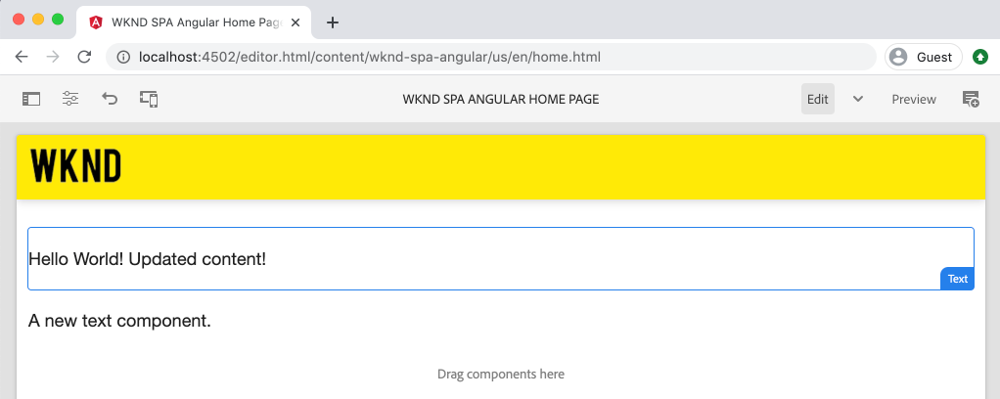

*The SPA is extended to add a static `Header` component*

## Prerequisites

Review the required tooling and instructions for setting up a [local development environment](overview.md#local-dev-environment).

### Get the code

1. Download the starting point for this tutorial via Git:

    ```shell
    $ git clone git@github.com:adobe/aem-guides-wknd-spa.git
    $ cd aem-guides-wknd-spa
    $ git checkout Angular/integrate-spa-start
    ```

2. Deploy the code base to a local AEM instance using Maven:

    ```shell
    $ mvn clean install -PautoInstallSinglePackage
    ```

    If using [AEM 6.x](overview.md#compatibility) add the `classic` profile:

    ```shell
    $ mvn clean install -PautoInstallSinglePackage -Pclassic
    ```

You can always view the finished code on [GitHub](https://github.com/adobe/aem-guides-wknd-spa/tree/Angular/integrate-spa-solution) or check the code out locally by switching to the branch `Angular/integrate-spa-solution`.

## Integration approach {#integration-approach}

Two modules were created as part of the AEM project: `ui.apps` and `ui.frontend`.

The `ui.frontend` module is a [webpack](https://webpack.js.org/) project that contains all of the SPA source code. A majority of the SPA development and testing is done in the webpack project. When a production build is triggered, the SPA is built and compiled using webpack. The compiled artifacts (CSS and Javascript) are copied into the `ui.apps` module which is then deployed to the AEM runtime.

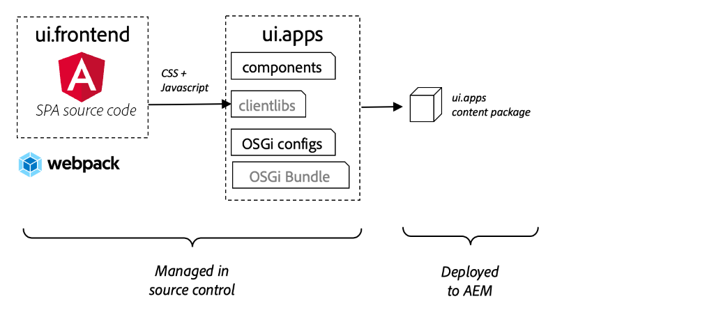

*A high-level depiction of the SPA integration.*

Additional information about the Front-end build can be [found here](https://experienceleague.adobe.com/docs/experience-manager-core-components/using/developing/archetype/uifrontend-angular.html).

## Inspect the SPA integration {#inspect-spa-integration}

Next, inspect the `ui.frontend` module to understand the SPA that has been auto-generated by the [AEM Project archetype](https://experienceleague.adobe.com/docs/experience-manager-core-components/using/developing/archetype/uifrontend-angular.html).

1. In the IDE of your choice open up the AEM Project for the WKND SPA. This tutorial will use the [Visual Studio Code IDE](https://experienceleague.adobe.com/docs/experience-manager-learn/cloud-service/local-development-environment-set-up/development-tools.html#microsoft-visual-studio-code).

    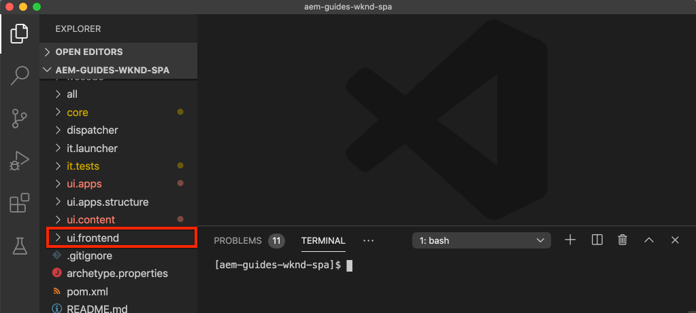

2. Expand and inspect the `ui.frontend` folder. Open the file `ui.frontend/package.json`

3. Under the `dependencies` you should see several related to `@angular`:

    ```json
    "@angular/animations": "~9.1.11",
    "@angular/common": "~9.1.11",
    "@angular/compiler": "~9.1.11",
    "@angular/core": "~9.1.11",
    "@angular/forms": "~9.1.10",
    "@angular/platform-browser": "~9.1.10",
    "@angular/platform-browser-dynamic": "~9.1.10",
    "@angular/router": "~9.1.10",
    ```

    The `ui.frontend` module is an [Angular application](https://angular.io) generated by using the [Angular CLI tool](https://angular.io/cli) that includes routing.

4. There are also three dependencies prefixed with `@adobe`:

    ```json
    "@adobe/cq-angular-editable-components": "^2.0.2",
    "@adobe/cq-spa-component-mapping": "^1.0.3",
    "@adobe/cq-spa-page-model-manager": "^1.1.3",
    ```

    The above modules make up the [AEM SPA Editor JS SDK](https://experienceleague.adobe.com/docs/experience-manager-65/developing/headless/spas/spa-blueprint.html) and provide the functionality to make it possible to map SPA Components to AEM Components.

5. In the `package.json` file several `scripts` are defined:

    ```json
    "scripts": {
        "start": "ng serve --open --proxy-config ./proxy.conf.json",
        "build": "ng lint && ng build && clientlib",
        "build:production": "ng lint && ng build --prod && clientlib",
        "test": "ng test",
        "sync": "aemsync -d -w ../ui.apps/src/main/content"
    }
    ```

    These scripts are based on common [Angular CLI commands](https://angular.io/cli/build) but have been modified slightly to work with the larger AEM project.

    `start` - runs the Angular app locally using a local web server. It has been updated to proxy the content of local AEM instance.

    `build` - compiles the Angular app for production distribution. The addition of `&& clientlib` is responsible for copying the compiled SPA into the `ui.apps` module as a client-side library during a build. The npm module [aem-clientlib-generator](https://github.com/wcm-io-frontend/aem-clientlib-generator) is used to facilitate this.

    More details about the available scripts can be found [here](https://experienceleague.adobe.com/docs/experience-manager-core-components/using/developing/archetype/uifrontend-angular.html).

6. Inspect the file `ui.frontend/clientlib.config.js`. This configuration file is used by [aem-clientlib-generator](https://github.com/wcm-io-frontend/aem-clientlib-generator#clientlibconfigjs) to determine how to generate the client library.

7. Inspect the file `ui.frontend/pom.xml`. This file transforms the `ui.frontend` folder into a [Maven module](https://maven.apache.org/guides/mini/guide-multiple-modules.html). The `pom.xml` file has been updated to use the [frontend-maven-plugin](https://github.com/eirslett/frontend-maven-plugin) to **test** and **build** the SPA during a Maven build.

8. Inspect the file `app.component.ts` at `ui.frontend/src/app/app.component.ts`:

    ```js
    import { Constants } from '@adobe/cq-angular-editable-components';
    import { ModelManager } from '@adobe/cq-spa-page-model-manager';
    import { Component } from '@angular/core';

    @Component({
    selector: '#spa-root', // tslint:disable-line
    styleUrls: ['./app.component.css'],
    templateUrl: './app.component.html'
    })
    export class AppComponent {
        ...

        constructor() {
            ModelManager.initialize().then(this.updateData);
        }

        private updateData = pageModel => {
            this.path = pageModel[Constants.PATH_PROP];
            this.items = pageModel[Constants.ITEMS_PROP];
            this.itemsOrder = pageModel[Constants.ITEMS_ORDER_PROP];
        }
    }
    ```

    `app.component.js` is the entrypoint of the SPA. `ModelManager` is provided by the AEM SPA Editor JS SDK. It is responsible for calling and injecting the `pageModel` (the JSON content) into the application.

## Add a Header component {#header-component}

Next, add a new component to the SPA and deploy the changes to a local AEM instance to see the integration.

1. Open a new terminal window and navigate to the `ui.frontend` folder:

    ```shell
    $ cd aem-guides-wknd-spa/ui.frontend
    ```

2. Install [Angular CLI](https://angular.io/cli#installing-angular-cli) globally This is used to generate Angular components as well as to build and serve the Angular application via the **ng** command.

    ```shell
    $ npm install -g @angular/cli
    ```

    >[!CAUTION]
    >
    > The version of **@angular/cli** used by this project is **9.1.7**. It is recommended to keep the the Angular CLI versions in sync.

3. Create a new `Header` component by running the Angular CLI `ng generate component` command from within the `ui.frontend` folder.

    ```shell
    $ ng generate component components/header

    CREATE src/app/components/header/header.component.css (0 bytes)
    CREATE src/app/components/header/header.component.html (21 bytes)
    CREATE src/app/components/header/header.component.spec.ts (628 bytes)
    CREATE src/app/components/header/header.component.ts (269 bytes)
    UPDATE src/app/app.module.ts (1809 bytes)
    ```

    This will create a skeleton for the new Angular Header component at `ui.frontend/src/app/components/header`.

4. Open the `aem-guides-wknd-spa` project in the IDE of your choice. Navigate to the `ui.frontend/src/app/components/header` folder.

    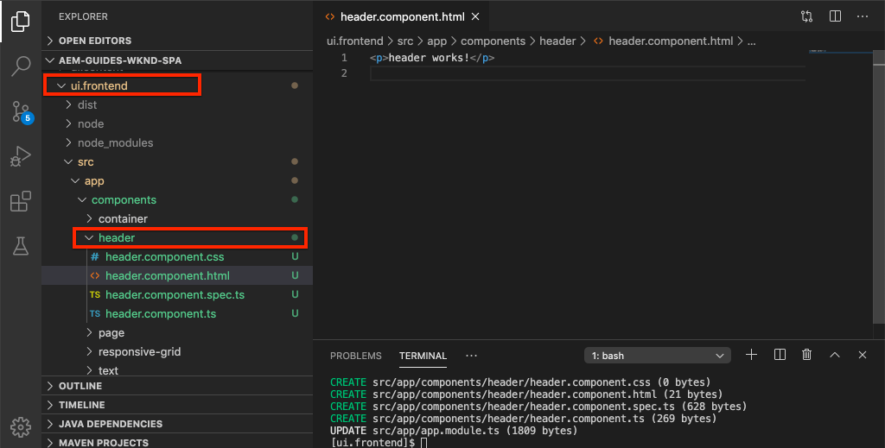

5. Open the file `header.component.html` and replace the contents with the following:

    ```html
    <!--/* header.component.html */-->
    <header className="header">
        <div className="header-container">
            <h1>WKND</h1>
        </div>
    </header>
    ```

    Note this displays static content, so this Angular component does not require any adjustments to the default generated `header.component.ts`.

6. Open the file **app.component.html** at  `ui.frontend/src/app/app.component.html`. Add the `app-header`:

    ```html
    <app-header></app-header>
    <router-outlet></router-outlet>
    ```

    This will include the `header` component above all the page content.

7. Open a new terminal and navigate into the `ui.frontend` folder and run the `npm run build` command:

    ```shell
    $ cd ui.frontend
    $ npm run build

    Linting "angular-app"...
    All files pass linting.
    Generating ES5 bundles for differential loading...
    ES5 bundle generation complete.
    ```

8. Navigate to the `ui.apps` folder. Beneath `ui.apps/src/main/content/jcr_root/apps/wknd-spa-angular/clientlibs/clientlib-angular` you should see the compiled SPA files have been copied from  the`ui.frontend/build` folder.

    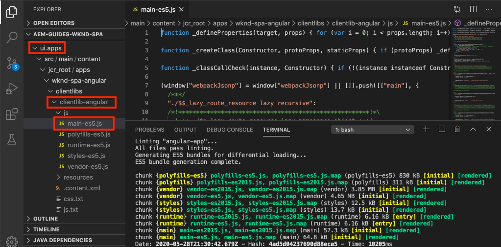

9. Return to the terminal and navigate into the `ui.apps` folder. Execute the following Maven command:

    ```shell
    $ cd ../ui.apps
    $ mvn clean install -PautoInstallPackage
    ...
    [INFO] ------------------------------------------------------------------------
    [INFO] BUILD SUCCESS
    [INFO] ------------------------------------------------------------------------
    [INFO] Total time:  9.629 s
    [INFO] Finished at: 2020-05-04T17:48:07-07:00
    [INFO] ------------------------------------------------------------------------
    ```

    This will deploy the `ui.apps` package to a local running instance of AEM.

10. Open a browser tab and navigate to [http://localhost:4502/editor.html/content/wknd-spa-angular/us/en/home.html](http://localhost:4502/editor.html/content/wknd-spa-angular/us/en/home.html). You should now see the contents of the `Header` component being displayed in the SPA.

    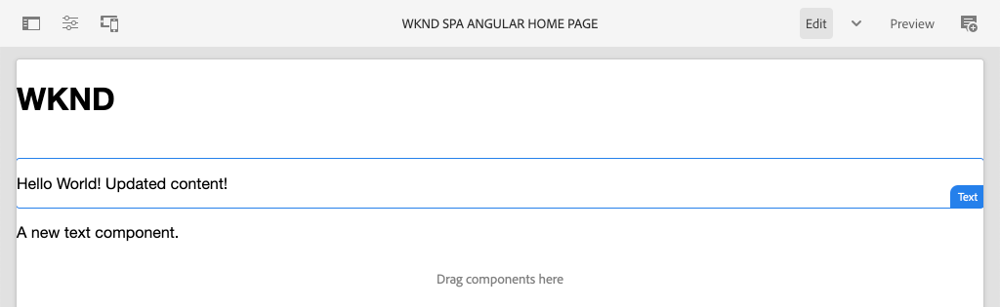

    Steps **7-9** are executed automatically when triggering a Maven build from the root of the project (i.e `mvn clean install -PautoInstallSinglePackage`). You should now understand the basics of the integration between the SPA and AEM client-side libraries. Notice that you can still edit and add `Text` components in AEM, however the `Header` component is not editable.

## Webpack Dev Server - Proxy the JSON API {#proxy-json}

As seen in the previous exercises, performing a build and syncing the client library to a local instance of AEM takes a few minutes. This is acceptable for final testing, but is not ideal for the majority of the SPA development.

A [webpack dev server](https://webpack.js.org/configuration/dev-server/) can be used to rapidly develop the SPA. The SPA is driven by a JSON model generated by AEM. In this exercise the JSON content from a running instance of AEM is **proxied** into the development server configured by the [Angular project](https://angular.io/guide/build).

1. Return to the IDE and open the file **proxy.conf.json** at `ui.frontend/proxy.conf.json`.

    ```json
    [
        {
            "context": [
                        "/content/**/*.(jpg|jpeg|png|model.json)",
                        "/etc.clientlibs/**/*"
                    ],
            "target": "http://localhost:4502",
            "auth": "admin:admin",
            "logLevel": "debug"
        }
    ]
    ```

    The [Angular app](https://angular.io/guide/build#proxying-to-a-backend-server) provides an easy mechanism to proxy API requests. The patterns specified in `context` are be proxied through `localhost:4502`, the local AEM quickstart.

2. Open the file **index.html** at `ui.frontend/src/index.html`. This is the root HTML file used by the dev server.

    Note there is an entry for `base href="/"`. The [base tag](https://angular.io/guide/deployment#the-base-tag) is critical for the app to resolve relative URLs.

    ```html
    <base href="/">
    ```

3. Open a terminal window and navigate to the `ui.frontend` folder. Run the command `npm start`:

    ```shell
    $ cd ui.frontend
    $ npm start

    > wknd-spa-angular@0.1.0 start /Users/dgordon/Documents/code/aem-guides-wknd-spa/ui.frontend
    > ng serve --open --proxy-config ./proxy.conf.json

    10% building 3/3 modules 0 active[HPM] Proxy created: [ '/content/**/*.(jpg|jpeg|png|model.json)', '/etc.clientlibs/**/*' ]  ->  http://localhost:4502
    [HPM] Subscribed to http-proxy events:  [ 'error', 'close' ]
    ℹ ｢wds｣: Project is running at http://localhost:4200/webpack-dev-server/
    ℹ ｢wds｣: webpack output is served from /
    ℹ ｢wds｣: 404s will fallback to //index.html
    ```

4. Open a new browser tab (if not already opened) and navigate to [http://localhost:4200/content/wknd-spa-angular/us/en/home.html](http://localhost:4200/content/wknd-spa-angular/us/en/home.html).

    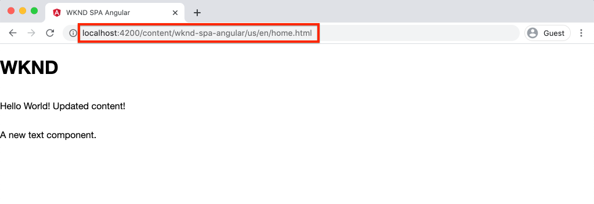

    You should see the same content as in AEM, but without any of the authoring capabilities enabled.

5. Return to the IDE and create a new folder named `img` at `ui.frontend/src/assets`.
6. Download and add the following WKND logo to the `img` folder:

    

7. Open **header.component.html** at `ui.frontend/src/app/components/header/header.component.html` and include the logo:

    ```html
    <header class="header">
        <div class="header-container">
            <div class="logo">
                
            </div>
        </div>
    </header>
    ```

    Save the changes to **header.component.html**.

8. Return to the browser. You should immediately see the changes to the app reflected.

    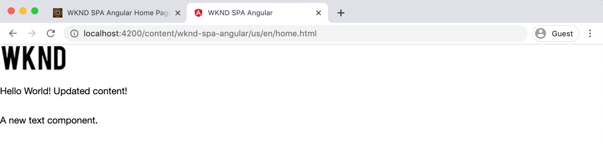

    You can continue to make content updates in **AEM** and see them reflected in **webpack dev server**, since we are proxying the content. Note that the content changes are only visible in the **webpack dev server**.

9. Stop the local web server with `ctrl+c` in the terminal.

## Webpack Dev Server - Mock JSON API {#mock-json}

Another approach to rapid development is to use a static JSON file to act as the JSON model. By "mocking" the JSON, we remove the dependency on a local AEM instance. It also allows a front-end developer to update the JSON model in order to test functionality and drive changes to the JSON API that would then be later implemented by a back-end developer.

The initial set up of the mock JSON does **require a local AEM instance**.

1. In the browser navigate to [http://localhost:4502/content/wknd-spa-angular/us/en.model.json](http://localhost:4502/content/wknd-spa-angular/us/en.model.json).

    This is the JSON exported by AEM that is driving the application. Copy the JSON output.

2. Return to the IDE navigate to `ui.frontend/src` and add new folders named **mocks** and **json** to match the following folder structure:

    ```plain
    |-- ui.frontend
        |-- src
            |-- mocks
                |-- json
    ```

3. Create a new file named **en.model.json** beneath `ui.frontend/public/mocks/json`. Paste the JSON output from **Step 1** here.

    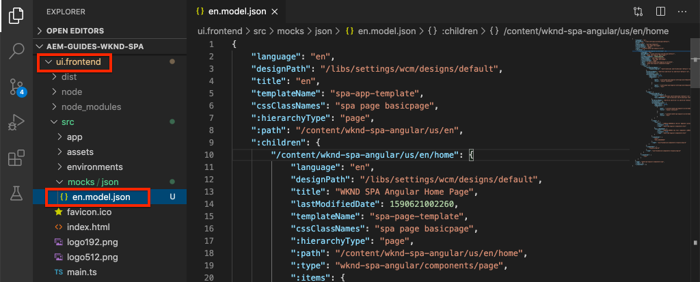

4. Create a new file **proxy.mock.conf.json** beneath `ui.frontend`. Populate the file with the following:

    ```json
    [
        {
        "context": [
            "/content/**/*.model.json"
        ],
        "pathRewrite": { "^/content/wknd-spa-angular/us" : "/mocks/json"} ,
        "target": "http://localhost:4200",
        "logLevel": "debug"
        }
    ]
    ```

    This proxy configuration will rewrite requests that start with `/content/wknd-spa-angular/us` with `/mocks/json` and serve the corresponding static JSON file, for example:

    ```plain
    /content/wknd-spa-angular/us/en.model.json -> /mocks/json/en.model.json
    ```

5. Open the file **angular.json**. Add a new **dev** configuration with an updated **assets** array to reference the **mocks** folder created.

    ```json
     "dev": {
              "assets": [
                "src/mocks",
                "src/assets",
                "src/favicon.ico",
                "src/logo192.png",
                "src/logo512.png",
                "src/manifest.json"
              ]
        },
    ```

    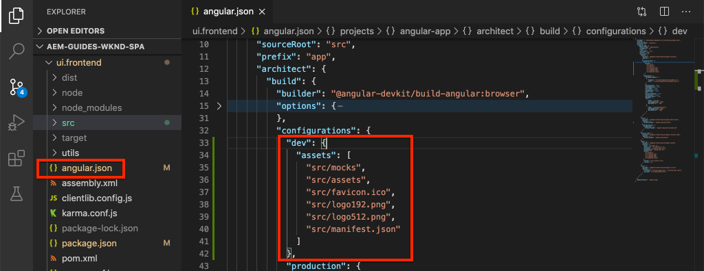

    Creating a dedicated **dev** configuration ensures that the **mocks** folder is only used during development and is never deployed to AEM in a production build.

6. In the **angular.json** file, next update the **browserTarget** configuration to use the new **dev** configuration:

    ```diff
      ...
      "serve": {
          "builder": "@angular-devkit/build-angular:dev-server",
          "options": {
    +       "browserTarget": "angular-app:build:dev"
    -       "browserTarget": "angular-app:build"
          },
      ...
    ```

    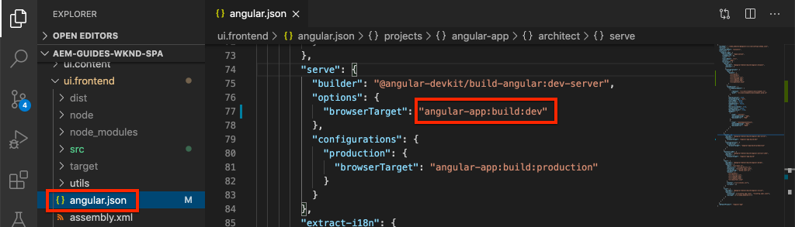

7. Open the file `ui.frontend/package.json` and add a new **start:mock** command to reference the **proxy.mock.conf.json** file.

    ```diff
        "scripts": {
            "start": "ng serve --open --proxy-config ./proxy.conf.json",
    +       "start:mock": "ng serve --open --proxy-config ./proxy.mock.conf.json",
            "build": "ng lint && ng build && clientlib",
            "build:production": "ng lint && ng build --prod && clientlib",
            "test": "ng test",
            "sync": "aemsync -d -w ../ui.apps/src/main/content"
        }
    ```

    Adding a new command makes it easy to toggle between the proxy configurations.

8. If currently running, stop the **webpack dev server**. Start the **webpack dev server** using the **start:mock** script:

    ```shell
    $ npm run start:mock

    > wknd-spa-angular@0.1.0 start:mock /Users/dgordon/Documents/code/aem-guides-wknd-spa/ui.frontend
    > ng serve --open --proxy-config ./proxy.mock.conf.json
    ```

    Navigate to [http://localhost:4200/content/wknd-spa-angular/us/en/home.html](http://localhost:4200/content/wknd-spa-angular/us/en/home.html) and you should see the same SPA but the content is now being pulled from the **mock** JSON file.

9. Make a small change to the **en.model.json** file created earlier. The updated content should immediately be reflected in the **webpack dev server**.

    

    Being able to manipulate the JSON model and see the effects on a live SPA can help a developer understand the JSON model API. It also allows both front-end and back-end development happen in parallel.

## Add Styles with Sass

Next, some style updated are added to the project. This project will add [Sass](https://sass-lang.com/) support for a few useful features like variables.

1. Open a terminal window and stop the **webpack dev server** if started. From inside the `ui.frontend` folder enter the following command to update the Angular app to process **.scss** files.

    ```shell
    $ cd ui.frontend
    $ ng config schematics.@schematics/angular:component.styleext scss
    ```

    This will update the `angular.json` file with a new entry at the bottom of the file:

    ```json
    "schematics": {
        "@schematics/angular:component": {
        "styleext": "scss"
        }
    }
    ```

2. Install `normalize-scss` to normalize the styles across browsers:

    ```shell
    $ npm install normalize-scss --save
    ```

3. Return to the IDE and beneath `ui.frontend/src` create a new folder named `styles`.
4. Create a new file beneath `ui.frontend/src/styles` named `_variables.scss` and populate it with the following variables:

    ```scss
    //_variables.scss

    //== Colors
    //
    //## Gray and brand colors for use across theme.

    $black:                  #202020;
    $gray:                   #696969;
    $gray-light:             #EBEBEB;
    $gray-lighter:           #F7F7F7;
    $white:                  #FFFFFF;
    $yellow:                 #FFEA00;
    $blue:                   #0045FF;


    //== Typography
    //
    //## Font, line-height, and color for body text, headings, and more.

    $font-family-sans-serif:  "Helvetica Neue", Helvetica, Arial, sans-serif;
    $font-family-serif:       Georgia, "Times New Roman", Times, serif;
    $font-family-base:        $font-family-sans-serif;
    $font-size-base:          18px;

    $line-height-base:        1.5;
    $line-height-computed:    floor(($font-size-base * $line-height-base));

    // Functional Colors
    $brand-primary:             $yellow;
    $body-bg:                   $white;
    $text-color:                $black;
    $text-color-inverse:        $gray-light;
    $link-color:                $blue;

    //Layout
    $max-width: 1024px;
    $header-height: 75px;

    // Spacing
    $gutter-padding: 12px;
    ```

5. Re-name the extension of the file **styles.css** at `ui.frontend/src/styles.css` to **styles.scss**. Replace the contents with the following:

    ```scss
    /* styles.scss * /

    /* Normalize */
    @import '~normalize-scss/sass/normalize';

    @import './styles/variables';

    body {
        background-color: $body-bg;
        font-family: $font-family-base;
        margin: 0;
        padding: 0;
        font-size: $font-size-base;
        text-align: left;
        color: $text-color;
        line-height: $line-height-base;
    }

    body.page {
        max-width: $max-width;
        margin: 0 auto;
        padding: $gutter-padding;
        padding-top: $header-height;
    }
    ```

6. Update **angular.json** and re-name all references to **style.css** with **styles.scss**. There should be 3 references.

    ```diff
      "styles": [
    -    "src/styles.css"
    +    "src/styles.scss"
       ],
    ```

## Update Header styles

Next add some brand-specific styles to the **Header** component using Sass.

1. Start the **webpack dev server** to see the styles updating in real-time:

    ```shell
    $ npm run start:mock
    ```

2. Under `ui.frontend/src/app/components/header` re-name **header.component.css** to **header.component.scss**. Populate the file with the following:

    ```scss
    @import "~src/styles/variables";

    .header {
        width: 100%;
        position: fixed;
        top: 0;
        left:0;
        z-index: 99;
        background-color: $brand-primary;
        box-shadow: 0px 0px 10px 0px rgba(0, 0, 0, 0.24);
    }

    .header-container {
        display: flex;
        max-width: $max-width;
        margin: 0 auto;
        padding-left: $gutter-padding;
        padding-right: $gutter-padding;
    }

    .logo {
        z-index: 100;
        display: flex;
        padding-top: $gutter-padding;
        padding-bottom: $gutter-padding;
    }

    .logo-img {
        width: 100px;
    }
    ```

3. Update **header.component.ts** to reference **header.component.scss**:

    ```diff
    ...
      @Component({
        selector: 'app-header',
        templateUrl: './header.component.html',
    -   styleUrls: ['./header.component.css']
    +   styleUrls: ['./header.component.scss']
      })
    ...
    ```

4. Return to the browser and the **webpack dev server**:

    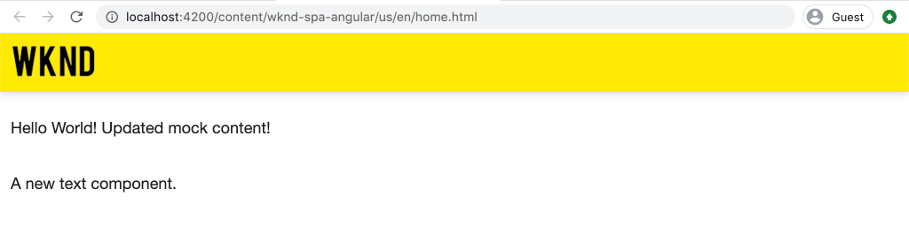

    You should now see the updated styles added to the **Header** component.

## Deploy SPA updates to AEM

The changes made to the **Header** are currently only visible through the **webpack dev server**. Deploy the updated SPA to AEM to see the changes.

1. Stop the **webpack dev server**.
2. Navigate to the root of the project `/aem-guides-wknd-spa` and deploy the project to AEM using Maven:

    ```shell
    $ cd ..
    $ mvn clean install -PautoInstallSinglePackage
    ```

3. Navigate to [http://localhost:4502/editor.html/content/wknd-spa-angular/us/en/home.html](http://localhost:4502/editor.html/content/wknd-spa-angular/us/en/home.html). You should see the updated **Header** with logo and styles applied:

    

    Now that the updated SPA is in AEM, authoring can continue.

## Congratulations! {#congratulations}

Congratulations, you have updated the SPA and explored the integration with AEM! You now know two different approaches for developing the SPA against the AEM JSON model API using a **webpack dev server**.

You can always view the finished code on [GitHub](https://github.com/adobe/aem-guides-wknd-spa/tree/Angular/integrate-spa-solution) or check the code out locally by switching to the branch `Angular/integrate-spa-solution`.

### Next Steps {#next-steps}

[Map SPA components to AEM components](map-components.md) - Learn how to map Angular components to Adobe Experience Manager (AEM) components with the AEM SPA Editor JS SDK. Component mapping enables authors to make dynamic updates to SPA components within the AEM SPA Editor, similar to traditional AEM authoring.
