# Map SPA components to AEM components {#map-components}

Learn how to map Angular components to Adobe Experience Manager (AEM) components with the AEM SPA Editor JS SDK. Component mapping enables users to make dynamic updates to SPA components within the AEM SPA Editor, similar to traditional AEM authoring.

This chapter takes a deeper-dive into the AEM JSON model API and how the JSON content exposed by an AEM component can be automatically injected into a Angular component as props.

## Objective

1. Learn how to map AEM components to SPA Components.
2. Understand the difference between **Container** components and **Content** components.
3. Create a new Angular component that maps to an existing AEM component.

## What you will build

This chapter will inspect how the provided `Text` SPA component is mapped to the AEM `Text`component. A new `Image` SPA component will be created that can be used in the SPA and authored in AEM. Out of the box features of the **Layout Container** and **Template Editor** policies will also be used to create a view that is a little more varied in appearance.

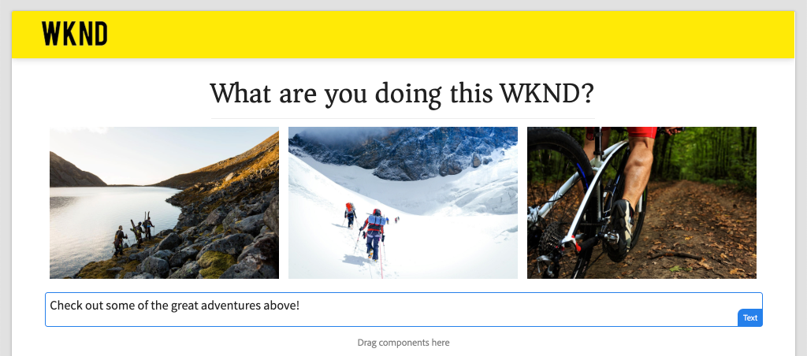

## Prerequisites

Review the required tooling and instructions for setting up a [local development environment](overview.md#local-dev-environment).

### Get the code

1. Download the starting point for this tutorial via Git:

    ```shell
    $ git clone git@github.com:adobe/aem-guides-wknd-spa.git
    $ cd aem-guides-wknd-spa
    $ git checkout Angular/map-components-start
    ```

2. Deploy the code base to a local AEM instance using Maven:

    ```shell
    $ mvn clean install -PautoInstallSinglePackage
    ```

    If using [AEM 6.x](overview.md#compatibility) add the `classic` profile:

    ```shell
    $ mvn clean install -PautoInstallSinglePackage -Pclassic
    ```

You can always view the finished code on [GitHub](https://github.com/adobe/aem-guides-wknd-spa/tree/Angular/map-components-solution) or check the code out locally by switching to the branch `Angular/map-components-solution`.

## Mapping Approach

The basic concept is to map a SPA Component to an AEM Component. AEM components, run server-side, export content as part of the JSON model API. The JSON content is consumed by the SPA, running client-side in the browser. A 1:1 mapping between SPA components and an AEM component is created.

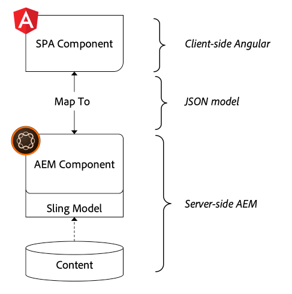

*High-level overview of mapping an AEM Component to a Angular Component*

## Inspect the Text Component

The [AEM Project Archetype](https://github.com/adobe/aem-project-archetype) provides a `Text` component that is mapped to the AEM [Text component](https://experienceleague.adobe.com/docs/experience-manager-core-components/using/components/text.html). This is an example of a **content** component, in that it renders *content* from AEM.

Let's see how the component works.

### Inspect the JSON model

1. Before jumping into the SPA code, it is important to understand the JSON model that AEM provides. Navigate to the [Core Component Library](https://www.aemcomponents.dev/content/core-components-examples/library/core-content/text.html) and view the page for the Text component. The Core Component Library provides examples of all the AEM Core Components.
2. Select the **JSON** tab for one of the examples:

    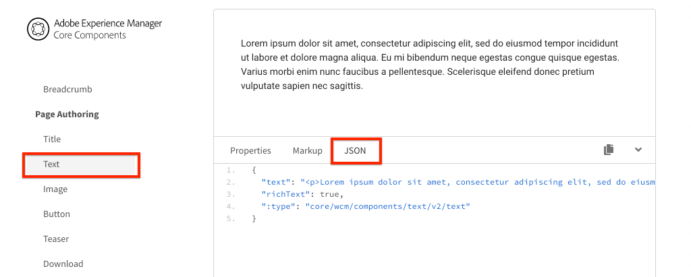

    You should see three properties: `text`, `richText`, and `:type`.

    `:type` is a reserved property that lists the `sling:resourceType` (or path) of the AEM Component. The value of `:type` is what is used to map the AEM component to the SPA component.

    `text` and `richText` are additional properties that will be exposed to the SPA component.

### Inspect the Text component

1. Open a new terminal and navigate to the `ui.frontend` folder inside the project. Run `npm install` and then `npm start` to start the **webpack dev server**:

    ```shell
    $ cd ui.frontend
    $ npm run start:mock
    ```

    The `ui.frontend` module is currently set up to use the [mock JSON model](./integrate-spa.md#mock-json).

2. You should see a new browser window open to [http://localhost:4200/content/wknd-spa-angular/us/en/home.html](http://localhost:4200/content/wknd-spa-angular/us/en/home.html)

    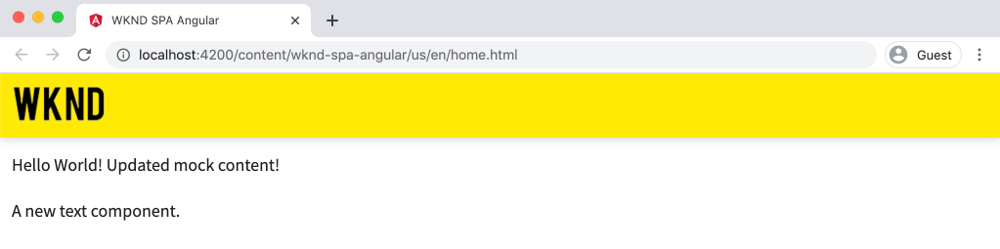

3. In the IDE of your choice open up the AEM Project for the WKND SPA. Expand the `ui.frontend` module and open the file **text.component.ts** under `ui.frontend/src/app/components/text/text.component.ts`:

    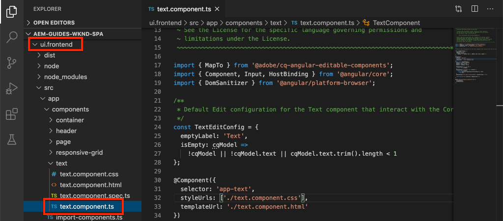

4. The first area to inspect is the `class TextComponent` at ~line 35:

    ```js
    export class TextComponent {
        @Input() richText: boolean;
        @Input() text: string;
        @Input() itemName: string;

        @HostBinding('innerHtml') get content() {
            return this.richText
            ? this.sanitizer.bypassSecurityTrustHtml(this.text)
            : this.text;
        }
        @HostBinding('attr.data-rte-editelement') editAttribute = true;

        constructor(private sanitizer: DomSanitizer) {}
    }
    ```

    [@Input()](https://angular.io/api/core/Input) decorator is used to declare fields who's values are set via the mapped JSON object, reviewed earlier.

    `@HostBinding('innerHtml') get content()` is a method that exposes the authored text content from the value of `this.text`. In the case that the content is rich text (determined by the `this.richText` flag) Angular's built-in security is bypassed. Angular's [DomSanitizer](https://angular.io/api/platform-browser/DomSanitizer) is used to "scrub" the raw HTML and prevent Cross Site Scripting vulnerabilities. The method is bound to the `innerHtml` property using the [@HostBinding](https://angular.io/api/core/HostBinding) decorator.

5. Next inspect the `TextEditConfig` at ~line 24:

    ```js
    const TextEditConfig = {
        emptyLabel: 'Text',
        isEmpty: cqModel =>
            !cqModel || !cqModel.text || cqModel.text.trim().length < 1
    };
    ```

    The above code is responsible for determining when to render the placeholder in the AEM author environment. If the `isEmpty` method returns **true** then the placeholder will be rendered.

6. Finally take a look at the `MapTo` call at ~line 53:

    ```js
    MapTo('wknd-spa-angular/components/text')(TextComponent, TextEditConfig );
    ```

    **MapTo** is provided by the AEM SPA Editor JS SDK (`@adobe/cq-angular-editable-components`). The path `wknd-spa-angular/components/text` represents the `sling:resourceType` of the AEM component. This path gets matched with the `:type` exposed by the JSON model observed earlier. **MapTo** parses the JSON model response and passes the correct values to the `@Input()` variables of the SPA component.

    You can find the AEM `Text` component definition at `ui.apps/src/main/content/jcr_root/apps/wknd-spa-angular/components/text`.

7. Experiment by modifying the **en.model.json** file at `ui.frontend/src/mocks/json/en.model.json`. 

    At ~line 62 update the first `Text` value to use an **`H1`** and **`u`** tags:

    ```json
        "text": {
            "text": "<h1><u>Hello World!</u></h1>",
            "richText": true,
            ":type": "wknd-spa-angular/components/text"
        }
    ```

    Return to the browser to see the effects served by the **webpack dev server**:

    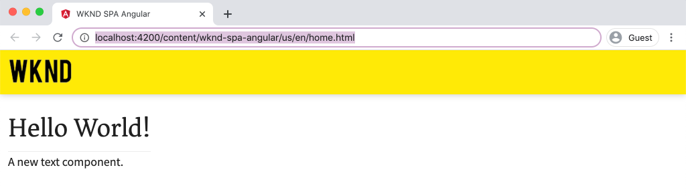

    Try toggling the `richText` property between **true** / **false** to see the render logic in action.

8. Inspect **text.component.html** at `ui.frontend/src/app/components/text/text.component.html`.

    This file is empty since the entire contents of the component will be set by the `innerHTML` property.

9. Inspect the **app.module.ts** at `ui.frontend/src/app/app.module.ts`.

    ```js
    @NgModule({
    imports: [
        BrowserModule,
        SpaAngularEditableComponentsModule,
        AppRoutingModule
    ],
    providers: [ModelManagerService, { provide: APP_BASE_HREF, useValue: '/' }],
    declarations: [AppComponent, TextComponent, PageComponent, HeaderComponent],
    entryComponents: [TextComponent, PageComponent],
    bootstrap: [AppComponent]
    })
    export class AppModule {}
    ```

    The **TextComponent** is not explicitly included, but rather dynamically via **AEMResponsiveGridComponent** provided by the AEM SPA Editor JS SDK. Therefore must be listed in the **app.module.ts**' [entryComponents](https://angular.io/guide/entry-components) array.

## Create the Image Component

Next, create an `Image` Angular component that is mapped to the AEM [Image component](https://experienceleague.adobe.com/docs/experience-manager-core-components/using/components/image.html). The `Image` component is another example of a **content** component.

### Inspect the JSON

Before jumping into the SPA code, inspect the JSON model provided by AEM.

1. Navigate to the [Image examples in the Core Component library](https://www.aemcomponents.dev/content/core-components-examples/library/core-content/image.html).

    

    Properties of `src`, `alt`, and `title` will be used to populate the SPA `Image` component.

    >[!NOTE]
    >
    > There are other Image properties exposed (`lazyEnabled`, `widths`) that allow a developer to create an adaptive and lazy-loading component. The component built in this tutorial will be simple and will **not** use these advanced properties.

2. Return to your IDE and open up the `en.model.json` at `ui.frontend/src/mocks/json/en.model.json`. Since this is a net-new component for our project we need to "mock" the Image JSON.

    At ~line 70 add a JSON entry for the `image` model (don't forget about the trailing comma `,` after the second `text_386303036`) and update the `:itemsOrder` array.

    ```json
    ...
    ":items": {
                ...
                "text_386303036": {
                    "text": "<p>A new text component.</p>\r\n",
                    "richText": true,
                    ":type": "wknd-spa-angular/components/text"
                    },
                "image": {
                    "alt": "Rock Climber in New Zealand",
                    "title": "Rock Climber in New Zealand",
                    "src": "/mocks/images/adobestock-140634652.jpeg",
                    ":type": "wknd-spa-angular/components/image"
                }
            },
            ":itemsOrder": [
                "text",
                "text_386303036",
                "image"
            ],
    ```

    The project includes a sample image at `/mock-content/adobestock-140634652.jpeg` that will be used with the **webpack dev server**.

    You can view the full [en.model.json here](https://github.com/adobe/aem-guides-wknd-spa/blob/Angular/map-components-solution/ui.frontend/src/mocks/json/en.model.json).

3. Add a stock photo to be displayed by the component.

    Create a new folder named **images** beneath `ui.frontend/src/mocks`. Download [adobestock-140634652.jpeg](assets/map-components/adobestock-140634652.jpeg) and place it in the newly created **images** folder. Feel free to use your own image, if desired.

### Implement the Image component

1. Stop the **webpack dev server** if started.
2. Create a new Image component by running the Angular CLI `ng generate component` command from within `ui.frontend` folder:

    ```shell
    $ ng generate component components/image
    ```

3. In the IDE, open **image.component.ts** at `ui.frontend/src/app/components/image/image.component.ts` and update as follows:

    ```js
    import {Component, Input, OnInit} from '@angular/core';
    import {MapTo} from '@adobe/cq-angular-editable-components';

    const ImageEditConfig = {
    emptyLabel: 'Image',
    isEmpty: cqModel =>
        !cqModel || !cqModel.src || cqModel.src.trim().length < 1
    };

    @Component({
    selector: 'app-image',
    templateUrl: './image.component.html',
    styleUrls: ['./image.component.scss']
    })
    export class ImageComponent implements OnInit {

    @Input() src: string;
    @Input() alt: string;
    @Input() title: string;

    constructor() { }

    get hasImage() {
        return this.src && this.src.trim().length > 0;
    }

    ngOnInit() { }
    }

    MapTo('wknd-spa-angular/components/image')(ImageComponent, ImageEditConfig);
    ```

    `ImageEditConfig` is the configuration to determine whether to render the author placeholder in AEM, based on if the `src` property is populated.

    `@Input()` of `src`, `alt`, and `title` are the properties mapped from the JSON API.

    `hasImage()` is a method that will determine if the image should be rendered.

    `MapTo` maps the SPA component to the AEM component located at `ui.apps/src/main/content/jcr_root/apps/wknd-spa-angular/components/image`.

4. Open **image.component.html** and update it as follows:

    ```html
    <ng-container *ngIf="hasImage">
        
    </ng-container>
    ```

    This will render the `` element if `hasImage` returns **true**.

5. Open **image.component.scss** and update it as follows:

    ```scss
    :host-context {
        display: block;
    }

    .image {
        margin: 1rem 0;
        width: 100%;
        border: 0;
    }
    ```

    >[!NOTE]
    >
    > The `:host-context` rule is **critical** for the AEM SPA editor placeholder to function correctly. All SPA components that are intended to be authored in the AEM page editor will need this rule at a minimum.

6. Open `app.module.ts` and add the `ImageComponent` to the `entryComponents` array:

    ```js
    entryComponents: [TextComponent, PageComponent, ImageComponent],
    ```

    Like the `TextComponent`, the `ImageComponent` is dynamically loaded, and must be included in the `entryComponents` array.

7. Start the **webpack dev server** to see the `ImageComponent` render.

    ```shell
    $ npm run start:mock
    ```

    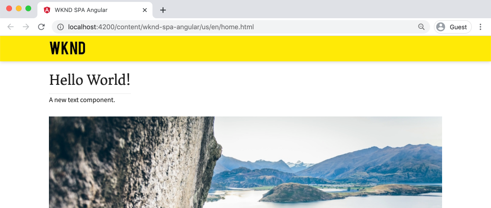

    *Image added to the SPA*

    >[!NOTE]
    >
    > **Bonus challenge**: Implement a new method to display the value of `title` as a caption beneath the image.

## Update Policies in AEM

The `ImageComponent` component is only visible in the **webpack dev server**. Next, deploy the updated SPA to AEM and update the template policies.

1. Stop the **webpack dev server** and from the **root** of the project, deploy the changes to AEM using your Maven skills:

    ```shell
    $ cd aem-guides-wknd-spa
    $ mvn clean install -PautoInstallSinglePackage
    ```

2. From the AEM Start screen navigate to **[!UICONTROL Tools]** &gt; **[!UICONTROL Templates]** &gt; **[WKND SPA Angular](http://localhost:4502/libs/wcm/core/content/sites/templates.html/conf/wknd-spa-angular)**.

    Select and edit the **SPA Page**:

    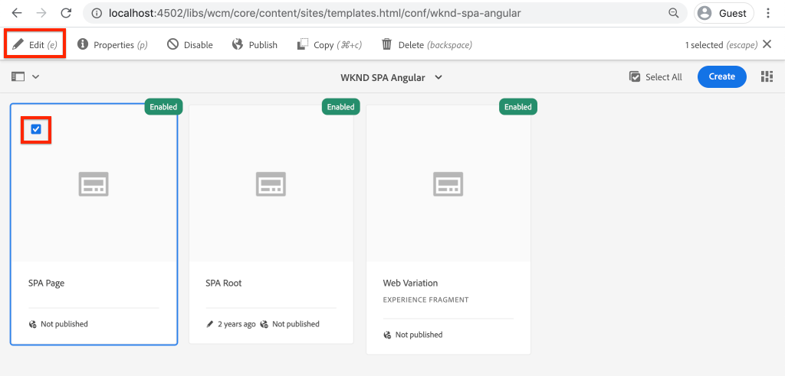

3. Select the **Layout Container** and click it's **policy** icon to edit the policy:

    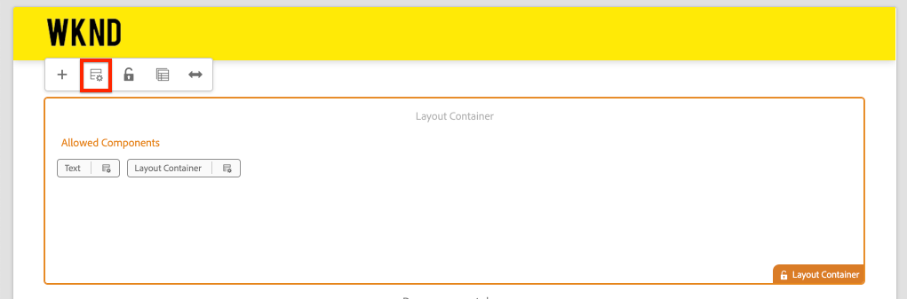

4. Under **Allowed Components** &gt; **WKND SPA Angular - Content** &gt; check the **Image** component:

    

    Under **Default Components** &gt; **Add mapping** and choose the **Image - WKND SPA Angular - Content** component:

    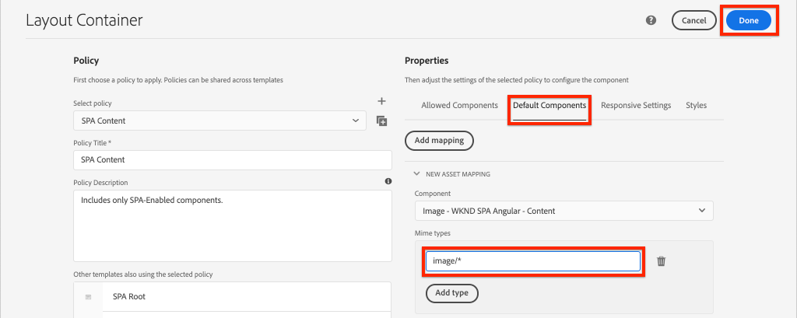

    Enter a **mime type** of `image/*`.

    Click **Done** to save the policy updates.

5. In the **Layout Container** click the **policy** icon for the **Text** component:

    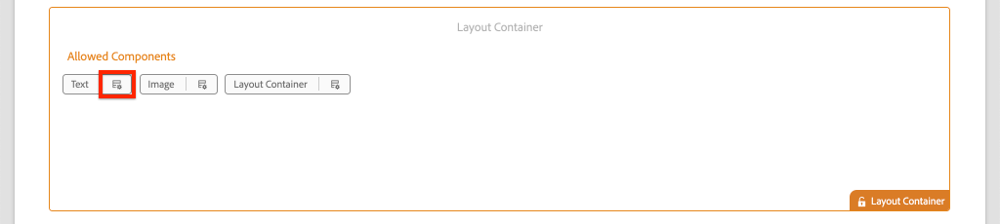

    Create a new policy named **WKND SPA Text**. Under **Plugins** &gt; **Formatting** &gt; check all the boxes to enable additional formatting options:

    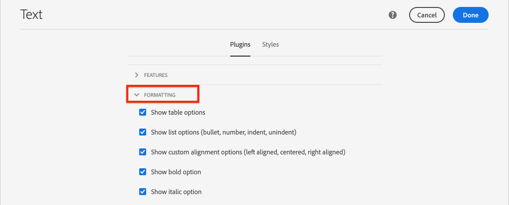

    Under **Plugins** &gt; **Paragraph Styles** &gt; check the box to **Enable paragraph styles**:

    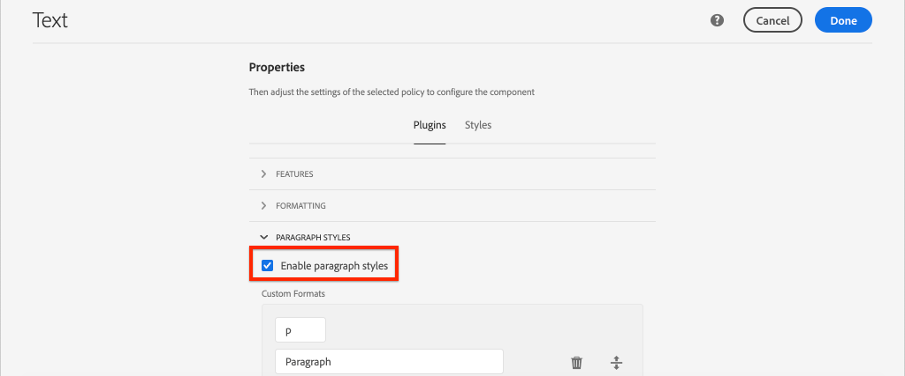

    Click **Done** to save the policy update.

6. Navigate to the **Homepage** [http://localhost:4502/editor.html/content/wknd-spa-angular/us/en/home.html](http://localhost:4502/editor.html/content/wknd-spa-angular/us/en/home.html).

    You should also be able to edit the `Text` component and add additional paragraph styles in **full-screen** mode.

    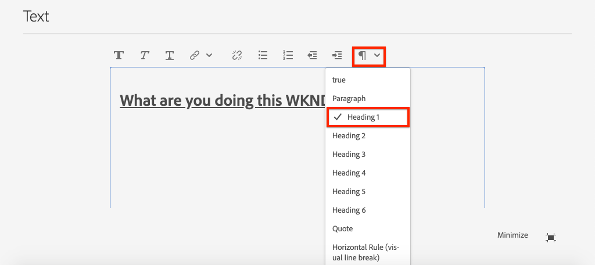

7. You should also be able to drag+drop an image from the **Asset finder**:

    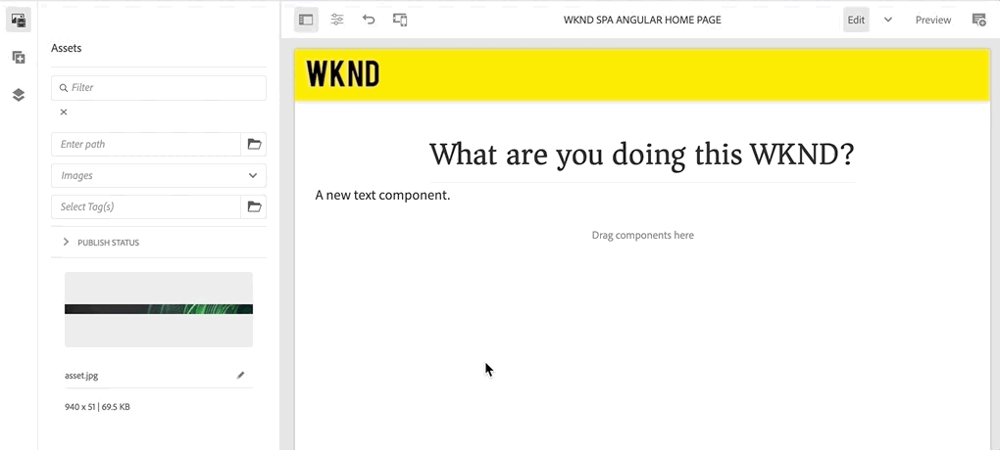

8. Add your own images via [AEM Assets](http://localhost:4502/assets.html/content/dam) or install the finished code base for the standard [WKND reference site](https://github.com/adobe/aem-guides-wknd/releases/latest). The [WKND reference site](https://github.com/adobe/aem-guides-wknd/releases/latest) includes many images that can be re-used on the WKND SPA. The package can be installed using [AEM's Package Manager](http://localhost:4502/crx/packmgr/index.jsp).

    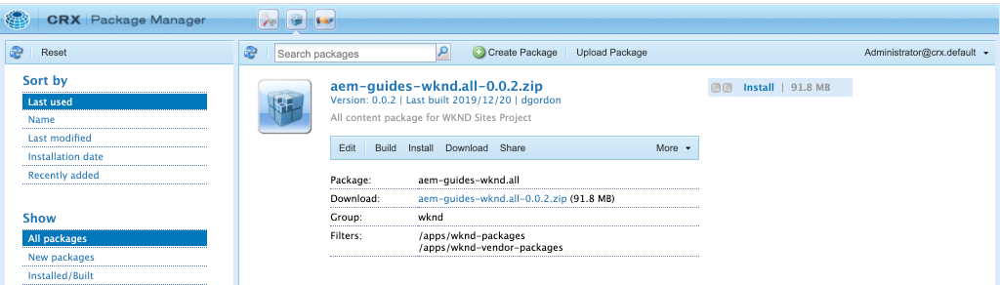

## Inspect the Layout Container

Support for the **Layout Container** is automatically provided by the AEM SPA Editor SDK. The **Layout Container**, as indicated by the name, is a **container** component. Container components are components that accept JSON structures which represent *other* components and dynamically instantiate them.

Let's inspect the Layout Container further.

1. In the IDE open **responsive-grid.component.ts** at `ui.frontend/src/app/components/responsive-grid`:

    ```js
    import { AEMResponsiveGridComponent,MapTo } from '@adobe/cq-angular-editable-components';

    MapTo('wcm/foundation/components/responsivegrid')(AEMResponsiveGridComponent);
    ```

    The `AEMResponsiveGridComponent` is implemented as part of the AEM SPA Editor SDK and is included in the project via `import-components`.

2. In a browser navigate to [http://localhost:4502/content/wknd-spa-angular/us/en.model.json](http://localhost:4502/content/wknd-spa-angular/us/en.model.json)

    

    The **Layout Container** component has a `sling:resourceType` of `wcm/foundation/components/responsivegrid` and is recognized by the SPA Editor using the `:type` property, just like the `Text` and `Image` components.

    The same capabilities of re-sizing a component using [Layout Mode](https://experienceleague.adobe.com/docs/experience-manager-65/authoring/siteandpage/responsive-layout.html#defining-layouts-layout-mode) are available with the SPA Editor.

3. Return to [http://localhost:4502/editor.html/content/wknd-spa-angular/us/en/home.html](http://localhost:4502/editor.html/content/wknd-spa-angular/us/en/home.html). Add additional **Image** components and try re-sizing them using the **Layout** option:

    

4. Re-open the JSON model [http://localhost:4502/content/wknd-spa-angular/us/en.model.json](http://localhost:4502/content/wknd-spa-angular/us/en.model.json) and observe the `columnClassNames` as part of the JSON:

    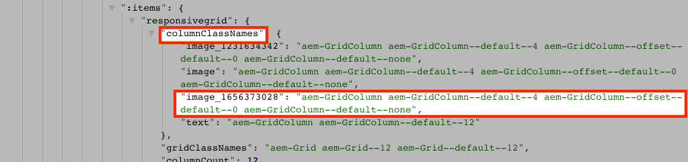

    The class name `aem-GridColumn--default--4` indicates the component should be 4 columns wide based on a 12 column grid. More details about the [responsive grid can be found here](https://adobe-marketing-cloud.github.io/aem-responsivegrid/).

5. Return to the IDE and in the `ui.apps` module there is a client-side library defined at `ui.apps/src/main/content/jcr_root/apps/wknd-spa-angular/clientlibs/clientlib-grid`. Open the file `less/grid.less`.

    This file determines the breakpoints (`default`, `tablet`, and `phone`) used by the **Layout Container**. This file is intended to be customized per project specifications. Currently the breakpoints are set to `1200px` and `650px`.

6. You should be able to use the responsive capabilities and the updated rich text policies of the `Text` component to author a view like the following:

    

## Congratulations! {#congratulations}

Congratulations, you learned how to map SPA components to AEM Components and you implemented a new `Image` component. You also got a chance to explore the responsive capabilities of the **Layout Container**.

You can always view the finished code on [GitHub](https://github.com/adobe/aem-guides-wknd-spa/tree/Angular/map-components-solution) or check the code out locally by switching to the branch `Angular/map-components-solution`.

### Next Steps {#next-steps}

[Navigation and Routing](navigation-routing.md) - Learn how multiple views in the SPA can be supported by mapping to AEM Pages with the SPA Editor SDK. Dynamic navigation is implemented using Angular Router and added to an existing Header component.

## Bonus - Persist configurations to source control {#bonus}

In many cases, especially at the beginning of an AEM project it is valuable to persist configurations, like templates and related content policies, to source control. This ensures that all developers are working against the same set of content and configurations and can ensure additional consistency between environments. Once a project reaches a certain level of maturity, the practice of managing templates can be turned over to a special group of power users.

The next few steps will take place using the Visual Studio Code IDE and [VSCode AEM Sync](https://marketplace.visualstudio.com/items?itemName=yamato-ltd.vscode-aem-sync) but could be doing using any tool and any IDE that you have configured to **pull** or **import** content from a local instance of AEM.

1. In the Visual Studio Code IDE, ensure that you have **VSCode AEM Sync** installed via the Marketplace extension:

   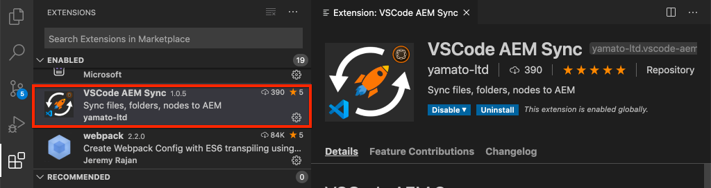

2. Expand the **ui.content** module in the Project explorer and navigate to `/conf/wknd-spa-angular/settings/wcm/templates`.

3. **Right+Click** the `templates` folder and select **Import from AEM Server**:

   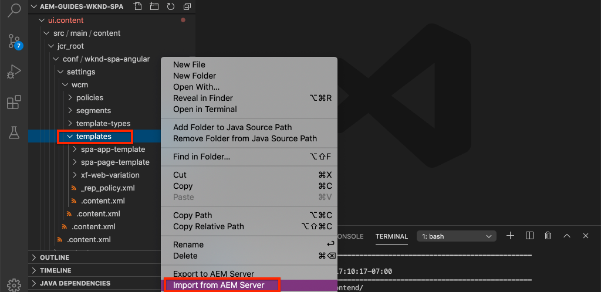

4. Repeat the steps to import content but select the **policies** folder located at `/conf/wknd-spa-angular/settings/wcm/policies`.

5. Inspect the `filter.xml` file located at `ui.content/src/main/content/META-INF/vault/filter.xml`.

   ```xml
   <!--ui.content filter.xml-->
   <?xml version="1.0" encoding="UTF-8"?>
    <workspaceFilter version="1.0">
        <filter root="/conf/wknd-spa-angular" mode="merge"/>
        <filter root="/content/wknd-spa-angular" mode="merge"/>
        <filter root="/content/dam/wknd-spa-angular" mode="merge"/>
        <filter root="/content/experience-fragments/wknd-spa-angular" mode="merge"/>
    </workspaceFilter>
   ```

   The `filter.xml` file is responsible for identifying the paths of nodes that will be installed with the package. Notice the `mode="merge"` on each of the filters which indicates that existing content will not be modified, only new content is added. Since content authors may be updating these paths, it is important that a code deployment does **not** overwrite content. See the [FileVault documentation](https://jackrabbit.apache.org/filevault/filter.html) for more details on working with filter elements.

   Compare `ui.content/src/main/content/META-INF/vault/filter.xml` and `ui.apps/src/main/content/META-INF/vault/filter.xml` to understand the different nodes managed by each module.
