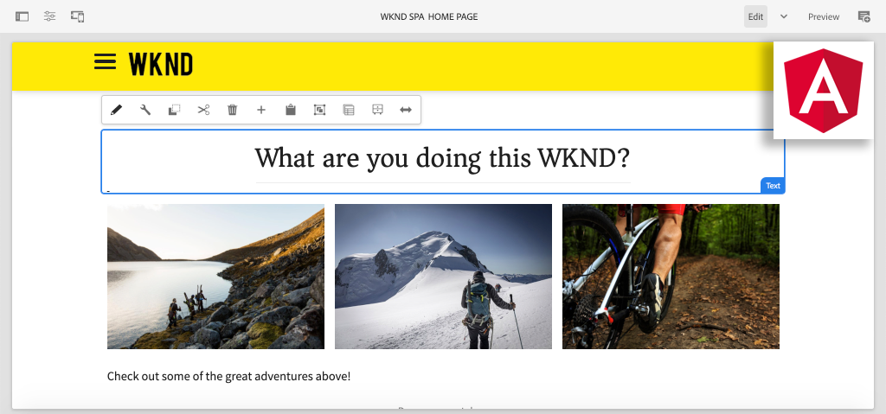

# Create your first Angular SPA in AEM {#introduction}

{{edge-delivery-services}}

Welcome to a multi-part tutorial designed for developers new to the **SPA Editor** feature in Adobe Experience Manager (AEM). This tutorial walks through the implementation of a Angular application for a fictitious lifestyle brand, the WKND. The Angular app is developed and designed to be deployed with AEM's SPA Editor, which maps Angular components to AEM components. The completed SPA, deployed to AEM, can be dynamically authored with traditional in-line editing tools of AEM.



*WKND SPA Implementation*

## About

The goal for this multi-part tutorial is to teach a developer how to implement an Angular application to work with the SPA Editor feature of AEM. In a real-world scenario the development activities are broken down by persona, often involving a **Front End developer** and a **Back End developer**. We believe it is beneficial for any developer  involved in an AEM SPA Editor project to complete this tutorial.

The tutorial is designed to work with **AEM as a Cloud Service** and is backwards compatible with **AEM 6.5.4+** and **AEM 6.4.8+**. The SPA is implemented using:

* [Maven AEM Project Archetype](https://experienceleague.adobe.com/docs/experience-manager-core-components/using/developing/archetype/overview.html)
* [AEM SPA Editor](https://experienceleague.adobe.com/docs/experience-manager-65/developing/headless/spas/spa-walkthrough.html#content-editing-experience-with-spa)
* [Core Components](https://experienceleague.adobe.com/docs/experience-manager-core-components/using/introduction.html)
* [Angular](https://angular.io/)

*Estimate 1-2 hours to get through each part of the tutorial.*

## Latest Code

All of the tutorial code can be found on [GitHub](https://github.com/adobe/aem-guides-wknd-spa). 

The [latest code base](https://github.com/adobe/aem-guides-wknd-spa/releases) is available as downloadable AEM Packages.

## Prerequisites

Before starting this tutorial, you'll need the following:

* A basic knowledge of HTML, CSS, and JavaScript
* Basic familiarity with [Angular](https://angular.io/)
* [AEM as a Cloud Service SDK](https://experienceleague.adobe.com/docs/experience-manager-learn/cloud-service/local-development-environment-set-up/aem-runtime.html#download-the-aem-as-a-cloud-service-sdk), [AEM 6.5.4+](https://helpx.adobe.com/experience-manager/aem-releases-updates.html#65) or [AEM 6.4.8+](https://helpx.adobe.com/experience-manager/aem-releases-updates.html#64)
* [Java](https://downloads.experiencecloud.adobe.com/content/software-distribution/en/general.html)
* [Apache Maven](https://maven.apache.org/) (3.3.9 or newer)
* [Node.js](https://nodejs.org/en/) and [npm](https://www.npmjs.com/)

*While not required, it is beneficial to have a basic understanding of [developing traditional AEM Sites components](https://experienceleague.adobe.com/docs/experience-manager-learn/getting-started-wknd-tutorial-develop/overview.html).*

## Local Development Environment {#local-dev-environment}

A local development environment is necessary to complete this tutorial. Screenshots and video are captured using the AEM as a Cloud Service SDK running on a Mac OS environment with [Visual Studio Code](https://code.visualstudio.com/) as the IDE. Commands and code should be independent of the local operating system, unless otherwise noted.

>[!NOTE]
>
> **New to AEM as a Cloud Service?** Check out the [following guide to setting up a local development environment using the AEM as a Cloud Service SDK](https://experienceleague.adobe.com/docs/experience-manager-learn/cloud-service/local-development-environment-set-up/overview.html).
>
> **New to AEM 6.5?** Check out the [following guide to setting up a local development environment](https://experienceleague.adobe.com/docs/experience-manager-learn/foundation/development/set-up-a-local-aem-development-environment.html).

## Next Steps {#next-steps}

What are you waiting for?! Start the tutorial by navigating to the [SPA Editor Project](create-project.md) chapter and learn how to generate a SPA Editor enabled project using the AEM Project Archetype.

## Backward compatibility {#compatibility}

The project code for this tutorial was built for AEM as a Cloud Service. In order to make the project code backward compatible for **6.5.4+** and **6.4.8+** several modifications have been made.

The [UberJar](https://experienceleague.adobe.com/docs/experience-manager-65/developing/devtools/ht-projects-maven.html#what-is-the-uberjar) **v6.4.4** has been included as a dependency:

```xml
<!-- Adobe AEM 6.x Dependencies -->
<dependency>
    <groupId>com.adobe.aem</groupId>
    <artifactId>uber-jar</artifactId>
    <version>6.4.4</version>
    <classifier>apis</classifier>
    <scope>provided</scope>
</dependency>
```

An additional Maven profile, named `classic` has been added to modify the build to target AEM 6.x environments:

```xml
  <!-- AEM 6.x Profile to include Core Components-->
    <profile>
        <id>classic</id>
        <activation>
            <activeByDefault>false</activeByDefault>
        </activation>
        <build>
        ...
    </profile>
```

The `classic` profile is disabled by default. If following the tutorial with AEM 6.x please add the `classic` profile whenever instructed to perform a Maven build:

```shell
$ mvn clean install -PautoInstallSinglePackage -Pclassic
```

When generating a new project for an AEM implementation always use the latest version of the [AEM Project Archetype](https://github.com/adobe/aem-project-archetype) and update the `aemVersion` to target your intended version of AEM.
