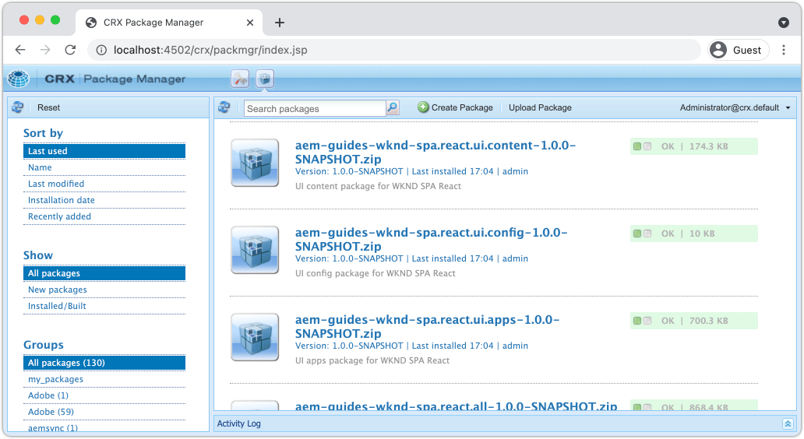
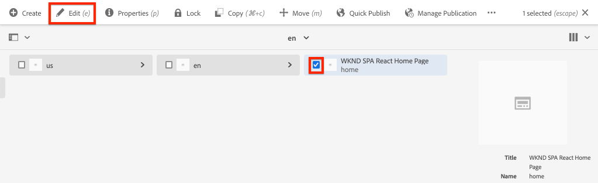
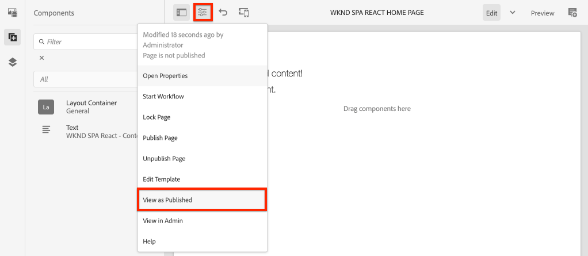
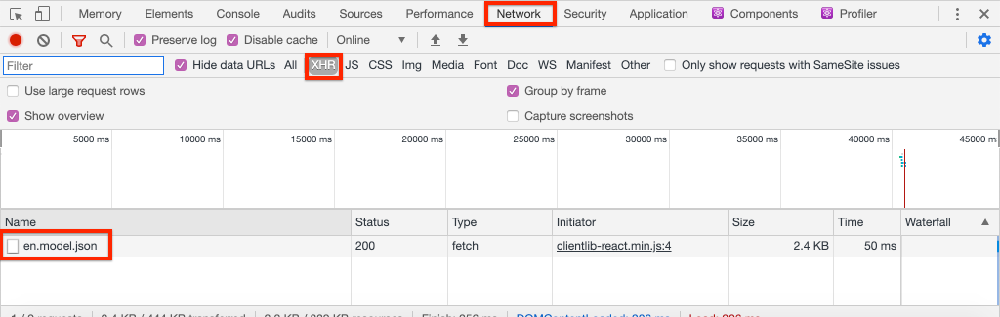

# Create Project {#spa-editor-project}

{{spa-editor-deprecation}}

Learn how to generate an Adobe Experience Manager (AEM) Maven project as a starting point for a React application integrated with the AEM SPA Editor.

## Objective

1. Generate a SPA Editor enabled project using the AEM Project Archetype.
2. Deploy the starter project to a local instance of AEM.

## What you will build {#what-build}

In this chapter, a new AEM project is generated, based on the [AEM Project Archetype](https://github.com/adobe/aem-project-archetype). The AEM project is bootstrapped with a very simple starting point for the React SPA.

**What is a Maven project?** - [Apache Maven](https://maven.apache.org/) is a software management tool to build projects. *All Adobe Experience Manager* implementations use Maven projects to build, manage and deploy custom code on top of AEM.

**What is a Maven archetype?** - A [Maven archetype](https://maven.apache.org/archetype/index.html) is a template or pattern for generating new projects. The AEM Project archetype allows us to generate a new project with a custom namespace and include a project structure that follows best practices, greatly accelerating our project.

## Prerequisites

Review the required tooling and instructions for setting up a [local development environment](overview.md#local-dev-environment). Ensure that a fresh instance of Adobe Experience Manager, started in **author** mode, is running locally.

## Create the project {#create}

>[!NOTE]
>
>This tutorial uses version **35** of the archetype. 

1. Open up a command line terminal and enter the following Maven command:

    ```shell
    mvn -B org.apache.maven.plugins:maven-archetype-plugin:3.2.1:generate \
     -D archetypeGroupId=com.adobe.aem \
     -D archetypeArtifactId=aem-project-archetype \
     -D archetypeVersion=35 \
     -D appTitle="WKND SPA React" \
     -D appId="wknd-spa-react" \
     -D artifactId="aem-guides-wknd-spa.react" \
     -D groupId="com.adobe.aem.guides.wkndspa.react" \
     -D frontendModule="react" \
     -D aemVersion="cloud"
    ```

    >[!NOTE]
    >
    > If targeting AEM 6.5.5+ replace `aemVersion="cloud"` with `aemVersion="6.5.5"`. If targeting 6.4.8+, use `aemVersion="6.4.8"`.

    Notice the `frontendModule=react` property. This tells the AEM Project Archetype to bootstrap the project with a starter [React code base](https://experienceleague.adobe.com/docs/experience-manager-core-components/using/developing/archetype/uifrontend-react.html) to be used with the AEM SPA Editor. Properties like `appTitle`, `appId`, `artifactId`, and `groupId` are used to identify the project and purpose.

    A full list of available properties for configuring a project [can be found here](https://github.com/adobe/aem-project-archetype#available-properties).

1. The following folder and file structure is generated by the Maven archetype on your local file system:

    ```plain
    |--- aem-guides-wknd-spa.react/
        |--- LICENSE
        |--- README.md
        |--- all/
        |--- archetype.properties
        |--- core/
        |--- dispatcher/
        |--- it.tests/
        |--- pom.xml
        |--- ui.apps/
        |--- ui.apps.structure/
        |--- ui.config/
        |--- ui.content/
        |--- ui.frontend/
        |--- ui.tests /
        |--- .gitignore
    ```

    Each folder represents an individual Maven module. In this tutorial we will primarily be working with the `ui.frontend` module, which is the React app. More details about individual modules can be found in the [AEM Project Archetype documentation](https://experienceleague.adobe.com/docs/experience-manager-core-components/using/developing/archetype/overview.html). 

## Deploy and build the project

Next, compile, build, and deploy the project code to a local instance of AEM using Maven.

1. Ensure an instance of AEM is running locally on port **4502**.
1. From the command line navigate into the `aem-guides-wknd-spa.react` project directory.

    ```shell
    $ cd aem-guides-wknd-spa.react
    ```

1. Run the following command to build and deploy the entire project to AEM:

    ```shell
    $ mvn clean install -PautoInstallSinglePackage
    ```

    The build will take around a minute and should end with the following message:

    ```shell
    ...
    [INFO] ------------------------------------------------------------------------
    [INFO] Reactor Summary for aem-guides-wknd-spa.react 1.0.0-SNAPSHOT:
    [INFO]
    [INFO] aem-guides-wknd-spa.react .......................... SUCCESS [  0.257 s]
    [INFO] WKND SPA React - Core .............................. SUCCESS [ 12.553 s]
    [INFO] WKND SPA React - UI Frontend ....................... SUCCESS [01:46 min]
    [INFO] WKND SPA React - Repository Structure Package ...... SUCCESS [  1.082 s]
    [INFO] WKND SPA React - UI apps ........................... SUCCESS [  8.237 s]
    [INFO] WKND SPA React - UI content ........................ SUCCESS [  5.633 s]
    [INFO] WKND SPA React - UI config ......................... SUCCESS [  0.234 s]
    [INFO] WKND SPA React - All ............................... SUCCESS [  0.643 s]
    [INFO] WKND SPA React - Integration Tests ................. SUCCESS [ 12.377 s]
    [INFO] WKND SPA React - Dispatcher ........................ SUCCESS [  0.066 s]
    [INFO] WKND SPA React - UI Tests .......................... SUCCESS [  0.074 s]
    [INFO] WKND SPA React - Project Analyser .................. SUCCESS [ 31.287 s]
    [INFO] ------------------------------------------------------------------------
    [INFO] BUILD SUCCESS
    [INFO] ------------------------------------------------------------------------
    ```

    The Maven profile `autoInstallSinglePackage` compiles the individual modules of the project and deploys a single package to the AEM instance. By default this package is deployed to an AEM instance running locally on port **4502** and with the credentials of `admin:admin`.

1. Navigate to **Package Manager** on your local AEM instance: [http://localhost:4502/crx/packmgr/index.jsp](http://localhost:4502/crx/packmgr/index.jsp).

1. You should see multiple packages prefixed with `aem-guides-wknd-spa.react`.

    

    *AEM Package Manager*

    All of the custom code needed for the project is bundled into these packages and installed on the AEM environment.

## Author Content

Next, open the starter SPA that was generated by the archetype and update some of the content.

1. Navigate to the **Sites** console: [http://localhost:4502/sites.html/content](http://localhost:4502/sites.html/content).

    The WKND SPA includes a basic site structure with a country, language and home page. This hierarchy is based on the archetype's default values for `language_country` and `isSingleCountryWebsite`. These values can be overwritten by updating the [available properties](https://github.com/adobe/aem-project-archetype#available-properties) when generating a project.

2. Open the **us** > **en** > **WKND SPA React Home Page** page by selecting the page and clicking the **Edit** button in the menu bar:

    

3. A **Text** component has already been added to the page. You can edit this component like any other component in AEM.

    

4. Add an additional **Text** component to the page.

    Notice that the authoring experience is similar to that of a traditional AEM Sites page. Currently a limited number of components are available to be used. More is added over the course of the tutorial.

## Inspect the Single Page Application

Next, verify that this is a Single Page Application with the use of your browser's developer tools.

1. In the **Page Editor**, click the **Page Information** button > **View as Published**:

    

    This will open a new tab with the query parameter `?wcmmode=disabled` which effectively turns off the AEM editor: [http://localhost:4502/content/wknd-spa-react/us/en/home.html?wcmmode=disabled](http://localhost:4502/content/wknd-spa-react/us/en/home.html?wcmmode=disabled)

2. View the page's source and notice that the text content **[!DNL Hello World]** or any of the other content is not found. Instead you should see HTML like the following:

    ```html
    ...
    <body>
        <noscript>You need to enable JavaScript to run this app.</noscript>
        <div id="spa-root"></div>
        <script type="text/javascript" src="/etc.clientlibs/wknd-spa-react/clientlibs/clientlib-react.lc-xxxx-lc.min.js"></script>
    </body>
    ...
    ```

    `clientlib-react.min.js` is the React SPA that is loaded on to the page and responsible for rendering the content.

    However, *where does the content come from?*

3. Return to the tab: [http://localhost:4502/content/wknd-spa-react/us/en/home.html?wcmmode=disabled](http://localhost:4502/content/wknd-spa-react/us/en/home.html?wcmmode=disabled)
4. Open the browser's developer tools and inspect the network traffic of the page during a refresh. View the **XHR** requests:

    

    There should be a request to [http://localhost:4502/content/wknd-spa-react/us/en.model.json](http://localhost:4502/content/wknd-spa-react/us/en.model.json). This contains all of the content, formatted in JSON, that will drive the SPA.

5. In a new tab open [http://localhost:4502/content/wknd-spa-react/us/en.model.json](http://localhost:4502/content/wknd-spa-react/us/en.model.json)

    The request `en.model.json` represents the content model that will drive the application. Inspect the JSON output and you should be able to find the snippet representing the **[!UICONTROL Text]** component(s).

    ```json
    ...
    ":items": {
        "text": {
            "text": "<p>Hello World! Updated content!</p>\r\n",
            "richText": true,
            ":type": "wknd-spa-react/components/text"
        },
        "text_98796435": {
            "text": "<p>A new text component.</p>\r\n",
            "richText": true,
            ":type": "wknd-spa-react/components/text"
        },
    }
    ...
    ```

    In the next chapter we will inspect how this JSON content is mapped from AEM Components to SPA Components to form the basis of the AEM SPA Editor experience.

    >[!NOTE]
    >
    > It may be helpful to install a browser extension to automatically format the JSON output.

## Congratulations! {#congratulations}

Congratulations, you have just created your first AEM SPA Editor Project!

The SPA is quite simple. In the next few chapters more functionality is added.

### Next Steps {#next-steps}

[Integrate a SPA](integrate-spa.md) - Learn how the SPA source code is integrated with the AEM Project and understand tools available to rapidly develop the SPA.
