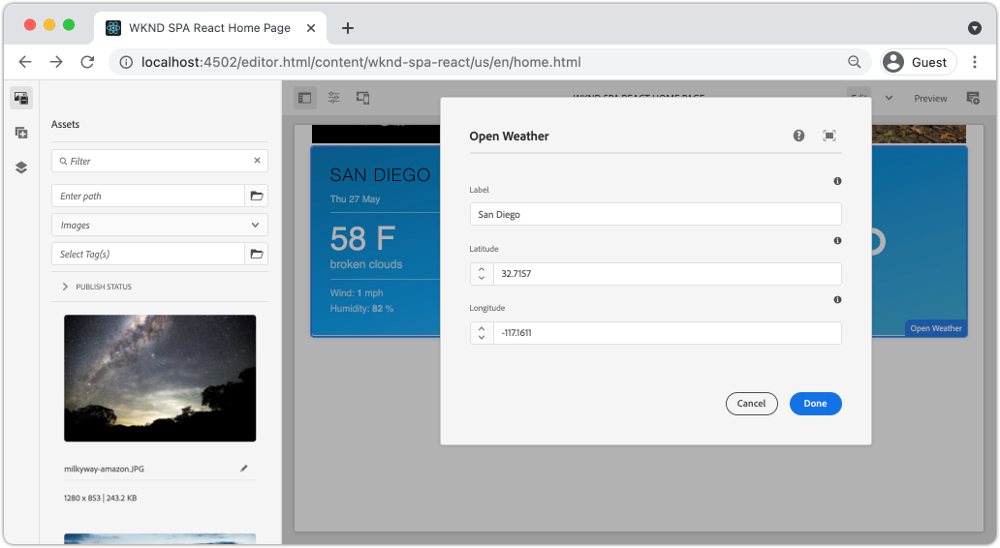
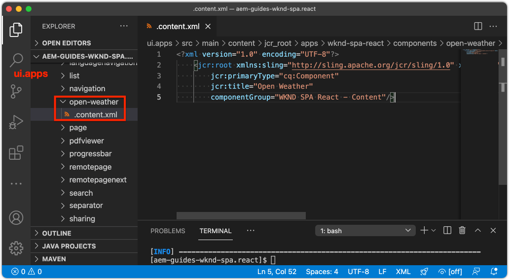
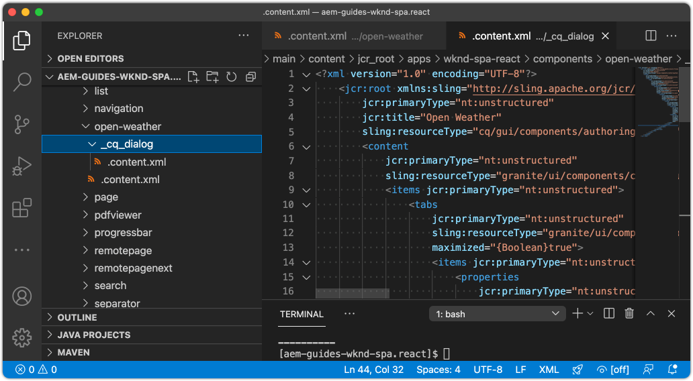
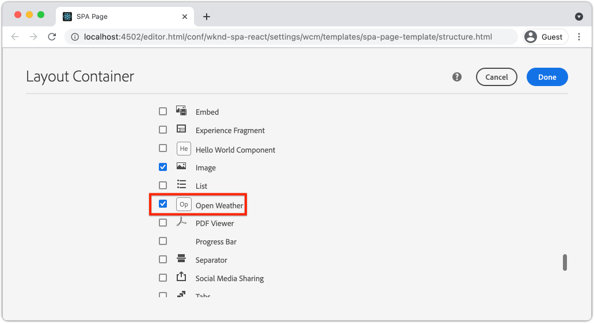
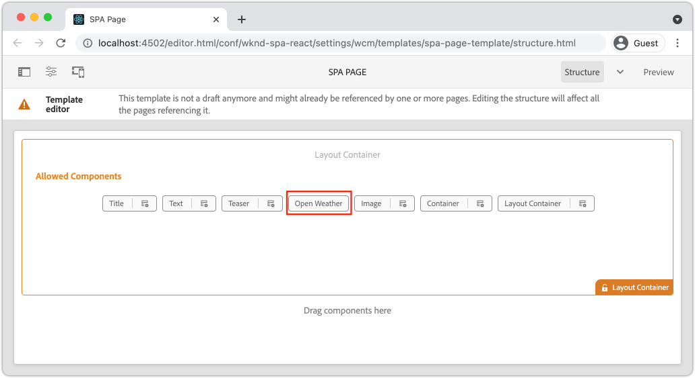
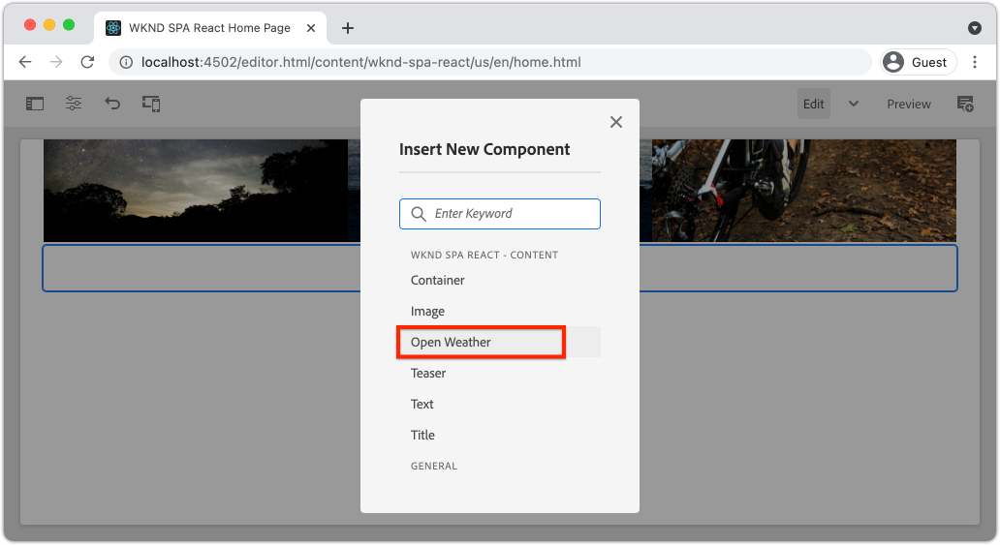
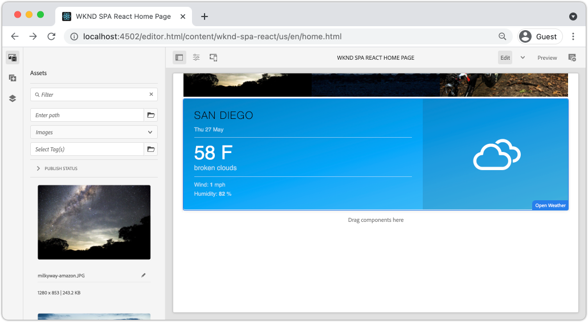

# Create a Custom WeatherComponent {#custom-component}

Learn how to create a custom weather component to be used with the AEM SPA Editor. Learn how to develop author dialogs and Sling Models to extend the JSON model to populate a custom component. The [Open Weather API](https://openweathermap.org) and [React Open Weather component](https://www.npmjs.com/package/react-open-weather) are used.

## Objective

1. Understand the role of Sling Models in manipulating the JSON model API provided by AEM.
2. Understand how to create new AEM component dialogs.
3. Learn to create a **custom** AEM Component that will be compatible with the SPA editor framework.

## What you will build

A simple weather component will be built. This component will be able to be added to the SPA by content authors. Using an AEM dialog, authors can set the location for the weather to be displayed.  The implementation of this component illustrates the steps needed to create a net-new AEM component that is compatible with the AEM SPA Editor framework.



## Prerequisites

Review the required tooling and instructions for setting up a [local development environment](overview.md#local-dev-environment). This chapter is a continuation of the [Navigation and Routing](navigation-routing.md) chapter, however to follow along all you need is a SPA-enabled AEM project deployed to a local AEM instance.

### Open Weather API Key

An API key from [Open Weather](https://openweathermap.org/) is needed to follow along with the tutorial. [Sign up is free](https://home.openweathermap.org/users/sign_up) for a limited amount of API calls.

## Define the AEM Component

An AEM component is defined as a node and properties. In the project these nodes and properties are represented as XML files in the `ui.apps` module. Next, create the AEM component in the `ui.apps` module.

>[!NOTE]
>
> A quick refresher on the [basics of AEM components may be helpful](https://experienceleague.adobe.com/docs/experience-manager-learn/getting-started-wknd-tutorial-develop/project-archetype/component-basics.html).

1. In the IDE of your choice open the `ui.apps` folder.
2. Navigate to `ui.apps/src/main/content/jcr_root/apps/wknd-spa-react/components` and create a new folder named `open-weather`.
3. Create a new file named `.content.xml` beneath the `open-weather` folder. Populate the `open-weather/.content.xml` with the following:

    ```xml
    <?xml version="1.0" encoding="UTF-8"?>
    <jcr:root xmlns:sling="http://sling.apache.org/jcr/sling/1.0" xmlns:cq="http://www.day.com/jcr/cq/1.0" xmlns:jcr="http://www.jcp.org/jcr/1.0"
        jcr:primaryType="cq:Component"
        jcr:title="Open Weather"
        componentGroup="WKND SPA React - Content"/>
    ```

    

    `jcr:primaryType="cq:Component"` - identifies that this node will be an AEM component.

    `jcr:title` is the value that will be displayed to Content Authors and the `componentGroup` determines the grouping of components in the authoring UI.

4. Beneath the `custom-component` folder, create another folder named `_cq_dialog`.
5. Beneath the `_cq_dialog` folder create a new file named `.content.xml` and populate it with the following:

    ```xml
    <?xml version="1.0" encoding="UTF-8"?>
    <jcr:root xmlns:sling="http://sling.apache.org/jcr/sling/1.0" xmlns:granite="http://www.adobe.com/jcr/granite/1.0" xmlns:cq="http://www.day.com/jcr/cq/1.0" xmlns:jcr="http://www.jcp.org/jcr/1.0" xmlns:nt="http://www.jcp.org/jcr/nt/1.0"
        jcr:primaryType="nt:unstructured"
        jcr:title="Open Weather"
        sling:resourceType="cq/gui/components/authoring/dialog">
        <content
            jcr:primaryType="nt:unstructured"
            sling:resourceType="granite/ui/components/coral/foundation/container">
            <items jcr:primaryType="nt:unstructured">
                <tabs
                    jcr:primaryType="nt:unstructured"
                    sling:resourceType="granite/ui/components/coral/foundation/tabs"
                    maximized="{Boolean}true">
                    <items jcr:primaryType="nt:unstructured">
                        <properties
                            jcr:primaryType="nt:unstructured"
                            jcr:title="Properties"
                            sling:resourceType="granite/ui/components/coral/foundation/container"
                            margin="{Boolean}true">
                            <items jcr:primaryType="nt:unstructured">
                                <columns
                                    jcr:primaryType="nt:unstructured"
                                    sling:resourceType="granite/ui/components/coral/foundation/fixedcolumns"
                                    margin="{Boolean}true">
                                    <items jcr:primaryType="nt:unstructured">
                                        <column
                                            jcr:primaryType="nt:unstructured"
                                            sling:resourceType="granite/ui/components/coral/foundation/container">
                                            <items jcr:primaryType="nt:unstructured">
                                                <label
                                                    jcr:primaryType="nt:unstructured"
                                                    sling:resourceType="granite/ui/components/coral/foundation/form/textfield"
                                                    fieldDescription="The label to display for the component"
                                                    fieldLabel="Label"
                                                    name="./label"/>
                                                <lat
                                                    jcr:primaryType="nt:unstructured"
                                                    sling:resourceType="granite/ui/components/coral/foundation/form/numberfield"
                                                    fieldDescription="The latitude of the location."
                                                    fieldLabel="Latitude"
                                                    step="any"
                                                    name="./lat" />
                                                <lon
                                                    jcr:primaryType="nt:unstructured"
                                                    sling:resourceType="granite/ui/components/coral/foundation/form/numberfield"
                                                    fieldDescription="The longitude of the location."
                                                    fieldLabel="Longitude"
                                                    step="any"
                                                    name="./lon"/>
                                            </items>
                                        </column>
                                    </items>
                                </columns>
                            </items>
                        </properties>
                    </items>
                </tabs>
            </items>
        </content>
    </jcr:root>
    ```

    

    The above XML file generates a very simple dialog for the `Weather Component`. The critical part of the file is the inner `<label>`, `<lat>` and `<lon>` nodes. This dialog will contain two `numberfield`s and a `textfield` that will allow a user to configure the the weather to be displayed.

    A Sling Model will be created next to expose the value of the `label`,`lat` and `long` properties via the JSON model.

    >[!NOTE]
    >
    > You can view a lot more [examples of dialogs by viewing the Core Component definitions](https://github.com/adobe/aem-core-wcm-components/tree/master/content/src/content/jcr_root/apps/core/wcm/components). You can also view additional form fields, like `select`, `textarea`, `pathfield`, available beneath `/libs/granite/ui/components/coral/foundation/form` in [CRXDE-Lite](http://localhost:4502/crx/de/index.jsp#/libs/granite/ui/components/coral/foundation/form).

    With a traditional AEM component, an [HTL](https://docs.adobe.com/content/help/en/experience-manager-htl/using/overview.html) script is typically required. Since the SPA will render the component, no HTL script is needed.

## Create the Sling Model

Sling Models are annotation driven Java "POJO's" (Plain Old Java Objects) that facilitate the mapping of data from the JCR to Java variables. [Sling Models](https://experienceleague.adobe.com/docs/experience-manager-learn/getting-started-wknd-tutorial-develop/project-archetype/component-basics.html?lang=en#sling-models) typically function to encapsulate complex server-side business logic for AEM Components.

In the context of the SPA Editor, Sling Models expose a component's content through the JSON model through a feature using the [Sling Model Exporter](https://experienceleague.adobe.com/docs/experience-manager-learn/foundation/development/develop-sling-model-exporter.html).

1. In the IDE of your choice open the `core` module at `aem-guides-wknd-spa.react/core`.
1. Create a file named at `OpenWeatherModel.java` at `core/src/main/java/com/adobe/aem/guides/wkndspa/react/core/models`.
1. Populate `OpenWeatherModel.java` with the following:

    ```java
    package com.adobe.aem.guides.wkndspa.react.core.models;

    import com.adobe.cq.export.json.ComponentExporter;

    // Sling Models intended to be used with SPA Editor must extend ComponentExporter interface
    public interface OpenWeatherModel extends ComponentExporter {

        public String getLabel();

        public double getLat();

        public double getLon();

    }
    ```

    This is the Java interface for our component. In order for our Sling Model to be compatible with the SPA Editor framework it must extend the `ComponentExporter` class.

1. Create a folder named `impl` beneath `core/src/main/java/com/adobe/aem/guides/wkndspa/react/core/models`.
1. Create a file named `OpenWeatherModelImpl.java` beneath `impl` and populate with the following:

    ```java
    package com.adobe.aem.guides.wkndspa.react.core.models.impl;

    import org.apache.sling.models.annotations.*;
    import org.apache.sling.models.annotations.injectorspecific.ValueMapValue;
    import com.adobe.cq.export.json.ComponentExporter;
    import com.adobe.cq.export.json.ExporterConstants;
    import org.apache.commons.lang3.StringUtils;
    import org.apache.sling.api.SlingHttpServletRequest;
    import com.adobe.aem.guides.wkndspa.react.core.models.OpenWeatherModel;

    // Sling Model annotation
    @Model(
        adaptables = SlingHttpServletRequest.class, 
        adapters = { OpenWeatherModel.class, ComponentExporter.class }, 
        resourceType = OpenWeatherModelImpl.RESOURCE_TYPE, 
        defaultInjectionStrategy = DefaultInjectionStrategy.OPTIONAL
        )
    @Exporter( //Exporter annotation that serializes the modoel as JSON
        name = ExporterConstants.SLING_MODEL_EXPORTER_NAME, 
        extensions = ExporterConstants.SLING_MODEL_EXTENSION
        )
    public class OpenWeatherModelImpl implements OpenWeatherModel {

        @ValueMapValue
        private String label; //maps variable to jcr property named "label" persisted by Dialog

        @ValueMapValue
        private double lat; //maps variable to jcr property named "lat"

        @ValueMapValue
        private double lon; //maps variable to jcr property named "lon"

        // points to AEM component definition in ui.apps
        static final String RESOURCE_TYPE = "wknd-spa-react/components/open-weather";

        // public getter method to expose value of private variable `label`
        // adds additional logic to default the label to "(Default)" if not set.
        @Override
        public String getLabel() {
            return StringUtils.isNotBlank(label) ? label : "(Default)";
        }

        // public getter method to expose value of private variable `lat`
        @Override
        public double getLat() {
            return lat;
        }

        // public getter method to expose value of private variable `lon`
        @Override
        public double getLon() {
            return lon;
        }

        // method required by `ComponentExporter` interface
        // exposes a JSON property named `:type` with a value of `wknd-spa-react/components/open-weather`
        // required to map the JSON export to the SPA component props via the `MapTo`
        @Override
        public String getExportedType() {
            return OpenWeatherModelImpl.RESOURCE_TYPE;
        }
    } 
    ```

    The the static variable `RESOURCE_TYPE` must point to the path in `ui.apps` of the component. The `getExportedType()` is used to map the JSON properties to the SPA component via `MapTo`. `@ValueMapValue` is an annotation that reads the jcr property saved by the dialog.

## Update the SPA

Next, update the React code to include the [React Open Weather component](https://www.npmjs.com/package/react-open-weather) and have it map to the AEM component created in the previous steps.

1. Install the React Open Weather component as an **npm** dependency:

    ```shell
    $ cd aem-guides-wknd-spa.react/ui.frontend
    $ npm i react-open-weather
    ```

1. Create a new folder named `OpenWeather` at `ui.frontend/src/components/OpenWeather`.
1. Add a file named `OpenWeather.js` and populate it with the following:

    ```js
    import React from 'react';
    import {MapTo} from '@adobe/aem-react-editable-components';
    import ReactWeather, { useOpenWeather } from 'react-open-weather';

    // Open weather API Key
    // For simplicity it is hard coded in the file, ideally this is extracted in to an environment variable
    const API_KEY = 'YOUR_API_KEY';

    // Logic to render placeholder or component
    const OpenWeatherEditConfig = {

        emptyLabel: 'Weather',
        isEmpty: function(props) {
            return !props || !props.lat || !props.lon || !props.label;
        }
    };

    // Wrapper function that includes react-open-weather component
    function ReactWeatherWrapper(props) {
        const { data, isLoading, errorMessage } = useOpenWeather({
            key: API_KEY,
            lat: props.lat, // passed in from AEM JSON
            lon: props.lon, // passed in from AEM JSON
            lang: 'en',
            unit: 'imperial', // values are (metric, standard, imperial)
        });

        return (
            <div className="cmp-open-weather">
                <ReactWeather
                    isLoading={isLoading}
                    errorMessage={errorMessage}
                    data={data}
                    lang="en"
                    locationLabel={props.label} // passed in from AEM JSON
                    unitsLabels={{ temperature: 'F', windSpeed: 'mph' }}
                    showForecast={false}
                  />
            </div>
        );
    }

    export default function OpenWeather(props) {

            // render nothing if component not configured
            if(OpenWeatherEditConfig.isEmpty(props)) {
                return null;
            }

            // render ReactWeather component if component configured
            // pass props to ReactWeatherWrapper. These props include the mapped properties from AEM JSON
            return ReactWeatherWrapper(props);

    }

    // Map OpenWeather to AEM component
    MapTo('wknd-spa-react/components/open-weather')(OpenWeather, OpenWeatherEditConfig);
    ```

1. Update `import-components.js` at `ui.frontend/src/components/import-components.js` to include the `OpenWeather` component:

    ```diff
      // import-component.js
      import './Container/Container';
      import './ExperienceFragment/ExperienceFragment';
    + import './OpenWeather/OpenWeather';
    ```

1. Deploy all of the updates to a local AEM environment from the root of the project directory, using your Maven skills:

    ```shell
    $ cd aem-guides-wknd-spa.react
    $ mvn clean install -PautoInstallSinglePackage
    ```

## Update the Template Policy

Next, navigate to AEM to verify the updates and allow the `OpenWeather` component to be added to the SPA.

1. Verify the registration of the new Sling Model by navigating to [http://localhost:4502/system/console/status-slingmodels](http://localhost:4502/system/console/status-slingmodels).

    ```plain
    com.adobe.aem.guides.wkndspa.react.core.models.impl.OpenWeatherModelImpl - wknd-spa-react/components/open-weather

    com.adobe.aem.guides.wkndspa.react.core.models.impl.OpenWeatherModelImpl exports 'wknd-spa-react/components/open-weather' with selector 'model' and extension '[Ljava.lang.String;@2fd80fc5' with exporter 'jackson'
    ```

    You should see the above two lines that indicate the `OpenWeatherModelImpl` is associated with the `wknd-spa-react/components/open-weather` component and that it is registered via the Sling Model Exporter.

1. Navigate to the SPA Page Template at [http://localhost:4502/editor.html/conf/wknd-spa-react/settings/wcm/templates/spa-page-template/structure.html](http://localhost:4502/editor.html/conf/wknd-spa-react/settings/wcm/templates/spa-page-template/structure.html).
1. Update the Layout Container's policy to add the new `Open Weather` as an allowed component:

    

    Save the changes to the policy, and observe the `Open Weather` as an allowed component:

    

## Author the Open Weather Component

Next, author the `Open Weather` component using the AEM SPA Editor.

1. Navigate to [http://localhost:4502/editor.html/content/wknd-spa-react/us/en/home.html](http://localhost:4502/editor.html/content/wknd-spa-react/us/en/home.html).
1. In `Edit` mode, add the `Open Weather` to the `Layout Container`:

    

1. Open the component's dialog and enter a **Label**, **Latitude**, and **Longitude**. For example **San Diego**, **32.7157**, and **-117.1611**. Western hemisphere and Southern hemisphere numbers are represented as negative numbers with the Open Weather API

    

    This is the dialog that was created based on the XML file earlier in the chapter.

1. Save the changes. Observe that the weather for **San Diego** is now displayed:

    

1. View the JSON model by navigating to [http://localhost:4502/content/wknd-spa-react/us/en.model.json](http://localhost:4502/content/wknd-spa-react/us/en.model.json). Search for `wknd-spa-react/components/open-weather`:

    ```json
    "open_weather": {
        "label": "San Diego",
        "lat": 32.7157,
        "lon": -117.1611,
        ":type": "wknd-spa-react/components/open-weather"
    }
    ```

    The JSON values are outputted by the Sling Model. These JSON values are passed into the React component as props.

## Congratulations! {#congratulations}

Congratulations, you learned how to create a custom AEM component to be used with the SPA Editor. You also learned how dialogs, JCR properties, and Sling Models interact to output the JSON model.

### Next Steps {#next-steps}

[Extend a Core Component](extend-component.md) - Learn how to extend an existing AEM Core Component to be used with the AEM SPA Editor. Understanding how to add properties and content to an existing component is a powerful technique to expand the capabilities of an AEM SPA Editor implementation.
