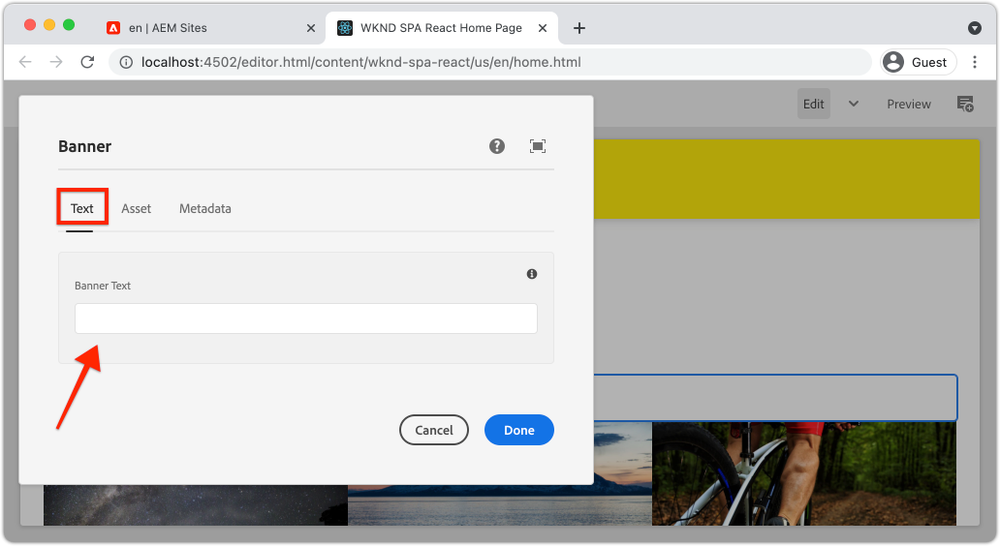

# Extend a Core Component {#extend-component}

{{spa-editor-deprecation}}

Learn how to extend an existing Core Component to be used with the AEM SPA Editor. Understanding how to extend an existing component is a powerful technique to customize and expand the capabilities of an AEM SPA Editor implementation.

## Objective

1. Extend an existing Core Component with additional properties and content.
2. Understand the basic of Component Inheritance with the use of `sling:resourceSuperType`.
3. Learn how to leverage the [Delegation Pattern](https://github.com/adobe/aem-core-wcm-components/wiki/Delegation-Pattern-for-Sling-Models) for Sling Models to re-use existing logic and functionality.

## What you will build

This chapter illustrates the additional code needed to add an extra property to a standard `Image` component to fulfill the requirements for a new `Banner` component. The `Banner` component contains all of the same properties as the standard `Image` component but includes an additional property for users to populate the **Banner Text**.


## Prerequisites

Review the required tooling and instructions for setting up a [local development environment](overview.md#local-dev-environment). It is assumed at this point in the tutorial users have a solid understanding of the AEM SPA Editor feature.

## Inheritance with Sling Resource Super Type {#sling-resource-super-type}

To extend an existing component set a property named `sling:resourceSuperType` on your component's definition.  `sling:resourceSuperType`is a [property](https://sling.apache.org/documentation/the-sling-engine/resources.html#resource-properties) that can be set on an AEM component's definition that points to another component. This explicitly sets the component to inherit all functionality of the component identified as the `sling:resourceSuperType`.

If we want to extend the `Image` component at `wknd-spa-react/components/image` we need to update the code in the `ui.apps` module.

1.  Create a new folder beneath the `ui.apps` module for `banner` at `ui.apps/src/main/content/jcr_root/apps/wknd-spa-react/components/banner`.
1.  Beneath `banner` create a Component definition (`.content.xml`) like the following:

    ```xml
    <?xml version="1.0" encoding="UTF-8"?>
    <jcr:root xmlns:sling="http://sling.apache.org/jcr/sling/1.0" xmlns:cq="http://www.day.com/jcr/cq/1.0" xmlns:jcr="http://www.jcp.org/jcr/1.0"
        jcr:primaryType="cq:Component"
        jcr:title="Banner"
        sling:resourceSuperType="wknd-spa-react/components/image"
        componentGroup="WKND SPA React - Content"/>
    ```

    This sets `wknd-spa-react/components/banner` to inherit all functionality of `wknd-spa-react/components/image`.

## cq:editConfig {#cq-edit-config}

The `_cq_editConfig.xml` file dictates the drag and drop behavior in the AEM authoring UI. When extending the Image component it is important that the resource type matches the component itself.

1.  In the `ui.apps` module create another file beneath `banner` named `_cq_editConfig.xml`.
1.  Populate `_cq_editConfig.xml` with the following XML:

    ```xml
    <?xml version="1.0" encoding="UTF-8"?>
    <jcr:root xmlns:sling="http://sling.apache.org/jcr/sling/1.0" xmlns:cq="http://www.day.com/jcr/cq/1.0" xmlns:jcr="http://www.jcp.org/jcr/1.0" xmlns:nt="http://www.jcp.org/jcr/nt/1.0"
        jcr:primaryType="cq:EditConfig">
        <cq:dropTargets jcr:primaryType="nt:unstructured">
            <image
                jcr:primaryType="cq:DropTargetConfig"
                accept="[image/gif,image/jpeg,image/png,image/webp,image/tiff,image/svg\\+xml]"
                groups="[media]"
                propertyName="./fileReference">
                <parameters
                    jcr:primaryType="nt:unstructured"
                    sling:resourceType="wknd-spa-react/components/banner"
                    imageCrop=""
                    imageMap=""
                    imageRotate=""/>
            </image>
        </cq:dropTargets>
        <cq:inplaceEditing
            jcr:primaryType="cq:InplaceEditingConfig"
            active="{Boolean}true"
            editorType="image">
            <inplaceEditingConfig jcr:primaryType="nt:unstructured">
                <plugins jcr:primaryType="nt:unstructured">
                    <crop
                        jcr:primaryType="nt:unstructured"
                        supportedMimeTypes="[image/jpeg,image/png,image/webp,image/tiff]"
                        features="*">
                        <aspectRatios jcr:primaryType="nt:unstructured">
                            <wideLandscape
                                jcr:primaryType="nt:unstructured"
                                name="Wide Landscape"
                                ratio="0.6180"/>
                            <landscape
                                jcr:primaryType="nt:unstructured"
                                name="Landscape"
                                ratio="0.8284"/>
                            <square
                                jcr:primaryType="nt:unstructured"
                                name="Square"
                                ratio="1"/>
                            <portrait
                                jcr:primaryType="nt:unstructured"
                                name="Portrait"
                                ratio="1.6180"/>
                        </aspectRatios>
                    </crop>
                    <flip
                        jcr:primaryType="nt:unstructured"
                        supportedMimeTypes="[image/jpeg,image/png,image/webp,image/tiff]"
                        features="-"/>
                    <map
                        jcr:primaryType="nt:unstructured"
                        supportedMimeTypes="[image/jpeg,image/png,image/webp,image/tiff,image/svg+xml]"
                        features="*"/>
                    <rotate
                        jcr:primaryType="nt:unstructured"
                        supportedMimeTypes="[image/jpeg,image/png,image/webp,image/tiff]"
                        features="*"/>
                    <zoom
                        jcr:primaryType="nt:unstructured"
                        supportedMimeTypes="[image/jpeg,image/png,image/webp,image/tiff]"
                        features="*"/>
                </plugins>
                <ui jcr:primaryType="nt:unstructured">
                    <inline
                        jcr:primaryType="nt:unstructured"
                        toolbar="[crop#launch,rotate#right,history#undo,history#redo,fullscreen#fullscreen,control#close,control#finish]">
                        <replacementToolbars
                            jcr:primaryType="nt:unstructured"
                            crop="[crop#identifier,crop#unlaunch,crop#confirm]"/>
                    </inline>
                    <fullscreen jcr:primaryType="nt:unstructured">
                        <toolbar
                            jcr:primaryType="nt:unstructured"
                            left="[crop#launchwithratio,rotate#right,flip#horizontal,flip#vertical,zoom#reset100,zoom#popupslider]"
                            right="[history#undo,history#redo,fullscreen#fullscreenexit]"/>
                        <replacementToolbars jcr:primaryType="nt:unstructured">
                            <crop
                                jcr:primaryType="nt:unstructured"
                                left="[crop#identifier]"
                                right="[crop#unlaunch,crop#confirm]"/>
                            <map
                                jcr:primaryType="nt:unstructured"
                                left="[map#rectangle,map#circle,map#polygon]"
                                right="[map#unlaunch,map#confirm]"/>
                        </replacementToolbars>
                    </fullscreen>
                </ui>
            </inplaceEditingConfig>
        </cq:inplaceEditing>
    </jcr:root>
    ```

1.  The unique aspect of the file is the `<parameters>` node that sets the resourceType to `wknd-spa-react/components/banner`.

    ```xml
    <parameters
        jcr:primaryType="nt:unstructured"
        sling:resourceType="wknd-spa-react/components/banner"
        imageCrop=""
        imageMap=""
        imageRotate=""/>
    ```

    Most component's do not require a `_cq_editConfig`. Image components and descendants are the exception.

## Extend the Dialog {#extend-dialog}

Our `Banner` component requires an extra text field in the dialog to capture the `bannerText`. Since we are using Sling inheritance, we can use features of the [Sling Resource Merger](https://experienceleague.adobe.com/docs/experience-manager-65/developing/platform/sling-resource-merger.html) to override or extend portions of the dialog. In this sample a new tab has been added to the dialog to capture additional data from an author to populate the Card Component.

1.  In the `ui.apps` module, beneath the `banner` folder, create a folder named `_cq_dialog`.
1.  Beneath `_cq_dialog` create a Dialog definition file `.content.xml`. Populate it with the following:

    ```xml
    <?xml version="1.0" encoding="UTF-8"?>
    <jcr:root xmlns:sling="http://sling.apache.org/jcr/sling/1.0" xmlns:granite="http://www.adobe.com/jcr/granite/1.0" xmlns:cq="http://www.day.com/jcr/cq/1.0" xmlns:jcr="http://www.jcp.org/jcr/1.0" xmlns:nt="http://www.jcp.org/jcr/nt/1.0"
        jcr:primaryType="nt:unstructured"
        jcr:title="Banner"
        sling:resourceType="cq/gui/components/authoring/dialog">
        <content jcr:primaryType="nt:unstructured">
            <items jcr:primaryType="nt:unstructured">
                <tabs jcr:primaryType="nt:unstructured">
                    <items jcr:primaryType="nt:unstructured">
                        <text
                            jcr:primaryType="nt:unstructured"
                            jcr:title="Text"
                            sling:orderBefore="asset"
                            sling:resourceType="granite/ui/components/coral/foundation/container"
                            margin="{Boolean}true">
                            <items jcr:primaryType="nt:unstructured">
                                <columns
                                    jcr:primaryType="nt:unstructured"
                                    sling:resourceType="granite/ui/components/coral/foundation/fixedcolumns"
                                    margin="{Boolean}true">
                                    <items jcr:primaryType="nt:unstructured">
                                        <column
                                            jcr:primaryType="nt:unstructured"
                                            sling:resourceType="granite/ui/components/coral/foundation/container">
                                            <items jcr:primaryType="nt:unstructured">
                                                <textGroup
                                                    granite:hide="${cqDesign.titleHidden}"
                                                    jcr:primaryType="nt:unstructured"
                                                    sling:resourceType="granite/ui/components/coral/foundation/well">
                                                    <items jcr:primaryType="nt:unstructured">
                                                        <bannerText
                                                            jcr:primaryType="nt:unstructured"
                                                            sling:resourceType="granite/ui/components/coral/foundation/form/textfield"
                                                            fieldDescription="Text to display on top of the banner."
                                                            fieldLabel="Banner Text"
                                                            name="./bannerText"/>
                                                    </items>
                                                </textGroup>
                                            </items>
                                        </column>
                                    </items>
                                </columns>
                            </items>
                        </text>
                    </items>
                </tabs>
            </items>
        </content>
    </jcr:root>
    ```

    The above XML definition will create a new tab named **Text** and order it *before* the existing **Asset** tab. It will contain a single field **Banner Text**.

1.  The dialog will look like the following:

    

    Observe that we did not have to define the tabs for **Asset** or **Metadata**. These are inherited via the `sling:resourceSuperType` property.
    
    Before we can preview the dialog, we need to implement the SPA Component and the `MapTo` function.

## Implement SPA Component {#implement-spa-component}

In order to use the Banner component with the SPA Editor, a new SPA component must be created that will map to `wknd-spa-react/components/banner`. This is done in the `ui.frontend` module.

1.  In the `ui.frontend` module create a new folder for `Banner` at `ui.frontend/src/components/Banner`.
1.  Create a new file named `Banner.js` beneath the `Banner` folder. Populate it with the following:

    ```js
    import React, {Component} from 'react';
    import {MapTo} from '@adobe/aem-react-editable-components';

    export const BannerEditConfig = {
        emptyLabel: 'Banner',

        isEmpty: function(props) {
            return !props || !props.src || props.src.trim().length < 1;
        }
    };

    export default class Banner extends Component {

        get content() {
            return ;
        }

        // display our custom bannerText property!
        get bannerText() {
            if(this.props.bannerText) {
                return <h4>{this.props.bannerText}</h4>;
            }

            return null;
        }

        render() {
            if (BannerEditConfig.isEmpty(this.props)) {
                return null;
            }

            return (
                <div className="Banner">
                    {this.bannerText}
                    <div className="BannerImage">{this.content}</div>
                </div>
            );
        }
    }

    MapTo('wknd-spa-react/components/banner')(Banner, BannerEditConfig);
    ```

    This SPA component maps to the AEM component `wknd-spa-react/components/banner` created earlier.

1.  Update `import-components.js` at `ui.frontend/src/components/import-components.js` to include the new `Banner` SPA component:

    ```diff
      import './ExperienceFragment/ExperienceFragment';
      import './OpenWeather/OpenWeather';
    + import './Banner/Banner';
    ```

1.  At this point the project can be deployed to AEM and the dialog can be tested. Deploy the project using your Maven skills:

    ```shell
    $ cd aem-guides-wknd-spa.react
    $ mvn clean install -PautoInstallSinglePackage
    ```

1.  Update the SPA Template's policy to add the `Banner` component as an **allowed component**. 

1.  Navigate to a SPA page and add the `Banner` component to one of the SPA pages:

    

    >[!NOTE]
    >
    > The dialog will allow you to save a value for **Banner Text** but this value is not reflected in the SPA component. To enable, we need to extend the Sling Model for the component.

## Add Java Interface {#java-interface}

To ultimately expose the values from the component dialog to the React component we need to update the Sling Model that populates the JSON for the `Banner` component. This is done in the `core` module that contains all of the Java code for our SPA project. 

First we will create a new Java interface for `Banner` that extends the `Image` Java interface.

1.  In the `core` module create a new file named `BannerModel.java` at `core/src/main/java/com/adobe/aem/guides/wkndspa/react/core/models`.
1.  Populate `BannerModel.java` with the following:

    ```java
    package com.adobe.aem.guides.wkndspa.react.core.models;

    import com.adobe.cq.wcm.core.components.models.Image;
    import org.osgi.annotation.versioning.ProviderType;

    @ProviderType
    public interface BannerModel extends Image {

        public String getBannerText();

    }
    ```

    This will inherit all of the methods from the Core Component `Image` interface and add one new method `getBannerText()`.

## Implement Sling Model {#sling-model}

Next, implement the Sling Model for the `BannerModel` interface.

1.  In the `core` module create a new file named `BannerModelImpl.java` at `core/src/main/java/com/adobe/aem/guides/wkndspa/react/core/models/impl`.

1.  Populate `BannerModelImpl.java` with the following:

    ```java
    package com.adobe.aem.guides.wkndspa.react.core.models.impl;

    import com.adobe.aem.guides.wkndspa.react.core.models.BannerModel;
    import com.adobe.cq.export.json.ComponentExporter;
    import com.adobe.cq.export.json.ExporterConstants;
    import com.adobe.cq.wcm.core.components.models.Image;
    import org.apache.sling.models.annotations.*;
    import org.apache.sling.api.SlingHttpServletRequest;
    import org.apache.sling.models.annotations.Model;
    import org.apache.sling.models.annotations.injectorspecific.Self;
    import org.apache.sling.models.annotations.injectorspecific.ValueMapValue;
    import org.apache.sling.models.annotations.via.ResourceSuperType;

    @Model(
        adaptables = SlingHttpServletRequest.class, 
        adapters = { BannerModel.class,ComponentExporter.class}, 
        resourceType = BannerModelImpl.RESOURCE_TYPE, 
        defaultInjectionStrategy = DefaultInjectionStrategy.OPTIONAL
    )
    @Exporter(name = ExporterConstants.SLING_MODEL_EXPORTER_NAME, extensions = ExporterConstants.SLING_MODEL_EXTENSION)
    public class BannerModelImpl implements BannerModel {

        // points to the the component resource path in ui.apps
        static final String RESOURCE_TYPE = "wknd-spa-react/components/banner";

        @Self
        private SlingHttpServletRequest request;

        // With sling inheritance (sling:resourceSuperType) we can adapt the current resource to the Image class
        // this allows us to re-use all of the functionality of the Image class, without having to implement it ourself
        // see https://github.com/adobe/aem-core-wcm-components/wiki/Delegation-Pattern-for-Sling-Models
        @Self
        @Via(type = ResourceSuperType.class)
        private Image image;

        // map the property saved by the dialog to a variable named `bannerText`
        @ValueMapValue
        private String bannerText;

        // public getter to expose the value of `bannerText` via the Sling Model and JSON output
        @Override
        public String getBannerText() {
            return bannerText;
        }

        // Re-use the Image class for all other methods:

        @Override
        public String getSrc() {
            return null != image ? image.getSrc() : null;
        }

        @Override
        public String getAlt() {
            return null != image ? image.getAlt() : null;
        }

        @Override
        public String getTitle() {
            return null != image ? image.getTitle() : null;
        }

        // method required by `ComponentExporter` interface
        // exposes a JSON property named `:type` with a value of `wknd-spa-react/components/banner`
        // required to map the JSON export to the SPA component props via the `MapTo`
        @Override
        public String getExportedType() {
            return BannerModelImpl.RESOURCE_TYPE;
        }
    }
    ```

    Notice the use of the `@Model` and `@Exporter` annotations to ensure the Sling Model is able to be serialized as JSON via the Sling Model Exporter.

    `BannerModelImpl.java` uses the [Delegation pattern for Sling Models](https://github.com/adobe/aem-core-wcm-components/wiki/Delegation-Pattern-for-Sling-Models) to avoid rewriting all of the logic from the Image core component.

1.  Review the following lines:

    ```java
    @Self
    @Via(type = ResourceSuperType.class)
    private Image image;
    ```

    The above annotation will instantiate an Image object named `image` based on the `sling:resourceSuperType` inheritance of the `Banner` component.

    ```java
    @Override
    public String getSrc() {
        return null != image ? image.getSrc() : null;
    }
    ```

    It is then possible to simply use the `image` object to implement methods defined by the `Image` interface, without having to write the logic ourselves. This technique is used for `getSrc()`, `getAlt()` and `getTitle()`.

1.  Open a terminal window and deploy just the updates to the `core` module using the Maven `autoInstallBundle` profile from the `core` directory.

    ```shell
    $ cd core/
    $ mvn clean install -PautoInstallBundle
    ```

## Putting it all together {#put-together}

1.  Return to AEM and open the SPA page that has the `Banner` component.
1.  Update the `Banner` component to include **Banner Text**:

    

1.  Populate the component with an image:

    

    Save the dialog updates.

1.  You should now see the rendered value of **Banner Text**:

   

1.  View the JSON model response at: [http://localhost:4502/content/wknd-spa-react/us/en.model.json](http://localhost:4502/content/wknd-spa-react/us/en.model.json) and search for the `wknd-spa-react/components/card`:

    ```json
    "banner": {
        "bannerText": "My Banner Text",
        "src": "/content/wknd-spa-react/us/en/home/_jcr_content/root/responsivegrid/banner.coreimg.jpeg/1622167884688/sport-climbing.jpeg",
        "alt": "alt banner rock climber",
        ":type": "wknd-spa-react/components/banner"
     },
    ```

    Notice the JSON model is updated with additional key/value pairs after implementing the Sling Model in `BannerModelImpl.java`.

## Congratulations! {#congratulations}

Congratulations, you learned how to extend an AEM component using the and how Sling Models and dialogs work with the JSON model.
