# Map SPA components to AEM components {#map-components}

Learn how to map React components to Adobe Experience Manager (AEM) components with the AEM SPA Editor JS SDK. Component mapping enables users to make dynamic updates to SPA components within the AEM SPA Editor, similar to traditional AEM authoring.

This chapter takes a deeper-dive into the AEM JSON model API and how the JSON content exposed by an AEM component can be automatically injected into a React component as props.

## Objective

1. Learn how to map AEM components to SPA Components.
1. Inspect how a React component uses dynamic properties passed from AEM.
1. Learn how to use out of the box [React AEM Core Components](https://github.com/adobe/aem-react-core-wcm-components-examples).

## What you will build

This chapter will inspect how the provided `Text` SPA component is mapped to the AEM `Text`component. React Core Components like the `Image` SPA component will be used in the SPA and authored in AEM. Out of the box features of the **Layout Container** and **Template Editor** policies will also be used to create a view that is a little more varied in appearance.

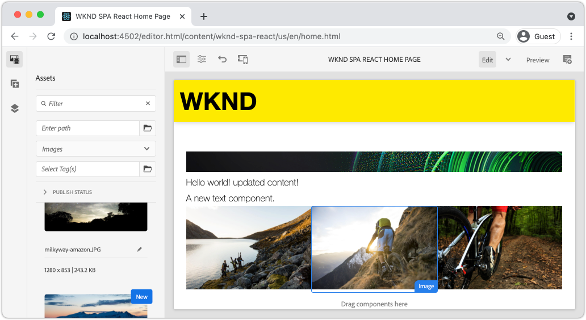

## Prerequisites

Review the required tooling and instructions for setting up a [local development environment](overview.md#local-dev-environment). This chapter is a continuation of the [Integrate the SPA](integrate-spa.md) chapter, however to follow along all you need is a SPA-enabled AEM project.

## Mapping Approach

The basic concept is to map a SPA Component to an AEM Component. AEM components, run server-side, export content as part of the JSON model API. The JSON content is consumed by the SPA, running client-side in the browser. A 1:1 mapping between SPA components and an AEM component is created.

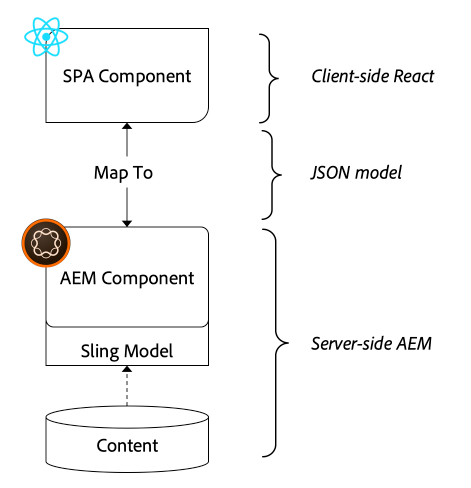

*High-level overview of mapping an AEM Component to a React Component*

## Inspect the Text Component

The [AEM Project Archetype](https://github.com/adobe/aem-project-archetype) provides a `Text` component that is mapped to the AEM [Text component](https://experienceleague.adobe.com/docs/experience-manager-core-components/using/components/text.html). This is an example of a **content** component, in that it renders *content* from AEM.

Let's see how the component works.

### Inspect the JSON model

1. Before jumping into the SPA code, it is important to understand the JSON model that AEM provides. Navigate to the [Core Component Library](https://www.aemcomponents.dev/content/core-components-examples/library/core-content/text.html) and view the page for the Text component. The Core Component Library provides examples of all the AEM Core Components.
1. Select the **JSON** tab for one of the examples:

    

    You should see three properties: `text`, `richText`, and `:type`.

    `:type` is a reserved property that lists the `sling:resourceType` (or path) of the AEM Component. The value of `:type` is what is used to map the AEM component to the SPA component.

    `text` and `richText` are additional properties that will be exposed to the SPA component.

1. View the JSON output at [http://localhost:4502/content/wknd-spa-react/us/en.model.json](http://localhost:4502/content/wknd-spa-react/us/en.model.json). You should be able to find an entry similar to:

    ```json
    "text": {
        "id": "text-a647cec03a",
        "text": "<p>Hello World! Updated content!</p>\r\n",
        "richText": true,
        ":type": "wknd-spa-react/components/text",
        "dataLayer": {}
       }
    ```

### Inspect the Text SPA component

1. In the IDE of your choice open up the AEM Project for the SPA. Expand the `ui.frontend` module and open the file `Text.js` under `ui.frontend/src/components/Text/Text.js`.

1. The first area we will inspect is the `class Text` at ~line 40:

    ```js

    class Text extends Component {

        get richTextContent() {
            return (<div
                    id={extractModelId(this.props.cqPath)}
                    data-rte-editelement
                    dangerouslySetInnerHTML={{__html: DOMPurify.sanitize(this.props.text)}} />
                    );
        }

        get textContent() {
            return <div>{this.props.text}</div>;
        }

        render() {
            return this.props.richText ? this.richTextContent : this.textContent;
        }
    }
    ```

    `Text` is a standard React component. The component uses `this.props.richText` to determine whether the content to render is going to be rich text or plain text. The actual "content" used comes from `this.props.text`.

    To avoid a potential XSS attack, the rich text is escaped via `DOMPurify` before using [dangerouslySetInnerHTML](https://reactjs.org/docs/dom-elements.html#dangerouslysetinnerhtml) to render the content. Recall the `richText` and `text` properties from the JSON model earlier in the exercise.

1. Next take a look at the `TextEditConfig` at ~line 29:

    ```js
    const TextEditConfig = {
    emptyLabel: 'Text',

        isEmpty: function(props) {
            return !props || !props.text || props.text.trim().length < 1;
        }
    };
    ```

    The above code is responsible for determining when to render the placeholder in the AEM author environment. If the `isEmpty` method returns **true** then the placeholder will be rendered.

1. Finally take a look at the `MapTo` call at ~line 62:

    ```js
    export default MapTo('wknd-spa-react/components/text')(Text, TextEditConfig);
    ```

    `MapTo` is provided by the AEM SPA Editor JS SDK (`@adobe/aem-react-editable-components`). The path `wknd-spa-react/components/text` represents the `sling:resourceType` of the AEM component. This path gets matched with the `:type` exposed by the JSON model observed earlier. `MapTo` takes care of parsing the JSON model response and passing the correct values as `props` to the SPA component.

    You can find the AEM `Text` component definition at `ui.apps/src/main/content/jcr_root/apps/wknd-spa-react/components/text`.

## Use React Core Components

[AEM WCM Components - React Core implementation](https://github.com/adobe/aem-react-core-wcm-components-base) and [AEM WCM Components - Spa editor - React Core implementation](https://github.com/adobe/aem-react-core-wcm-components-spa). These are a set of re-usable UI components that map to out of the box AEM components. Most projects can re-use these components as a starting point for their own implementation.

1. In the project code open the file `import-components.js` at `ui.frontend/src/components`.
    This file imports all of the SPA components that map to AEM components. Given the dynamic nature of the SPA Editor implementation, we must explicitly reference any SPA components that are tied to AEM author-able components. This allows an AEM author to choose to use a component wherever they want in the application.
1. The following import statements include SPA components written in the project:

    ```js
    import './Page/Page';
    import './Text/Text';
    import './Container/Container';
    import './ExperienceFragment/ExperienceFragment';
    ```

1. There are several other `imports` from `@adobe/aem-core-components-react-spa` and `@adobe/aem-core-components-react-base`. These are importing the React Core components and making them available in the current project. These are then mapped to project specific AEM components using the `MapTo`, just like with the `Text` component example earlier.

### Update AEM Policies

Policies are a feature of AEM templates gives developers and power-users granular control over which components are available to be used. The React Core Components are included in the SPA Code but need to be enabled via a policy before they can be used in the application.

1. From the AEM Start screen navigate to **Tools** &gt; **Templates** &gt; **[WKND SPA React](http://localhost:4502/libs/wcm/core/content/sites/templates.html/conf/wknd-spa-react)**.

1. Select and open the **SPA Page** template for editing.

1. Select the **Layout Container** and click it's **policy** icon to edit the policy:

    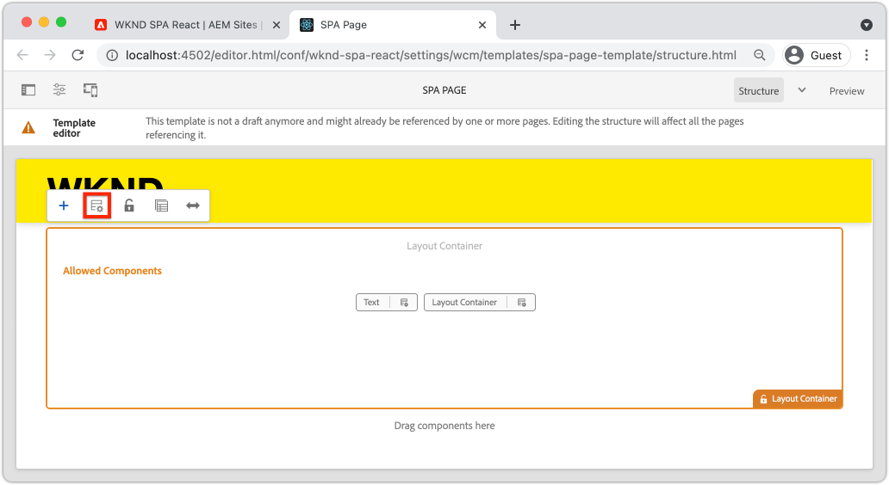

1. Under **Allowed Components** &gt; **WKND SPA React - Content** &gt; check **Image**, **Teaser**, and **Title**.

    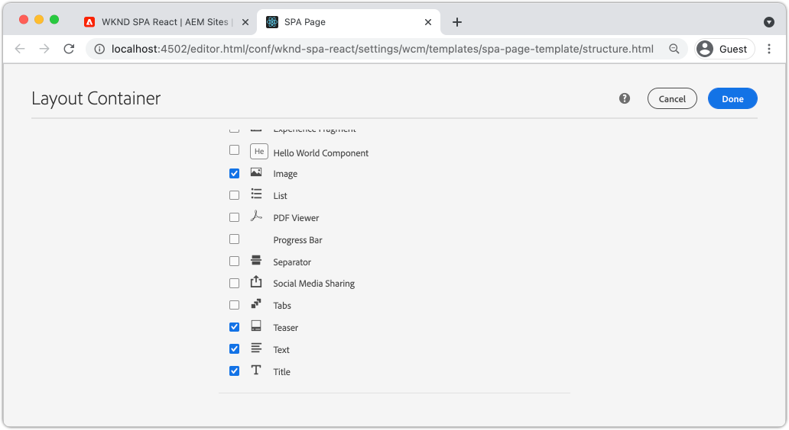

    Under **Default Components** &gt; **Add mapping** and choose the **Image - WKND SPA React - Content** component:

    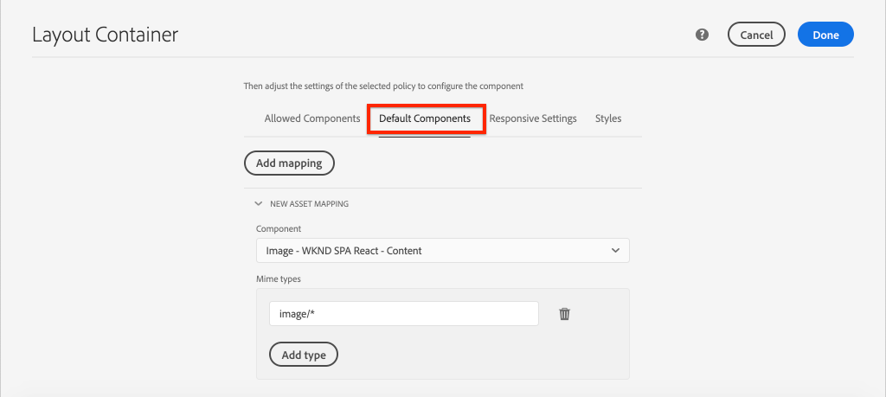

    Enter a **mime type** of `image/*`.

    Click **Done** to save the policy updates.

1. In the **Layout Container** click the **policy** icon for the **Text** component.

    Create a new policy named **WKND SPA Text**. Under **Plugins** &gt; **Formatting** &gt; check all the boxes to enable additional formatting options:

    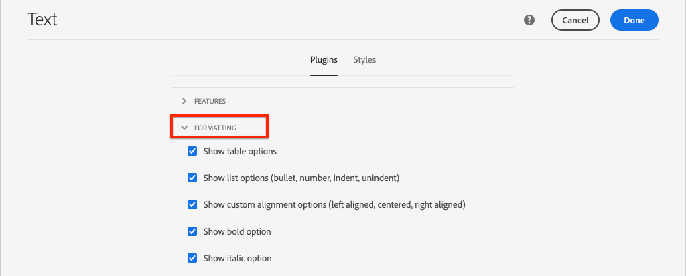

    Under **Plugins** &gt; **Paragraph Styles** &gt; check the box to **Enable paragraph styles**:

    

    Click **Done** to save the policy update.

### Author Content

1. Navigate to the **Homepage** [http://localhost:4502/editor.html/content/wknd-spa-react/us/en/home.html](http://localhost:4502/editor.html/content/wknd-spa-react/us/en/home.html).

1. You should now be able to use the additional components **Image**, **Teaser**, and **Title** on the page.

    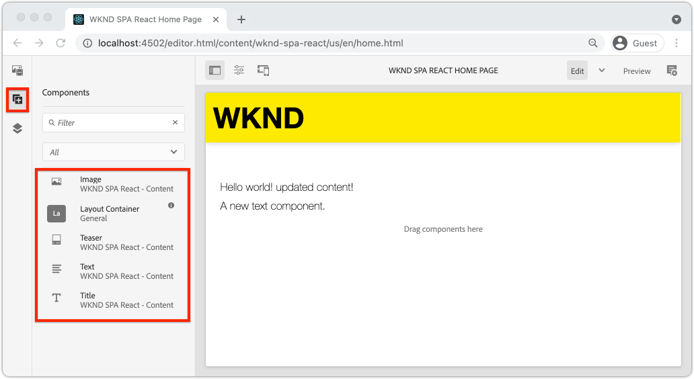

1. You should also be able to edit the `Text` component and add additional paragraph styles in **full-screen** mode.

    

1. You should also be able to drag+drop an image from the **Asset finder**:

    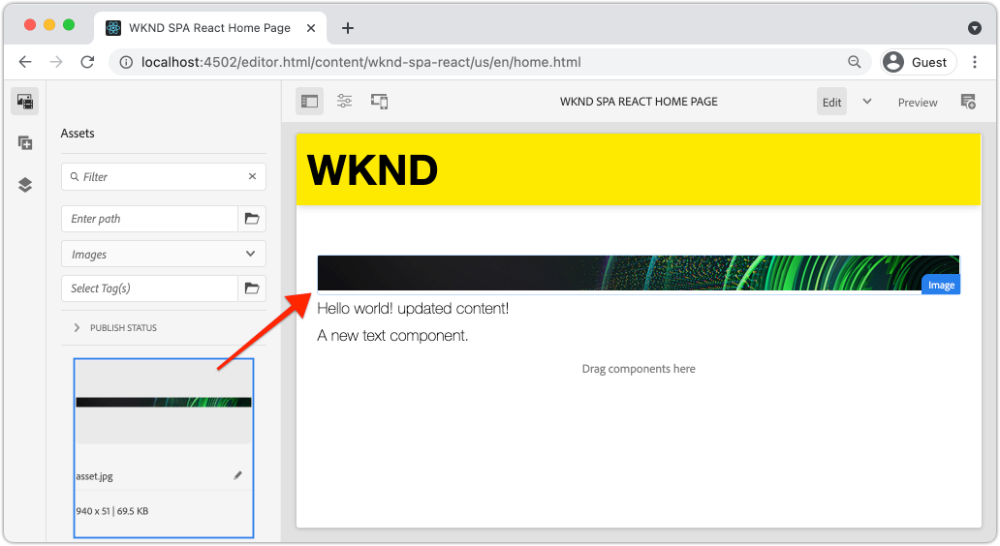

1. Experiement with the **Title** and **Teaser** components.

1. Add your own images via [AEM Assets](http://localhost:4502/assets.html/content/dam) or install the finished code base for the standard [WKND reference site](https://github.com/adobe/aem-guides-wknd/releases/latest). The [WKND reference site](https://github.com/adobe/aem-guides-wknd/releases/latest) includes many images that can be re-used on the WKND SPA. The package can be installed using [AEM's Package Manager](http://localhost:4502/crx/packmgr/index.jsp).

    

## Inspect the Layout Container

Support for the **Layout Container** is automatically provided by the AEM SPA Editor SDK. The **Layout Container**, as indicated by the name, is a **container** component. Container components are components that accept JSON structures which represent *other* components and dynamically instantiate them.

Let's inspect the Layout Container further.

1. In a browser navigate to [http://localhost:4502/content/wknd-spa-react/us/en.model.json](http://localhost:4502/content/wknd-spa-react/us/en.model.json)

    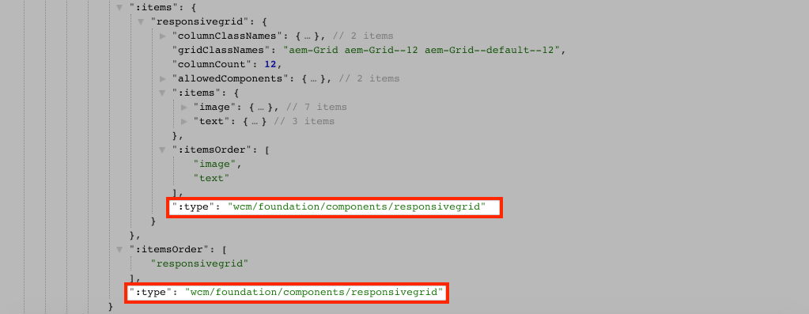

    The **Layout Container** component has a `sling:resourceType` of `wcm/foundation/components/responsivegrid` and is recognized by the SPA Editor using the `:type` property, just like the `Text` and `Image` components.

    The same capabilities of re-sizing a component using [Layout Mode](https://experienceleague.adobe.com/docs/experience-manager-65/authoring/siteandpage/responsive-layout.html#defining-layouts-layout-mode) are available with the SPA Editor.

2. Return to [http://localhost:4502/editor.html/content/wknd-spa-react/us/en/home.html](http://localhost:4502/editor.html/content/wknd-spa-react/us/en/home.html). Add additional **Image** components and try re-sizing them using the **Layout** option:

    

3. Re-open the JSON model [http://localhost:4502/content/wknd-spa-react/us/en.model.json](http://localhost:4502/content/wknd-spa-react/us/en.model.json) and observe the `columnClassNames` as part of the JSON:

    

    The class name `aem-GridColumn--default--4` indicates the component should be 4 columns wide based on a 12 column grid. More details about the [responsive grid can be found here](https://adobe-marketing-cloud.github.io/aem-responsivegrid/).

4. Return to the IDE and in the `ui.apps` module there is a client-side library defined at `ui.apps/src/main/content/jcr_root/apps/wknd-spa-react/clientlibs/clientlib-grid`. Open the file `less/grid.less`.

    This file determines the breakpoints (`default`, `tablet`, and `phone`) used by the **Layout Container**. This file is intended to be customized per project specifications. Currently the breakpoints are set to `1200px` and `768px`.

5. You should be able to use the responsive capabilities and the updated rich text policies of the `Text` component to author a view like the following:

    

## Congratulations! {#congratulations}

Congratulations, you learned how to map SPA components to AEM Components and you used the React Core Components. You also got a chance to explore the responsive capabilities of the **Layout Container**.

### Next Steps {#next-steps}

[Navigation and Routing](navigation-routing.md) - Learn how multiple views in the SPA can be supported by mapping to AEM Pages with the SPA Editor SDK. Dynamic navigation is implemented using React Router and React Core Components.

## (Bonus) Persist configurations to source control {#bonus-configs}

In many cases, especially at the beginning of an AEM project it is valuable to persist configurations, like templates and related content policies, to source control. This ensures that all developers are working against the same set of content and configurations and can ensure additional consistency between environments. Once a project reaches a certain level of maturity, the practice of managing templates can be turned over to a special group of power users.

The next few steps will take place using the Visual Studio Code IDE and [VSCode AEM Sync](https://marketplace.visualstudio.com/items?itemName=yamato-ltd.vscode-aem-sync) but could be doing using any tool and any IDE that you have configured to **pull** or **import** content from a local instance of AEM.

1. In the Visual Studio Code IDE, ensure that you have **VSCode AEM Sync** installed via the Marketplace extension:

   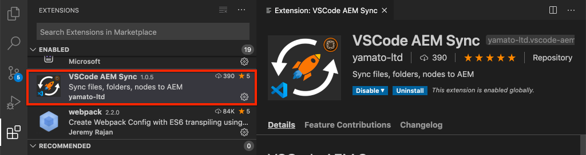

2. Expand the **ui.content** module in the Project explorer and navigate to `/conf/wknd-spa-react/settings/wcm/templates`.

3. **Right+Click** the `templates` folder and select **Import from AEM Server**:

   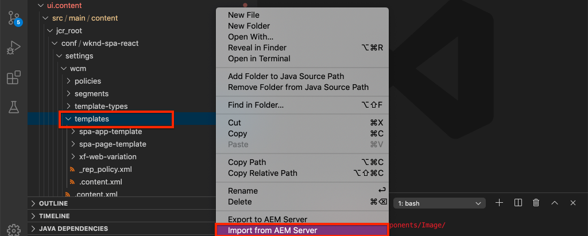

4. Repeat the steps to import content but select the **policies** folder located at `/conf/wknd-spa-react/settings/wcm/templates/policies`.

5. Inspect the `filter.xml` file located at `ui.content/src/main/content/META-INF/vault/filter.xml`.

   ```xml
   <!--ui.content filter.xml-->
   <?xml version="1.0" encoding="UTF-8"?>
    <workspaceFilter version="1.0">
        <filter root="/conf/wknd-spa-react" mode="merge"/>
        <filter root="/content/wknd-spa-react" mode="merge"/>
        <filter root="/content/dam/wknd-spa-react" mode="merge"/>
        <filter root="/content/experience-fragments/wknd-spa-react" mode="merge"/>
    </workspaceFilter>
   ```

   The `filter.xml` file is responsible for identifying the paths of nodes that will be installed with the package. Notice the `mode="merge"` on each of the filters which indicates that existing content will not be modified, only new content is added. Since content authors may be updating these paths, it is important that a code deployment does **not** overwrite content. See the [FileVault documentation](https://jackrabbit.apache.org/filevault/filter.html) for more details on working with filter elements.

   Compare `ui.content/src/main/content/META-INF/vault/filter.xml` and `ui.apps/src/main/content/META-INF/vault/filter.xml` to understand the different nodes managed by each module.

## (Bonus) Create custom Image Component {#bonus-image}

A SPA Image component has already been provided by the React Core components. However, if you want extra practice, create your own React implementation that maps to the AEM [Image component](https://experienceleague.adobe.com/docs/experience-manager-core-components/using/components/image.html). The `Image` component is another example of a **content** component.

### Inspect the JSON

Before jumping into the SPA code, inspect the JSON model provided by AEM.

1. Navigate to the [Image examples in the Core Component library](https://www.aemcomponents.dev/content/core-components-examples/library/core-content/image.html).

    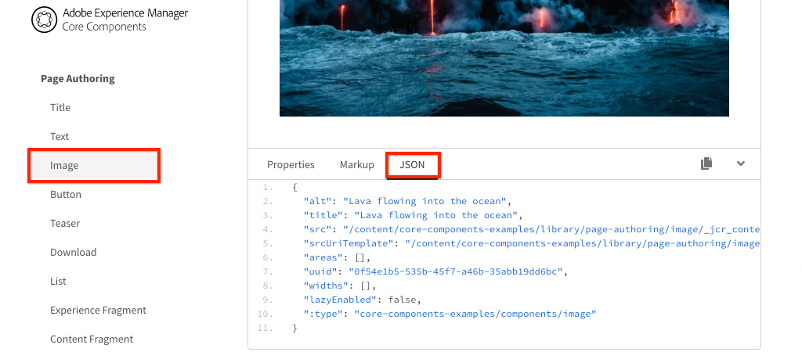

    Properties of `src`, `alt`, and `title` will be used to populate the SPA `Image` component.

    >[!NOTE]
    >
    > There are other Image properties exposed (`lazyEnabled`, `widths`) that allow a developer to create an adaptive and lazy-loading component. The component built in this tutorial will be simple and will **not** use these advanced properties.

### Implement the Image component

1. Next, create a new folder named `Image` under `ui.frontend/src/components`.
1. Beneath the `Image` folder create a new file named `Image.js`.

    

1. Add the following `import` statements to `Image.js`:

    ```js
    import React, {Component} from 'react';
    import {MapTo} from '@adobe/aem-react-editable-components';
    ```

1. Then add the `ImageEditConfig` to determine when to show the placeholder in AEM:

    ```js
    export const ImageEditConfig = {

        emptyLabel: 'Image',

        isEmpty: function(props) {
            return !props || !props.src || props.src.trim().length < 1;
        }
    };
    ```

    The placeholder will show if the `src` property is not set.

1. Next implement the `Image` class:

    ```js
     export default class Image extends Component {

        get content() {
            return ;
        }

        render() {
            if(ImageEditConfig.isEmpty(this.props)) {
                return null;
            }

            return (
                    <div className="Image">
                        {this.content}
                    </div>
            );
        }
    }
    ```

    The above code will render an `` based on the props `src`, `alt`, and `title` passed in by the JSON model.

1. Add the `MapTo` code to map the React component to the AEM component:

    ```js
    MapTo('wknd-spa-react/components/image')(Image, ImageEditConfig);
    ```

    Note the string `wknd-spa-react/components/image` corresponds to the location of the AEM component in `ui.apps` at: `ui.apps/src/main/content/jcr_root/apps/wknd-spa-react/components/image`.

1. Create a new file named `Image.css` in the same directory and add the following:

    ```scss
    .Image-src {
        margin: 1rem 0;
        width: 100%;
        border: 0;
    }
    ```

1. In `Image.js` add a reference to the file at the top beneath the `import` statements:

    ```js
    import React, {Component} from 'react';
    import {MapTo} from '@adobe/aem-react-editable-components';

    require('./Image.css');
    ```

1. Open the file `ui.frontend/src/components/import-components.js` and add a reference to the new `Image` component:

    ```js
    import './Page/Page';
    import './Text/Text';
    import './Container/Container';
    import './ExperienceFragment/ExperienceFragment';
    import './Image/Image'; //add reference to Image component
    ```

1. In `import-components.js` comment out the React Core Component Image:

    ```js
    //MapTo('wknd-spa-react/components/image')(ImageV2, {isEmpty: ImageV2IsEmptyFn});
    ```

    This will ensure that our custom Image component is used instead.

1. From the root of the project deploy the SPA code to AEM using Maven:

    ```shell
    $ cd aem-guides-wknd-spa.react
    $ mvn clean install -PautoInstallSinglePackage
    ```

1. Inspect the SPA in AEM. Any Image components on the page should continue to work. Inspect the rendered output and you should see the markup for our custom Image component instead of the React Core Component.
    
    *Custom Image component markup*
 
    ```html
    <div class="Image">
        
    </div>
    ```

    *React Core Component Image markup*

    ```html
    <div class="cmp-image cq-dd-image">
        
    </div>
    ```

    This is a good introduction to extending and implementing your own components.
