# Add navigation and routing {#navigation-routing}

Learn how multiple views in the SPA can be supported by mapping to AEM Pages with the SPA Editor SDK. Dynamic navigation is implemented using React Router and React Core Components.

## Objective

1. Understand the SPA model routing options available when using the SPA Editor.
1. Learn to use [React Router](https://reacttraining.com/react-router/) to navigate between different views of the SPA.
1. Use AEM React Core Components to implement a dynamic navigation that is driven by the AEM page hierarchy.

## What you will build

This chapter will add navigation to a SPA in AEM. The navigation menu will be driven by the AEM page hierarchy and will make use of the JSON model provided by the [Navigation Core Component](https://experienceleague.adobe.com/docs/experience-manager-core-components/using/components/navigation.html).

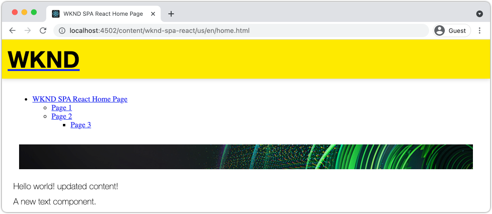

## Prerequisites

Review the required tooling and instructions for setting up a [local development environment](overview.md#local-dev-environment). This chapter is a continuation of the [Map Components](map-components.md) chapter, however to follow along all you need is a SPA-enabled AEM project deployed to a local AEM instance.

## Add the Navigation to the Template {#add-navigation-template}

1. Open a browser and login to AEM, [http://localhost:4502/](http://localhost:4502/). The starting code base should already be deployed.
1. Navigate to the **SPA Page Template**: [http://localhost:4502/editor.html/conf/wknd-spa-react/settings/wcm/templates/spa-page-template/structure.html](http://localhost:4502/editor.html/conf/wknd-spa-react/settings/wcm/templates/spa-page-template/structure.html).
1. Select the outer-most **Root Layout Container** and click its **Policy** icon. Be careful **not** to select the **Layout Container** un-locked for authoring.

    

1. Create a new policy named **SPA Structure**:

    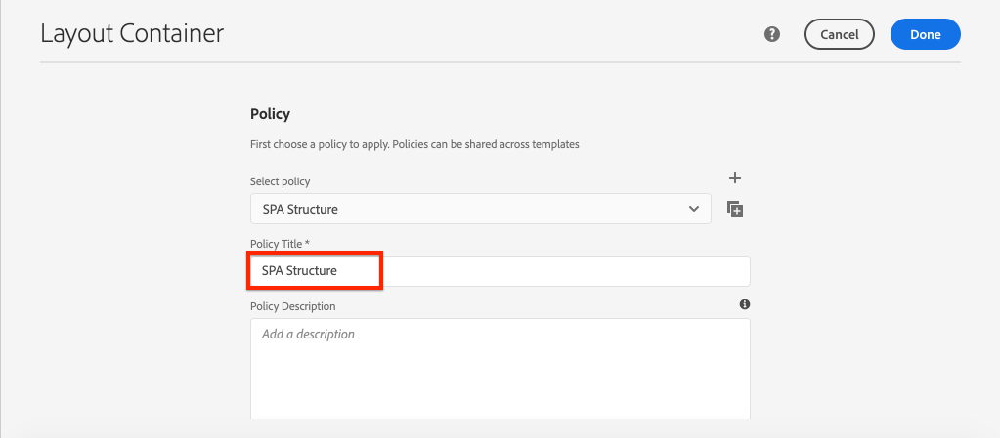

    Under **Allowed Components** &gt; **General** &gt; select the **Layout Container** component.

    Under **Allowed Components** &gt; **WKND SPA REACT - STRUCTURE** &gt; select the **Navigation** component:

    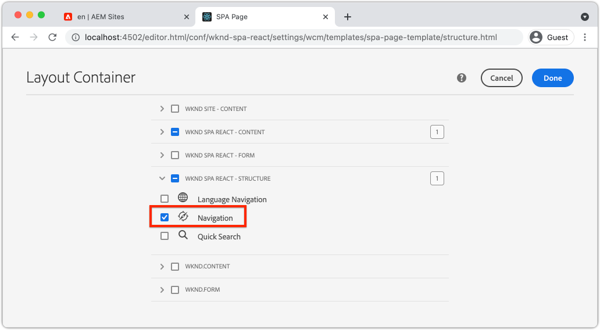

    Under **Allowed Components** &gt; **WKND SPA REACT - Content** &gt; select the **Image** and **Text** components. You should have 4 total components selected.

    Click **Done** to save the changes.

1. Refresh the page, and add the **Navigation** component above the un-locked **Layout Container**:

   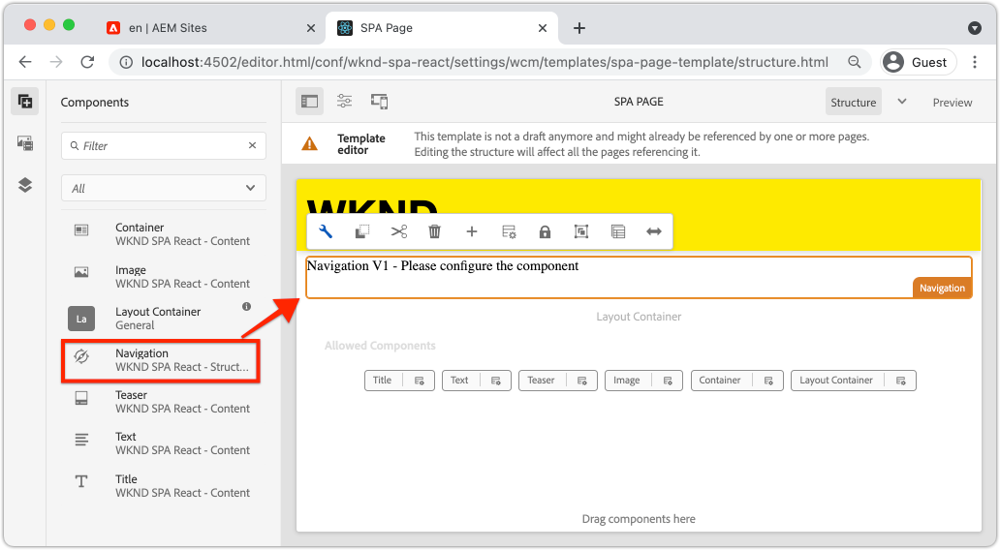

1. Select the **Navigation** component and click its **Policy** icon to edit the policy.
1. Create a new policy with a **Policy Title** of **SPA Navigation**.

   Under the **Properties**:

   * Set the **Navigation Root** to `/content/wknd-spa-react/us/en`.
   * Set the **Exclude Root Levels** to **1**.
   * Uncheck **Collect all child pages**.
   * Set the **Navigation Structure Depth** to **3**.

   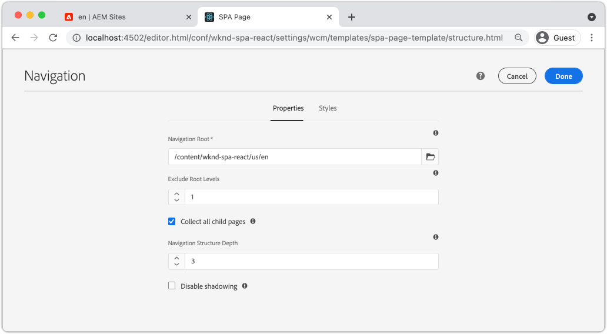

   This will collect the navigation 2 levels deep beneath `/content/wknd-spa-react/us/en`.

1. After saving your changes you should see the populated `Navigation` as part of the template:

   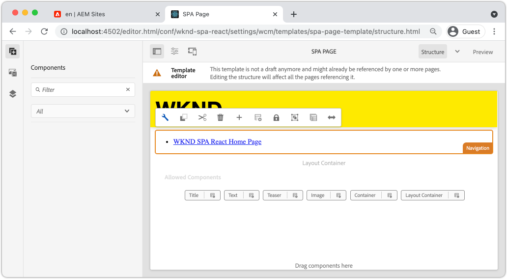

## Create Child Pages

Next, create additional pages in AEM that will serve as the different views in the SPA. We will also inspect the hierarchical structure of the JSON model provided by AEM.

1. Navigate to the **Sites** console: [http://localhost:4502/sites.html/content/wknd-spa-react/us/en/home](http://localhost:4502/sites.html/content/wknd-spa-react/us/en/home). Select the **WKND SPA React Home Page** and click **Create** &gt; **Page**:

   

1. Under **Template** select **SPA Page**. Under **Properties** enter **Page 1** for the **Title** and **page-1** as the name.

   

   Click **Create** and in the dialog pop-up, click **Open** to open the page in the AEM SPA Editor.

1. Add a new **Text** component to the main **Layout Container**. Edit the component and enter the text: **Page 1** using the RTE and the **H2** element.

   

   Feel free to add additional content, like an image.

1. Return to the AEM Sites console and repeat the above steps, creating a second page named **Page 2** as a sibling of **Page 1**.
1. Lastly create a third page, **Page 3** but as a **child** of **Page 2**. Once completed the site hierarchy should look like the following:

   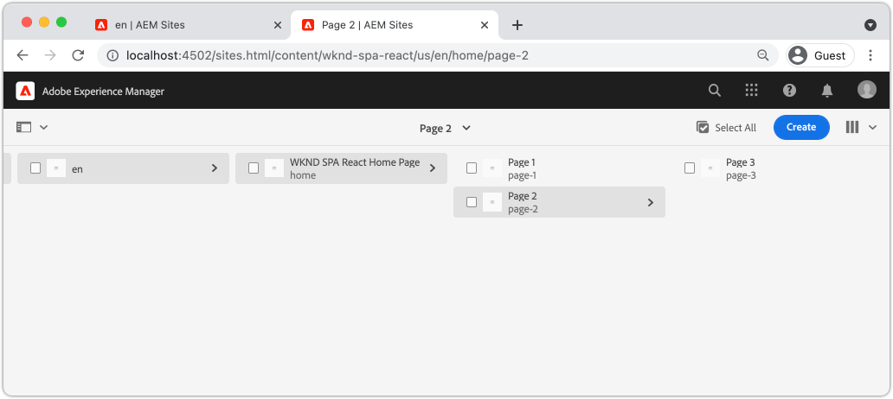

1. The Navigation component can now be used to navigate to different areas of the SPA.

    

1. Open the page outside of the AEM Editor: [http://localhost:4502/content/wknd-spa-react/us/en/home.html](http://localhost:4502/content/wknd-spa-react/us/en/home.html). Use the **Navigation** component to navigate to different views of the app.

1. Use your browser's developer tools to inspect the network requests, as you navigate. Screenshots below are captured from Google Chrome browser.

   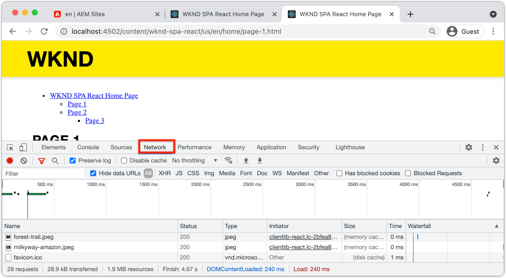

    Observe that after the initial page load, subsequent navigation does not cause a full page refresh and that network traffic is minimized when returning to previously visited pages.

## Hierarchy Page JSON Model {#hierarchy-page-json-model}

Next, inspect the JSON Model that drives the multi-view experience of the SPA.

1. In a new tab, open the JSON model API provided by AEM: [http://localhost:4502/content/wknd-spa-react/us/en.model.json](http://localhost:4502/content/wknd-spa-react/us/en.model.json). It may be helpful to use a browser extension to [format the JSON](https://chrome.google.com/webstore/detail/json-formatter/bcjindcccaagfpapjjmafapmmgkkhgoa).

    This JSON content is requested when the SPA is first loaded. The outer structure looks like the following:

    ```json
    {
    "language": "en",
    "title": "en",
    "templateName": "spa-app-template",
    "designPath": "/libs/settings/wcm/designs/default",
    "cssClassNames": "spa page basicpage",
    ":type": "wknd-spa-react/components/spa",
    ":items": {},
    ":itemsOrder": [],
    ":hierarchyType": "page",
    ":path": "/content/wknd-spa-react/us/en",
    ":children": {
       "/content/wknd-spa-react/us/en/home": {},
       "/content/wknd-spa-react/us/en/home/page-1": {},
       "/content/wknd-spa-react/us/en/home/page-2": {},
       "/content/wknd-spa-react/us/en/home/page-2/page-3": {}
       }
    }
    ```

    Under `:children` you should see an entry for each of the pages created. The content for all of the pages is in this initial JSON request. With the navigation routing, subsequent views of the SPA will be loaded rapidly, since the content is already available client-side.

    It is not wise to load **ALL** of the content of a SPA in the initial JSON request, as this would slow down the initial page load. Next, lets look at how the hierarchy depth of pages are collected.

1. Navigate to the **SPA Root** template at: [http://localhost:4502/editor.html/conf/wknd-spa-react/settings/wcm/templates/spa-app-template/structure.html](http://localhost:4502/editor.html/conf/wknd-spa-react/settings/wcm/templates/spa-app-template/structure.html).

    Click the **Page properties menu** &gt; **Page Policy**:

    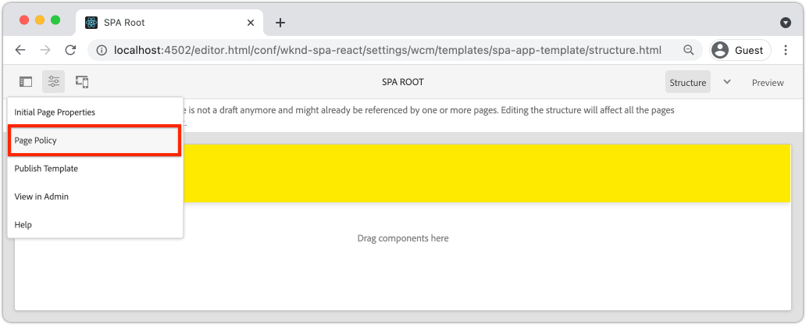

1. The **SPA Root** template has an extra **Hierarchical Structure** tab to control the JSON content collected. The **Structure Depth** determines how deep in the site hierarchy to collect child pages beneath the **root**. You can also use the **Structure Patterns** field to filter out additional pages based on a regular expression.

    Update the **Structure Depth** to **2**:

    

    Click **Done** to save the changes to the policy.

1. Re-open the JSON model [http://localhost:4502/content/wknd-spa-react/us/en.model.json](http://localhost:4502/content/wknd-spa-react/us/en.model.json).

    ```json
    {
    "language": "en",
    "title": "en",
    "templateName": "spa-app-template",
    "designPath": "/libs/settings/wcm/designs/default",
    "cssClassNames": "spa page basicpage",
    ":type": "wknd-spa-react/components/spa",
    ":items": {},
    ":itemsOrder": [],
    ":hierarchyType": "page",
    ":path": "/content/wknd-spa-react/us/en",
    ":children": {
       "/content/wknd-spa-react/us/en/home": {},
       "/content/wknd-spa-react/us/en/home/page-1": {},
       "/content/wknd-spa-react/us/en/home/page-2": {}
       }
    }
    ```

    Notice that the **Page 3** path has been removed: `/content/wknd-spa-react/us/en/home/page-2/page-3` from the initial JSON model. This is because **Page 3** is at a level 3 in the hierarchy and we updated the policy to only include content at a max depth of level 2.

1. Re-open the SPA homepage: [http://localhost:4502/content/wknd-spa-react/us/en/home.html](http://localhost:4502/content/wknd-spa-react/us/en/home.html) and open your browser's developer tools.

    Refresh the page and you should see the XHR request to `/content/wknd-spa-react/us/en.model.json`, which is the SPA Root. Notice that only three child pages are included based on the hierarchy depth configuration to the SPA Root template made earlier in the tutorial. This does not include **Page 3**.

    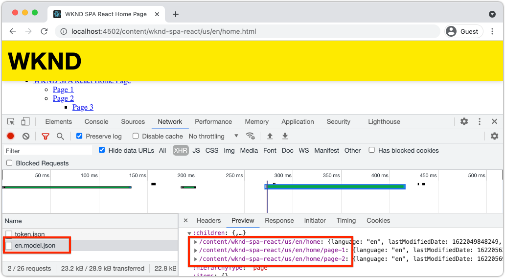

1. With the developer tools open, use the `Navigation` component to navigate directly to **Page 3**:

   Observe that a new XHR request is made to: `/content/wknd-spa-react/us/en/home/page-2/page-3.model.json`

   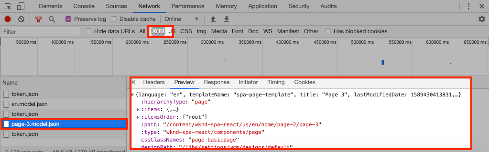

   The AEM Model Manager understands that the **Page 3** JSON content is not available and automatically triggers the additional XHR request.

1. Experiment with deep links by navigating directly to: [http://localhost:4502/content/wknd-spa-react/us/en/home/page-2.html](http://localhost:4502/content/wknd-spa-react/us/en/home/page-2.html). Also observe that the browser's back button continues to work.

## Inspect React Routing  {#react-routing}

The navigation and routing is implemented with [React Router](https://reactrouter.com/). React Router is a collection of navigation components for React applications. [AEM React Core Components](https://github.com/adobe/aem-react-core-wcm-components-base) uses features of React Router to implement the **Navigation** component used in the previous steps.

Next, inspect how React Router is integrated with the SPA and experiment using React Router's [Link](https://reactrouter.com/web/api/Link) component.

1. In the IDE open the file `index.js` at `ui.frontend/src/index.js`.

   ```js
   /* index.js */
   import { Router } from 'react-router-dom';
   ...
   ...
    ModelManager.initialize().then(pageModel => {
       const history = createBrowserHistory();
       render(
       <Router history={history}>
           <App
           history={history}
           cqChildren={pageModel[Constants.CHILDREN_PROP]}
           cqItems={pageModel[Constants.ITEMS_PROP]}
           cqItemsOrder={pageModel[Constants.ITEMS_ORDER_PROP]}
           cqPath={pageModel[Constants.PATH_PROP]}
           locationPathname={window.location.pathname}
           />
       </Router>,
       document.getElementById('spa-root')
       );
   });
   ```

   Notice that the `App` is wrapped in the `Router` component from [React Router](https://reacttraining.com/react-router/). The `ModelManager`, provided by the AEM SPA Editor JS SDK, adds the dynamic routes to AEM Pages based on the JSON model API.

1. Open the file `Page.js` at `ui.frontend/src/components/Page/Page.js`

    ```js
    class AppPage extends Page {
      get containerProps() {
        let attrs = super.containerProps;
        attrs.className =
          (attrs.className || '') + ' page ' + (this.props.cssClassNames || '');
        return attrs;
      }
    }

    export default MapTo('wknd-spa-react/components/page')(
      withComponentMappingContext(withRoute(AppPage))
    );
    ```

    The `Page` SPA component uses the `MapTo` function to map **Pages** in AEM to a corresponding SPA component. The `withRoute` utility helps to dynamically route the SPA to the appropriate AEM Child page based on the `cqPath` property.

1. Open the `Header.js` component at `ui.frontend/src/components/Header/Header.js`.
1. Update the `Header` to wrap the `<h1>` tag in a [Link](https://reactrouter.com/web/api/Link) to the homepage:

    ```diff
      //Header.js
      import React, {Component} from 'react';
    + import {Link} from 'react-router-dom';
      require('./Header.css');

    export default class Header extends Component {

        render() {
            return (
                <header className="Header">
                <div className="Header-container">
    +              <Link to="/content/wknd-spa-react/us/en/home.html">
                        <h1>WKND</h1>
    +              </Link>
                </div>
                </header>
            );
        }
    ```

    Instead of using a default `<a>` anchor tag we use `<Link>` provided by React Router. As long as the `to=` points to a valid route, the SPA will switch to that route and **not** perform a full page refresh. Here we simply hard-code the link to the home page to illustrate the use of `Link`.

1. Update the test at `App.test.js` at `ui.frontend/src/App.test.js`.

    ```diff
    + import { BrowserRouter as Router } from 'react-router-dom';
      import App from './App';

      it('renders without crashing', () => {
        const div = document.createElement('div');
    -   ReactDOM.render(<App />, div);
    +   ReactDOM.render(<Router><App /></Router>, div);
      });
    ```

    Since we are using features of React Router within a static component referenced in `App.js` we need to update the unit test to account for it.

1. Open a terminal, navigate to the root of the project, and deploy the project to AEM using your Maven skills:

    ```shell
    $ cd aem-guides-wknd-spa.react
    $ mvn clean install -PautoInstallSinglePackage
    ```

1. Navigate to one of the pages in the SPA in AEM: [http://localhost:4502/content/wknd-spa-react/us/en/home/page-1.html](http://localhost:4502/content/wknd-spa-react/us/en/home/page-1.html)

    Instead of using the `Navigation` component to navigate, use the link in the `Header`.

    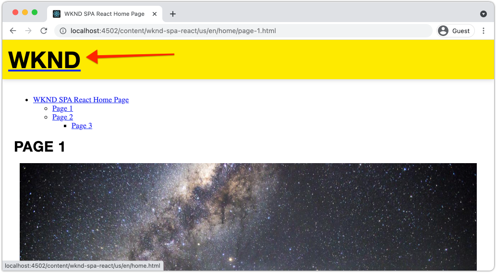

    Observe that a full page refresh is **not** triggered and that the SPA routing is working.

1. Optionally, experiment with the `Header.js` file using a standard `<a>` anchor tag:

    ```js
    <a href="/content/wknd-spa-react/us/en/home.html">
        <h1>WKND</h1>
    </a>
    ```

    This can help illustrate the difference between SPA routing and regular web page links.

## Congratulations! {#congratulations}

Congratulations, you learned how multiple views in the SPA can be supported by mapping to AEM Pages with the SPA Editor SDK. Dynamic navigation has been implemented using React Router and added to the `Header` component.
