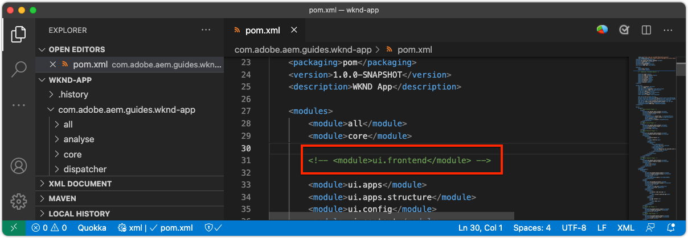
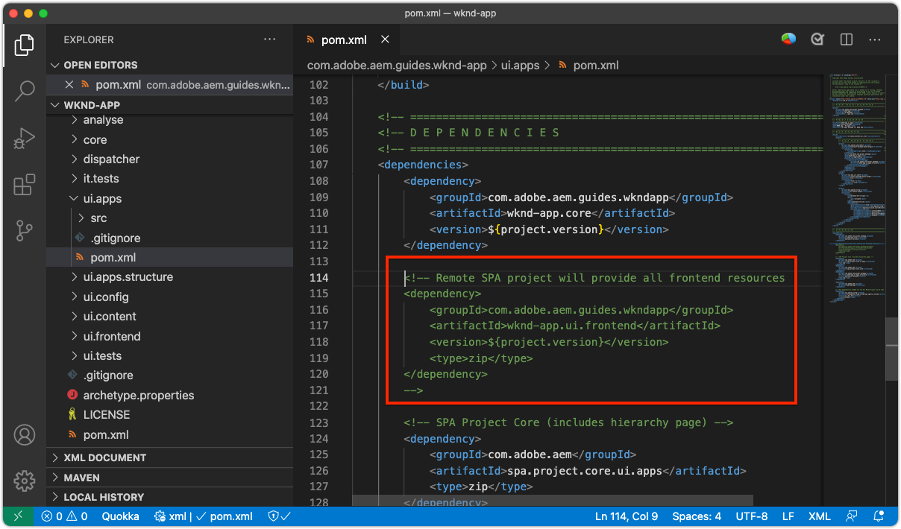
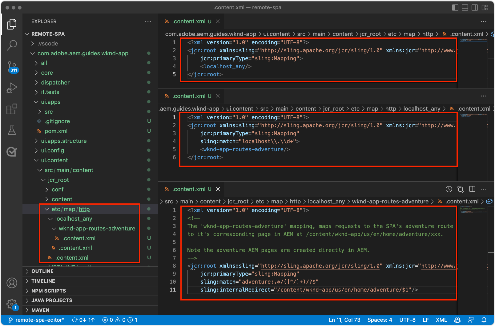
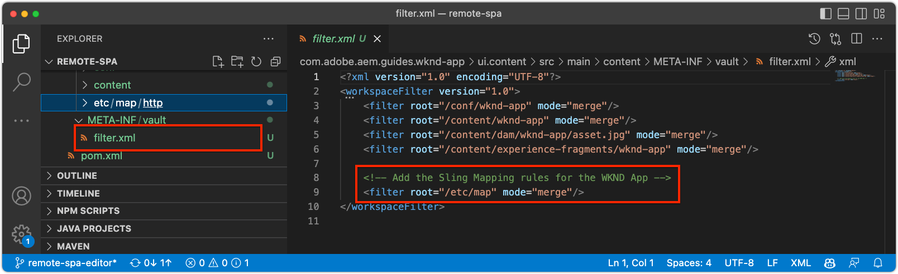
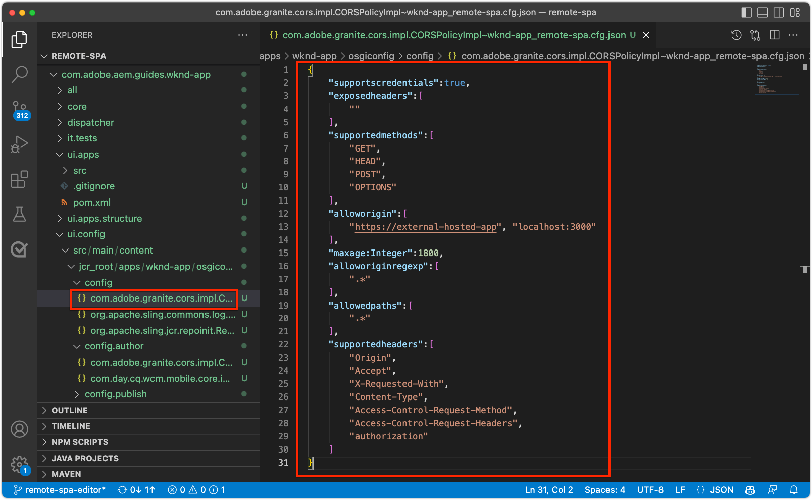
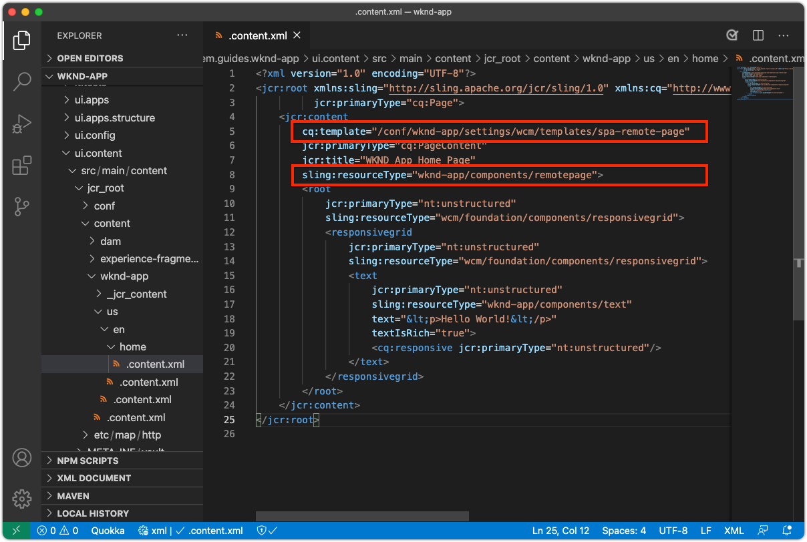
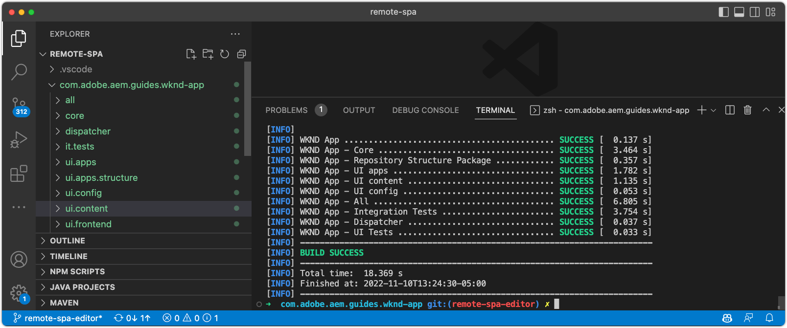
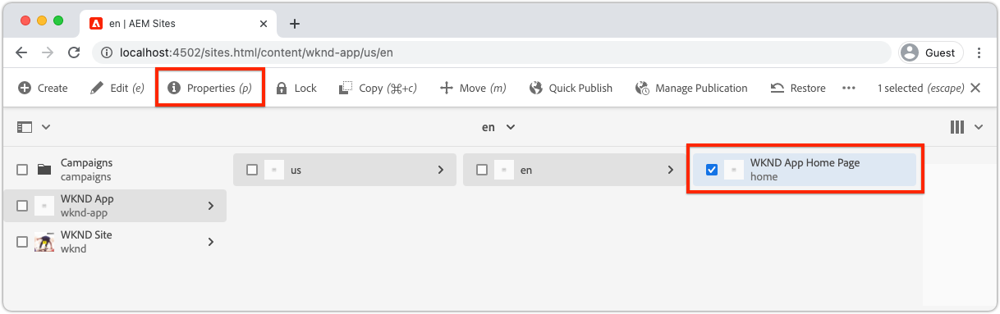
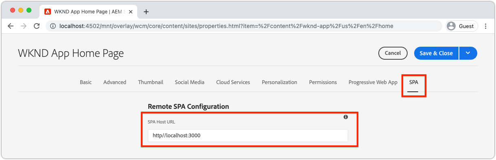

# Configure AEM for SPA Editor

While the SPA codebase is managed outside of AEM, an AEM project is required to setup supporting configuration and content requirements. This chapter walks through the creation of an AEM project that contains necessary configurations:

+ AEM WCM Core Components proxies
+ AEM Remote SPA Page proxy
+ AEM Remote SPA Page Templates
+ Baseline Remote SPA AEM pages
+ Subproject to define SPA to AEM URL mappings
+ OSGi configuration folders

## Create an AEM project

Create an AEM project in which configurations and baseline content are managed.

_Always use the latest version of the [AEM Archetype](https://github.com/adobe/aem-project-archetype)._


```
$ mkdir -p ~/Code/wknd-app
$ cd ~/Code/wknd-app
$ mvn -B archetype:generate \
 -D archetypeGroupId=com.adobe.aem \
 -D archetypeArtifactId=aem-project-archetype \
 -D archetypeVersion=27 \
 -D aemVersion=cloud \
 -D appTitle="WKND App" \
 -D appId="wknd-app" \
 -D groupId="com.adobe.aem.guides.wkndapp" \
 -D frontendModule="react"
$ mv ~/Code/wknd-app/wknd-app ~/Code/wknd-app/com.adobe.aem.guides.wknd-app
```

_The last command simply renames the AEM project folder so it is clear it's the AEM project, and not to be confused with Remote SPA__

While `frontendModule="react"` is specified, the `ui.frontend` project is not used for the Remote SPA use case. The SPA is developed and managed externally to AEM and only uses AEM as a content API. The `frontendModule="react"` flag is required for the project include the  `spa-project` AEM Java&trade; dependencies and set up the Remote SPA Page Templates.

The AEM Project Archetype generates the following elements that used to configure AEM for integration with the SPA.

+ __AEM WCM Core Components proxies__ at `ui.apps/src/.../apps/wknd-app/components`
+ __AEM SPA Remote Page proxy__ at `ui.apps/src/.../apps/wknd-app/components/remotepage`
+ __AEM Page Templates__ at `ui.content/src/.../conf/wknd-app/settings/wcm/templates`
+ __Subproject to define content mappings__ at `ui.content/src/...`
+ __Baseline Remote SPA AEM pages__ at `ui.content/src/.../content/wknd-app`
+ __OSGi configuration folders__ at `ui.config/src/.../apps/wknd-app/osgiconfig`

With the base AEM project is generated, a few adjustments ensure SPA Editor compatibility with Remote SPAs.

## Remove ui.frontend project

Since the SPA is a Remote SPA, assume it's developed and managed outside of the AEM project. To avoid conflicts, remove the `ui.frontend` project from deploying. If the `ui.frontend` project is not removed, two SPAs, the default SPA provided in the `ui.frontend` project and the Remote SPA, is loaded at the same time in the AEM SPA Editor.

1. Open the AEM project (`~/Code/wknd-app/com.adobe.aem.guides.wknd-app`) in your IDE
1. Open the root `pom.xml`
1. Comment the `<module>ui.frontend</module` out from the `<modules>` list

    ```
    <modules>
        <module>all</module>
        <module>core</module>
        
        <!-- <module>ui.frontend</module> -->

        <module>ui.apps</module>
        <module>ui.apps.structure</module>
        <module>ui.config</module>
        <module>ui.content</module>
        <module>it.tests</module>
        <module>dispatcher</module>
        <module>ui.tests</module>
        <module>analyse</module>
    </modules>
    ```

    The `pom.xml` file should look like:

    

1. Open the `ui.apps/pom.xml`
1. Comment out the `<dependency>` on `<artifactId>wknd-app.ui.frontend</artifactId>`

    ```
    <dependencies>

        <!-- Remote SPA project will provide all frontend resources
        <dependency>
            <groupId>com.adobe.aem.guides.wkndapp</groupId>
            <artifactId>wknd-app.ui.frontend</artifactId>
            <version>${project.version}</version>
            <type>zip</type>
        </dependency>
        --> 
    </dependencies>
    ```

    The `ui.apps/pom.xml` file should look like:

    

If the AEM project was built before these changes, manually delete the `ui.frontend` generated Client Library from the `ui.apps` project at `ui.apps/src/main/content/jcr_root/apps/wknd-app/clientlibs/clientlib-react`.

## AEM content mapping

For AEM to load the Remote SPA in the SPA Editor, mappings between the SPA's routes and the AEM Pages used to open and author content must be established.

The importance of this configuration is explored later.

The mapping can be done with [Sling Mapping](https://sling.apache.org/documentation/the-sling-engine/mappings-for-resource-resolution.html#root-level-mappings-1) defined in `/etc/map`.

1. In the IDE, open the `ui.content` subproject
1. Navigate to  `src/main/content/jcr_root`
1. Create a folder `etc`
1. In `etc`, create a folder `map`
1. In `map`, create a folder `http`
1. In `http`, create a file `.content.xml` with the contents:

    ```
    <?xml version="1.0" encoding="UTF-8"?>
    <jcr:root xmlns:sling="http://sling.apache.org/jcr/sling/1.0" xmlns:jcr="http://www.jcp.org/jcr/1.0"
        jcr:primaryType="sling:Mapping">
        <localhost_any/>
    </jcr:root>
    ```

1. In `http` , create a folder `localhost_any`
1. In `localhost_any`, create a file `.content.xml` with the contents:

    ```
    <?xml version="1.0" encoding="UTF-8"?>
    <jcr:root xmlns:sling="http://sling.apache.org/jcr/sling/1.0" xmlns:jcr="http://www.jcp.org/jcr/1.0"
        jcr:primaryType="sling:Mapping"
        sling:match="localhost\\.\\d+">
        <wknd-app-routes-adventure/>
    </jcr:root>
    ```

1. In `localhost_any` , create a folder `wknd-app-routes-adventure`
1. In `wknd-app-routes-adventure`, create a file `.content.xml` with the contents:

    ```
    <?xml version="1.0" encoding="UTF-8"?>

    <!--
    The 'wknd-app-routes-adventure' mapping, maps requests to the SPA's adventure route 
    to it's corresponding page in AEM at /content/wknd-app/us/en/home/adventure/xxx.

    Note the adventure AEM pages are created directly in AEM.
    -->

    <jcr:root xmlns:sling="http://sling.apache.org/jcr/sling/1.0" xmlns:jcr="http://www.jcp.org/jcr/1.0"
        jcr:primaryType="sling:Mapping"
        sling:match="adventure:.*/([^/]+)/?$"
        sling:internalRedirect="/content/wknd-app/us/en/home/adventure/$1"/>
    ```    

1. Add the mapping nodes to `ui.content/src/main/content/META-INF/vault/filter.xml` to they included in the AEM package.

    ```
    <?xml version="1.0" encoding="UTF-8"?>
    <workspaceFilter version="1.0">
        <filter root="/conf/wknd-app" mode="merge"/>
        <filter root="/content/wknd-app" mode="merge"/>
        <filter root="/content/dam/wknd-app/asset.jpg" mode="merge"/>
        <filter root="/content/experience-fragments/wknd-app" mode="merge"/>

        <!-- Add the Sling Mapping rules for the WKND App -->
        <filter root="/etc/map" mode="merge"/>
    </workspaceFilter>
    ```

The folder structure and `.context.xml` files should look like:



The `filter.xml` file should look like:



Now, when the AEM project is deployed, these configurations are automatically included.

The Sling Mapping effects AEM running on `http` and `localhost`, so only support local development. When deploying to AEM as a Cloud Service, similar Sling Mappings must be added that target `https` and the appropriate AEM as a Cloud Service domain/s. For more information, see the [Sling Mapping documentation](https://sling.apache.org/documentation/the-sling-engine/mappings-for-resource-resolution.html).

## Cross-Origin Resource Sharing security policies

Next, configure AEM to protect the content so only this SPA can access the AEM content. Configure [Cross-Origin Resource Sharing in AEM](https://experienceleague.adobe.com/docs/experience-manager-learn/foundation/security/develop-for-cross-origin-resource-sharing.html).

1. In your IDE, open the `ui.config` Maven subproject
1. Navigate `src/main/content/jcr_root/apps/wknd-app/osgiconfig/config`
1. Create a file named `com.adobe.granite.cors.impl.CORSPolicyImpl~wknd-app_remote-spa.cfg.json`
1. Add the following to the file:

    ```
    {
        "supportscredentials":true,
        "exposedheaders":[
            ""
        ],
        "supportedmethods":[
            "GET",
            "HEAD",
            "POST",
            "OPTIONS"
        ],
        "alloworigin":[
            "https://external-hosted-app", "localhost:3000"
        ],
        "maxage:Integer":1800,
        "alloworiginregexp":[
            ".*"
        ],
        "allowedpaths":[
            ".*"
        ],
        "supportedheaders":[
            "Origin",
            "Accept",
            "X-Requested-With",
            "Content-Type",
            "Access-Control-Request-Method",
            "Access-Control-Request-Headers",
            "authorization"
        ]
    }
    ```

The `com.adobe.granite.cors.impl.CORSPolicyImpl~wknd-app_remote-spa.cfg.json` file should look like:



The key configuration elements are: 

+ `alloworigin` specifies which hosts are allowed to retrieve content from AEM.
  + `localhost:3000` is added to support the SPA running locally
  +  `https://external-hosted-app` acts as a placeholder to be replaced with the domain that Remote SPA is hosted on.
+ `allowedpaths` specify which paths in AEM are covered by this CORS configuration. The default allows access to all content in AEM, however this can be scoped to only the specific paths the SPA can access, for example: `/content/wknd-app`.    

## Set AEM Page as Remote SPA Page Template 

The AEM Project Archetype generates a project primed for AEM's integration with a Remote SPA, but requires a small, but important adjustment to auto-generated AEM page structure. The auto-generated AEM page must have its type changed to __Remote SPA page__, rather than a __SPA page__.

1. In your IDE, open the `ui.content` subproject
1. Open to `src/main/content/jcr_root/content/wknd-app/us/en/home/.content.xml`
1. Update this `.content.xml` file with:

    ```
    <?xml version="1.0" encoding="UTF-8"?>
    <jcr:root xmlns:sling="http://sling.apache.org/jcr/sling/1.0" xmlns:cq="http://www.day.com/jcr/cq/1.0" xmlns:jcr="http://www.jcp.org/jcr/1.0" xmlns:nt="http://www.jcp.org/jcr/nt/1.0"
            jcr:primaryType="cq:Page">
        <jcr:content
            cq:template="/conf/wknd-app/settings/wcm/templates/spa-remote-page"
            jcr:primaryType="cq:PageContent"
            jcr:title="WKND App Home Page"
            sling:resourceType="wknd-app/components/remotepage">
            <root
                jcr:primaryType="nt:unstructured"
                sling:resourceType="wcm/foundation/components/responsivegrid">
                <responsivegrid
                    jcr:primaryType="nt:unstructured"
                    sling:resourceType="wcm/foundation/components/responsivegrid">
                    <text
                        jcr:primaryType="nt:unstructured"
                        sling:resourceType="wknd-app/components/text"
                        text="&lt;p>Hello World!&lt;/p>"
                        textIsRich="true">
                        <cq:responsive jcr:primaryType="nt:unstructured"/>
                    </text>
                </responsivegrid>
            </root>
        </jcr:content>
    </jcr:root>
    ```

The key changes are updates to the `jcr:content` node's:

+ `cq:template` to `/conf/wknd-app/settings/wcm/templates/spa-remote-page`
+ `sling:resourceType` to `wknd-app/components/remotepage`

The `src/main/content/jcr_root/content/wknd-app/us/en/home/.content.xml` file should look like:



These changes allow this page, which acts are the SPA's root in AEM, to load the Remote SPA in SPA Editor.

>[!NOTE]
>
>If this project was previously deployed to AEM, make sure to delete the AEM page as __Sites > WKND App > us > en > WKND App Home Page__, as the `ui.content`  project is set to __merge__ nodes, rather than __update__.

This page could also be removed and re-created as a Remote SPA Page in AEM itself, however since this page is auto-created in the `ui.content` project it is best to update it in the code base.

## Deploy the AEM Project to AEM SDK

1. Ensure that AEM Author service is running on port 4502
1. From the command line, navigate to the root of the AEM Maven project
1. Use Maven to deploy the project to your local AEM SDK Author service

    ```
    $ mvn clean install -PautoInstallSinglePackage
    ```

    

## Configure the root AEM page

With the AEM Project deployed, there is one last step to prepare SPA Editor to load our Remote SPA. In AEM, mark the AEM page that corresponds to the SPA's root,`/content/wknd-app/us/en/home`, generated by the AEM Project Archetype.

1. Log in to AEM Author
1. Navigate to __Sites > WKND App > us > en__
1. Select the __WKND App Home Page__, and tap __Properties__

    

1. Navigate to the __SPA__ tab
1. Fill out the __Remote SPA Configuration__
    + __SPA Host URL__: `http://localhost:3000`
       + The URL to the root of the Remote SPA

    

1. Tap __Save & Close__         

Remember that we changed this page's type to that of a __Remote SPA Page__, which is what allows us to see the __SPA__ tab in its __Page Properties__.

This configuration only must be set on the AEM page that corresponds to the root of the SPA. All AEM pages beneath this page inherit the value.

## Congratulations

You've now prepared AEM's configurations and deployed them to your local AEM author! You now know how to:

+ Remove the AEM Project Archetype-generated SPA, by commenting out the dependencies in `ui.frontend`
+ Add Sling Mappings to AEM that map the SPA routes to resources in AEM
+ Set up AEM's Cross-Origin Resource Sharing security policies that allow the Remote SPA to consume content from AEM
+ Deploy the AEM project to your local AEM SDK Author service
+ Mark an AEM Page as the Remote SPA's root using the SPA Host URL page property

## Next Steps

With AEM configured, we can focus on [bootstrapping the Remote SPA](./spa-bootstrap.md) with support for editable areas using AEM SPA Editor!
