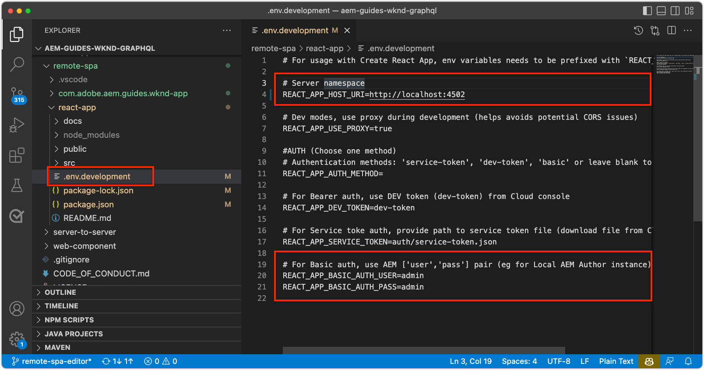
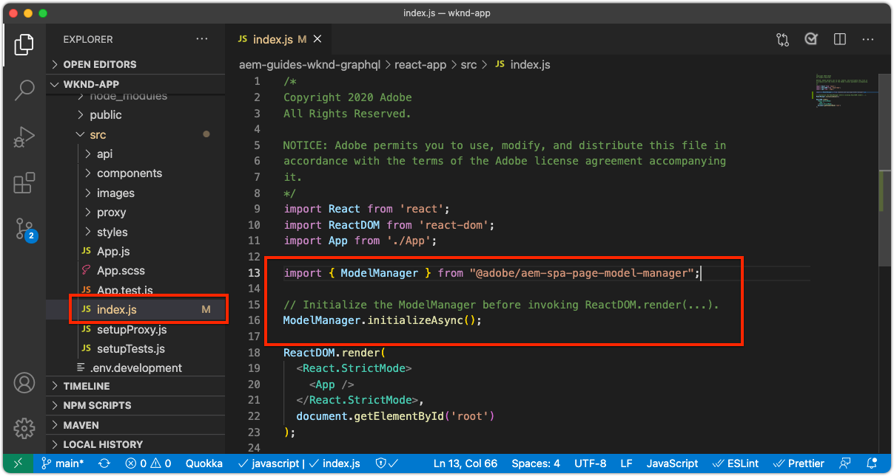
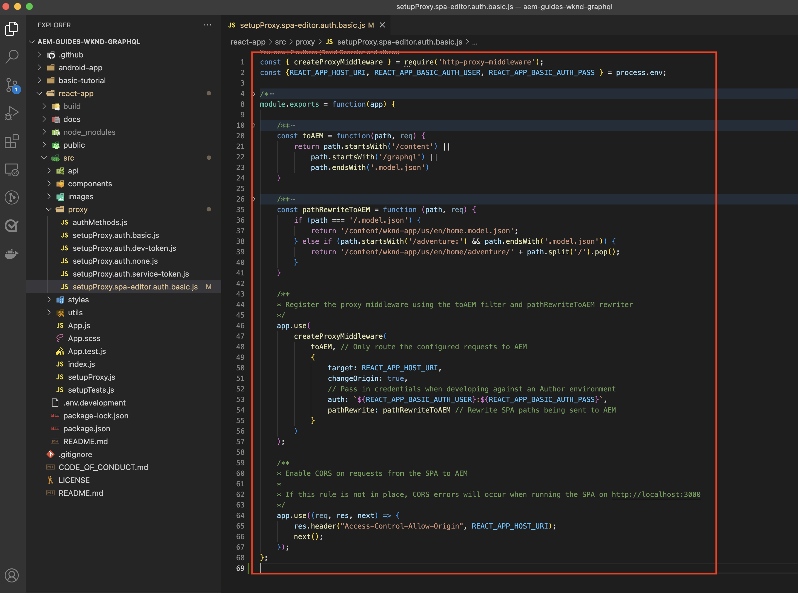
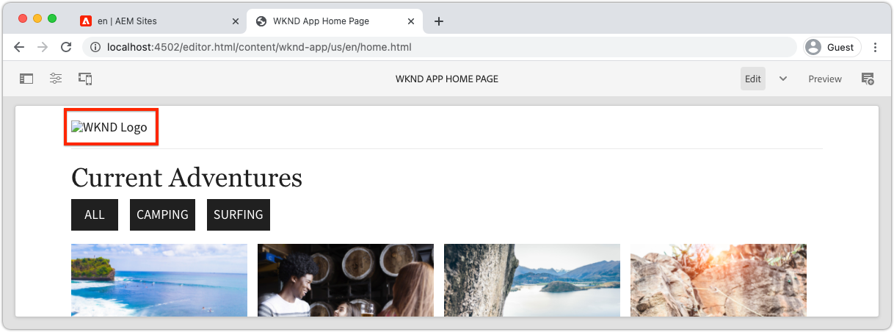
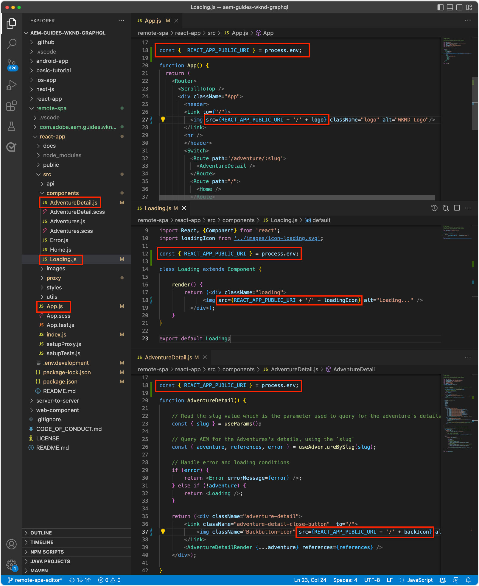
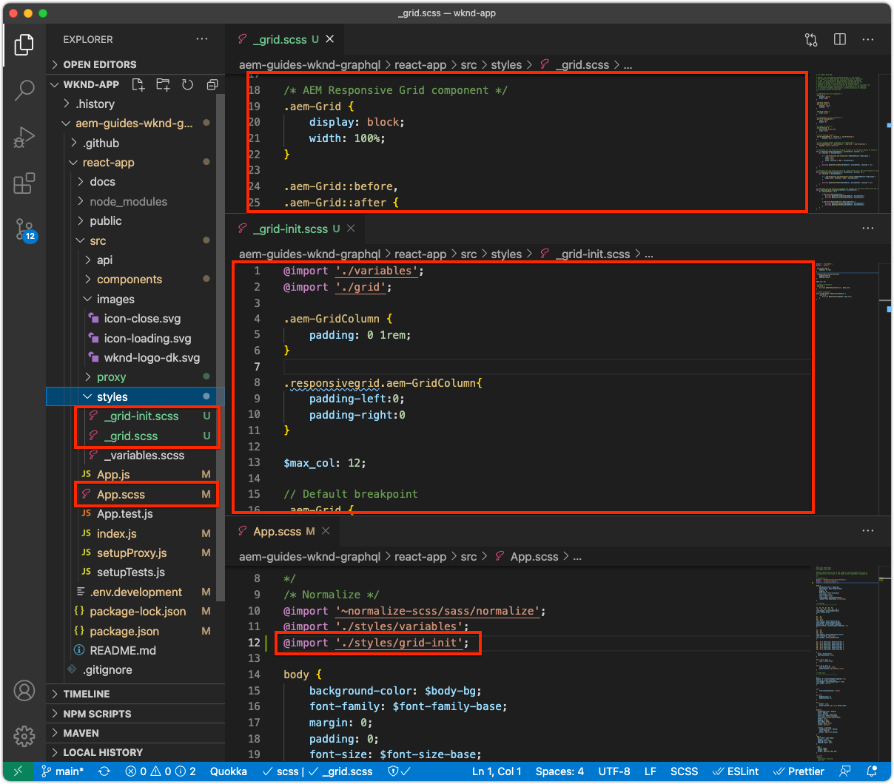
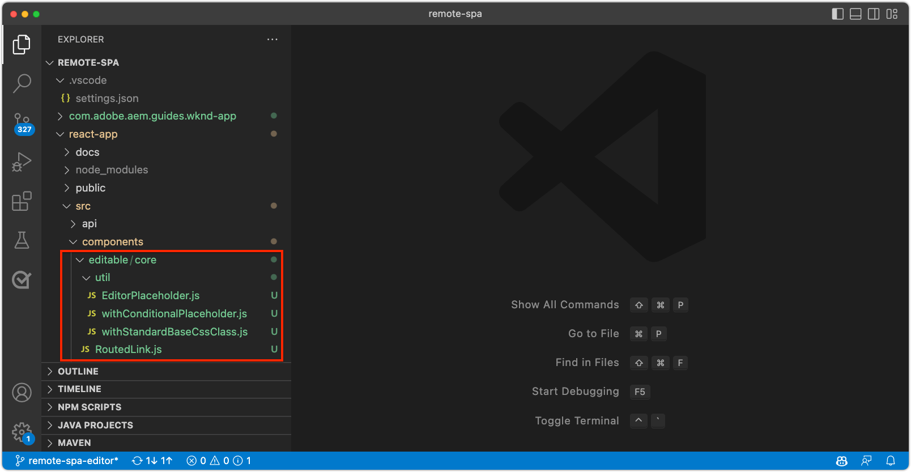
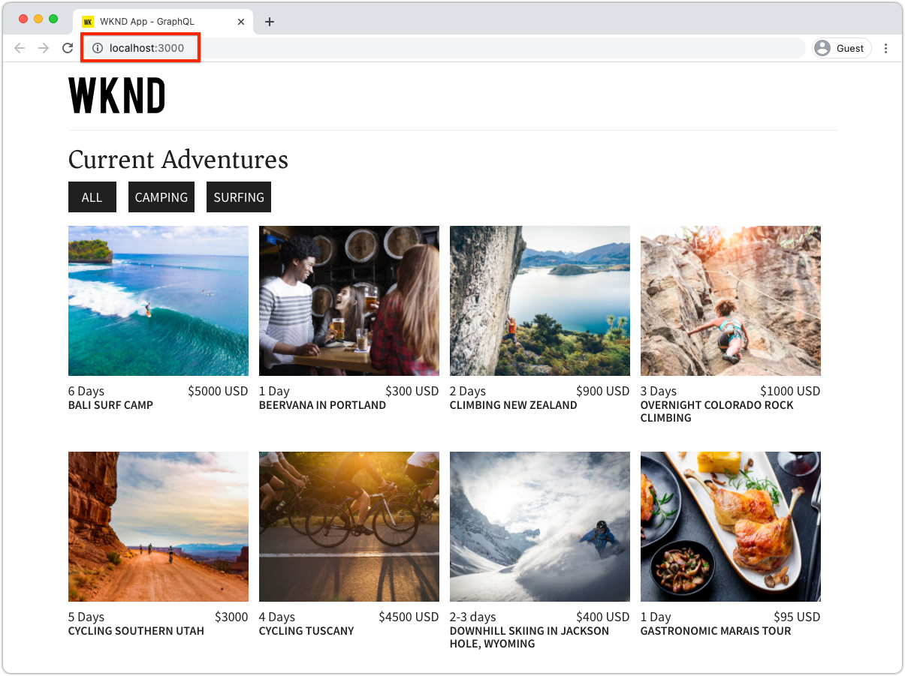
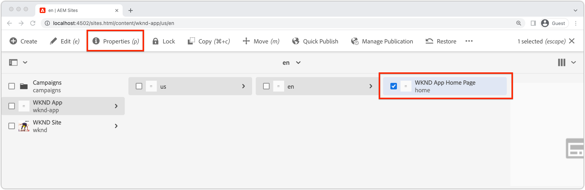
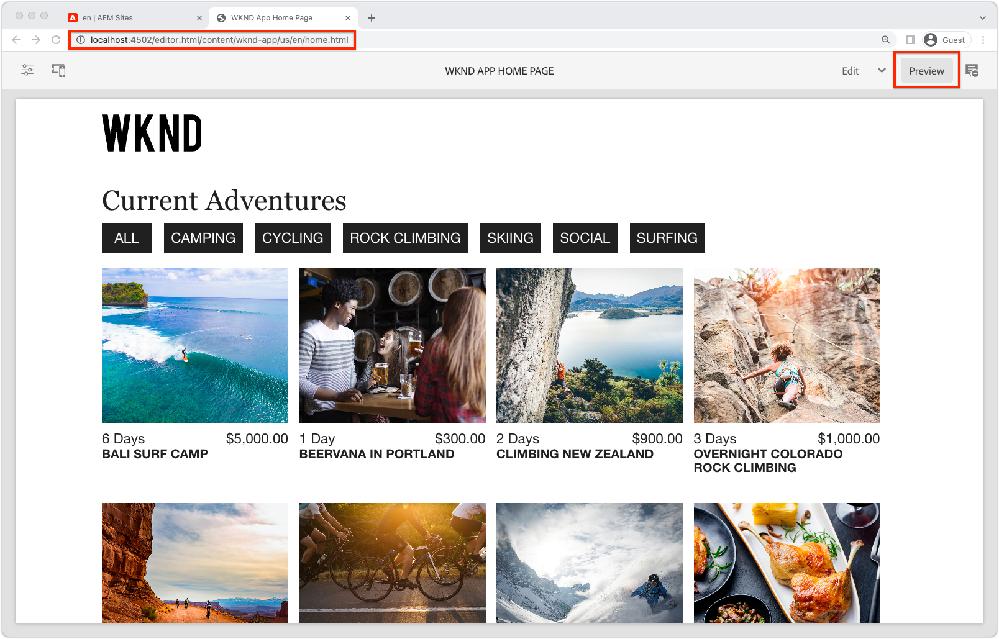

# Bootstrap the Remote SPA for SPA Editor

Before the editable areas can be added to the Remote SPA, it must be bootstrapped with the AEM SPA Editor JavaScript SDK, and a few other configurations.

## Install AEM SPA Editor JS SDK npm dependencies

First, review AEM's SPA npm dependencies for the React project, and the install them.

+ [`@adobe/aem-spa-page-model-manager`](https://github.com/adobe/aem-spa-page-model-manager) : provides the API for retrieving content from AEM.
+ [`@adobe/aem-spa-component-mapping`](https://github.com/adobe/aem-spa-component-mapping) : provides the API that map AEM content to SPA components.
+ [`@adobe/aem-react-editable-components` v2](https://github.com/adobe/aem-react-editable-components) : provides an API for building custom SPA components and provides common-use implementations such as the `AEMPage` React component.

```shell
$ cd ~/Code/aem-guides-wknd-graphql/remote-spa-tutorial/react-app
$ npm install @adobe/aem-spa-page-model-manager 
$ npm install @adobe/aem-spa-component-mapping
$ npm install @adobe/aem-react-editable-components 
```

## Review SPA environment variables

Several environment variables must be exposed to the Remote SPA so it knows how to interact with AEM.

1.  Open Remote SPA project at `~/Code/aem-guides-wknd-graphql/remote-spa-tutorial/react-app` in your IDE
1.  Open the file `.env.development` 
1.  In the file, pay specific attention to the keys, and update as needed:

    ```
    REACT_APP_HOST_URI=http://localhost:4502

    REACT_APP_USE_PROXY=true

    REACT_APP_AUTH_METHOD=basic
    
    REACT_APP_BASIC_AUTH_USER=admin
    REACT_APP_BASIC_AUTH_PASS=admin
    ```

    
    
    *Remember that custom environment variables in React must be prefixed with `REACT_APP_`.*

    +   `REACT_APP_HOST_URI`: the scheme and host of the AEM service the Remote SPA connects to.
        + This value changes based on if the AEM environment (local, Dev, Stage, or Production), and the AEM Service type (Author vs. Publish)
    +   `REACT_APP_USE_PROXY`: this avoids CORS issues during development by telling the react development server to proxy AEM requests such as `/content, /graphql, .model.json` using `http-proxy-middleware` module.
    +   `REACT_APP_AUTH_METHOD`: authentication method for AEM served requests, options are 'service-token', 'dev-token', 'basic' or leave blank for no-auth use case
        + Required for use with AEM Author
        + Possibly required for use with AEM Publish (if content is protected)
        + Developing against the AEM SDK supports local accounts via Basic Auth. This is the method used in this tutorial.
        + When integrating with AEM as a Cloud Service, use [access tokens](https://experienceleague.adobe.com/docs/experience-manager-learn/getting-started-with-aem-headless/authentication/overview.html)
    +   `REACT_APP_BASIC_AUTH_USER`: the AEM __username__ by the SPA to authenticate while retrieving AEM content.
    +   `REACT_APP_BASIC_AUTH_PASS`: the AEM __password__ by the SPA to authenticate while retrieving AEM content.

## Integrate the ModelManager API

With the AEM SPA npm dependencies available to the app, initialize AEM's `ModelManager` in the project's `index.js` before `ReactDOM.render(...)` is invoked.

The [ModelManager](https://github.com/adobe/aem-spa-page-model-manager/blob/master/src/ModelManager.ts) is responsible for connecting to AEM to retrieving editable content.

1.  Open the Remote SPA project in your IDE
1.  Open the file `src/index.js`
1.  Add import `ModelManager` and initialize it before the `root.render(..)` invocation,

    ```javascript
    ...
    import { ModelManager } from "@adobe/aem-spa-page-model-manager";

    // Initialize the ModelManager before invoking root.render(..).
    ModelManager.initializeAsync();

    const container = document.getElementById('root');
    const root = createRoot(container);
    root.render(<App />);
    ```

The `src/index.js` file should look like:



## Set up an internal SPA proxy

When creating an editable SPA, it is best to set up an [internal proxy in the SPA](https://create-react-app.dev/docs/proxying-api-requests-in-development/#configuring-the-proxy-manually), that is configured to route the appropriate requests to AEM. This is done by using [http-proxy-middleware](https://www.npmjs.com/package/http-proxy-middleware) npm module, which is already installed by the base WKND GraphQL App.

1.  Open the Remote SPA project in your IDE
1.  Open the file at `src/proxy/setupProxy.spa-editor.auth.basic.js`
1.  Update the file with the following code:

    ```javascript
    const { createProxyMiddleware } = require('http-proxy-middleware');
    const {REACT_APP_HOST_URI, REACT_APP_BASIC_AUTH_USER, REACT_APP_BASIC_AUTH_PASS } = process.env;

    /*
        Set up a proxy with AEM for local development
        In a production environment this proxy should be set up at the webserver level or absolute URLs should be used.
    */
    module.exports = function(app) {

        /**
        * Filter to check if the request should be re-routed to AEM. The paths to be re-routed at:
        * - Starts with /content (AEM content)
        * - Starts with /graphql (AEM graphQL endpoint)
        * - Ends with .model.json (AEM Content Services)
        * 
        * @param {*} path the path being requested of the SPA
        * @param {*} req the request object
        * @returns true if the SPA request should be re-routed to AEM
        */
        const toAEM = function(path, req) {
            return path.startsWith('/content') || 
                path.startsWith('/graphql') ||
                path.endsWith('.model.json')
        }

        /**
        * Re-writes URLs being proxied to AEM such that they can resolve to real AEM resources
        * - The "root" case of `/.model.json` are rewritten to the SPA's home page in AEM
        * - .model.json requests for /adventure:xxx routes are rewritten to their corresponding adventure page under /content/wknd-app/us/en/home/adventure/ 
        * 
        * @param {*} path the path being requested of the SPA
        * @param {*} req the request object
        * @returns returns a re-written path, or nothing to use the @param path
        */
        const pathRewriteToAEM = function (path, req) { 
            if (path === '/.model.json') {
                return '/content/wknd-app/us/en/home.model.json';
            } else if (path.startsWith('/adventure/') && path.endsWith('.model.json')) {
                return '/content/wknd-app/us/en/home/adventure/' + path.split('/').pop();
            }    
        }
    
        /**
        * Register the proxy middleware using the toAEM filter and pathRewriteToAEM rewriter 
        */
        app.use(
            createProxyMiddleware(
                toAEM, // Only route the configured requests to AEM
                {
                    target: REACT_APP_HOST_URI,
                    changeOrigin: true,
                    // Pass in credentials when developing against an Author environment
                    auth: `${REACT_APP_BASIC_AUTH_USER}:${REACT_APP_BASIC_AUTH_PASS}`,
                    pathRewrite: pathRewriteToAEM // Rewrite SPA paths being sent to AEM
                }
            )
        );
    
        /**
        * Enable CORS on requests from the SPA to AEM
        * 
        * If this rule is not in place, CORS errors will occur when running the SPA on http://localhost:3000
        */
        app.use((req, res, next) => {
            res.header("Access-Control-Allow-Origin", REACT_APP_HOST_URI);
            next();
        });
    };
    ```    

    The `setupProxy.spa-editor.auth.basic.js` file should look like:

    

    This proxy configuration does two main things:

    1.  Proxies specific requests made to the SPA (`http://localhost:3000`) to AEM `http://localhost:4502`
        + It only proxies requests whose paths match patterns that indicate they should be served by AEM, as defined in `toAEM(path, req)`.
        + It rewrites SPA paths to their counterpart AEM pages, as defined in `pathRewriteToAEM(path, req)`
    1.  It adds CORS headers to all requests to allow access to AEM content, as defined by `res.header("Access-Control-Allow-Origin", REACT_APP_HOST_URI);` 
        + If this is not added, CORS errors occur when loading AEM content in the SPA.
    
1.  Open the file `src/setupProxy.js`
1.  Review the line pointing to the `setupProxy.spa-editor.auth.basic` proxy configuration file:

    ```
    ...
    case BASIC:
    // Use user/pass for local development with Local Author Env
    return require('./proxy/setupProxy.spa-editor.auth.basic');
    ...

    ```

Note, any changes to the `src/setupProxy.js` or it's referenced files require a restart of the SPA.

## Static SPA resource

Static SPA resources such as the WKND Logo and Loading graphics need to have their src URLs updated to force them load from the Remote SPA's host. If left relative, when the SPA is loaded in SPA Editor for authoring, these URLs default to use AEM's host rather than the SPA, resulting in 404 requests as illustrated in the image below.



To resolve this issue, make a static resource hosted by the Remote SPA use absolute paths that include the Remote SPA's origin.

1.  Open the SPA project in your IDE
1.  Open your SPA's environment variables file `src/.env.development` and add a variable for the SPA's public URI:

    ```
    ...
    # The base URI the SPA is accessed from
    REACT_APP_PUBLIC_URI=http://localhost:3000
    ```

    _When deploying to AEM as a Cloud Service, you need to the same for the corresponding `.env` files._

1.  Open the file `src/App.js`
1.  Import the SPA's public URI from the SPA's environment variables

    ```javascript
    const {  REACT_APP_PUBLIC_URI } = process.env;

    function App() { ... }
    ```

1.  Prefix the WKND logo `` with `REACT_APP_PUBLIC_URI` to force resolution against the SPA.

    ```html
    
    ```

1.  Do the same for loading image in `src/components/Loading.js`

    ```javascript
    const { REACT_APP_PUBLIC_URI } = process.env;

    class Loading extends Component {

        render() {
            return (<div className="loading">
                
            </div>);
        }
    }
    ```

1.  And for the __two instances__ of the back button in `src/components/AdventureDetails.js`

    ```javascript
    const { REACT_APP_PUBLIC_URI } = process.env;

    function AdventureDetail(props) {
        ...
        render() {
            
        }
    }
    ```

The `App.js`, `Loading.js`, and `AdventureDetails.js` files should look like:



## AEM Responsive Grid

To support SPA Editor's layout mode for editable areas in the SPA, we must integrate AEM's Responsive Grid CSS into the SPA. Don't worry - this grid system is only applicable to the editable containers, and you can use your grid system of choice to drive the layout of the rest of your SPA.

Add the AEM Responsive Grid SCSS files to the SPA.

1.  Open the SPA project in your IDE
1.  Download and copy the following two files into `src/styles`
    +   [_grid.scss](./assets/spa-bootstrap/_grid.scss)
        + The AEM Responsive Grid SCSS generator
    +   [_grid-init.scss](./assets/spa-bootstrap/_grid-init.scss)
        + Invokes `_grid.scss` using the SPA's specific breakpoints (desktop and mobile) and columns (12).
1.  Open `src/App.scss` and import `./styles/grid-init.scss`

    ```scss
    ...
    @import './styles/grid-init';
    ...
    ```

The `_grid.scss` and `_grid-init.scss` files should look like:



Now the SPA includes the CSS required to support AEM's Layout Mode for components added to an AEM container.

## Utility classes

Copy in the the following utility classes into your React app project. 

+ [RoutedLink.js](./assets/spa-bootstrap/RoutedLink.js) to `~/Code/aem-guides-wknd-graphql/remote-spa-tutorial/react-app/src/components/editable/core/RoutedLink.js`
+ [EditorPlaceholder.js](./assets/spa-bootstrap/EditorPlaceholder.js) to `~/Code/aem-guides-wknd-graphql/remote-spa-tutorial/react-app/src/components/editable/core/util/EditorPlaceholder.js`
+ [withConditionalPlaceholder.js](./assets/spa-bootstrap/withConditionalPlaceholder.js) to `~/Code/aem-guides-wknd-graphql/remote-spa-tutorial/react-app/src/components/editable/core/util/withConditionalPlaceholder.js`
+ [withStandardBaseCssClass.js](./assets/spa-bootstrap/withStandardBaseCssClass.js) to `~/Code/aem-guides-wknd-graphql/remote-spa-tutorial/react-app/src/components/editable/core/util/withStandardBaseCssClass.js`



## Start the SPA

Now that the SPA is bootstrapped for integration with AEM, let's run the SPA and see what it looks like!

1.  On the command line, navigate to the root of the SPA project
1.  Start the SPA using the normal commands (if you have not already done it)

    ```shell
    $ cd ~/Code/aem-guides-wknd-graphql/remote-spa-tutorial/react-app
    $ npm install 
    $ npm run start
    ```

1.  Browse the SPA on [http://localhost:3000](http://localhost:3000). Everything should look good!



## Open the SPA in AEM SPA Editor

With the SPA running on [http://localhost:3000](http://localhost:3000), let's open it using AEM SPA Editor. Nothing is editable in the SPA yet, this only validates the SPA in AEM.

1.  Log in to AEM Author
1.  Navigate to __Sites > WKND App > us > en__
1.  Select the __WKND App Home Page__ and tap __Edit__, and the SPA appears.

    

1.  Switch to __Preview__ using the mode switcher in the top right
1.  Click around the SPA

    

## Congratulations!

You've bootstrapped the Remote SPA to be AEM SPA Editor compatible! You now know how to:

+ Add the AEM SPA Editor JS SDK npm dependencies to the SPA project
+ Configure your SPA's environment variables
+ Integrate the ModelManager API with the SPA
+ Set up an internal proxy for the SPA so it routes the appropriate content requests to AEM
+ Address issues with static SPA resources resolving in the context of SPA Editor
+ Add AEM's Responsive Grid CSS to support layout-ing in AEM's editable containers

## Next Steps

Now that we've achieved a baseline of compatibility with AEM SPA Editor, we can start introducing editable areas. We first look at how to place a [fixed editable component](./spa-fixed-component.md) in the SPA.
