# Editable container components

{{spa-editor-deprecation}}

[Fixed components](./spa-fixed-component.md) provide some flexibility for authoring SPA content, however this approach is rigid and requires developers to define the exact composition of the editable content. To support the creation of exceptional experiences by authors, SPA Editor supports the use of container components in the SPA. Container components allow authors to drag and drop allowed components into the container, and author them, just like they can in traditional AEM Sites authoring!

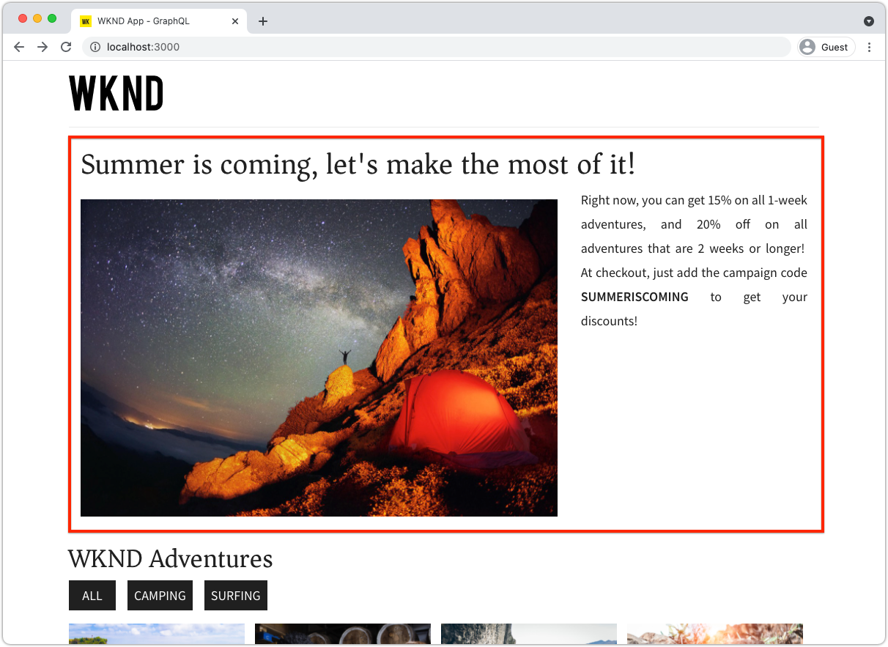

In this chapter, we add an editable container to the home view allowing authors to compose and layout rich content experiences using Editable React components directly in the SPA.

## Update the WKND App 

To add a container component to the Home view:

* Import the AEM React Editable Component's `ResponsiveGrid` component
* Import and register custom Editable React Components (Text and Image) for use in the ResponsiveGrid component

### Use the ResponsiveGrid component

To add an editable area to the Home view:

1. Open and edit `react-app/src/components/Home.js`
1. Import the `ResponsiveGrid` component from `@adobe/aem-react-editable-components` and add it to the `Home` component.
1. Set the following attributes on the `<ResponsiveGrid...>` component
    1. `pagePath = '/content/wknd-app/us/en/home'`
    1. `itemPath = 'root/responsivegrid'`

    This instructs the `ResponsiveGrid` component to retrieve its content from the AEM resource:

    1. `/content/wknd-app/us/en/home/jcr:content/root/responsivegrid`

    The `itemPath` maps to the `responsivegrid` node defined in the `Remote SPA Page` AEM Template and is automatically created on new AEM Pages created from the `Remote SPA Page` AEM Template.

    Update `Home.js` to add the `<ResponsiveGrid...>` component.

    ```javascript
    ...
    import { ResponsiveGrid } from '@adobe/aem-react-editable-components';
    ...

    function Home() {
        return (
            <div className="Home">
                <ResponsiveGrid
                    pagePath='/content/wknd-app/us/en/home' 
                    itemPath='root/responsivegrid'/>

                <EditableTitle
                    pagePath='/content/wknd-app/us/en/home' 
                    itemPath='title'/>

                <Adventures />
            </div>
        );
    }
    ```

The `Home.js` file should look like:

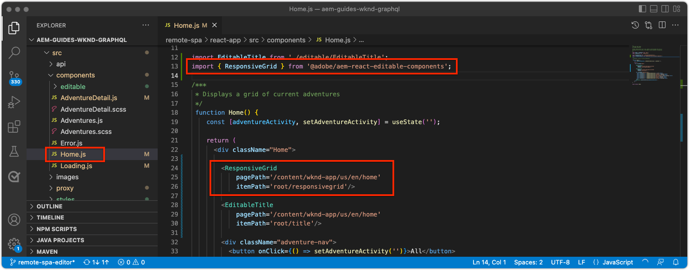

## Create editable components

To get the full effect of the flexible authoring experience containers provide in SPA Editor. We've already create an editable Title component, but let's make a few more that allow authors to use editable Text and Image components in the newly added ResponsiveGrid component.

The new editable Text and Image React components are created using the editable component defintion pattern expored in [editable fixed components](./spa-fixed-component.md).

### Editable text component

1. Open the SPA project in your IDE
1. Create a React component at `src/components/editable/core/Text.js`
1. Add the following code to `Text.js`

    ```javascript
    import React from 'react'

    const TextPlain = (props) => <div className={props.baseCssClass}><p className="cmp-text__paragraph">{props.text}</p></div>;
    const TextRich = (props) => {
    const text = props.text;
    const id = (props.id) ? props.id : (props.cqPath ? props.cqPath.substr(props.cqPath.lastIndexOf('/') + 1) : "");
        return <div className={props.baseCssClass} id={id} data-rte-editelement dangerouslySetInnerHTML={{ __html: text }} />
    };

    export const Text = (props) => {
        if (!props.baseCssClass) {
            props.baseCssClass = 'cmp-text'
        }

        const { richText = false } = props

        return richText ? <TextRich {...props} /> : <TextPlain {...props} />
        }

        export function textIsEmpty(props) {
        return props.text == null || props.text.length === 0;
    }
    ```

1. Create an editable React component at `src/components/editable/EditableText.js`
1. Add the following code to `EditableText.js`

    ```javascript
    import React from 'react'
    import { EditableComponent, MapTo } from '@adobe/aem-react-editable-components';
    import { Text, textIsEmpty } from "./core/Text";
    import { withConditionalPlaceHolder } from "./core/util/withConditionalPlaceholder";
    import { withStandardBaseCssClass } from "./core/util/withStandardBaseCssClass";

    const RESOURCE_TYPE = "wknd-app/components/text";

    const EditConfig = {
        emptyLabel: "Text",
        isEmpty: textIsEmpty,
        resourceType: RESOURCE_TYPE
    };

    export const WrappedText = (props) => {
        const Wrapped = withConditionalPlaceHolder(withStandardBaseCssClass(Text, "cmp-text"), textIsEmpty, "Text V2")
        return <Wrapped {...props} />
    };

    const EditableText = (props) => <EditableComponent config={EditConfig} {...props}><WrappedText /></EditableComponent>

    MapTo(RESOURCE_TYPE)(EditableText);

    export default EditableText;
    ```

The editable Text component implementation should look like:

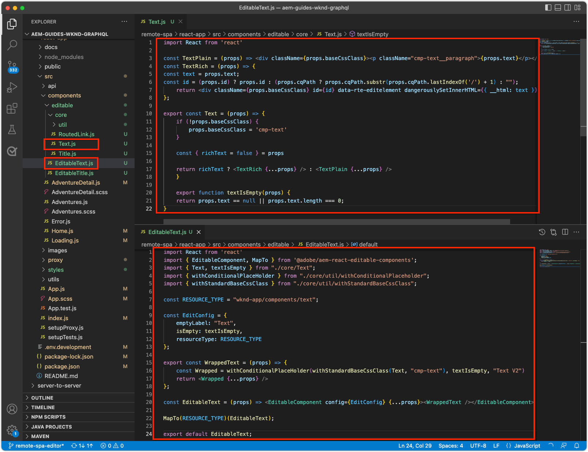

### Image component

1. Open the SPA project in your IDE
1. Create a React component at `src/components/editable/core/Image.js`
1. Add the following code to `Image.js`

    ```javascript
    import React from 'react'
    import { RoutedLink } from "./RoutedLink";

    export const imageIsEmpty = (props) => (!props.src) || props.src.trim().length === 0

    const ImageInnerContents = (props) => {
    return (<>
        
        {
            !!(props.title) && <span className={props.baseCssClass + '__title'} itemProp="caption">{props.title}</span>
        }
        {
            props.displayPopupTitle && (!!props.title) && <meta itemProp="caption" content={props.title} />
        }
        </>);
    };

    const ImageContents = (props) => {
        if (props.link && props.link.trim().length > 0) {
            return (
            <RoutedLink className={props.baseCssClass + '__link'} isRouted={props.routed} to={props.link}>
                <ImageInnerContents {...props} />
            </RoutedLink>
            )
        }
        return <ImageInnerContents {...props} />
    };

    export const Image = (props) => {
        if (!props.baseCssClass) {
            props.baseCssClass = 'cmp-image'
        }

        const { isInEditor = false } = props;
        const cssClassName = (isInEditor) ? props.baseCssClass + ' cq-dd-image' : props.baseCssClass;

        return (
            <div className={cssClassName}>
                <ImageContents {...props} />
            </div>
        )
    };
    ```

1. Create an editable React component at `src/components/editable/EditableImage.js`
1. Add the following code to `EditableImage.js`

```javascript
import { EditableComponent, MapTo } from '@adobe/aem-react-editable-components';
import { Image, imageIsEmpty } from "./core/Image";
import React from 'react'

import { withConditionalPlaceHolder } from "./core/util/withConditionalPlaceholder";
import { withStandardBaseCssClass } from "./core/util/withStandardBaseCssClass";

const RESOURCE_TYPE = "wknd-app/components/image";

const EditConfig = {
    emptyLabel: "Image",
    isEmpty: imageIsEmpty,
    resourceType: RESOURCE_TYPE
};

const WrappedImage = (props) => {
    const Wrapped = withConditionalPlaceHolder(withStandardBaseCssClass(Image, "cmp-image"), imageIsEmpty, "Image V2");
    return <Wrapped {...props}/>
}

const EditableImage = (props) => <EditableComponent config={EditConfig} {...props}><WrappedImage /></EditableComponent>

MapTo(RESOURCE_TYPE)(EditableImage);

export default EditableImage;
```


1. Create an SCSS file `src/components/editable/EditableImage.scss` that provides custom styles for the `EditableImage.scss`. These styles target the editable React component's CSS classes.
1. Add the following SCSS to `EditableImage.scss`

    ```css
    .cmp-image__image {
        margin: 1rem 0;
        width: 100%;
        border: 0;
     }
    ```

1. Import `EditableImage.scss` in `EditableImage.js` 

    ```javascript
    ...
    import './EditableImage.scss';
    ...
    ```

The editable Image component implementation should look like:

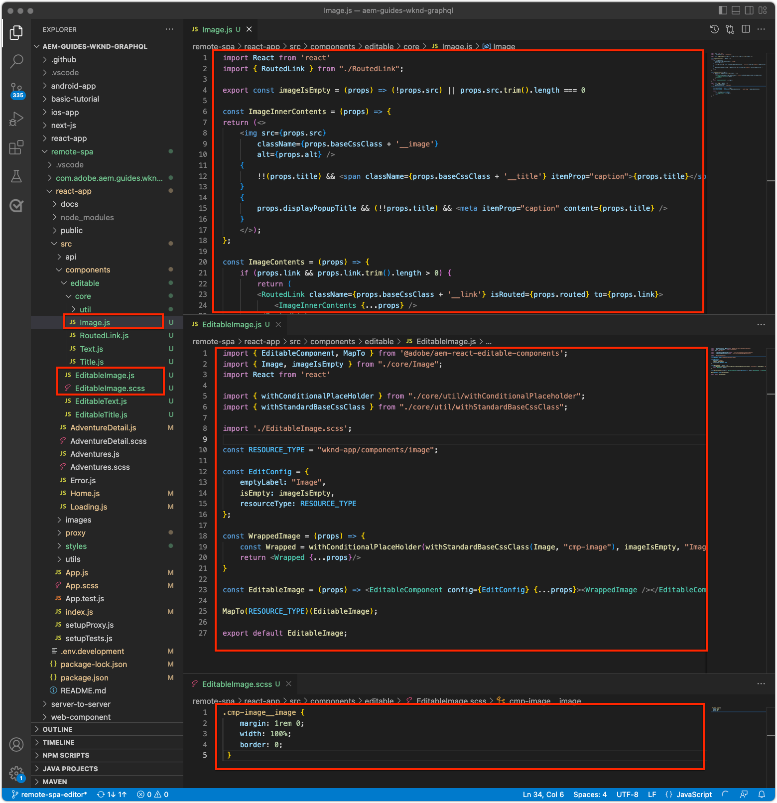


### Import the editable components

The newly created `EditableText` and `EditableImage` React components are referenced in the SPA, and are dynamically instantiated based on the JSON returned by AEM. To ensure that these components are available to the SPA, create import statements for them in `Home.js`

1. Open the SPA project in your IDE
1. Open the file `src/Home.js`
1. Add import statements for `AEMText` and `AEMImage`

    ```javascript
    ...
    // The following need to be imported, so that MapTo is run for the components
    import EditableText from './editable/EditableText';
    import EditableImage from './editable/EditableImage';
    ...
    ```

The result should look like:

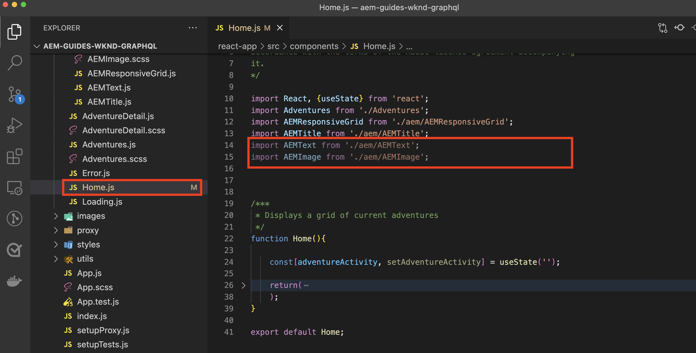

If these imports are _not_ added, the `EditableText` and `EditableImage` code is not be invoked by SPA, and thus, the components are not mapped to the provided resource types.

## Configuring the container in AEM

AEM container components use policies to dictate their allowed components. This is a critical configuration when using SPA Editor, since only AEM Components that have mapped SPA component counterparts are render-able by the SPA. Ensure only the components which we've provided SPA implementations for are allowed:

* `EditableTitle` mapped to `wknd-app/components/title`
* `EditableText` mapped to `wknd-app/components/text`
* `EditableImage` mapped to `wknd-app/components/image`

To configure the Remote SPA Page template's reponsivegrid container:

1. Log in to AEM Author
1. Navigate to __Tools > General > Templates > WKND App__
1. Edit __Report SPA Page__

    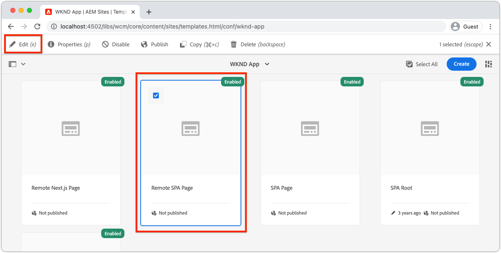

1. Select __Structure__ in the mode switcher in the top right
1. Tap to select the __Layout Container__ 
1. Tap the __Policy__ icon in the popup bar

    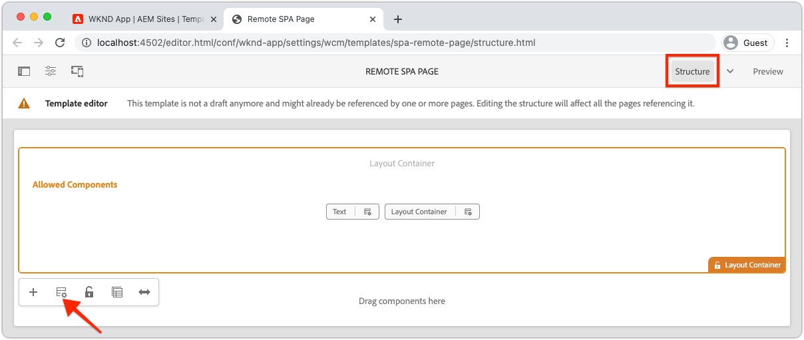

1. On the right, under the __Allowed Components__ tab, expand __WKND APP - CONTENT__
1. Ensure only following are selected:
    1. Image
    1. Text 
    1. Title

    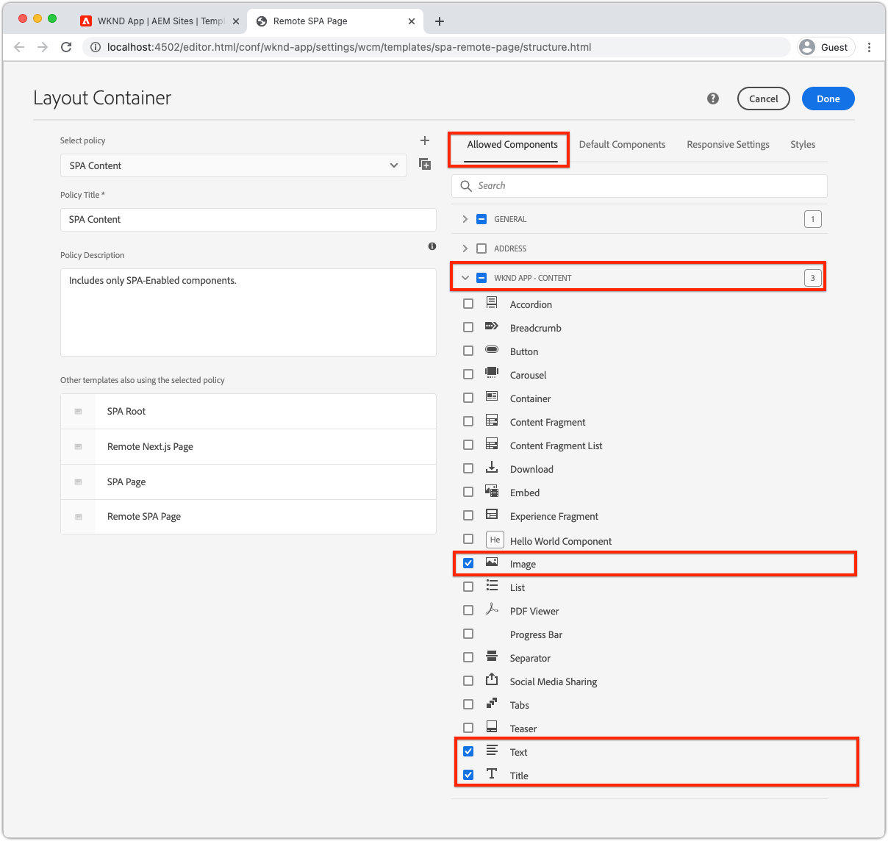

1. Tap __Done__

## Authoring the container in AEM

After the SPA updated to embed the `<ResponsiveGrid...>`, wrappers for three editable React components (`EditableTitle`, `EditableText`, and `EditableImage`), and AEM is updated with a matching Template policy, we can start authoring content in the container component.

1. Log in to AEM Author 
1. Navigate to __Sites > WKND App__
1. Tap __Home__ and select __Edit__ from the top action bar
    1. A "Hello World" Text component displays, as this was automatically added when generating the project from the AEM Project archetype
1. Select __Edit__ from the mode-selector in the top right of the Page Editor
1. Locate the __Layout Container__ editable area beneath the Title
1. Open the __Page Editor's side bar__, and select the __Components view__
1. Drag the following components into the __Layout Container__
    1. Image 
    1. Title
1. Drag the components to reorder them to the following order:
    1. Title
    1. Image
    1. Text    
1. __Author__ the __Title__ component
    1. Tap the Title component, and tap the __wrench__ icon to __edit__ the Title component
    1. Add the following text:  
        1. Title: __Summer is coming, let's make the most of it!__
        1. Type: __H1__
    1. Tap __Done__
1. __Author__ the __Image__ component
    1. Drag an image in from the Side bar (after switching to the Assets view) on the Image component
    1. Tap the Image component, and tap the __wrench__ icon to edit
    1. Check the __Image is decorative__ checkbox
    1. Tap __Done__
1. __Author__ the __Text__ component
    1. Edit the Text component by tapping the Text component, and tapping the __wrench__ icon
    1. Add the following text:  
        1. _Right now, you can get 15% on all 1-week adventures, and 20% off on all adventures that are 2 weeks or longer! At checkout, add the campaign code SUMMERISCOMING to get your discounts!_
    1. Tap __Done__

1. Your components are now authored, but stack vertically. 

    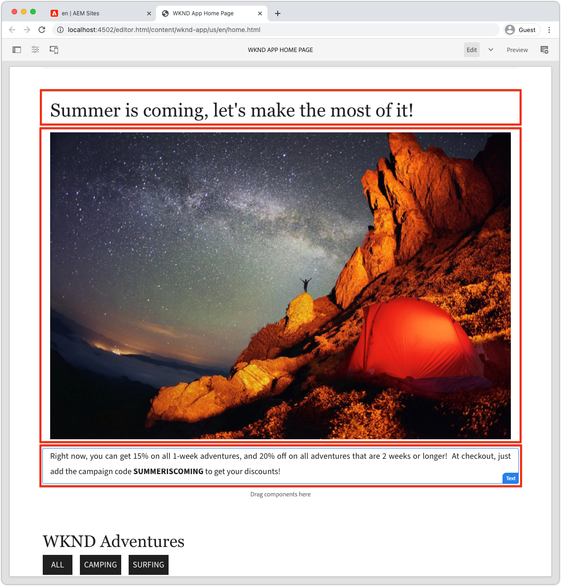

   Use AEM's Layout Mode to allow us to adjust the size and layout of the components.
    
1. Switch to __Layout Mode__ using the mode-selector in the top-right
1. __Resize__ the Image and Text components, such that  they are side by side
    1. __Image__ component should be __8 columns wide__
    1. __Text__ component should be __3 columns wide__

    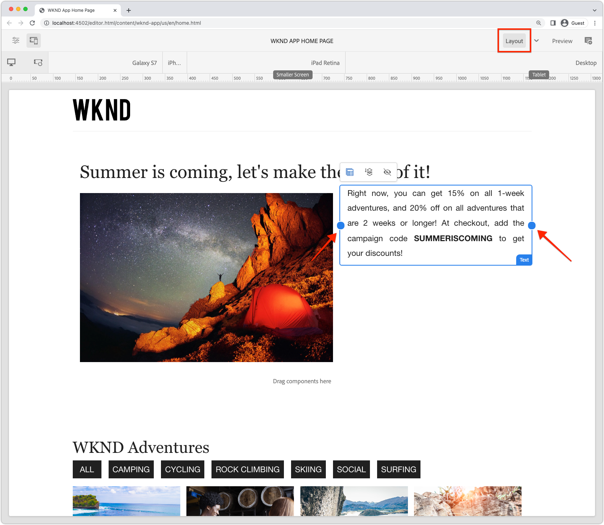

1. __Preview__ your changes in AEM Page Editor
1. Refresh the WKND App running locally on [http://localhost:3000](http://localhost:3000) to see the authored changes!

    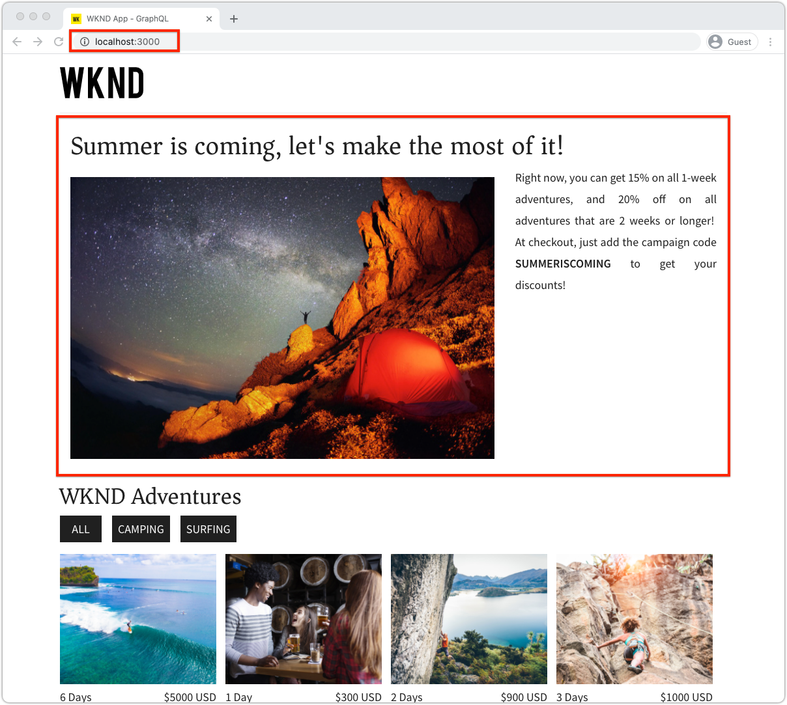


## Congratulations!

You've added a container component that allows for editable components to be added by authors to the WKND App! You now know how to:

* Use the AEM React Editable Component's `ResponsiveGrid` component in the SPA
* Create and register editable React components (Text and Image) for use in the SPA via the container component
* Configure the Remote SPA Page template to allow the SPA-enabled components
* Add editable components to the container component
* Author and layout components in SPA Editor

## Next Steps

The next step uses this same technique to [add an editable component to an Adventure Details route](./spa-dynamic-routes.md) in the SPA.
