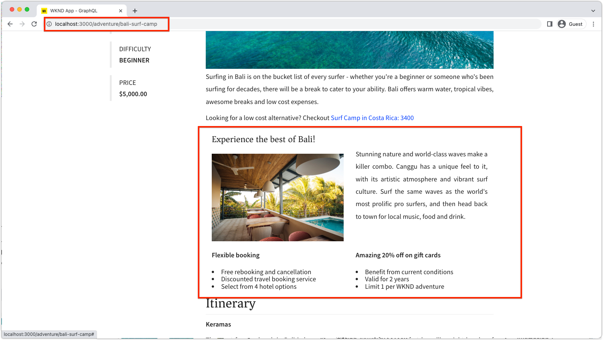
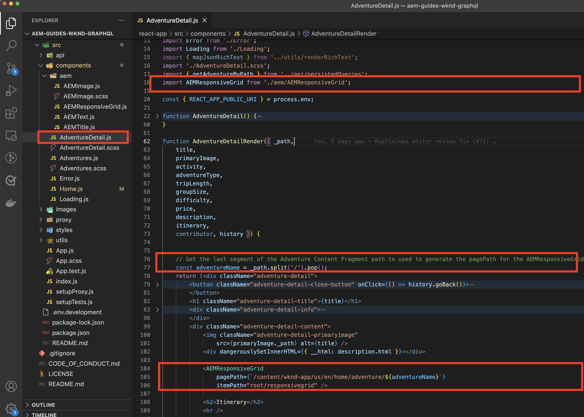
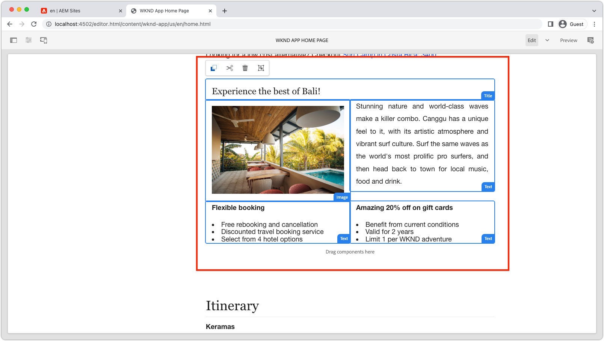
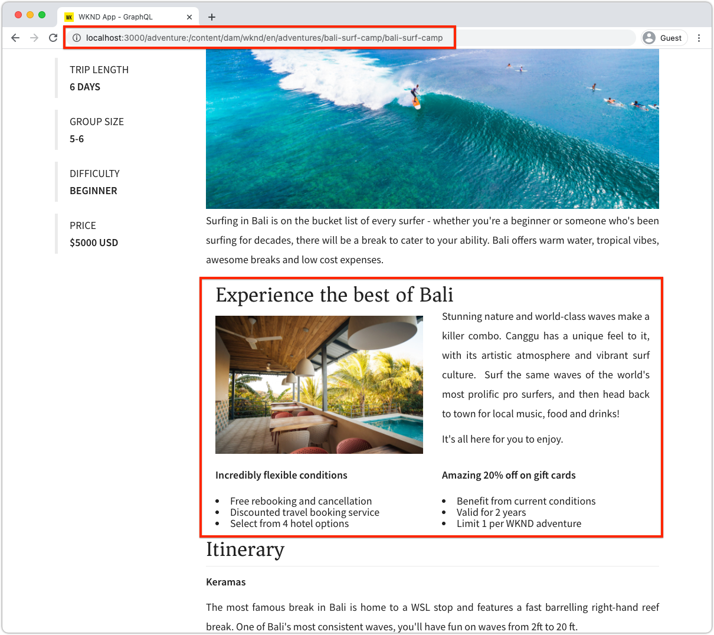

# Dynamic routes and editable components

In this chapter, we enable two dynamic Adventure Detail routes to support editable components; __Bali Surf Camp__ and __Beervana in Portland__.



The Adventure Detail SPA route is defined as `/adventure/:slug` where `slug` is a unique identifier property on the Adventure Content Fragment.

## Map the SPA URLs to AEM Pages

In the previous two chapters, we mapped editable component content from the SPA's Home view to corresponding Remote SPA root page in AEM at `/content/wknd-app/us/en/`. 

Defining mapping for editable components for the SPA's dynamic routes is similar however we must come up 1:1 mapping scheme between instances of the route and AEM pages.

In this tutorial, we take the name of the WKND Adventure Content Fragment, which is the last segment of the path, and map it to a simple path under `/content/wknd-app/us/en/adventure`.

| Remote SPA route | AEM page path |
|------------------------------------|--------------------------------------------|
| /                                  | /content/wknd-app/us/en/home                                 |
| /adventure/__bali-surf-camp__      | /content/wknd-app/us/en/home/adventure/__bali-surf-camp__ |
| /adventure/__beervana-portland__   | /content/wknd-app/us/en/home/adventure/__beervana-in-portland__ |

So, based on this mapping we must create two new AEM pages at:

+ `/content/wknd-app/us/en/home/adventure/bali-surf-camp`
+ `/content/wknd-app/us/en/home/adventure/beervana-in-portland`

## Remote SPA mapping

The mapping for requests leaving the Remote SPA are configured via the `setupProxy` configuration done in [Bootstrap the SPA](./spa-bootstrap.md).

## SPA Editor mapping 

The mapping for SPA requests when the SPA is opened via AEM SPA Editor are configured via Sling Mappings configuration done in [Configure AEM](./aem-configure.md).

## Create content pages in AEM

First, create the intermediary `adventure` Page segment:

1. Log in to AEM Author
1. Navigate to __Sites > WKND App > us > en > WKND App Home Page__
    + This AEM page is mapped as the root of the SPA, so this is where we begin building out the AEM page structure for other SPA routes.
1. Tap __Create__ and select __Page__
1. Select the __Remote SPA Page__ template, and tap __Next__
1. Fill out the Page Properties
    + __Title__: Adventure
    + __Name__: `adventure` 
        + This value defines the AEM page's URL, and therefore must match the SPA' route segment.
1. Tap __Done__

Then, create the AEM pages that correspond to each of the SPA's URLs that require editable areas.

1. Navigate into the new __Adventure__ page in the Site Admin
1. Tap __Create__ and select __Page__
1. Select the __Remote SPA Page__ template, and tap __Next__
1. Fill out the Page Properties
    + __Title__: Bali Surf Camp
    + __Name__: `bali-surf-camp` 
        + This value defines the AEM page's URL, and therefore must match the SPA' route's last segment
1. Tap __Done__
1. Repeat the steps 3-6 to create the __Beervana in Portland__ page, with:
    + __Title__: Beervana in Portland
    + __Name__: `beervana-in-portland`
        + This value defines the AEM page's URL, and therefore must match the SPA' route's last segment

These two AEM pages hold the respective-authored content for their matching SPA routes. If other SPA routes require authoring, new AEM Pages must be created at their SPA's URL under the Remote SPA page's root page (`/content/wknd-app/us/en/home`) in AEM.

## Update the WKND App 

Let's place the `<ResponsiveGrid...>` component created in the [last chapter](./spa-container-component.md), into our `AdventureDetail` SPA component, creating an editable container.

### Place the ResponsiveGrid SPA component

Placing the `<ResponsiveGrid...>` in the `AdventureDetail` component creates an editable container in that route. The trick is because multiple routes use the `AdventureDetail` component to render, we must dynamically adjust the  `<ResponsiveGrid...>'s pagePath` attribute. The `pagePath` must be derived to point to the corresponding AEM page, based on the adventure the route's instance displays.

1. Open and edit `react-app-/src/components/AdventureDetail.js`
1. Import the `ResponsiveGrid` component and place it above the `<h2>Itinerary</h2>` component.
1. Set the following attributes on the `<ResponsiveGrid...>` component. Note the `pagePath` attribute adds the current `slug` which maps to the adventure page per the mapping defined above.
    + `pagePath = '/content/wknd-app/us/en/home/adventure/${slug}'`
    + `itemPath = 'root/responsivegrid'`

    This instructs the `ResponsiveGrid` component to retrieve its content from the AEM resource:

    + `/content/wknd-app/us/en/home/adventure/${slug}/jcr:content/root/responsivegrid`

Update `AdventureDetail.js` with the following lines:

```javascript
...
import { ResponsiveGrid } from '@adobe/aem-react-editable-components';
...

function AdventureDetailRender(props) {
    ...
    // Get the slug from the React route parameter, this will be used to specify the AEM Page to store/read editable content from
    const { slug } = useParams();

    return(
        ...
        // Pass the slug in
        function AdventureDetailRender({ title, primaryImage, activity, adventureType, tripLength, 
                groupSize, difficulty, price, description, itinerary, references, slug }) {
            ...
            return (
                ...
                <ResponsiveGrid 
                    pagePath={`/content/wknd-app/us/en/home/adventure/${slug}`}
                    itemPath="root/responsivegrid"/>
                    
                <h2>Itinerary</h2>
                ...
            )
        }
    )
}
```

The `AdventureDetail.js` file should look like:



## Author the Container in AEM

With the `<ResponsiveGrid...>` in place, and its `pagePath` dynamically set based on the adventure being rendered, we try authoring content in it.

1. Log in to AEM Author 
1. Navigate to __Sites > WKND App > us > en__
1. __Edit__ the __WKND App Home Page__ page
    + Navigate to the __Bali Surf Camp__ route in the SPA to edit it
1. Select __Preview__ from the mode-selector in the top-right
1. Tap on the __Bali Surf Camp__ card in the SPA to navigate to its route
1. Select __Edit__ from the mode-selector
1. Locate the __Layout Container__ editable area right above the __Itinerary__
1. Open the __Page Editor's side bar__, and select the __Components view__
1. Drag some of the enabled components into the __Layout Container__
    + Image 
    + Text
    + Title

    And create some promotional marketing material. It could look something like this:

     

1. __Preview__ your changes in AEM Page Editor
1. Refresh the WKND App running locally on [http://localhost:3000](http://localhost:3000), navigate to the __Bali Surf Camp__ route to see the authored changes!

    

When navigating to an adventure detail route that does not have a mapped AEM Page, there is no authoring ability on that route instance. To enable authoring on these pages, simply make an AEM Page with the matching name under the __Adventure__ page!

## Congratulations!

Congratulations! You've added authoring ability to dynamic routes in the SPA!

+ Added the AEM React Editable Component's ResponsiveGrid component to a dynamic route
+ Created AEM pages to supporting authoring of two specific routes in the SPA (Bali Surf Camp and Beervana in Portland)
+ Authored content on the dynamic Bali Surf Camp route!

You've now completed exploring the first steps of how AEM SPA Editor can be used to add specific editable areas to a Remote SPA! 
