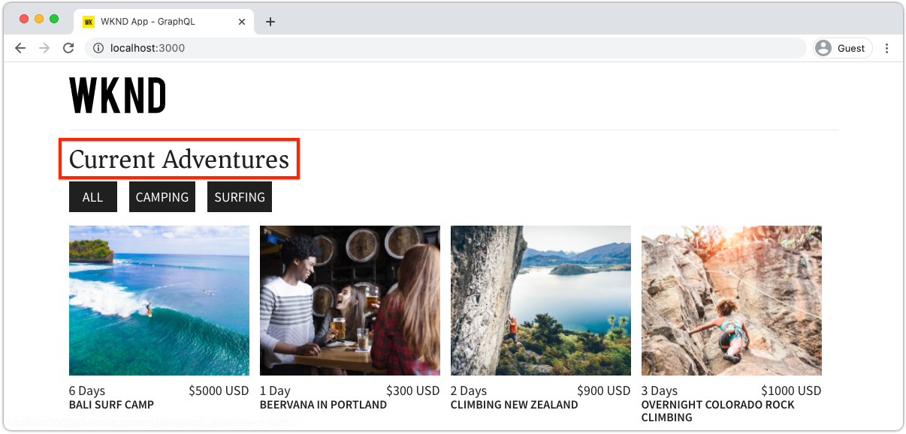
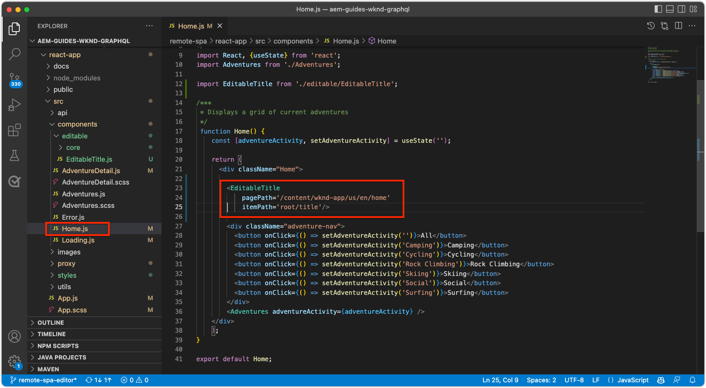
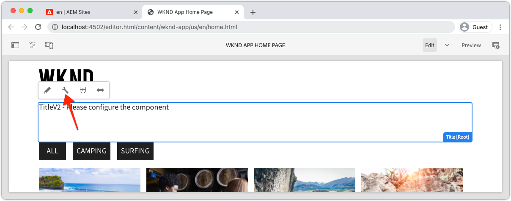
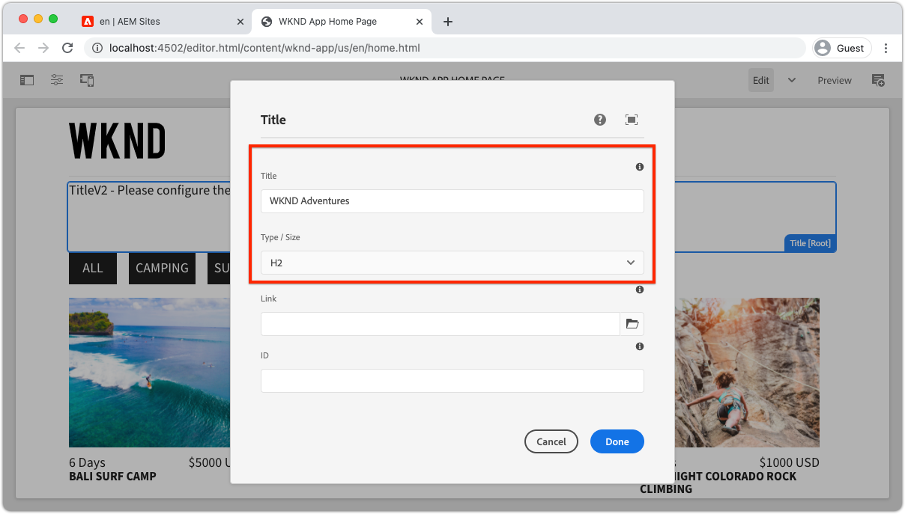
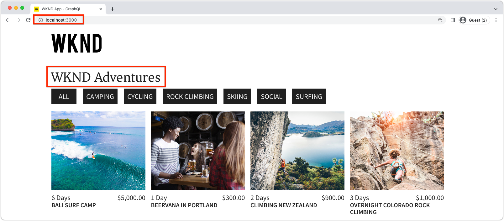

# Editable fixed components

Editable React components can be "fixed", or hard-coded into the SPA's views. This allows developers to place SPA Editor-compatible components into the SPA views, and allow users to author the components' content in AEM SPA Editor.



In this chapter, we replace the Home view's title, "Current Adventures", which is hard-coded text in `Home.js` with a fixed, but editable Title component. Fixed components guarantee the placement of the title, but also allows the title's text to be authored, and change outside the development cycle.

## Update the WKND App 

To add a __Fixed__ component to the Home view:

+ Create a custom editable Title component and register it to the project's Title's resource type
+ Place the editable Title component on the SPA's Home view

### Create an editable React Title component

In the SPA's Home view, replace the hard-coded text `<h2>Current Adventures</h2>` with a custom editable Title component. Before the Title component can be used, we have to:

1. Create a custom Title React component
1. Decorate the custom Title component using methods from `@adobe/aem-react-editable-components` to make it editable.
1. Register the editable Title component with `MapTo` so it can be used in [container component later](./spa-container-component.md).

To do this:

1.  Open Remote SPA project at `~/Code/aem-guides-wknd-graphql/remote-spa-tutorial/react-app` in your IDE
1.  Create a React component at `react-app/src/components/editable/core/Title.js`
1.  Add the following code to `Title.js`. 

    ```javascript
    import React from 'react'
    import { RoutedLink } from "./RoutedLink";

    const TitleLink = (props) => {
    return (
        <RoutedLink className={props.baseCssClass + (props.nested ? '-' : '__') + 'link'} 
            isRouted={props.routed} 
            to={props.linkURL}>
        {props.text}
        </RoutedLink>
    );
    };

    const TitleV2Contents = (props) => {
        if (!props.linkDisabled) {
            return <TitleLink {...props} />
        }

        return <>{props.text}</>
    };

    export const Title = (props) => {
        if (!props.baseCssClass) {
            props.baseCssClass = 'cmp-title'
        }

        const elementType = (!!props.type) ? props.type.toString() : 'h3';
        return (<div className={props.baseCssClass}>
            {
                React.createElement(elementType, {
                        className: props.baseCssClass + (props.nested ? '-' : '__') + 'text',
                    },
                    <TitleV2Contents {...props} />
                )
            }

            </div>)
    }

    export const titleIsEmpty = (props) => props.text == null || props.text.trim().length === 0
    ```

    Note that this React component is not yet editable using AEM SPA Editor. This base component will be made editable in the next step.

    Read through the code's comments for the implementation details.

1.  Create a React component at `react-app/src/components/editable/EditableTitle.js`
1.  Add the following code to `EditableTitle.js`. 

    ```javascript
    // Import the withMappable API provided bu the AEM SPA Editor JS SDK
    import { EditableComponent, MapTo } from '@adobe/aem-react-editable-components';
    import React from 'react'

    // Import the AEM the Title component implementation and it's Empty Function
    import { Title, titleIsEmpty } from "./core/Title";
    import { withConditionalPlaceHolder } from "./core/util/withConditionalPlaceholder";
    import { withStandardBaseCssClass } from "./core/util/withStandardBaseCssClass";

    // The sling:resourceType of the AEM component used to collected and serialize the data this React component displays
    const RESOURCE_TYPE = "wknd-app/components/title";

    // Create an EditConfig to allow the AEM SPA Editor to properly render the component in the Editor's context
    const EditConfig = {
        emptyLabel: "Title",        // The component placeholder in AEM SPA Editor
        isEmpty: titleIsEmpty,      // The function to determine if this component has been authored
        resourceType: RESOURCE_TYPE // The sling:resourceType this component is mapped to
    };

    export const WrappedTitle = (props) => {
        const Wrapped = withConditionalPlaceHolder(withStandardBaseCssClass(Title, "cmp-title"), titleIsEmpty, "TitleV2")
        return <Wrapped {...props} />
    }

    // EditableComponent makes the component editable by the AEM editor, either rendered statically or in a container
    const EditableTitle = (props) => <EditableComponent config={EditConfig} {...props}><WrappedTitle /></EditableComponent>

    // MapTo allows the AEM SPA Editor JS SDK to dynamically render components added to SPA Editor Containers
    MapTo(RESOURCE_TYPE)(EditableTitle);

    export default EditableTitle;
    ```

    This `EditableTitle` React component wraps the `Title` React component, wrapping and decorating it to be editable in AEM SPA Editor.

### Use the React EditableTitle component

Now that the EditableTitle React component is registered in and available for use within the React app, replace the hard-coded title text on the Home view.

1.  Edit `react-app/src/components/Home.js`
1.  In the `Home()` at the bottom, import `EditableTitle` and replace the hard-coded title with the new `AEMTitle` component:
     
    ```javascript
    ...
    import EditableTitle from './editable/EditableTitle';
    ...
    function Home() {
        return (
            <div className="Home">

            <EditableTitle
                pagePath='/content/wknd-app/us/en/home'
                itemPath='root/title'/>

                <Adventures />
            </div>
        );
    }
    ```

The `Home.js` file should look like:



## Author the Title component in AEM

1.  Log in to AEM Author
1.  Navigate to __Sites > WKND App__
1.  Tap __Home__ and select __Edit__ from the top action bar
1.  Select __Edit__ from the edit mode selector in the top right of the Page Editor
1.  Hover over the default title text below the WKND logo and above the adventures list, until the blue edit outline displays
1.  Tap to expose the component's action bar, and then tap the __wrench__  to edit

    

1.  Author the Title component:
    +   Title: __WKND Adventures__
    +   Type/Size: __H2__

        

1.  Tap __Done__ to save
1.  Preview your changes in AEM SPA Editor
1.  Refresh the WKND App running locally on [http://localhost:3000](http://localhost:3000) and see the authored title changes immediately reflected.

    

## Congratulations!

You've added a fixed, editable component to the WKND App! You now know how to:

+ Created a fixed, but editable, component to the SPA
+ Author the fixed component in AEM
+ See the authored content in the Remote SPA

## Next steps

The next steps are to [add an AEM ResponsiveGrid container component](./spa-container-component.md) to the SPA that allows author to add and editable components to the SPA!
