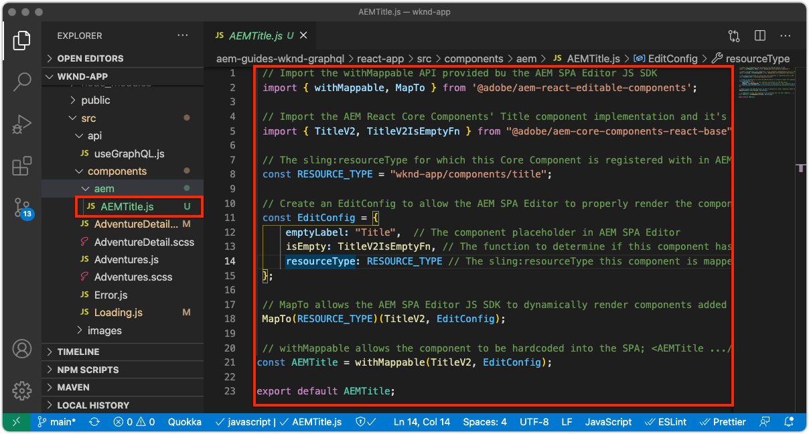
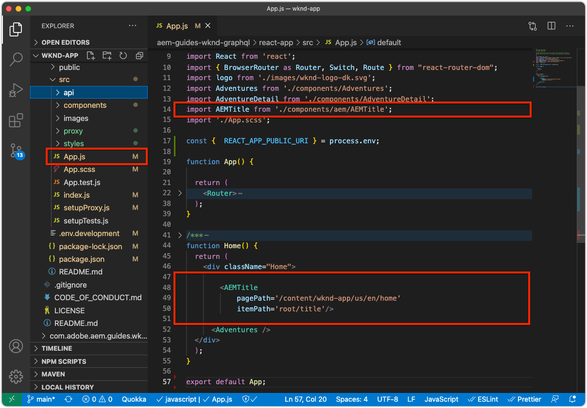

# Editable fixed components

Editable React components can be "fixed", or hard-coded into the SPA's views. This allows developers to place SPA Editor-compatible components into the SPA views, and allow users to author the components' content in AEM SPA Editor.


In this chapter, we replace the Home view's title, "Current Adventures", which is hard-coded text in `Home.js` with a fixed, but editable Title component. Fixed components guarantee the placement of the title, but also allows the title's text to be authored, and change outside the development cycle.

## Update the WKND App 

To add a Fixed a component to the Home view:

+ Import the AEM React Core Component Title component and register it to the project's Title's resource type
+ Place the editable Title component on the SPA's Home view

### Import in the AEM React Core Component's Title component

In the SPA's Home view, replace the hard-coded text `<h2>Current Adventures</h2>` with the AEM React Core Components' Title component. Before the Title component can be used, we have to:

1. Import the Title component from `@adobe/aem-core-components-react-base` 
1. Register it using `withMappable` so developers can place it in the SPA
1. Also, register with `MapTo` so it can be used in [container component later](./spa-container-component.md).

To do this:

1. Open Remote SPA project at `~/Code/wknd-app/aem-guides-wknd-graphql/react-app` in your IDE
1. Create a React component at `react-app/src/components/aem/AEMTitle.js`
1. Add the following code to `AEMTitle.js`. 

    ```
    // Import the withMappable API provided by the AEM SPA Editor JS SDK
    import { withMappable, MapTo } from '@adobe/aem-react-editable-components';

    // Import the AEM React Core Components' Title component implementation and it's Empty Function 
    import { TitleV2, TitleV2IsEmptyFn } from "@adobe/aem-core-components-react-base";

    // The sling:resourceType for which this Core Component is registered with in AEM
    const RESOURCE_TYPE = "wknd-app/components/title";

    // Create an EditConfig to allow the AEM SPA Editor to properly render the component in the Editor's context
    const EditConfig = {    
        emptyLabel: "Title",  // The component placeholder in AEM SPA Editor
        isEmpty: TitleV2IsEmptyFn, // The function to determine if this component has been authored
        resourceType: RESOURCE_TYPE // The sling:resourceType this component is mapped to
    };

    // MapTo allows the AEM SPA Editor JS SDK to dynamically render components added to SPA Editor Containers
    MapTo(RESOURCE_TYPE)(TitleV2, EditConfig);

    // withMappable allows the component to be hardcoded into the SPA; <AEMTitle .../>
    const AEMTitle = withMappable(TitleV2, EditConfig);

    export default AEMTitle;
    ```

Read through the code's comments for the implementation details.

The `AEMTitle.js` file should look like:



### Use the React AEMTitle component

Now that the AEM React Core Component's Title component is registered in and available for use within the React app, replace the hard-coded title text on the Home view.

1. Edit `react-app/src/App.js`
1. in the `Home()` at the bottom, replace the hard-coded title with the new `AEMTitle` component:
     
    ```
    <h2>Current Adventures</h2>
    ```
     
    with
     
    ```
    <AEMTitle
        pagePath='/content/wknd-app/us/en/home' 
        itemPath='root/title'/>
    ```

    Update `Apps.js` with the following code:

    ```
    ...
    import { AEMTitle } from './components/aem/AEMTitle';
    ...
    function Home() {
        return (
            <div className="Home">

                <AEMTitle
                    pagePath='/content/wknd-app/us/en/home' 
                    itemPath='root/title'/>

                <Adventures />
            </div>
        );
    }
    ```

The `Apps.js` file should look like:



## Author the Title component in AEM

1. Log in to AEM Author
1. Navigate to __Sites > WKND App__
1. Tap __Home__ and select __Edit__ from the top action bar
1. Select __Edit__ from the edit mode selector in the top-right of the Page Editor
1. Hover over the default title text below the WKND logo and above the adventures list, until the blue edit outline displays
1. Tap to expose the component's action bar, and then tap the __wrench__  to edit

    

1. Author the Title component:
    + Title: __WKND Adventures__
    + Type/Size: __H2__

        

1. Tap __Done__ to save
1. Preview your changes in AEM SPA Editor
1. Refresh the WKND App running locally on [http://localhost:3000](http://localhost:3000) and see the authored title changes immediately reflected.

    

## Congratulations!

You've added a fixed, editable component to the WKND App! You now know how to:

+ Import from and reuse a AEM React Core Component in the SPA
+ Add a fixed, but editable, component to the SPA
+ Author the fixed component in AEM
+ See the authored content in the Remote SPA

## Next steps

The next steps are to [add an AEM ResponsiveGrid container component](./spa-container-component.md) to the SPA that allows author to add and editable components to the SPA!
