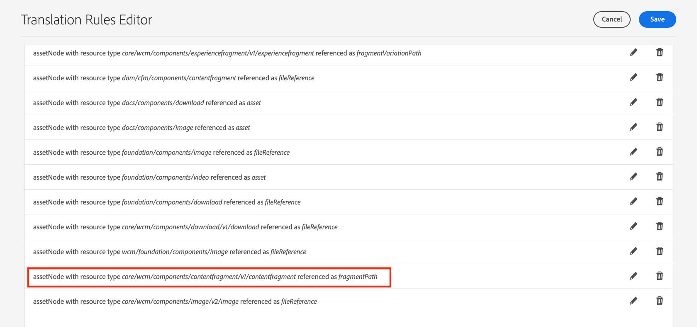

# Translation support for AEM Content Fragments {#translation-support-content-fragments}

Learn how Content Fragments can be localized and translated with Adobe Experience Manager. Mixed-media assets associated with a Content Fragment are also eligible to be extracted and translated.

>[!VIDEO](https://video.tv.adobe.com/v/18131/?quality=12&learn=on)

## Content Fragment Translation Use Cases {#content-fragment-translation-use-cases}

Content Fragments are a recognized content type that AEM extracts to be sent to an external translation service. Several use cases are supported out of the box:

1. A Content Fragment can be selected directly in the Assets console for language copy and translation
2. Content Fragments referenced on a Sites page are copied to the appropriate language folder and extracted for translation when the Sites page is selected for language copy
3. Inline media assets embedded inside a content fragment are eligible to be extracted and translated.
4. Asset collections associated with a content fragment are eligible to be extracted and translated

## Translation Rules Editor {#translation-rules-editor}

Experience Manager translation behavior can be updated by using the **Translation Rules Editor**. To update the translation, navigate to **Tools** > **General** > **Translation Configuration** at [http://localhost:4502/libs/cq/translation/translationrules/contexts.html](http://localhost:4502/libs/cq/translation/translationrules/contexts.html).

Out of the box configurations reference Content Fragments at `fragmentPath` with a resource type of `core/wcm/components/contentfragment/v1/contentfragment`. All components that inherit from the `v1/contentfragment` are recognized by the default configuration.

