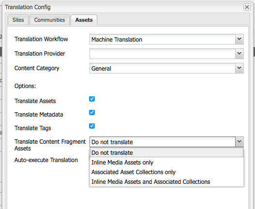

# Using Translation with AEM Content Fragments{#using-translation-with-aem-content-fragments}

AEM 6.3 introduces the ability to translate Content Fragments. Mixed-media assets and Asset collections associated with a Content Fragment are also eligible to be extracted and translated.

>[!VIDEO](https://video.tv.adobe.com/v/18131/?quality=9&learn=on)

## Content Fragment Translation Use Cases {#content-fragment-translation-use-cases}

Content Fragments are a recognized content type that AEM will extract to be sent to an external translation service. Several use cases are supported out of the box:

1. A Content Fragment can be selected directly in the Assets console for language copy and translation
2. Content Fragments referenced on a Sites page will be copied to the appropriate language folder and extracted for translation when the Sites page is selected for language copy
3. Inline media assets embedded inside a content fragment are eligible to be extracted and translated.
4. Asset collections associated with a content fragment are eligible to be extracted and translated

## Translation Configuration Options {#translation-config-options}

The out of the box translation configuration supports several options for translating Content Fragments. By default inline media assets and associated asset collections are NOT translated. To update the translation configuration navigate to [http://localhost:4502/etc/cloudservices/translation/default_translation.html](http://localhost:4502/etc/cloudservices/translation/default_translation.html).

There are four options for translating Content Fragment assets:

1. **Do not translate (default)**
2. **Inline Media Assets only**
3. **Associated Asset Collections only**
4. **Inline Media Assets and Associated Collections**

