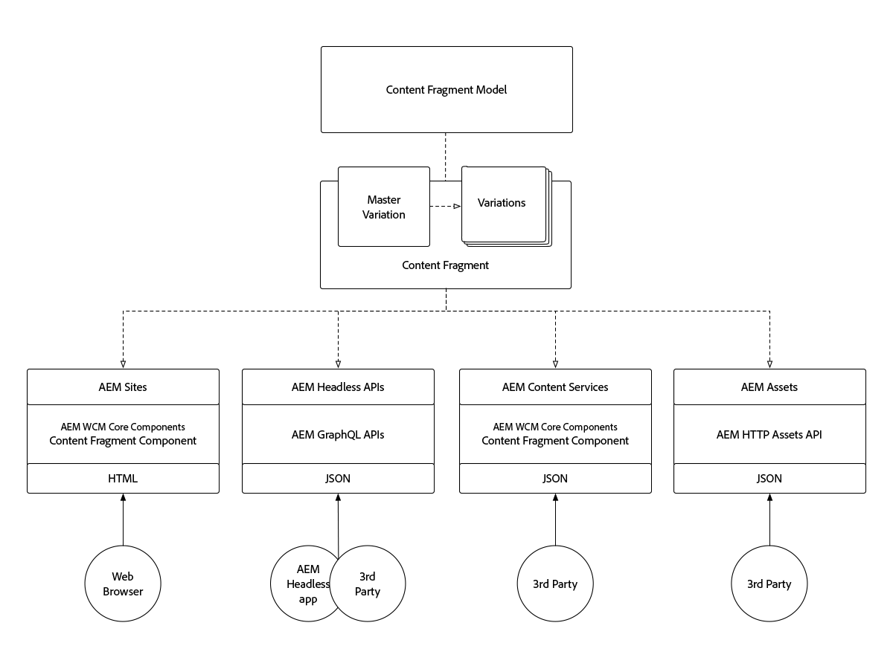
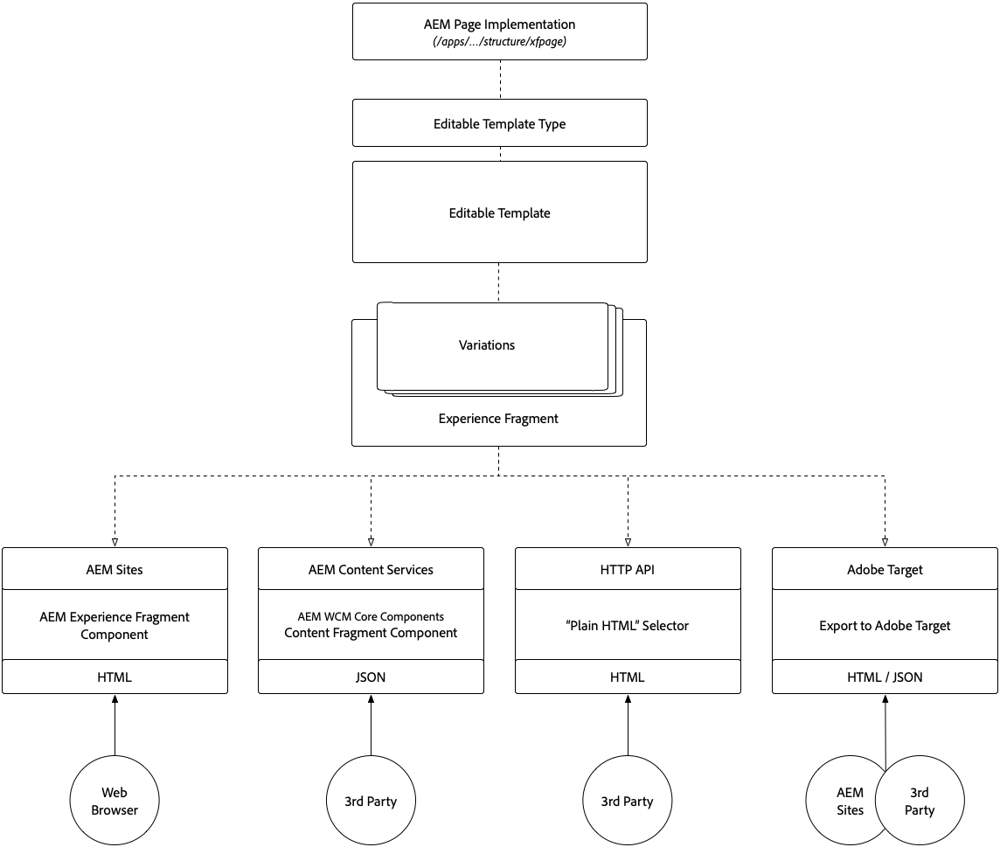

# Content Fragments and Experience Fragments

 Adobe Experience Manager's Content Fragments and Experience Fragments may seem similar on the surface, but each play key roles in different use cases. Learn how Content Fragments and Experience Fragments are similar, different, and when and how to use each.

## Comparison

<table>
<tbody><tr><td><strong> </strong></td>
<td><strong>Content Fragments (CF)</strong></td>
<td><strong>Experience Fragments (XF)</strong></td>
</tr><tr><td><strong>Definition</strong></td>
<td><ul>
<li>Re-usable, presentation-agnostic <strong>content</strong>, composed of structured data elements (text, dates, references, etc.)</li>
</ul>
</td>
<td><ul>
<li>A re-usable, composite of one or more AEM Components defining content and presentation that forms an <strong>experience</strong> which makes sense on its own</li>
</ul>
</td>
</tr><tr><td><strong>Core Tenets</strong></td>
<td><ul>
<li>Content-centric</li>
<li>Defined by a <a href="https://experienceleague.adobe.com/docs/experience-manager-65/assets/fragments/content-fragments-models.html?lang=en" target="_blank">structured, form-based, data model.</a></li>
<li>Design and layout agnostic.</li>
<li>The channel owns the presentation of the Content Fragment's content (layout and design)</li>
</ul>
</td>
<td><ul>
<li>Presentation-centric</li>
<li>Defined by unstructured composition of AEM Components</li>
<li>Defines design and layout of content</li>
<li>Used "as is" in channels</li>
</ul>
</td>
</tr><tr><td><strong>Technical details</strong></td>
<td><ul>
<li>Implemented as a <strong>dam:Asset</strong></li>
<li>Defined by a <a href="https://experienceleague.adobe.com/docs/experience-manager-65/assets/fragments/content-fragments-models.html?lang=en" target="_blank">Content Fragment Model</a></li>
</ul>
</td>
<td><ul>
<li>Implemented as a <strong>cq:Page</strong></li>
<li>Defined by Editable Templates</li>
<li>Native HTML rendition</li>
</ul>
</td>
</tr><tr><td><strong>Variations</strong></td>
<td><ul>
<li>The Master variation is the canonical variation</li>
<li>Variations are use-case specific, which may align with channels.</li>
</ul>
</td>
<td><ul>
<li>Variations are channel or context specific</li>
<li>Variations are kept in sync via AEM Live Copy</li>
<li><a href="https://experienceleague.adobe.com/docs/experience-manager-65/authoring/authoring/experience-fragments.html" target="_blank">Building blocks</a> allow content re-use across variations</li>
</ul>
</td>
</tr><tr><td><strong>Features</strong></td>
<td><ul>
<li>Variations</li>
<li>Versions</li>
<li><a href="https://experienceleague.adobe.com/docs/experience-manager-65/assets/fragments/content-fragments-variations.html?lang=en#synchronizing-with-master" target="_blank">Synchronization</a> of content across variations</li>
<li><a href="https://experienceleague.adobe.com/docs/experience-manager-65/assets/fragments/content-fragments-managing.html?lang=en#comparing-fragment-versions" target="_blank">Visual diff</a> of Content Fragment versions</li>
<li><a href="https://experienceleague.adobe.com/docs/experience-manager-65/assets/fragments/content-fragments-variations.html?lang=en#annotating-a-content-fragment" target="_blank">Annotations</a> of multi-line text elements</li>
<li>Intelligent <a href="https://experienceleague.adobe.com/docs/experience-manager-65/assets/fragments/content-fragments-variations.html?lang=en#summarizing-text" target="_blank">summarization</a> of multi-line text elements.</li>
<li><a href="https://experienceleague.adobe.com/docs/experience-manager-65/assets/fragments/creating-translation-projects-for-content-fragments.html?lang=en" target="_blank">Translation/localization</a></li>
</ul>
</td>
<td><ul>
<li>Variations</li>
<li>Variations as Live Copies</li>
<li>Versions</li>
<li><a href="https://experienceleague.adobe.com/docs/experience-manager-65/authoring/authoring/experience-fragments.html?lang=en#building-blocks" target="_blank">Building blocks</a></li>
<li>Annotations</li>
<li>Responsive layout and preview</li>
<li>Translation/localization</li>
<li>Complex data-model via Content Fragment references</li>
<li>In-app preview</li>
</ul>
</td>
</tr><tr><td><strong>Use</strong></td>
<td><ul>
<li>JSON export via <a href="https://experienceleague.adobe.com/landing/experience-manager/headless/developer.html">AEM Headless GraphQL APIs</a></li>
<li><a href="https://experienceleague.adobe.com/docs/experience-manager-core-components/using/components/content-fragment-component.html" target="_blank">AEM Core Components Content Fragment component</a> for use in AEM Sites, AEM Screens or in Experience Fragments.</li>
<li>JSON export via <a href="https://experienceleague.adobe.com/docs/experience-manager-learn/getting-started-with-aem-headless/content-services/overview.html?lang=en" target="_blank">AEM Content Services</a> for 3rd party consumption</li>
<li>JSON export to Adobe Target for targeted offers</li>
<li>JSON via AEM HTTP Assets APIs for 3rd party consumption</li>
</ul>
</td>
<td><ul>
<li>AEM Experience Fragment component for use in AEM Sites, AEM Screens or other Experience Fragments.</li>
<li>Export as <a href="https://experienceleague.adobe.com/docs/experience-manager-65/authoring/authoring/experience-fragments.html?lang=en" target="_blank">Plain HTML</a> for use by 3rd party systems</li>
<li><a href="https://experienceleague.adobe.com/docs/experience-manager-65/administering/integration/experience-fragments-target.html?lang=en" target="_blank">HTML export to Adobe Target</a> for targeted offers</li>
<li>JSON export to Adobe Target for targeted offers</li>
</ul>
</td>
</tr><tr><td><strong>Common use cases</strong></td>
<td><ul>
<li>Powering headless use-cases over GraphQL</li>
<li>Structured data-entry/form-based content</li>
<li>Long-form editorial content (multi-line element)</li>
<li>Content managed outside the life cycle of the channels delivering it</li>
</ul>
</td>
<td><ul>
<li>Centralized management of multi-channel promotional collateral using per-channel variations.</li>
<li>Content re-used across multiple pages in a Web site.</li>
<li>Web site chrome (ex. header and footer)</li>
<li>An experience managed outside the life cycle of the channels delivering it</li>
</ul>
</td>
</tr><tr><td><strong>Documentation</strong></td>
<td><ul>
<li><a href="https://experienceleague.adobe.com/docs/experience-manager-65/assets/home.html?lang=en&topic=/experience-manager/6-5/assets/morehelp/content-fragments.ug.js" target="_blank">AEM Content Fragments User Guide</a></li>
<li><a href="https://experienceleague.adobe.com/docs/experience-manager-learn/sites/content-fragments/content-fragments-feature-video-use.html?lang=en" target="_blank">Using Content Fragments in AEM</a></li>
</ul>
</td>
<td><ul>
<li><a href="https://experienceleague.adobe.com/docs/experience-manager-65/authoring/authoring/experience-fragments.html?lang=en" target="_blank">Adobe documentation on Experience Fragments</a></li>
</ul>
</td>
</tr></tbody></table>

## Content Fragments architecture

The following diagram illustrates the overall architecture for AEM Content Fragments

+ **Content Fragment Models** define the elements (or fields) that define what content the Content Fragment may capture and expose.
+ The **Content Fragment** is an instance of a Content Fragment Model that represents a logical content entity.
+ Content Fragment **variations** adhere to the Content Fragment Model, however, have variations in content.
+ Content Fragments can be exposed/consumed by:
  + Using Content Fragments on **AEM Sites** (or AEM Screens) via the AEM WCM Core Components' Content Fragment component.
  + Consume **Content Fragment** from headless apps using AEM Headless GraphQL APIs.
  + Exposing a Content Fragment variations content as JSON via **AEM Content Services** and API Pages for read-only use cases.
  + Directly exposing Content Fragment content (all variations) as JSON via direct calls to AEM Assets via the **AEM Assets HTTP API** for CRUD use cases.

## Experience Fragments architecture

+ **Editable Templates**, which in turn are defined by **Editable Template Types** and an **AEM Page component implementation**, define the allowed AEM Components that can be used to compose an Experience Fragment.
+ The **Experience Fragment** is an instance of an Editable Template that represents a logical experience.
+ Experience Fragment **variations** adhere to the Editable Template, however, have variations in experience (content and design).
+ Experience Fragments can be exposed/consumed by:
  + Using Experience Fragments on AEM Sites (or AEM Screens) via the AEM Experience Fragment component.
  + Exposing an Experience Fragment variations content as JSON (with embedded HTML) via **AEM Content Services** and API Pages.
  + Directly exposing an Experience Fragment variation as **"Plain HTML"**.
  + Exporting Experience Fragments to **Adobe Target** as either HTML or JSON offers.
  + AEM Sites natively supports HTML offers, however, JSON offers require custom development.

## Supporting resource for Content Fragments

+ [Content Fragments User Guide](https://experienceleague.adobe.com/docs/experience-manager-65/assets/home.html?lang=en&topic=/experience-manager/6-5/assets/morehelp/content-fragments.ug.js)
+ [Introduction to Adobe Experience Manager as a Headless CMS](https://experienceleague.adobe.com/docs/experience-manager-cloud-service/content/headless/introduction.html)
+ [Using Content Fragments in AEM](https://experienceleague.adobe.com/docs/experience-manager-learn/sites/content-fragments/content-fragments-feature-video-use.html?lang=en)
+ [AEM WCM Core Components' Content Fragment component](https://experienceleague.adobe.com/docs/experience-manager-core-components/using/components/content-fragment-component.html)
+ [Using Content Fragments and AEM Headless](https://experienceleague.adobe.com/docs/experience-manager-learn/getting-started-with-aem-headless/overview.html?lang=en)
+ [Getting Started with AEM Content Services](https://experienceleague.adobe.com/docs/experience-manager-learn/getting-started-with-aem-headless/content-services/overview.html?lang=en)

## Supporting resource for Experience Fragments

+ [Adobe documentation on Experience Fragments](https://experienceleague.adobe.com/docs/experience-manager-65/authoring/authoring/experience-fragments.html?lang=en)
+ [Understanding AEM Experience Fragments](https://experienceleague.adobe.com/docs/experience-manager-learn/sites/experience-fragments/experience-fragments-feature-video-use.html?lang=en)
+ [Using AEM Experience Fragments](https://experienceleague.adobe.com/docs/experience-manager-learn/sites/experience-fragments/experience-fragments-feature-video-use.html?lang=en)
+ [Using AEM Experience Fragments with Adobe Target](https://medium.com/adobetech/experience-fragments-and-adobe-target-d8d74381b9b2)
