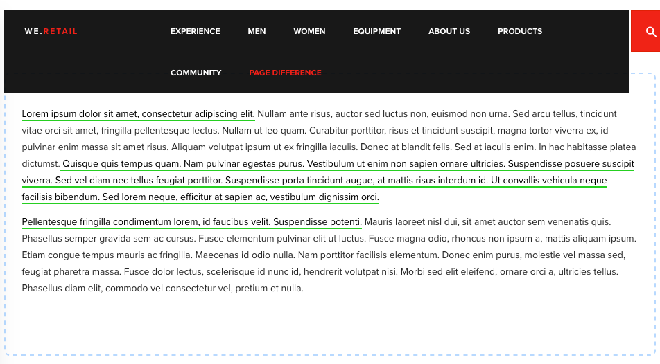

# Developing for Page Difference {#developing-for-page-difference}

This video shows how to provide custom styles for AEM Sites' Page Difference functionality.

## Customizing page difference styles {#customizing-page-difference-styles}

>[!VIDEO](https://video.tv.adobe.com/v/18871?quality=12&learn=on)

>[!NOTE]
>
>This video adds custom CSS to the we.Retail client library, where as these changes should be made to the customizer's AEM Sites project; in the example code below: `my-project`.

AEM's page difference obtains the OOTB CSS via a direct load of `/libs/cq/gui/components/common/admin/diffservice/clientlibs/diffservice/css/htmldiff.css`.

Because of this direct load of CSS rather than using a client library category, we must find another injecting point for the custom styles, and this custom injection point is the project's authoring clientlib.

This has the benefit of allowing these custom style overrides to be tenant specific.

### Prepare the authoring clientlib {#prepare-the-authoring-clientlib}

Ensure the existence of an `authoring` clientlib for your project at `/apps/my-project/clientlib/authoring.`

```xml
<?xml version="1.0" encoding="UTF-8"?>
<jcr:root xmlns:cq="http://www.day.com/jcr/cq/1.0" xmlns:jcr="http://www.jcp.org/jcr/1.0"
        jcr:primaryType="cq:ClientLibraryFolder"
        categories="[my-project.authoring]"/>

```

### Provide the custom CSS {#provide-the-custom-css}

Add to the project's `authoring` clientlib a `css.txt` that points to the less file that will provide the overriding styles. [Less](https://lesscss.org/) is preferred due to its many convenient features, including class-wrapping which is leveraged in this example.

```shell
base=./css

htmldiff.less
```

Create the `less` file that contains the style overrides at `/apps/my-project/clientlibs/authoring/css/htmldiff.less`, and provide the overring styles as needed.

```css
/* Wrap with body to gives these rules more specificity than the OOTB */
body {

    /* .html-XXXX are the styles that wrap text that has been added or removed */

    .html-added {
        background-color: transparent;
     color: initial;
        text-decoration: none;
     border-bottom: solid 2px limegreen;
    }

    .html-removed {
        background-color: transparent;
     color: initial;
        text-decoration: none;
     border-bottom: solid 2px red;
    }

    /* .cq-component-XXXX require !important as the class these are overriding uses it. */

    .cq-component-changed {
        border: 2px dashed #B9DAFF !important;
        border-radius: 8px;
    }
    
    .cq-component-moved {
        border: 2px solid #B9DAFF !important;
        border-radius: 8px;
    }

    .cq-component-added {
        border: 2px solid #CCEBB8 !important;
        border-radius: 8px;
    }

    .cq-component-removed {
        border: 2px solid #FFCCCC !important;
        border-radius: 8px;
    }
}
```

### Include the authoring clientlib CSS via the page component {#include-the-authoring-clientlib-css-via-the-page-component}

Include the authoring clientlibs category in the project's base page's `/apps/my-project/components/structure/page/customheaderlibs.html` directly before the `</head>` tag to ensure the styles get loaded.

These styles should be limited to [!UICONTROL Edit] and [!UICONTROL preview] WCM modes.

```xml
<head>
  ...
  <sly data-sly-test="${wcmmode.preview || wcmmode.edit}" 
       data-sly-call="${clientLib.css @ categories='my-project.authoring'}"/>
</head>
```

The end result of a diff'd page with the above styles applied would look like this (HTML added and Component changed).



## Additional Resources {#additional-resources}

* [Download the we.Retail sample site](https://github.com/Adobe-Marketing-Cloud/aem-sample-we-retail/releases)
* [Using AEM Client Libraries](https://helpx.adobe.com/experience-manager/6-5/sites/developing/using/clientlibs.html)
* [Less CSS Documentation](https://lesscss.org/)
