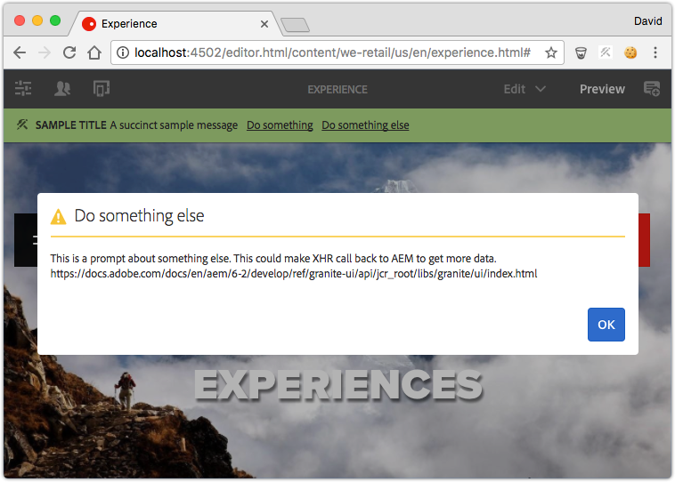
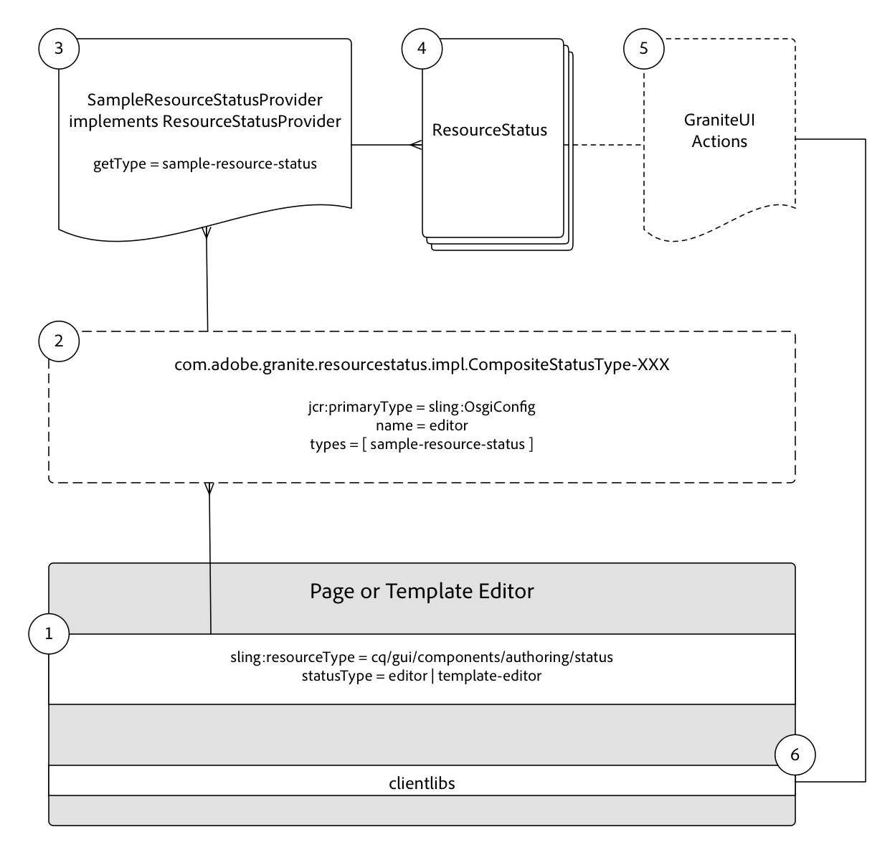

# Developing Resource Statuses {#developing-resource-statuses-in-aem-sites}

Adobe Experience Manager's Resource Status API's, is a pluggable framework for exposing status messaging in AEM's various editor Web UIs.

## Overview {#overview}

The Resource Status for Editors framework provides server-side and client-side APIs for displaying and interacting with editor statuses, in a standard and uniform manner.

The editor status bars are natively available in the Page, Experience Fragment and Template editors of AEM.

Example use cases for custom Resource Status Providers are:

* Notifying authors when a page is within 2 hours of scheduled activation
* Notifying authors that a page was activated within the past 15 mins
* Notifying authors that a page was edited within the last 5 mins, and by whom

 

## Resource status provider framework {#resource-status-provider-framework}

When developing custom Resource Statuses, the develop work is comprised of:

1. The ResourceStatusProvider implementation, that is responsible for determining if a status is required, and the basic information about the status: title, message, priority, variant, icon, and available actions.
2. Optionally, GraniteUI JavaScript that implements the functionality of any available actions.

    

3. The status resource provided as part of the Page, Experience Fragment and Template editors is given a type via the resources "statusType" property.

    * Page editor: `editor`
    * Experience Fragment editor: `editor`
    * Template editor: `template-editor`

4. The status resource's `statusType` is matched to registered `CompositeStatusType` OSGi configured `name` property.

   For all matches, the `CompositeStatusType's` types are collected, and used to collect the `ResourceStatusProvider` implementations that have this type, via `ResourceStatusProvider.getType()`.

5. The matching `ResourceStatusProvider` is passed the `resource` in the editor, and determines if the `resource` has status to be displayed. If status is needed, this implementation is responsible for building 0 or many `ResourceStatuses` to return, each representing a status to display.

   Typically, a `ResourceStatusProvider` returns 0 or 1 `ResourceStatus` per `resource`.

6. ResourceStatus is an interface that can be implemented by the customer, or the helpful `com.day.cq.wcm.commons.status.EditorResourceStatus.Builder` can be used to construct a status. A status is comprised of:

    * Title
    * Message
    * Icon
    * Variant
    * Priority
    * Actions
    * Data

7. Optionally, if `Actions` are provided for the `ResourceStatus` object, supporting clientlibs are required to bind functionality to the action links int he status bar.

   ```js

   (function(jQuery, document) {
       'use strict';

       $(document).on('click', '.editor-StatusBar-action[data-status-action-id="do-something"]', function () {
           // Do something on the click of the resource status action

       });
   })(jQuery, document);

   ```

8. Any supporting JavaScript or CSS to support the actions, must be proxied through each editor's respective client libraries to ensure the front-end code is available in the editor.

    * Page editor category: `cq.authoring.editor.sites.page`
    * Experience Fragment editor category: `cq.authoring.editor.sites.page`
    * Template editor category: `cq.authoring.editor.sites.template`

## View the code {#view-the-code}

[See code on GitHub](https://github.com/Adobe-Consulting-Services/acs-aem-samples/tree/master/bundle/src/main/java/com/adobe/acs/samples/resourcestatus/impl/SampleEditorResourceStatusProvider.java)

## Additional Resources {#additional-resources}

* [`com.adobe.granite.resourcestatus` JavaDocs](https://helpx.adobe.com/experience-manager/6-5/sites/developing/using/reference-materials/javadoc/com/adobe/granite/resourcestatus/package-summary.html)
* [`com.day.cq.wcm.commons.status.EditorResourceStatus` JavaDocs](https://helpx.adobe.com/experience-manager/6-5/sites/developing/using/reference-materials/javadoc/com/day/cq/wcm/commons/status/EditorResourceStatus.html)
