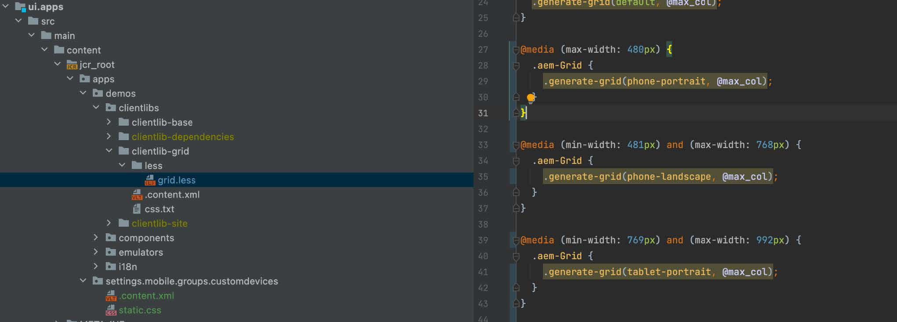
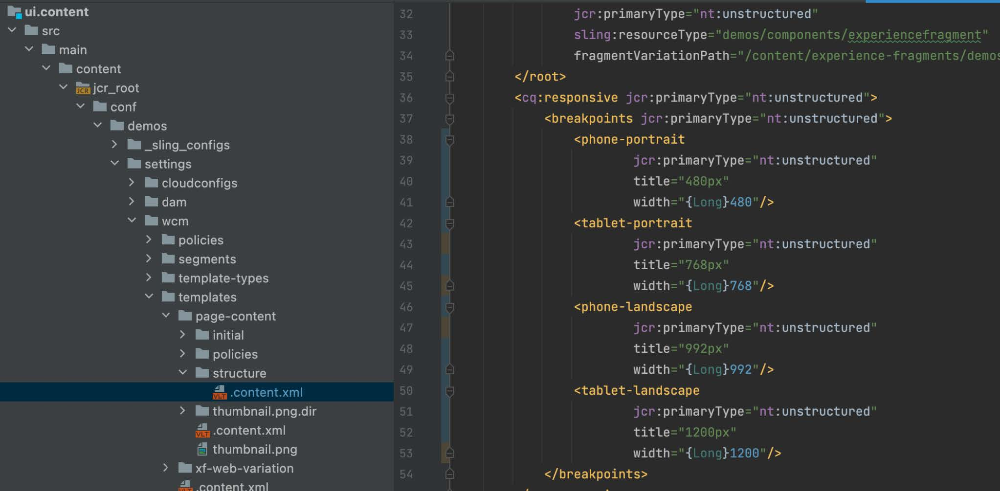
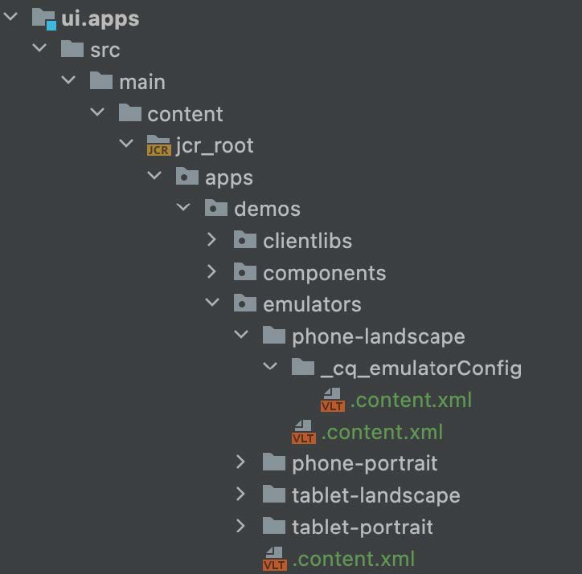
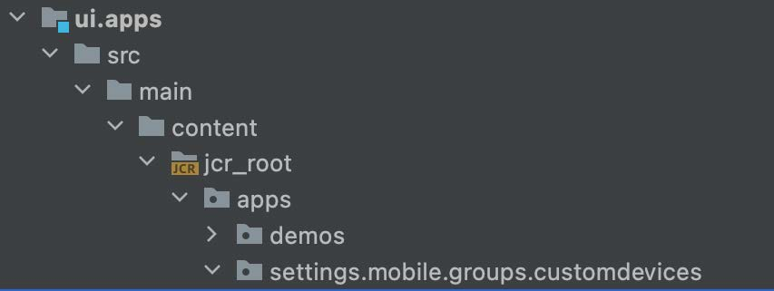
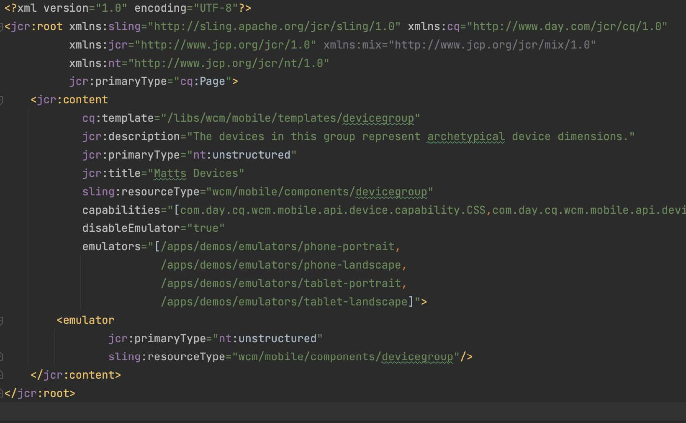

# Responsive breakpoints

Learn how to configure new responsive breakpoints for AEM responsive Page Editor.

## Create CSS breakpoints

First, create media breakpoints in the AEM Responsive Grid CSS that the responsive AEM site adheres to.

In `/ui.apps/src/main/content/jcr_root/apps/[app name]/clientlibs/clientlib-grid/less/grid.less` file, create your breakpoints to be used together with the mobile emulator. Make note of the `max-width` for each breakpoint, as this maps the CSS breakpoints to the AEM responsive Page Editor breakpoints.

## Customize the template's breakpoints

Open the `ui.content/src/main/content/jcr_root/conf/<app name>/settings/wcm/templates/page-content/structure/.content.xml` file and update `cq:responsive/breakpoints` with your new breakpoint node definitions. Each [CSS breakpoint](#create-new-css-breakpoints) should have a corresponding node under `breakpoints` with its `width` property set to the CSS breakpoint's `max-width`. 

## Create emulators

AEM emulators must be defined that allow authors to select the responsive view to edit in the Page Editor.

Create emulators nodes under `/ui.apps/src/main/content/jcr_root/apps/<app name>/emulators`
 
For example, `/ui.apps/src/main/content/jcr_root/apps/wknd-examples/emulators/phone-landscape`. Copy a reference emulator node from `/libs/wcm/mobile/components/emulators` in CRXDE Lite to and update the copy to expedite node definition.

## Create device group

Group the emulators to [make them available in AEM Page Editor](#update-the-templates-device-group).

Create `/apps/settings/mobile/groups/<name of device group>` node structure under `/ui.apps/src/main/content/jcr_root`.

Create a `.content.xml` file in `/apps/settings/mobile/groups/<device group name>` and define
the new emulators using code similar to the one below:

## Update the template's device group

Lastly, map the device group back to the page template so the emulators are available in the Page Editor for pages created from this template.

Open the `ui.content/src/main/content/jcr_root/conf/[app name]/settings/wcm/templates/page-content/structure/.content.xml` file and update the `cq:deviceGroups` property to reference the new mobile group (for example, `cq:deviceGroups="[mobile/groups/customdevices]"`)
