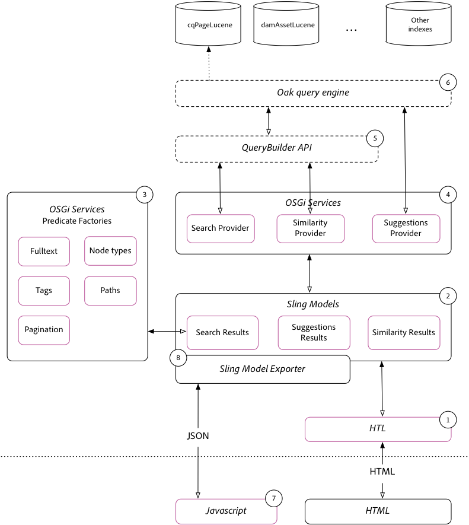

# Simple search implementation guide{#simple-search-implementation-guide}

The Simple search implementation are the materials from the **Adobe Summit lab AEM Search Demystified**. This page contains the materials from this lab. For a guided tour of the lab, please view  the Lab workbook in the Presentation section of this page.



## Presentation materials {#bookmarks}

* [Lab workbook](assets/l4080/l4080-lab-workbook.pdf)
* [Presentation](assets/l4080/l4080-presentation.pdf)

## Bookmarks {#bookmarks-1}

### Tools {#tools}

* [Index Manager](http://localhost:4502/libs/granite/operations/content/diagnosis/tool.html/granite_oakindexmanager)
* [Explain Query](http://localhost:4502/libs/granite/operations/content/diagnosis/tool.html/granite_queryperformance)
* [CRXDE Lite](http://localhost:4502/crx/de/index.jsp#/oak%3Aindex/cqPageLucene) &gt; /oak:index/cqPageLucene
* [CRX Package Manager](http://localhost:4502/crx/packmgr/index.jsp)
* [QueryBuilder Debugger](http://localhost:4502/libs/cq/search/content/querydebug.html?)
* [Oak Index Definition Generator](https://oakutils.appspot.com/generate/index)

### Chapters {#chapters}

*The Chapter links below assume the [Initial Packages](#initialpackages) are installed on AEM Author at `http://localhost:4502`*

* [Chapter 1](http://localhost:4502/editor.html/content/summit/l4080/chapter-1.html)
* [Chapter 2](http://localhost:4502/editor.html/content/summit/l4080/chapter-2.html)
* [Chapter 3](http://localhost:4502/editor.html/content/summit/l4080/chapter-3.html)
* [Chapter 4](http://localhost:4502/editor.html/content/summit/l4080/chapter-4.html)
* [Chapter 5](http://localhost:4502/editor.html/content/summit/l4080/chapter-5.html)
* [Chapter 6](http://localhost:4502/editor.html/content/summit/l4080/chapter-6.html)
* [Chapter 7](http://localhost:4502/editor.html/content/summit/l4080/chapter-7.html)
* [Chapter 8](http://localhost:4502/editor.html/content/summit/l4080/chapter-8.html)
* [Chapter 9](http://localhost:4502/editor.html/content/summit/l4080/chapter-9.html)

## Packages {#packages}

### Initial packages {#initial-packages}

* [Tags](assets/l4080/summit-tags.zip)
* [Simple search application package](assets/l4080/simple.ui.apps-0.0.1-snapshot.zip)

### Chapter packages {#chapter-packages}

* [Chapter 1 solution](assets/l4080/l4080-chapter1.zip)
* [Chapter 2 solution](assets/l4080/l4080-chapter2.zip)
* [Chapter 3 solution](assets/l4080/l4080-chapter3.zip)
* [Chapter 4 solution](assets/l4080/l4080-chapter4.zip)
* [Chapter 5 setup](assets/l4080/l4080-chapter5-setup.zip)
* [Chapter 5 solution](assets/l4080/l4080-chapter5-solution.zip)
* [Chapter 6 solution](assets/l4080/l4080-chapter6.zip)
* [Chapter 9 solution](assets/l4080/l4080-chapter9.zip)

## Referenced materials {#reference-materials}

* [Github repository](https://github.com/Adobe-Marketing-Cloud/aem-guides/tree/master/simple-search-guide)
* [Sling Models](https://sling.apache.org/documentation/bundles/models.html)
* [Sling Model Exporter](https://sling.apache.org/documentation/bundles/models.html#exporter-framework-since-130)
* [QueryBuilder API](https://experienceleague.adobe.com/docs/)
* [AEM Chrome Plug-in](https://chrome.google.com/webstore/detail/aem-chrome-plug-in/ejdcnikffjleeffpigekhccpepplaode) ([Documentation page](https://adobe-consulting-services.github.io/acs-aem-tools/aem-chrome-plugin/))

## Corrections and Follow-up {#corrections-and-follow-up}

Corrections and clarifications from the lab discussions and answers to follow-up questions from attendees.

1. **How to stop re-indexing?**  

    Re-indexing can be stopped via the IndexStats MBean available via [AEM Web Console &gt; JMX](http://localhost:4502/system/console/jmx)

    * [http://localhost:4502/system/console/jmx/org.apache.jackrabbit.oak%3Aname%3Dasync%2Ctype%3DIndexStats](http://localhost:4502/system/console/jmx/org.apache.jackrabbit.oak%3Aname%3Dasync%2Ctype%3DIndexStats)
        * Execute `abortAndPause()` to abort the re-indexing. This will lock the index to further re-indexing until `resume()` is invoked.
        * Executing `resume()` will restart the indexing process.
    * Documentation: [https://jackrabbit.apache.org/oak/docs/query/indexing.html#async-index-mbean](https://jackrabbit.apache.org/oak/docs/query/indexing.html#async-index-mbean)

2. **How can oak indexes support multiple tenants?**  

    Oak supports placing indexes through-out the content tree, and these indexes will only index within that sub-tree. For example **`/content/site-a/oak:index/cqPageLucene`** could be create to index content only under **`/content/site-a`.**

    An equivalent approach is to use the **`includePaths`** and **`queryPaths`** properties on an index under **`/oak:index`**. For example:

    * `/oak:index/siteAcqPageLucene@includePaths=/content/site-a`
    * `/oak:index/siteAcqPageLucene@queryPaths=/content/site-a`

   The considerations with this approach are:

    * Queries MUST specify a path restriction that is equal to the index's query path scope, or be a descendant there of.
    * Broader scoped indexes (for example `/oak:index/cqPageLucene`) will ALSO index the data, resulting in duplicative-ingestion and disk use cost.
    * May require duplicative configuration management (ex. adding the same indexRules across multiple tenant indexes if they must satisfy the same query sets)
    * This approach is best served on the AEM Publish tier for custom site search, as on AEM Author, it is common for queries to be executed at high up the content tree for different tenants (for example, via OmniSearch) - different index definitions can result in different behavior based only on the path restriction.

3. **Where is a list of all available Analyzers?**

    Oak exposes a set of lucene-provides analyzer configuration elements for use in AEM.

    * [Apache Oak Analyzers documentation](https://jackrabbit.apache.org/oak/docs/query/lucene.html#analyzers)
        * [Tokenizers](https://cwiki.apache.org/confluence/display/solr/Tokenizers)
        * [Filters](https://cwiki.apache.org/confluence/display/solr/Filter+Descriptions)
        * [CharFilters](https://cwiki.apache.org/confluence/display/solr/CharFilterFactories)

4. **How to search for Pages and Assets in the same query?**

   New in AEM 6.3 is the ability to query for multiple node-types in the same provided query. The following QueryBuilder query. Note that each "sub-query" can resolve to its own index, so in this example, the `cq:Page` sub-query resolves to `/oak:index/cqPageLucene` and the `dam:Asset` sub-query resolves to `/oak:index/damAssetLucene`.

   ```plain
   group.p.or=true
   group.1_group.type=cq:Page
   # add all page restrictions to this group
   group.2_group.type=dam:Asset
   # add all asset restrictions to this group
   ```

   results in the following query and query plan:

   ```plain
   QUERY:(//element(*, cq:Page) | //element(*, dam:Asset))

   PLAN: [cq:Page] as [a] /* lucene:cqPageLucene(/oak:index/cqPageLucene) *:* */ union [dam:Asset] as [a] /* lucene:damAssetLucene(/oak:index/damAssetLucene) *:* */
   ```

   Explore the query and results via [QueryBuilder Debugger](http://localhost:4502/libs/cq/search/content/querydebug.html?_charset_=UTF-8&query=group.p.or%3Dtrue%0D%0Agroup.1_group.type%3Dcq%3APage%0D%0A%23+add+all+page+restrictions+to+this+group%0D%0Agroup.2_group.type%3Ddam%3AAsset%0D%0A%23+add+all+asset+restrictions+to+this+group) and [AEM Chrome Plug-in](https://chrome.google.com/webstore/detail/aem-chrome-plug-in/ejdcnikffjleeffpigekhccpepplaode?hl=en-US).

5. **How to search over multiple paths in the same query?**

    New in AEM 6.3 is the ability to query across multiple paths in the same provided query. The following QueryBuilder query. Note that each "sub-query" may resolve to its own index.

   ```plain

   group.p.or=true
   group.1_group.type=cq:Page
   group.1_group.path=/content/docs/en/6-2
   # add all page restrictions to this group
   group.2_group.type=cq:Page
   group.2_group.path=/content/docs/en/6-3
   # add all asset restrictions to this group

   ```

   results in the following query and query plan

   ```plain

   QUERY: (/jcr:root/content/docs/en/_x0036_-2//element(*, cq:Page) | /jcr:root/content/docs/en/_x0036_-3//element(*, cq:Page))

   PLAN: [cq:Page] as [a] /* traverse "/content/docs/en/6-2//*" where isdescendantnode([a], [/content/docs/en/6-2]) */ union [cq:Page] as [a] /* traverse "/content/docs/en/6-3//*" where isdescendantnode([a], [/content/docs/en/6-3]) */

   ```

   Explore the query and results via [QueryBuilder Debugger](http://localhost:4502/libs/cq/search/content/querydebug.html?_charset_=UTF-8&query=group.p.or%3Dtrue%0D%0Agroup.1_group.type%3Dcq%3APage%0D%0Agroup.1_group.path%3D%2Fcontent%2Fdocs%2Fen%2F6-2%0D%0A%23+add+all+page+restrictions+to+this+group%0D%0Agroup.2_group.type%3Dcq%3APage%0D%0Agroup.2_group.path%3D%2Fcontent%2Fdocs%2Fen%2F6-3%0D%0A%23+add+all+asset+restrictions+to+this+group) and [AEM Chrome Plug-in](https://chrome.google.com/webstore/detail/aem-chrome-plug-in/ejdcnikffjleeffpigekhccpepplaode?hl=en-US).
