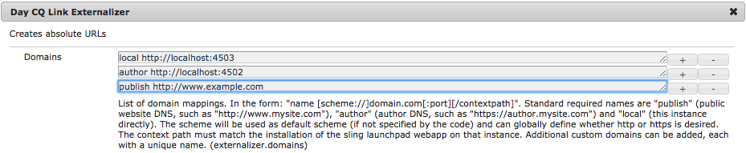

# Using Social Media Sharing {#using-social-media-sharing-in-aem-sites}

Explore setting up and using the Social Media Sharing component.

>[!VIDEO](https://video.tv.adobe.com/v/18897/?quality=9)

This video explores the following facilities of the Social Media Sharing component (part of [AEM Core Components](https://docs.adobe.com/content/help/en/experience-manager-core-components/using/introduction.html)) using the [We.Retail](https://github.com/Adobe-Marketing-Cloud/aem-sample-we-retail#weretail) sample web site.

* 0:00 - Adding and configuring the Social Media Sharing component
* 1:00 - Sharing to Facebook
* 3:10 - Sharing to Pinterest
* 6:25 - Using the Social Media Sharing component on a Product page

## Externalizer setup {#externalizer-setup}

[http://localhost:4502/system/console/configMgr/com.day.cq.commons.impl.ExternalizerImpl](http://localhost:4502/system/console/configMgr/com.day.cq.commons.impl.ExternalizerImpl)

[AEM's externalizer](https://helpx.adobe.com/experience-manager/6-5/sites/developing/using/externalizer.html) should be set up on both AEM Author and AEM Publish, to map the publish runmode to the publicly accessible domain used to access AEM Publish.

In this video we use `/etc/hosts` to spoof *www.example.com* to resolve to localhost, and use a [basic AEM Dispatcher configuration](https://docs.adobe.com/content/help/en/experience-manager-dispatcher/using/getting-started/dispatcher-install.html) to allow www.example.com to front AEM Publish.

## Supporting materials {#supporting-materials}

* [Download the AEM Core Components](https://github.com/adobe/aem-core-wcm-components/releases)
* [Download We.Retail](https://github.com/Adobe-Marketing-Cloud/aem-sample-we-retail/releases)
* [Installing Dispatcher](https://docs.adobe.com/content/help/en/experience-manager-dispatcher/using/getting-started/dispatcher-install.html)
