# Understanding Style System Best Practices{#understanding-style-organization-with-the-aem-style-system}

>[!NOTE]
>
>Please review the content at [Understanding how to code for the Style System](style-system-technical-video-understand.md), to ensure an understanding of the BEM-like conventions used by AEM Style System.

There are two main flavors or styles that are implemented for the AEM Style System:

* **Layout styles**
* **Display styles**

**Layout styles** affect many elements of a Component to create a well define and identifiable rendition (design and layout) of the component, often aligning to a specific re-useable Brand concept. For example, a Teaser component may be able to be presented in the traditional card-based layout, a horizontal Promotional style or as a Hero layout overlaying text on an image.

**Display styles** are used to affect minor variations to Layout styles, however, they do not change the fundamental nature or intent of the Layout style. For example, a Hero layout style may have Display styles that change the color scheme from the primary brand color scheme to the secondary brand color scheme.

## Style organization best practices {#style-organization-best-practices}

When defining the style names available to AEM authors, it is best to:

* Name styles using a vocabulary understood by the authors
* Minimize the number of style options
* Only expose style options and combinations that are allowed by brand standards
* Only expose style combinations that have an effect
  * If ineffective combinations are exposed, ensure they at least do not have an ill effect

As the number of possible style combinations available to AEM authors increases, the more permutations exist that must be QA'd and validated against brand standards. Too many options can also confuse authors as it may become unclear which option or combination is required to produce the desired effect.

### Style names vs CSS classes {#style-names-vs-css-classes}

Style names, or the options presented to AEM authors, and the implementing CSS class names are decoupled in AEM.

This allows Style options to be labeled in a vocabulary clear and understood by the AEM authors,  but lets CSS developers name the CSS classes in a future-proof, semantic manner. For example:

A component must have the options to be colored with the brand's **primary** and **secondary** colors, however, the AEM authors know the colors as **green** and **yellow**, rather than the the design language of primary and secondary.

The AEM Style System can expose these coloring Display styles using author-friendly labels **Green** and **Yellow**, while allowing the CSS developers to use semantic naming of `.cmp-component--primary-color` and `.cmp-component--secondary-color` to define the actual style implementation in CSS.

The Style name of **Green** is mapped to `.cmp-component--primary-color`, and **Yellow** to `.cmp-component--secondary-color`.

If the company's brand color change in the future, all that needs to be changed is the single implementations of `.cmp-component--primary-color` and `.cmp-component--secondary-color`, and the Style names.

## The Teaser component as an example use case {#the-teaser-component-as-an-example-use-case}

The following is an example use case of styling a Teaser component to have several different Layout an Display styles.

This will explore how Style names (exposed to authors) and how the backing CSS classes are organized.

### Teaser component styles configuration {#component-styles-configuration}

The following image shows the [!UICONTROL Styles] configuration for the Teaser component for the variations discussed in the use case.

The [!UICONTROL Style Group] names, Layout, and Display, by happenstance match to the general concepts of Display styles and Layout styles used to conceptually categorize types of styles in this article.

The [!UICONTROL Style Group] names and the number of [!UICONTROL Style Groups] should be tailored to the component use case and project-specific component styling conventions.

For example, the **Display** style group name could have been named **Colors**.

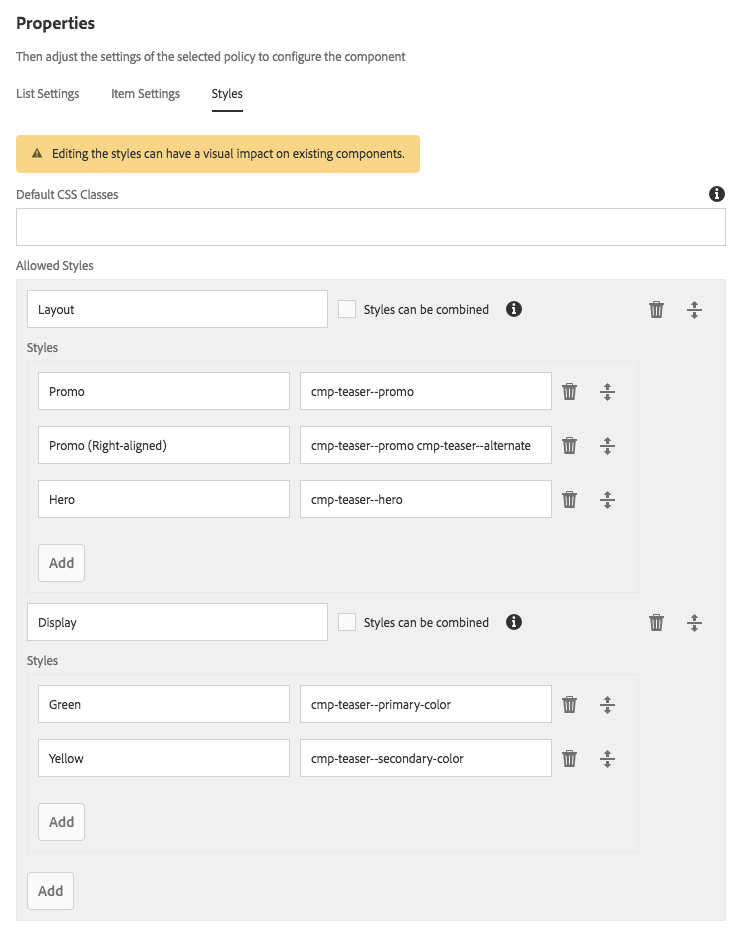

### Style selection menu {#style-selection-menu}

The image below displays the [!UICONTROL Style] menu authors interact with to select the appropriate styles for the component. Note the [!UICONTROL Style Grpi] names, as well as the Style names, are all exposed to the author.

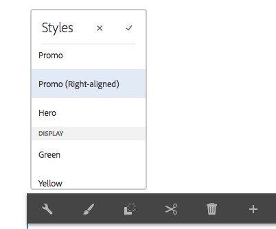 

### Default style {#default-style}

The default style is often the most commonly used style of the component, and the default, un-styled view of the teaser when added to a page.

Depending on the commonality of the default style, the CSS may be applied directly on the `.cmp-teaser` (without any modifiers) or on a `.cmp-teaser--default`.

If the default style rules apply more often than not to all variation, it is best to use `.cmp-teaser` as the default style's CSS classes, since all variations should implicitly inherit them, assuming BEM-like conventions are followed. If not, they should be applied via the default modifier, such as `.cmp-teaser--default`, which in turn needs to be added to the [component's style configuration's Default CSS Classes](#component-styles-configuration) field, otherwise these style rules will have to be overridden in each variation.

It is even possible to assign a "named" style as the default style, for example, the Hero style `(.cmp-teaser--hero)` defined below, however it is more clear to implement the default style against the `.cmp-teaser` or `.cmp-teaser--default` CSS class implementations.

>[!NOTE]
>
>Notice the Default layout style does NOT have a Display style name, however, the author is able to select a Display option in the AEM Style System selection tool.
>
>This in violation of the best practice:
>
>**Only expose style combinations that have an effect**
>
>If an author selects the Display style of **Green** nothing will happen.
>
>In this use case, we will concede this violation, as all other Layout styles must be colorable using the brand colors.
>
>In the **Promo (Right-aligned)** section below we will see how to prevent unwanted style combinations.

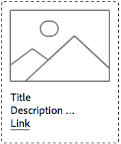

* **Layout style**
  * Default
* **Display style**
  * None
* **Effective CSS Classes**: `.cmp-teaser--promo` or `.cmp-teaser--default`

### Promo style {#promo-style}

The **Promo layout style** is used to promote high-value content on the site and is laid out horizontally to take up a band of space on the web page and must be style-able by brand colors, with the default Promo layout style using black text.

The achieve this, a **layout style** of **Promo** and the **display styles** of **Green** and **Yellow** are configured in the AEM Style System for the Teaser component.

#### Promo Default

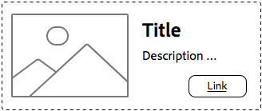

* **Layout style**
  * Style name: **Promo**
  * CSS Class: `cmp-teaser--promo`
* **Display style**
  * None
* **Effective CSS Classes**: `.cmp-teaser--promo`

#### Promo Primary

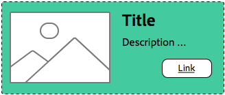

* **Layout style**
  * Style name: **Promo**
  * CSS Class: `cmp-teaser--promo`
* **Display style**
  * Style name: **Green**
  * CSS Class: `cmp-teaser--primary-color`
* **Effective CSS Classes**: `cmp-teaser--promo.cmp-teaser--primary-color`

#### Promo Secondary

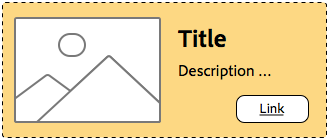

* **Layout style**
  * Style name: **Promo**
  * CSS Class: `cmp-teaser--promo`
* **Display style**
  * Style name: **Yellow**
  * CSS Class: `cmp-teaser--secondary-color`
* **Effective CSS Classes**: `cmp-teaser--promo.cmp-teaser--secondary-color`

### Promo Right-aligned style {#promo-r-align}

The **Promo Right-aligned** layout style is a variation of the Promo style that style flips the location of the image and text (image on right, text on left).

The right alignment, at its core, is a display style, it could be entered into the AEM Style System as a Display style that is selected in conjunction with the Promo layout style. This violates the best practice of:

**Only expose style combinations that have an effect**

..which was already violated in the [Default style](#default-style).

Since the right alignment only affects the Promo layout style, and not the other 2 layout styles: default and hero, we can create a new layout style Promo (Right-aligned) that includes the CSS class that right-aligns the Promo layout styles content: `cmp -teaser--alternate`.

This combination of multiple styles into a single Style entry can also help reduces the number of available styles and style permutations, which is best to minimize.

Notice the name of the CSS class, `cmp-teaser--alternate`, does not have to match the author-friendly nomenclature of "right aligned".

#### Promo Right-aligned Default

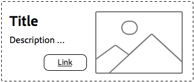

* **Layout style**
  * Style name: **Promo (Right-aligned)**
  * CSS Classes: `cmp-teaser--promo cmp-teaser--alternate`
* **Display style**
  * None
* **Effective CSS Classes**: `.cmp-teaser--promo.cmp-teaser--alternate`

#### Promo Right-aligned Primary

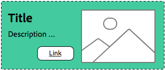

* **Layout style**
  * Style name: **Promo (Right-aligned)**
  * CSS Classes: `cmp-teaser--promo cmp-teaser--alternate`
* **Display style**
  * Style name: **Green**
  * CSS Class: `cmp-teaser--primary-color`
* **Effective CSS Classes**: `.cmp-teaser--promo.cmp-teaser--alternate.cmp-teaser--primary-color`

#### Promo Right-aligned Secondary

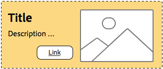

* **Layout style**
  * Style name: **Promo (Right-aligned)**
  * CSS Classes: `cmp-teaser--promo cmp-teaser--alternate`
* **Display style**
  * Style name: **Yellow**
  * CSS Class: `cmp-teaser--secondary-color`
* **Effective CSS Classes**: `.cmp-teaser--promo.cmp-teaser--alternate.cmp-teaser--secondary-color`

### Hero style {#hero-style}

The Hero layout style displays the components' image as a background with the title and link overlayed. The Hero layout style, like the Promo layout style, must be colorable with brand colors.

To color the Hero layout style with brand colors, the same display styles used for the Promo layout style can be leveraged.

Per component, the style name is mapped to the single set of CSS classes, which means the CSS Class names that color the background of the Promo layout style, must color the text and link of the Hero layout style.

This can be trivially achieved by scoping the CSS rules, however, this does require the CSS developers to understand how these permutations are enacted on AEM.

CSS for coloring the background of the **Promote** layout style with the primary (green) color:

```css
.cmp-teaser--promo.cmp-teaser--primary--color {
   ...
   background-color: green;
   ...
}
```

CSS for coloring the text of the **Hero** layout style with the primary (green) color:

```css
.cmp-teaser--hero.cmp-teaser--primary--color {
   ...
   color: green;
   ...
}
```

#### Hero Default

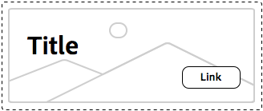

* **Layout style**
  * Style name: **Hero**
  * CSS Class: `cmp-teaser--hero`
* **Display style**
  * None
* **Effective CSS Classes**: `.cmp-teaser--hero`

#### Hero Primary

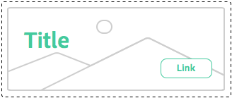

* **Layout style**
  * Style name: **Promo**
  * CSS Class: `cmp-teaser--hero`
* **Display style**
  * Style name: **Green**
  * CSS Class: `cmp-teaser--primary-color`
* **Effective CSS Classes**: `cmp-teaser--hero.cmp-teaser--primary-color`

#### Hero Secondary

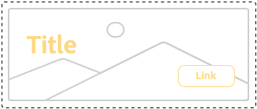

* **Layout style**
  * Style name: **Promo**
  * CSS Class: `cmp-teaser--hero`
* **Display style**
  * Style name: **Yellow**
  * CSS Class: `cmp-teaser--secondary-color`
* **Effective CSS Classes**: `cmp-teaser--hero.cmp-teaser--secondary-color`

## Additional Resources {#additional-resources}

* [Style System Documentation](https://helpx.adobe.com/experience-manager/6-5/sites/authoring/using/style-system.html)
* [Creating AEM Client libraries](https://helpx.adobe.com/experience-manager/6-5/sites/developing/using/clientlibs.html)
* [BEM (Block Element Modifier) documentation website](https://getbem.com/)
* [LESS Documentation website](https://lesscss.org/)
* [jQuery website](https://jquery.com/)
