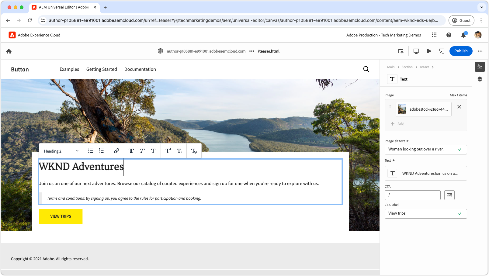
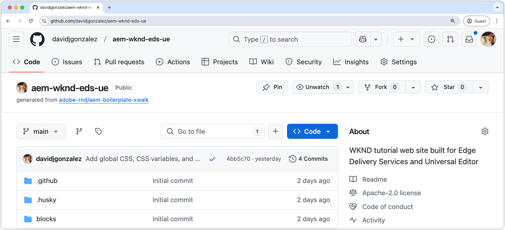
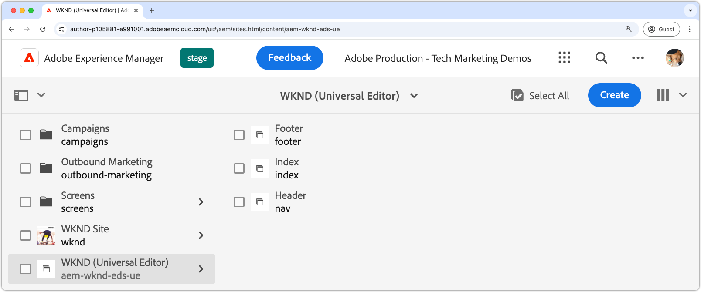
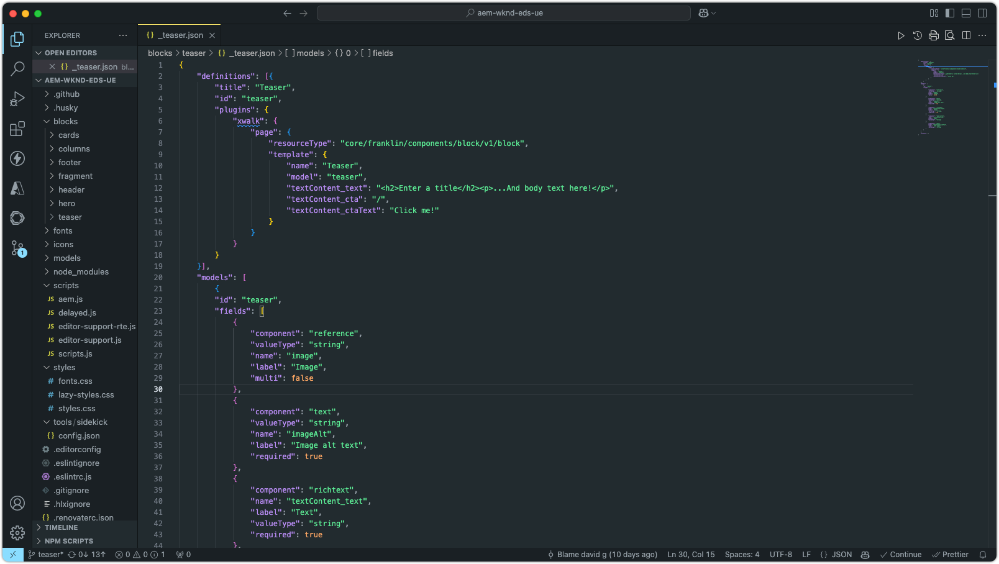
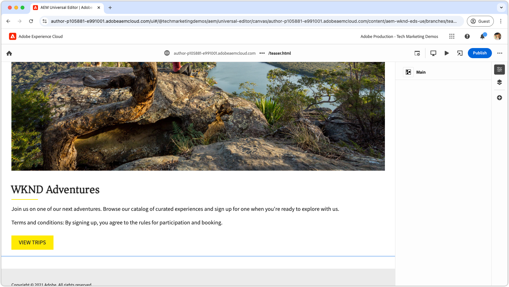
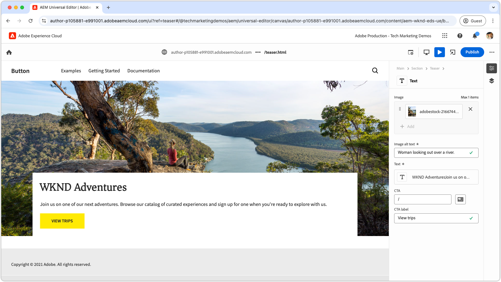
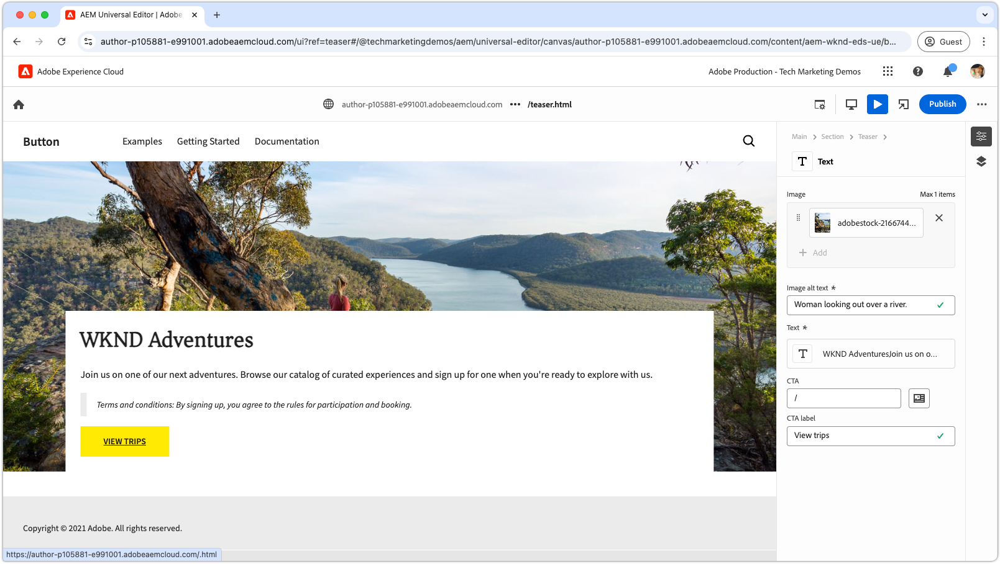

# Edge Delivery Services and Universal Editor developer tutorial

In this tutorial, you'll learn the fundamentals of building an AEM website that combines powerful authoring with Universal Editor and lightning-fast delivery using Edge Delivery Services. By the end, you'll have basic understanding of how to create a new project, set up a local development environment, and build a new block.

## Project setup

Learn how to create a code project and configure a new site in AEM as a Cloud Service. This setup enables seamless development with the Universal Editor for content creation and fast content delivery through Edge Delivery Services. 

<!-- CARDS 

* ./1-new-code-project.md
* ./2-new-aem-site.md

-->
<!-- START CARDS HTML - DO NOT MODIFY BY HAND -->

    

        

            

                <figure class="image x-is-16by9">
                    
                </figure>
            

            

                

                    

                        <a href="./1-new-code-project.md" target="_blank" rel="referrer" title="Create a code project">Create a code project</a>
                    

                    
Create a code project for Edge Delivery Services, editable using the Universal Editor.

                

                <a href="./1-new-code-project.md" target="_blank" rel="referrer" class="spectrum-Button spectrum-Button--outline spectrum-Button--primary spectrum-Button--sizeM" style="align-self: flex-start; margin-top: 1rem;">
                    Learn more
                </a>
            

        

    

    

        

            

                <figure class="image x-is-16by9">
                    
                </figure>
            

            

                

                    

                        <a href="./2-new-aem-site.md" target="_blank" rel="referrer" title="Create an AEM site">Create an AEM site</a>
                    

                    
Create a site in AEM Sites for Edge Delivery Services, editable using the Universal Editor.

                

                <a href="./2-new-aem-site.md" target="_blank" rel="referrer" class="spectrum-Button spectrum-Button--outline spectrum-Button--primary spectrum-Button--sizeM" style="align-self: flex-start; margin-top: 1rem;">
                    Learn more
                </a>
            

        

    

<!-- END CARDS HTML - DO NOT MODIFY BY HAND -->

## Development setup

Learn how to configure your local development environment to enable fast website development. This setup allows for seamless site creation with the Universal Editor and efficient content delivery through Edge Delivery Services, ensuring a smooth and optimized development workflow.
<!-- CARDS 

* ./3-local-development-environment.md
* ./4-website-branding.md

-->
<!-- START CARDS HTML - DO NOT MODIFY BY HAND -->

    

        

            

                <figure class="image x-is-16by9">
                    
                </figure>
            

            

                

                    

                        <a href="./3-local-development-environment.md" target="_blank" rel="referrer" title="Set up a local development environment">Set up a local development environment</a>
                    

                    
Set up a local development environment for sites delivered with Edge Delivery Services and editable with Universal Editor.

                

                <a href="./3-local-development-environment.md" target="_blank" rel="referrer" class="spectrum-Button spectrum-Button--outline spectrum-Button--primary spectrum-Button--sizeM" style="align-self: flex-start; margin-top: 1rem;">
                    Learn more
                </a>
            

        

    

    

        

            

                <figure class="image x-is-16by9">
                    
                </figure>
            

            

                

                    

                        <a href="./4-website-branding.md" target="_blank" rel="referrer" title="Add website branding">Add website branding</a>
                    

                    
Define global CSS, CSS variables and web fonts for an Edge Delivery Services site.

                

                <a href="./4-website-branding.md" target="_blank" rel="referrer" class="spectrum-Button spectrum-Button--outline spectrum-Button--primary spectrum-Button--sizeM" style="align-self: flex-start; margin-top: 1rem;">
                    Learn more
                </a>
            

        

    

<!-- END CARDS HTML - DO NOT MODIFY BY HAND -->

## Block development

Learn how to create a new block by defining its content model and setting up sample content for testing and development. Explore two methods for rendering the block and understand how to structure it for optimal performance and flexibility in AEM and Edge Delivery Services.

<!-- CARDS 

* ./5-new-block.md {image = ./assets/5-new-block/card.png}
* ./6-author-block.md {image = ./assets/6-author-block/card.png}
* ./7a-block-css.md {image = ./assets/7a-block-css/card.png}
* ./7b-block-js-css.md {image = ./assets/7b-block-js-css/card.png}

-->
<!-- START CARDS HTML - DO NOT MODIFY BY HAND -->

    

        

            

                <figure class="image x-is-16by9">
                    
                </figure>
            

            

                

                    

                        <a href="./5-new-block.md" target="_blank" rel="referrer" title="Create a block">Create a block</a>
                    

                    
Build a block for an Edge Delivery Services website that is editable with Universal Editor.

                

                <a href="./5-new-block.md" target="_blank" rel="referrer" class="spectrum-Button spectrum-Button--outline spectrum-Button--primary spectrum-Button--sizeM" style="align-self: flex-start; margin-top: 1rem;">
                    Learn more
                </a>
            

        

    

    

        

            

                <figure class="image x-is-16by9">
                    
                </figure>
            

            

                

                    

                        <a href="./6-author-block.md" target="_blank" rel="referrer" title="Author a block">Author a block</a>
                    

                    
Author a Edge Delivery Services block with Universal Editor.

                

                <a href="./6-author-block.md" target="_blank" rel="referrer" class="spectrum-Button spectrum-Button--outline spectrum-Button--primary spectrum-Button--sizeM" style="align-self: flex-start; margin-top: 1rem;">
                    Learn more
                </a>
            

        

    

    

        

            

                <figure class="image x-is-16by9">
                    
                </figure>
            

            

                

                    

                        <a href="./7a-block-css.md" target="_blank" rel="referrer" title="Develop a block with CSS">Develop a block with CSS</a>
                    

                    
Develop a block with CSS for Edge Delivery Services, editable using the Universal Editor.

                

                <a href="./7a-block-css.md" target="_blank" rel="referrer" class="spectrum-Button spectrum-Button--outline spectrum-Button--primary spectrum-Button--sizeM" style="align-self: flex-start; margin-top: 1rem;">
                    Learn more
                </a>
            

        

    

    

        

            

                <figure class="image x-is-16by9">
                    
                </figure>
            

            

                

                    

                        <a href="./7b-block-js-css.md" target="_blank" rel="referrer" title="Develop a block with CSS and JS">Develop a block with CSS and JS</a>
                    

                    
Develop a block with CSS and JavaScript for Edge Delivery Services, editable using the Universal Editor.

                

                <a href="./7b-block-js-css.md" target="_blank" rel="referrer" class="spectrum-Button spectrum-Button--outline spectrum-Button--primary spectrum-Button--sizeM" style="align-self: flex-start; margin-top: 1rem;">
                    Learn more
                </a>
            

        

    

<!-- END CARDS HTML - DO NOT MODIFY BY HAND -->
