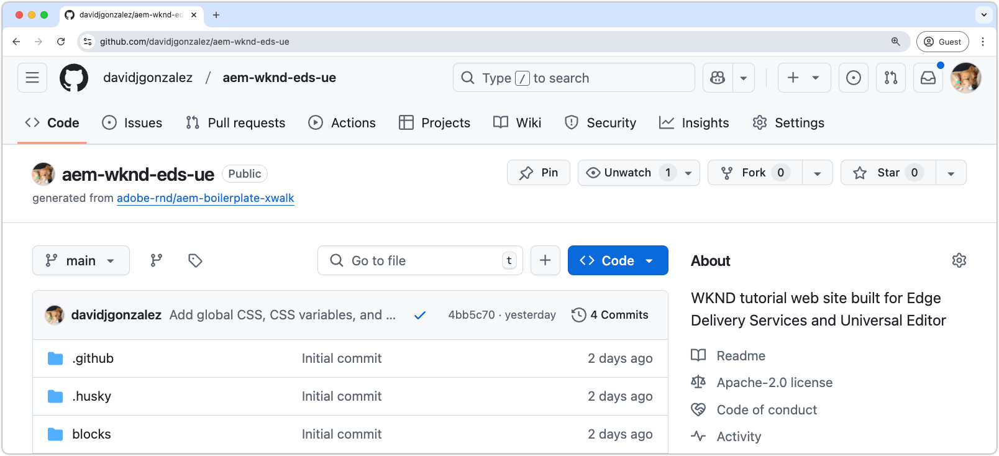

# Create an Edge Delivery Services code project

To build AEM websites for Edge Delivery Services and Universal Editor, use Adobe's [AEM Boilerplate XWalk project template](https://github.com/adobe-rnd/aem-boilerplate-xwalk). This template creates a new code project that contains the CSS and JavaScript used to create the website experience. This template creates a new GitHub repository, and loads it with Adobe's boilerplate code and configuration, providing a solid foundation for your AEM website project.

Remember, [AEM websites delivered by Edge Delivery Services](https://experienceleague.adobe.com/en/docs/experience-manager-learn/sites/edge-delivery-services/overview) only have client-side (browser) code. Website code is not executed in the AEM Author or Publish services.

Follow the [detailed steps outlined in documentation](https://experienceleague.adobe.com/en/docs/experience-manager-cloud-service/content/edge-delivery/wysiwyg-authoring/edge-dev-getting-started#create-github-project) for creating an Edge Delivery Services code project whose content is editable in Universal Editor.  Below is a summarized list of the steps, including the values used in this tutorial.

1. **Set up a GitHub account.** If you're creating a project for your organization, make sure that the organization has a GitHub account, and you're a member.
2. **Create a new code project** using the [AEM Boilerplate XWalk project template](https://github.com/adobe-rnd/aem-boilerplate-xwalk).
3. **Install the AEM Code Sync GitHub app** and grant access to the repository. You can find the [app here](https://github.com/apps/aem-code-sync).
4. **Configure your new project's `fstab.yaml`** to point to the correct AEM Author service.

    * To experiment, you can use lower AEM as a Cloud Service environments (Stage or Dev), however real websites implementations should be configured to use a production AEM service.

5. **Edit your new project's `paths.json`** to map the AEM Author service path to your website's root.

This Git repository is cloned in the [local development environment](https://experienceleague.adobe.com/en/docs/experience-manager-learn/sites/edge-delivery-services/developing/universal-editor/3-local-development-environment) chapter, and where code is developed.

