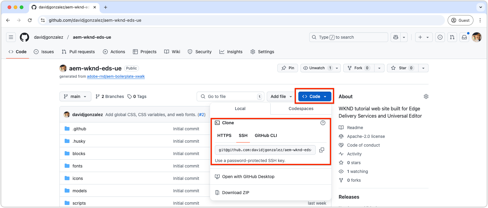

# Setup a local development environment

A local development environment is essential for quickly developing websites delivered by Edge Delivery Services. The environment uses locally developed code while sourcing content from Edge Delivery Services, allowing developers to instantly view code changes. Such a setup supports fast, iterative development and testing.

The development tools and processes for an Edge Delivery Services website project are designed to be familiar to web developers and provide a fast and efficient development experience.

## Development topology

The development topology for an Edge Delivery Services website project that is editable with Universal Editor consists of the following aspects:

- **GitHub repository**:  
   - **Purpose**: Hosts the website's code (CSS and JavaScript).  
   - **Structure**: The **main branch** contains production-ready code, while other branches hold working code.  
   - **Functionality**: Code from any branch can run against the **production** or **preview** environments without affecting the live website.  

- **AEM Author service**:  
   - **Purpose**: Serves as the canonical content repository where website content is edited and managed.  
   - **Functionality**: Content is read and written by the **Universal Editor**. Edited content is published to **Edge Delivery Services** in **production** or **preview** environments.

- **Universal Editor**:  
   - **Purpose**: Provides a WYSIWYG interface for editing website content.  
   - **Functionality**: Reads from and writes to the **AEM Author service**. Can be configured to use code from any branch in the **GitHub repository** to test and validate changes.

- **Edge Delivery Services**:  
   - **Production environment**:  
     - **Purpose**: Delivers the live website content and code to end users.  
     - **Functionality**: Serves content published from the **AEM Author service** using code from the **main branch** of the **GitHub repository**.  
   - **Preview Environment**:  
     - **Purpose**: Provides a staging environment to test and preview content and code before deployment.  
     - **Functionality**: Serves content published from the **AEM Author service** using code from any branch of the **GitHub repository**, enabling thorough testing without affecting the live website.

- **Local developer environment**:  
   - **Purpose**: Allows developers to write and test code (CSS and JavaScript) locally.  
   - **Structure**:  
     - A local clone of the **GitHub repository** for branch-based development.  
     - The **AEM CLI**, which acts as a development server, applies local code changes to the **Preview environment** for a hot-reload experience.  
   - **Workflow**: Developers write code locally, commit changes to a working branch, push the branch to GitHub, validate it in the **Universal Editor** (using the specified branch), and merge it into the **main branch** when ready for production deployment.  

## Prerequisites

Before starting development, install the following on your machine:

1. [Git](https://git-scm.com/)
1. [Node.js & npm](https://nodejs.org)
1. [Microsoft Visual Studio Code](https://code.visualstudio.com/) (or similar code editor)

## Clone the GitHub repository

Clone the [GitHub repository](./1-new-code-project.md) containing the AEM Edge Delivery Services code project to your local development environment.



```bash
$ cd ~/Code
$ git clone git@github.com:<YOUR_ORG>/aem-wknd-eds-ue.git
```

A new `aem-wknd-eds-ue` folder is created in the `Code` directory, which serves as the project's root. Although the project can be cloned to any location on the machine, this tutorial uses `~/Code` as the root directory.

## Install project dependencies

Navigate to the project folder and install the required dependencies with `npm install`. Although Edge Delivery Services projects don't use traditional Node.js build systems like Webpack or Vite, they still require several dependencies for local development.

```bash
# ~/Code/aem-wknd-eds-ue

$ npm install
```

## Install the AEM CLI

The AEM CLI is a Node.js command-line tool designed to streamline the development of Edge Delivery Services-based AEM websites, providing a local development server for rapid development and testing of your website.  

To install the AEM CLI, run:  

```bash
# ~/Code/aem-wknd-eds-ue

$ npm install @adobe/aem-cli
```

The AEM CLI can also be installed globally using `npm install --global @adobe/aem-cli`.

## Start the local AEM development server

The `aem up` command starts the local development server and automatically opens a browser window to the server's URL. This server acts as a reverse proxy to the Edge Delivery Services environment, serving content from there while using your local code base for development.

```bash
$ cd ~/Code/aem-wknd-eds-ue 
$ aem up

    ___    ________  ___                          __      __ 
   /   |  / ____/  |/  /  _____(_)___ ___  __  __/ /___ _/ /_____  _____
  / /| | / __/ / /|_/ /  / ___/ / __ `__ \/ / / / / __ `/ __/ __ \/ ___/
 / ___ |/ /___/ /  / /  (__  ) / / / / / / /_/ / / /_/ / /_/ /_/ / /
/_/  |_/_____/_/  /_/  /____/_/_/ /_/ /_/\__,_/_/\__,_/\__/\____/_/

info: Starting AEM dev server version x.x.x
info: Local AEM dev server up and running: http://localhost:3000/
info: Enabled reverse proxy to https://main--aem-wknd-eds-ue--<YOUR_ORG>.aem.page
```

The AEM CLI opens the website in your browser at `http://localhost:3000/`. Changes in the project are automatically hot-reloaded in the web browser, while content changes [require publishing to the preview environment](./6-author-block.md) and refreshing the web browser.

## Build JSON fragments

Edge Delivery Services projects, created using the [AEM Boilerplate XWalk template](https://github.com/adobe-rnd/aem-boilerplate-xwalk), rely on JSON configurations that enable block authoring in the Universal Editor.

- **JSON fragments**: Stored with their associated blocks and define the block models, definitions, and filters.  
  - **Model fragments**: Stored at `/blocks/example/_example.json`.  
  - **Definition fragments**: Stored at `/blocks/example/_example.json`.  
  - **Filter fragments**: Stored at `/blocks/example/_example.json`.  

NPM scripts compile these JSON fragments and place them in the appropriate locations in the project root. To build JSON files, use the provided NPM scripts. For example, to compile all fragments, run:  

```bash
# ~/Code/aem-wknd-eds-ue

npm run build:json
```

| NPM script         | Description                                                                 |
|--------------------|-----------------------------------------------------------------------------|
| `build:json`        | Builds all JSON files from fragments and adds them to the appropriate `component-*.json` files. |
| `build:json:models` | Builds block JSON fragments and compiles them into `/component-models.json`. |
| `build:json:definitions` | Builds page JSON fragments and compiles them into `/component-definitions.json`. |
| `build:json:filters` | Builds page JSON fragments and compiles them into `/component-filters.json`. |

>[!TIP]
>
> Run `npm run build:json` after any changes to fragment files to regenerate the main JSON files. 

## Linting  

Linting ensures code quality and consistency, which is required for Edge Delivery Services projects before merging changes into the `main` branch.  

The NPM scripts can be run via `npm run`, for example: 

```bash
# ~/Code/aem-wknd-eds-ue

$ npm run lint
```

| NPM script       | Description                                      |
|------------------|--------------------------------------------------|
| `lint:js`        | Runs JavaScript linting checks.                  |
| `lint:css`       | Runs CSS linting checks.                         |
| `lint`           | Runs both JavaScript and CSS linting checks.     |

### Fix linting issues automatically  

You can automatically resolve linting issues by adding the following `scripts` to the project's `package.json`, and can be run via `npm run`:

```bash
# ~/Code/aem-wknd-eds-ue

$ npm run lint:fix
```

These scripts do not come pre-configured with the AEM Boilerplate XWalk template, but can be added to the `package.json` file:

>[!BEGINTABS]

>[!TAB Additional scripts]

| NPM script       | Command                                        | Description                                           |
|------------------|------------------------------------------------|-------------------------------------------------------|
| `lint:js:fix`    | `npm run lint:js --fix`                        | Automatically fixes JavaScript linting issues.        |
| `lint:css:fix`   | `stylelint blocks/**/*.css styles/*.css --fix` | Automatically fixes CSS linting issues.               |
| `lint:fix`       | `npm run lint:js:fix && npm run lint:css:fix`   | Runs both JS and CSS fix scripts for quick cleanup.   |

>[!TAB package.json example]

The following script entries can be added to the `package.json` `scripts` array.

```json
{
  ...
  "scripts": [
    ...,
    "lint:js:fix": "npm run lint:js --fix",
    "lint:css:fix": "npm run lint:css --fix",
    "lint:fix": "npm run lint:js:fix && npm run lint:css:fix",
    ...
  ]
  ...
}
```

>[!ENDTABS]
