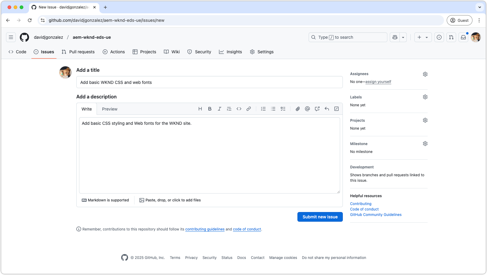
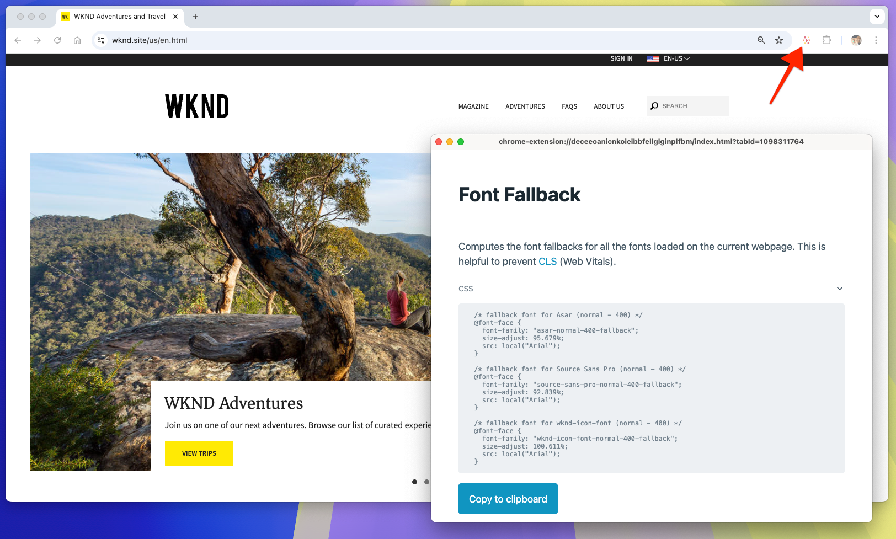
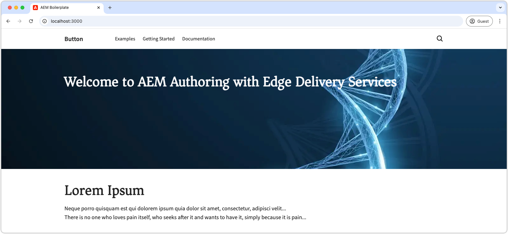

# Add website branding

Begin by setting up the overall branding by updating global styles, defining CSS variables, and adding web fonts. These foundational elements ensure that the website remains consistent and maintainable and should be applied consistently across the site.

## Create a GitHub issue

To keep everything organized, use GitHub to track work. First, create a GitHub issue for this body of work:

1. Go to the GitHub repository (refer to the [Create a code project](./1-new-code-project.md) chapter for details).
2. Click on the **Issues** tab and then **New issue**.
3. Write a **title** and **description** for the work to be done.
4. Click **Submit new issue**.

The GitHub issue is used later when [creating a pull request](#merge-code-changes).



## Create a working branch

To maintain organization and ensure code quality, create a new branch for each body of work. This practice prevents new code from negatively affecting performance and ensures that changes are not live before they are complete.

For this chapter, which focuses on the basic styles for the website, create a branch named `wknd-styles`.

```bash
# ~/Code/aem-wknd-eds-ue

$ git checkout -b wknd-styles
```

## Global CSS

Edge Delivery Services uses a global CSS file, located at `styles/styles.css`, to set up the common styles for the entire website. The `styles.css` controls aspects like colors, fonts, and spacing, making sure that everything looks consistent across the site.

Global CSS should be agnostic to lower-level constructs such as blocks, focusing on the overall look and feel of the site, and shared visual treatments.

Keep in mind that global CSS styles can be overridden when needed.

### CSS variables

[CSS variables](https://developer.mozilla.org/en-US/docs/Web/CSS/Using_CSS_custom_properties) are a great way to store design settings like colors, fonts, and sizes. By using variables, you can change these elements in one place and have it update throughout the whole site.

To get started with customizing the CSS variables, follow these steps:

1. Open the `styles/styles.css` file in the code editor.
2. Find the `:root` declaration, where global CSS variables are stored.
3. Modify the color and font variables to match the WKND brand.

Here's an example:


```css
/* styles/styles.css */

:root {
  /* colors */
  --primary-color: rgb(255, 234, 3); /* WKND primary color */
  --secondary-color: rgb(32, 32, 32); /* Secondary brand color */
  --background-color: white; /* Background color */
  --light-color: rgb(235, 235, 235); /* Light background color */
  --dark-color: var(--secondary-color); /* Dark text color */
  --text-color: var(--secondary-color); /* Default text color */
  --link-color: var(--text-color); /* Link color */
  --link-hover-color: black; /* Link hover color */

  /* fonts */
  --heading-font: 'Roboto', sans-serif; /* Heading font */
  --body-font: 'Open Sans', sans-serif; /* Body font */
  --base-font-size: 16px; /* Base font size */
}
```

Explore the other variables in the `:root` section and review the default settings. 

As you develop a web site, and find yourself repeating the same CSS values, consider creating new variables to make the styles easier to manage. Examples of other CSS properties that can benefit from CSS variables, include: `border-radius`, `padding`, `margin`, and `box-shadow`.

### Bare elements

Bare elements are styled directly through their element name instead of using a CSS class. For example, rather than styling a `.page-heading` CSS class, styles are applied to the `h1` element using `h1 { ... }`.

In the `styles/styles.css` file, a set of base styles is applied to bare HTML elements. Edge Delivery Services websites prioritize using bare elements because they align with Edge Delivery Service's native semantic HTML.

To align with WKND branding, let's style some bare elements in `styles.css`:

```css
/* styles/styles.css */

...
h2 {
  font-size: var(--heading-font-size-xl); /* Set font size for h2 */
}

/* Add a partial yellow underline under H2 */
h2::after {
  border-bottom: 2px solid var(--primary-color); /* Yellow underline */
  content: "";
  display: block;
  padding-top: 8px;
  width: 84px;
}
...
```

These styles ensure that `h2` elements, unless overridden, are consistently styled with the WKND branding, helping to create a clear visual hierarchy. The partial yellow underline under each `h2` adds a distinctive touch to the headings.

### Inferred elements

In Edge Delivery Services, the project's `scripts.js` and `aem.js` code automatically enhance specific bare HTML elements based on their context within the HTML.

For example, anchor (`<a>`) elements authored on their own line - rather than inline with surrounding text — are inferred to be buttons based on this context. These anchors are automatically wrapped with a container `div` with CSS class `button-container` and the anchor element has a `button` CSS class added. 

For instance, when a link is authored on its own line, Edge Delivery Services JavaScript updates its DOM to the following:

```html
<p class="button-container">
  <a href="/authored/link" title="Click me" class="button">Click me</a>
</p>
```

These buttons can be customized to match the WKND brand - which dictates buttons appear as yellow rectangles with black text.

Here is an example of how to style the "inferred buttons" in `styles.css`:

```css
/* styles/styles.css */

/* Buttons */
a.button:any-link,
button {
  box-sizing: border-box;
  display: inline-block;
  max-width: 100%;
  margin: 12px 0;
  border: 2px solid transparent;
  padding: 0.5em 1.2em;
  font-family: var(--body-font-family);
  font-style: normal;
  font-weight: 500;
  line-height: 1.25;
  text-align: center;
  text-decoration: none;
  cursor: pointer;
  overflow: hidden;
  text-overflow: ellipsis;
  white-space: nowrap;

  /* WKND specific treatments */
  text-transform: uppercase;
  background-color: var(--primary-color);
  color: var(--dark-color);
  border-radius: 0;
}
```

This CSS defines the base button styles and includes WKND-specific treatments, such as uppercase text, a yellow background, and black text. The `background-color` and `color` properties use CSS variables allowing the button style to stay aligned with the brand's colors. This approach ensures that buttons are consistently styled across the site while remaining flexible.

## Web fonts

Edge Delivery Services projects optimize the use of web fonts to maintain high performance and minimize the impact on Lighthouse scores. This method ensures fast rendering without compromising the site's visual identity. Here's how to implement web fonts efficiently for optimal performance.

### Font faces

Add custom web fonts using CSS `@font-face` declarations in the `styles/fonts.css` file. Adding the `@font-faces` to `fonts.css` ensures that web fonts are loaded at the optimal time, helping maintain Lighthouse scores.

1. Open `styles/fonts.css`.
2. Add the following `@font-face` declarations to include the WKND brand fonts: `Asar` and `Source Sans Pro`.

```css
/* styles/fonts.css */

@font-face {
  font-family: Asar;
  font-style: normal;
  font-weight: 400;
  font-display: swap;
  src: url("https://fonts.gstatic.com/s/asar/v22/sZlLdRyI6TBIbkEaDZtQS6A.woff2") format('woff2');
  unicode-range: U+0000-00FF, U+0131, U+0152-0153, U+02BB-02BC, U+02C6, U+02DA, U+02DC, U+0304, U+0308, U+0329, U+2000-206F, U+20AC, U+2122, U+2191, U+2193, U+2212, U+2215, U+FEFF, U+FFFD;
}

@font-face {
  font-family: 'Source Sans Pro';
  font-style: italic;
  font-weight: 300;
  font-display: swap;
  src: url("https://fonts.gstatic.com/s/sourcesanspro/v22/6xKwdSBYKcSV-LCoeQqfX1RYOo3qPZZMkids18S0xR41.woff2") format('woff2');
  unicode-range: U+0000-00FF, U+0131, U+0152-0153, U+02BB-02BC, U+02C6, U+02DA, U+02DC, U+0304, U+0308, U+0329, U+2000-206F, U+20AC, U+2122, U+2191, U+2193, U+2212, U+2215, U+FEFF, U+FFFD;
}

@font-face {
  font-family: 'Source Sans Pro';
  font-style: italic;
  font-weight: 400;
  font-display: swap;
  src: url("https://fonts.gstatic.com/s/sourcesanspro/v22/6xK1dSBYKcSV-LCoeQqfX1RYOo3qPZ7nsDJB9cme.woff2") format('woff2');
  unicode-range: U+0000-00FF, U+0131, U+0152-0153, U+02BB-02BC, U+02C6, U+02DA, U+02DC, U+0304, U+0308, U+0329, U+2000-206F, U+20AC, U+2122, U+2191, U+2193, U+2212, U+2215, U+FEFF, U+FFFD;
}

@font-face {
  font-family: 'Source Sans Pro';
  font-style: italic;
  font-weight: 600;
  font-display: swap;
  src: url("https://fonts.gstatic.com/s/sourcesanspro/v22/6xKwdSBYKcSV-LCoeQqfX1RYOo3qPZY4lCds18S0xR41.woff2") format('woff2');
  unicode-range: U+0000-00FF, U+0131, U+0152-0153, U+02BB-02BC, U+02C6, U+02DA, U+02DC, U+0304, U+0308, U+0329, U+2000-206F, U+20AC, U+2122, U+2191, U+2193, U+2212, U+2215, U+FEFF, U+FFFD;
}

@font-face {
  font-family: 'Source Sans Pro';
  font-style: normal;
  font-weight: 300;
  font-display: swap;
  src: url("https://fonts.gstatic.com/s/sourcesanspro/v22/6xKydSBYKcSV-LCoeQqfX1RYOo3ik4zwlxdu3cOWxw.woff2") format('woff2');
  unicode-range: U+0000-00FF, U+0131, U+0152-0153, U+02BB-02BC, U+02C6, U+02DA, U+02DC, U+0304, U+0308, U+0329, U+2000-206F, U+20AC, U+2122, U+2191, U+2193, U+2212, U+2215, U+FEFF, U+FFFD;
}

@font-face {
  font-family: 'Source Sans Pro';
  font-style: normal;
  font-weight: 400;
  font-display: swap;
  src: url("https://fonts.gstatic.com/s/sourcesanspro/v22/6xK3dSBYKcSV-LCoeQqfX1RYOo3qOK7lujVj9w.woff2") format('woff2');
  unicode-range: U+0000-00FF, U+0131, U+0152-0153, U+02BB-02BC, U+02C6, U+02DA, U+02DC, U+0304, U+0308, U+0329, U+2000-206F, U+20AC, U+2122, U+2191, U+2193, U+2212, U+2215, U+FEFF, U+FFFD;
}

@font-face {
  font-family: 'Source Sans Pro';
  font-style: normal;
  font-weight: 600;
  font-display: swap;
  src: url("https://fonts.gstatic.com/s/sourcesanspro/v22/6xKydSBYKcSV-LCoeQqfX1RYOo3i54rwlxdu3cOWxw.woff2") format('woff2');
  unicode-range: U+0000-00FF, U+0131, U+0152-0153, U+02BB-02BC, U+02C6, U+02DA, U+02DC, U+0304, U+0308, U+0329, U+2000-206F, U+20AC, U+2122, U+2191, U+2193, U+2212, U+2215, U+FEFF, U+FFFD;
}
```

The fonts used in this tutorial are sourced from Google Fonts, but web fonts can be obtained from any font provider, including [Adobe Fonts](https://fonts.adobe.com/).

+++Using local web font files

Alternatively, web fonts files be copied into project in the `/fonts` folder, and referenced in the `@font-face` declarations.

This tutorial uses the remote, hosted, web fonts so that it is easier to follow along.

```css
/* styles/fonts.css */

@font-face { 
    font-family: Asar;
    ...
    src: url("/fonts/asar.woff2") format('woff2'),
    ...
}
```

+++

Lastly, update the `styles/styles.css` CSS variables to use the new fonts:

```css
/* styles/styles.css */

:root {
    ...
    /* fonts */
    --body-font-family: 'Source Sans Pro', roboto-fallback, sans-serif;
    --heading-font-family: 'Asar', roboto-condensed-fallback, sans-serif;
    ...
}
```

The `roboto-fallback` and `roboto-condensed-fallback` are fallback fonts that are updated in the [Fallback fonts](#fallback-fonts) section to align to support the custom `Asar` and `Source Sans Pro` web fonts.

### Fallback fonts

Web fonts often impact performance due to their size, potentially increasing Cumulative Layout Shift (CLS) scores, and reducing overall Lighthouse scores. To ensure instant text display while web fonts are loading, Edge Delivery Services projects use browser-native fallback fonts. This approach helps maintain a smooth user experience while the desired font applies.

To select the best fallback font, use Adobe's [Helix Font Fallback Chrome extension](https://www.aem.live/developer/font-fallback), which determines a closely matching font for browsers to use before the custom font loads. The resulting fallback font declarations should be added to the `styles/styles.css` file to improve performance and ensure a seamless experience for users.

{align=center}

To use the [Helix Font Fallback Chrome extension](https://www.aem.live/developer/font-fallback), ensure that the web page has web fonts applied in the same variations used on the Edge Delivery Services website. This tutorial demonstrates the extension on [wknd.site](http://wknd.site/us/en.html). When developing a website, apply the extension to the site being worked on rather than to [wknd.site](http://wknd.site/us/en.html).

```css
/* styles/styles.css */
...

/* fallback fonts */

/* Fallback font for Asar (normal - 400) */
@font-face {
    font-family: "asar-normal-400-fallback";
    size-adjust: 95.7%;
    src: local("Arial");
}

/* Fallback font for Source Sans Pro (normal - 400) */
@font-face {
    font-family: "source-sans-pro-normal-400-fallback";
    size-adjust: 92.9%;
    src: local("Arial");
}

...
```

Add the fallback font-family names to the fonts CSS variables in `styles/styles.css` after the "real" font-family names.

```css
/* styles/styles.css */

:root {
    ...
    /* fonts */
    --body-font-family: 'Source Sans Pro', source-sans-pro-normal-400-fallback, sans-serif;
    --heading-font-family: 'Asar', asar-normal-400-fallback, sans-serif;
    ...
}
```

## Development preview

As you add CSS, the AEM CLI's local development environment automatically reloads the changes, making it fast and easy to see how the CSS is affecting the block.




## Download final CSS files 

You can download the updated CSS files from the links below:

* [`styles.css`](https://raw.githubusercontent.com/davidjgonzalez/aem-wknd-eds-ue/refs/heads/main/styles/styles.css)
* [`fonts.css`](https://raw.githubusercontent.com/davidjgonzalez/aem-wknd-eds-ue/refs/heads/main/styles/fonts.css)

## Lint the CSS files

Make sure to [frequently lint](./3-local-development-environment.md#linting) your code changes to ensure they are clean and consistent. Linting regularly helps catch issues early and reduces overall development time. Remember, you can't merge your work to the main branch until all linting issues are resolved!

```bash
$ npm run lint:css
```

## Merge code changes

Merge the changes into the `main` branch on GitHub to build future work upon these updates.

```bash
$ git add .
$ git commit -m "Add global CSS, CSS variables, and web fonts"
$ git push origin wknd-styles
```

Once the changes are pushed to the `wknd-styles` branch, create a pull request on GitHub to merge them into the `main` branch.

1. Navigate to the GitHub repository from the [Create a new project](./1-new-code-project.md) chapter.
2. Click the **Pull requests** tab and select **New pull request**.
3. Set `wknd-styles` as the source branch and `main` as the target branch.
4. Review the changes and click **Create pull request**.
5. In the pull request details, **add the following**:

    ```
    Add basic global CSS, CSS variables, and web fonts (including fallback fonts) to support the WKND brand.

    Fix #1

    Test URLs:
    - Before: https://main--wknd-aem-eds-ue--davidjgonzalez.aem.live/
    - After: https://wknd-styles--wknd-aem-eds-ue--davidjgonzalez.aem.live/
    ```
  
    * The `Fix #1` references the GitHub issue created earlier.
    * The Test URLs tell AEM Code Sync what branches to use for validation and comparison. The "After" URL uses the working branch `wknd-styles`, to check how the code changes impact website performance.

6. Click **Create pull request**.
7. Wait for the [AEM Code Sync GitHub app](./1-new-code-project.md) to **complete quality checks**. If they fail, resolve the errors and rerun the checks.
8. Once the checks pass, **merge the pull request** into `main`.

With the changes merged into `main`, they are no considered deployed to production, and new development can proceed based on these updates.
