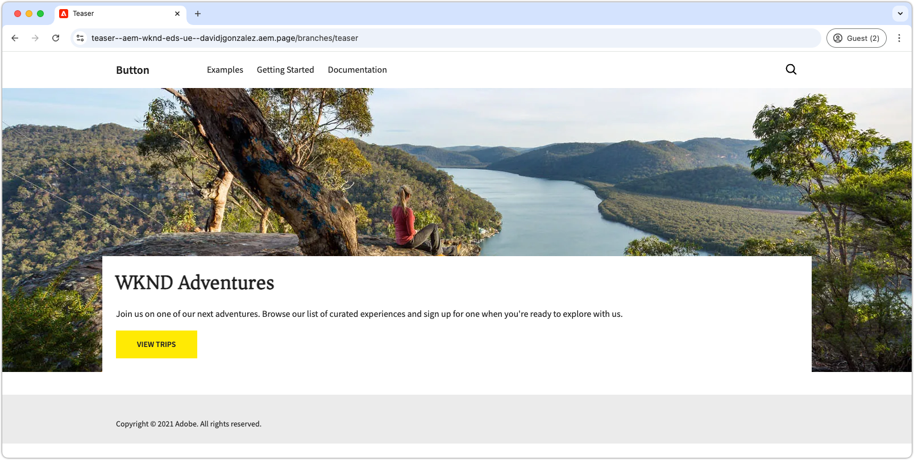
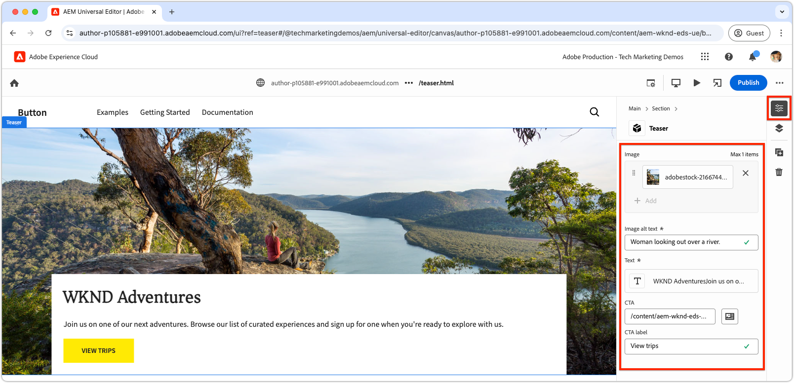
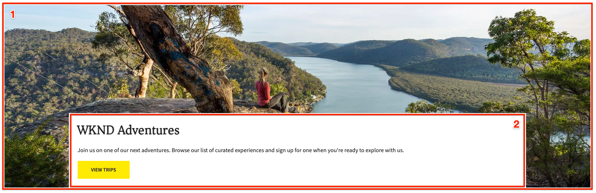
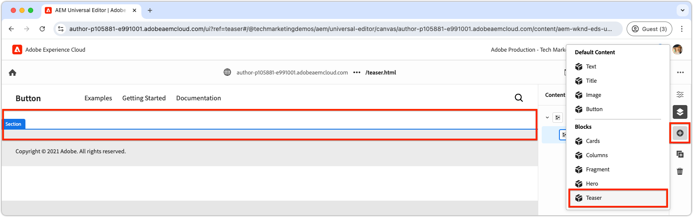

# Create a new block

This chapter covers the process of creating a new, editable teaser block for an Edge Delivery Services website using the Universal Editor.



The block, named `teaser`, showcases the following elements:

- **Image**: A visually engaging image.
- **Text content**:
  - **Title**: A compelling headline to draw focus.
  - **Body text**: Descriptive content providing context or details, including optional terms and conditions.
  - **Call-to-action (CTA) button**: A link designed to prompt user interaction and guide them to further engagement.

The `teaser` block's content is editable in the Universal Editor, ensuring ease of use and reusability throughout the website.

Note the `teaser` block is similar to the boilerplate's `hero` block; thus `teaser` block is only intended to serve as a simple example to illustrate development concepts.

## Create a new Git branch

To maintain a clean and organized workflow, create a new branch for each specific development task. This helps avoid issues with deploying incomplete or untested code to production.

1. **Start from the main branch**: Working from the most up-to-date production code ensures a solid foundation.
2. **Fetch remote changes**: Fetching the latest updates from GitHub ensures that the most current code is available before starting development.  
   - Example: After merging changes from the `wknd-styles` branch into `main`, fetch the latest updates.
3. **Create a new branch**:

```bash
# ~/Code/aem-wknd-eds-ue

$ git fetch origin  
$ git checkout -b teaser origin/main  
```

Once the `teaser` branch is created, you're ready to start developing the teaser block.

## Block folder

Create a new folder named `teaser` in the project's `blocks` directory. This folder contains the block's JSON, CSS, and JavaScript files, organizing the block's files in one location:

```
# ~/Code/aem-wknd-eds-ue

/blocks/teaser
```

The block folder name acts as the block's ID, and is used to reference the block throughout its development.

## Block JSON

The block JSON defines three key aspects of the block:

- **Definition**: Registers the block as an editable component in the Universal Editor, linking it to a block model and optionally a filter.
- **Model**: Specifies the block's authoring fields and how these fields are rendered as semantic Edge Delivery Services HTML.
- **Filter**: Configures filtering rules to restrict which containers the block can be added to via the Universal Editor. Most blocks are not containers, but rather, their id's are added to other container blocks' filters.

Create a new file at `/blocks/teaser/_teaser.json` with the following initial structure, in the exact order. If the keys are out of order, they may not build properly.

[!BADGE /blocks/teaser/_teaser.json]{type=Neutral tooltip="File name of code sample below."}

```json
{
    "definitions": [],
    "models": [],
    "filters": []
}
``` 

### Block model 

The block model is a critical part of the block's configuration, as it defines:

1. The authoring experience by defining the fields available for editing.

    

2. How the field's values are rendered into Edge Delivery Services HTML.

Models are assigned an `id` that corresponds to the [block's definition](#block-definition) and include a `fields` array to specify the editable fields.

Each field in the `fields` array has a JSON object that includes the following required properties:

| JSON property | Description                                                                                                           |
|---------------|-----------------------------------------------------------------------------------------------------------------------|
| `component`   | The [field type](https://experienceleague.adobe.com/en/docs/experience-manager-cloud-service/content/implementing/developing/universal-editor/field-types#component-types), such as `text`, `reference`, or `aem-content`. |
| `name`        | The name of the field, mapping to the JCR property where the value is stored in AEM.                                  |
| `label`       | The label displayed to authors in the Universal Editor.                                                              |

For a comprehensive list of properties, including optional, review the [Universal Editor fields documentation](https://experienceleague.adobe.com/en/docs/experience-manager-cloud-service/content/implementing/developing/universal-editor/field-types#fields).

#### Block design



The teaser block includes the following editable elements:

1. **Image**: Represents the teaser's visual content.
2. **Text content**: Includes the title, body text, and call-to-action button, and sits in a white rectangle.
   - The **title** and **body text** can be authored via the same rich text editor.
   - The **CTA** can be authored via a `text` field for the **label**, and `aem-content` field for the **link**.

The teaser block's design is broken into these two logical components (image and text content), ensuring a structured and intuitive authoring experience for users.

### Block fields

Define the fields required for the block: image, image alt text, text, CTA label, and CTA link.

>[!BEGINTABS]

>[!TAB The right way]

**This tab illustrates the right way to model the teaser block.**

The teaser consists of two logical areas: image and text. To simplify the code needed to display the Edge Delivery Services HTML as the desired web experience, the block model should reflect this structure.

- Group the **image** and **image alt text** together using [field collapse](https://experienceleague.adobe.com/en/docs/experience-manager-cloud-service/content/edge-delivery/wysiwyg-authoring/content-modeling#field-collapse).
- Group the text content fields together using [element grouping](https://experienceleague.adobe.com/en/docs/experience-manager-cloud-service/content/edge-delivery/wysiwyg-authoring/content-modeling#element-grouping), and [field collapse for the CTA](https://experienceleague.adobe.com/en/docs/experience-manager-cloud-service/content/edge-delivery/wysiwyg-authoring/content-modeling#field-collapse).

If you are not familiar with [field collapse](https://experienceleague.adobe.com/en/docs/experience-manager-cloud-service/content/edge-delivery/wysiwyg-authoring/content-modeling#field-collapse), [element grouping](https://experienceleague.adobe.com/en/docs/experience-manager-cloud-service/content/edge-delivery/wysiwyg-authoring/content-modeling#element-grouping), or [type inference](https://experienceleague.adobe.com/en/docs/experience-manager-cloud-service/content/edge-delivery/wysiwyg-authoring/content-modeling#type-inference) review the linked documentation before continuing, as they are essential to creating a well-structured block model.

[!BADGE /blocks/teaser/_teaser.json]{type=Neutral tooltip="File name of code sample below."}

```json
{
    "definitions": [],
    "models": [
        {
            "id": "teaser", 
            "fields": [
                {
                    "component": "reference",
                    "valueType": "string",
                    "name": "image",
                    "label": "Image",
                    "multi": false
                },
                {
                    "component": "text",
                    "valueType": "string",
                    "name": "imageAlt",
                    "label": "Image alt text",
                    "required": true
                },
                {
                    "component": "richtext",
                    "name": "textContent_text",
                    "label": "Text",
                    "valueType": "string",
                    "required": true
                },
                {
                    "component": "aem-content",
                    "name": "textContent_cta",
                    "label": "CTA",
                    "valueType": "string"
                },
                {
                    "component": "text",
                    "name": "textContent_ctaText",
                    "label": "CTA label",
                    "valueType": "string"
                }
            ]
        }
    ],
    "filters": []
}
```

This model defines the authoring inputs in Universal Editor for the block.

The resulting Edge Delivery Services HTML for this block puts the image in the first div, and the element group `textContent` fields in the second div.

```html
<div>
    <div>
        <!-- This div contains the field-collapsed image fields  -->
        <picture>
            ...
            <source .../>            
            
        </picture>
    </div>
    <div>
        <!-- This div, via element grouping contains the textContent fields -->
        <h2>The authored title</h2>
        <p>The authored body text</p>
        <a href="/authored/cta/link">The authored CTA label</a>
    </div>
</div>        
```

As demonstrated [in the next chapter](./7a-block-css.md), this HTML structure simplifies styling the block as a cohesive unit.

To understand the consequences of not using field collapse and element grouping, see the **The wrong way** tab above.

>[!TAB The wrong way]

**This tab illustrates a suboptimal way to model the teaser block, and is only a juxtaposition to the right way.**

Defining each field as a standalone field in the block model without using [field collapse](https://experienceleague.adobe.com/en/docs/experience-manager-cloud-service/content/edge-delivery/wysiwyg-authoring/content-modeling#field-collapse) and [element grouping](https://experienceleague.adobe.com/en/docs/experience-manager-cloud-service/content/edge-delivery/wysiwyg-authoring/content-modeling#element-grouping) may seem tempting. However, this oversight complicates styling the block as a cohesive unit.

For example, the teaser model could be defined **without** field collapse or element grouping as follows:

[!BADGE /blocks/teaser/_teaser.json]{type=Neutral tooltip="File name of code sample below."}

```json
{
    "definitions": [],
    "models": [
        {
            "id": "teaser", 
            "fields": [
                {
                    "component": "reference",
                    "valueType": "string",
                    "name": "image",
                    "label": "Image",
                    "multi": false
                },
                {
                    "component": "text",
                    "valueType": "string",
                    "name": "alt",
                    "label": "Image alt text",
                    "required": true
                },
                {
                    "component": "richtext",
                    "name": "text",
                    "label": "Text",
                    "valueType": "string",
                    "required": true
                },
                {
                    "component": "aem-content",
                    "name": "link",
                    "label": "CTA",
                    "valueType": "string"
                },
                {
                    "component": "text",
                    "name": "label",
                    "label": "CTA label",
                    "valueType": "string"
                }
            ]
        }
    ],
    "filters": []
}
```

The Edge Delivery Services HTML for the block renders each field's value in a separate `div`, complicating content understanding, style application, and HTML structure adjustments to achieve the desired design.

```html
<div>
    <div>
        <!-- This div contains the field-collapsed image  -->
        <picture>
            ...
            <source .../>            
            
        </picture>
    </div>
    <div>
        <p>The authored alt text</p>
    </div>
    <div>
        <h2>The authored title</h2>
        <p>The authored body text</p>
    </div>
    <div>
        <a href="/authored/cta/link">/authored/cta/link</a>
    </div>
    <div>
        The authored CTA label
    </div>
</div>        
```

Each field is isolated in its own `div`, making it difficult to style the image and text content as cohesive units. Achieving the desired design with effort and creativity is possible, but using [element grouping](https://experienceleague.adobe.com/en/docs/experience-manager-cloud-service/content/edge-delivery/wysiwyg-authoring/content-modeling#element-grouping) to group text content fields and [field collapse](https://experienceleague.adobe.com/en/docs/experience-manager-cloud-service/content/edge-delivery/wysiwyg-authoring/content-modeling#field-collapse) to add authored values as element attributes is simpler, easier, and semantically correct.

See **The write way** tab above for how to better model the teaser block.

>[!ENDTABS]


### Block definition

The block definition register the block in Universal Editor. Here's a breakdown of the JSON properties used in the block definition:

| JSON property | Description |
|---------------|-------------|
| `definition.title`       | The title of the block as it is displayed in the Universal Editor's **Add** blocks. |
| `definition.id`          | A unique ID for the block, used to control its use in `filters`. |
| `definition.plugins.xwalk.page.resourceType` | Defines the Sling resource type for rendering the component in the Universal Editor. Always use a `core/franklin/components/block/v#/block` resource type. |
| `definition.plugins.xwalk.page.template.name` | The name of the block. It should be lower-cased and hyphenated to match the block's folder name. This value is also used to label the instance of the block in the Universal Editor. |
| `definition.plugins.xwalk.page.template.model` | Links this definition to its `model` definition, which controls the authoring fields displayed for the block in the Universal Editor. The value here must match a `model.id` value. |

Here's an example JSON for the block definition:

[!BADGE /blocks/teaser/_teaser.json]{type=Neutral tooltip="File name of code sample below."}

```json
{
    "definitions": [{
      "title": "Teaser",
      "id": "teaser",
      "plugins": {
        "xwalk": {
          "page": {
            "resourceType": "core/franklin/components/block/v1/block",
            "template": {
              "name": "Teaser",
              "model": "teaser",
              "textContent_text": "<h2>Enter a title</h2><p>...and body text here!</p>",
              "textContent_cta": "/",
              "textContent_ctaText": "Click me!"
            }
          }
        }
      }
    }],
    "models": [... from previous section ...],
    "filters": []
}
```

In this example:

- The block is named "Teaser" and uses the `teaser` model which determines what fields are available for editing in the Universal Editor.
- The block includes default content for the `textContent_text` field, which is a rich text area for the title and body text, and `textContent_cta` and `textContent_ctaText` for the CTA (call-to-action) link and label. The template's field names containing initial content, match the fields names defined in the [content model's fields array](#block-model);

This structure ensures that the block is set up in the Universal Editor with the proper fields, content model, and resource type for rendering.

### Block filters

The block's `filters` array defines, for [container blocks](https://experienceleague.adobe.com/en/docs/experience-manager-cloud-service/content/edge-delivery/wysiwyg-authoring/content-modeling#container), which other blocks can be added to the container. Filters define a list of block IDs (`model.id`) that can be added to the container.

[!BADGE /blocks/teaser/_teaser.json]{type=Neutral tooltip="File name of code sample below."}

```json
{
  "definitions": [... populated from previous section ...],
  "models": [... populated from previous section ...],
  "filters": []
}
```

The teaser component isn't a [container block](https://experienceleague.adobe.com/en/docs/experience-manager-cloud-service/content/edge-delivery/wysiwyg-authoring/content-modeling#container), meaning you can't add other blocks to it. As a result, its `filters` array is left empty. Instead, add the teaser's ID to the section block's filter list, so the teaser can be added to a section.



Adobe-provided blocks, such as the section block, store filters in the project's `models` folder. To adjust, locate the JSON file for the Adobe-provided block (for example, `/models/_section.json`) and add the teaser's ID (`teaser`) to the filters list. The configuration signals the Universal Editor that the teaser component can be added to the section container block.

[!BADGE /models/_section.json]{type=Neutral tooltip="File name of code sample below."}

```json
{
  "definitions": [],
  "models": [],
  "filters": [
    {
      "id": "section",
      "components": [
        "text",
        "image",
        "button",
        "title",
        "hero",
        "cards",
        "columns",
        "fragment",
        "teaser"
      ]
    }
  ]
}
```

The teaser block definition ID of `teaser` is added to the `components` array.

## Lint your JSON files

Make sure you [frequently lint](./3-local-development-environment.md#linting) your changes to ensure it's clean and consistent. Linting frequently helps catch issues early, and reduces overall development time. The `npm run lint:js` command also lints JSON files, and catches any syntax errors. 

```bash
# ~/Code/aem-wknd-eds-ue

$ npm run lint:js
```

## Build the project JSON

After configuring the block JSON files (`blocks/teaser/_teaser.json`, `models/_section.json`), they must be compiled into the project's `component-models.json`, `component-definitions.json`, and `component-filters.json` files. Compilation is done by running the project's [build JSON](./3-local-development-environment.md#build-json-fragments) npm scripts.

```bash
# ~/Code/aem-wknd-eds-ue

$ npm run build:json
```

## Deploy the block definition

To make the block available in the Universal Editor, the project must be commit and pushed to a GitHub repository's branch, in this case the `teaser` branch. 

The exact branch name Universal Editor uses can be adjusted, per user, via the Universal Editor's URL.

```bash
# ~/Code/aem-wknd-eds-ue

$ git add .
$ git commit -m "Add teaser block JSON files so it is available in Universal Editor"
$ git push origin teaser
```

When the Universal Editor is opened with the query parameter `?ref=teaser`, the new `teaser` block appears in the block palette. Note that the block has no styling; it renders the block's fields as semantic HTML, styled only via the [global CSS](./4-website-branding.md#global-css).
