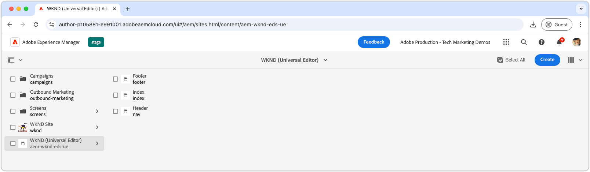
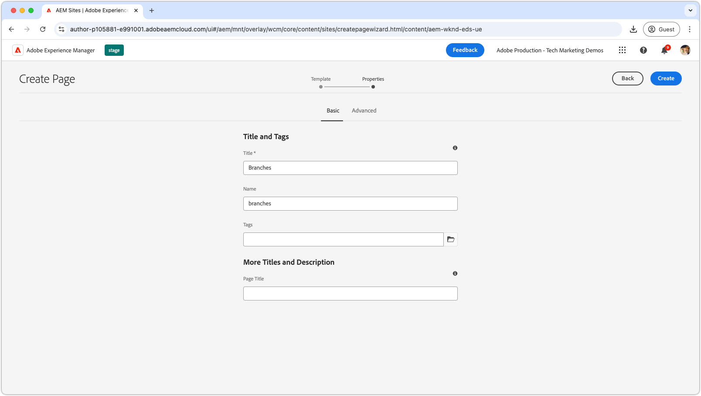
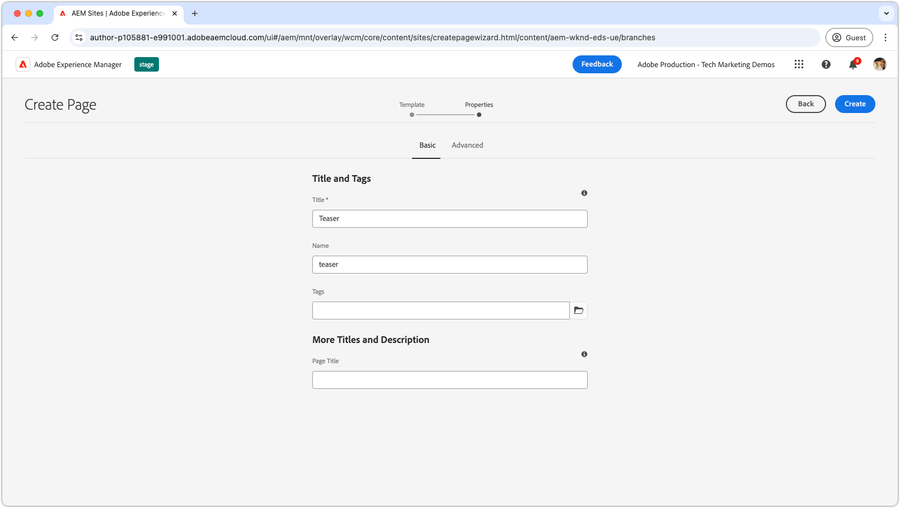
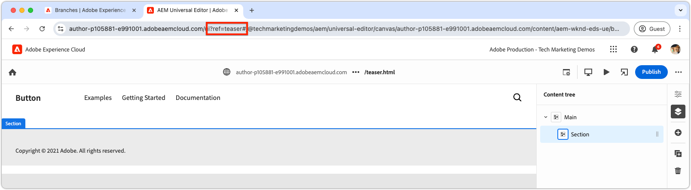
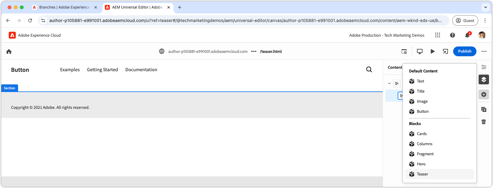
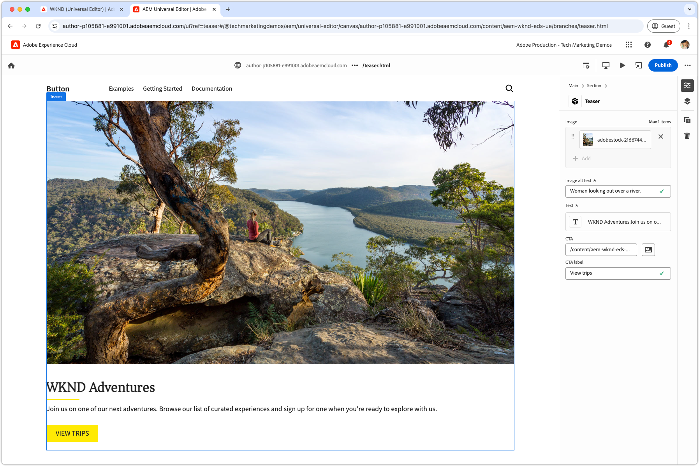
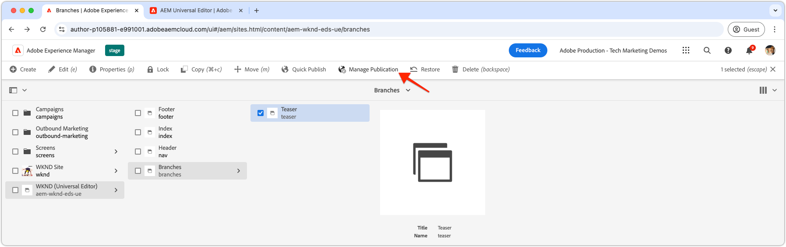
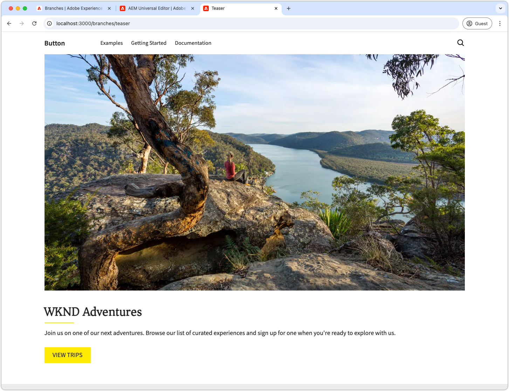

# Author a block

After pushing the [teaser block's JSON](./5-new-block.md) to the `teaser` branch, the block becomes editable in the AEM Universal Editor.

Authoring a block in development is important for several reasons:

1. It verifies that the block's definition and model are accurate.
1. It allows developers to review the block's semantic HTML, which serves as the foundation for development.
1. It enables deployment of both the content and semantic HTML to the preview environment, supporting faster block development.
   
## Open Universal Editor using code from the `teaser` branch

1. Log in to AEM Author.
2. Navigate to **Sites** and select the site (WKND (Universal Editor)) created in the [previous chapter](./2-new-aem-site.md).

    

3. Create or edit a page to add the new block, ensuring the context is available to support local development. While pages can be created anywhere within the site, it's often best to create discrete pages for each new body of work. Create a new "folder" page named **Branches**. Each sub-page is used to support the development of the same-named Git branch.

    

4. Under the **Branches** page, create a new page titled **Teaser**, matching the development branch name, and click **Open** to edit the page.

    

5. Update the Universal Editor to load the code from the `teaser` branch by adding `?ref=teaser` to the URL. Make sure to add the query parameter **BEFORE** the `#` symbol.

    

6. Select the first section under **Main**, click the **add** button, and choose the **Teaser** block.

    

7. On the canvas, select the newly added teaser and author the fields on the right, or via the inline editing capability.

    

8. After completing authoring, select the **Publish** button in the top right of Universal Editor, choose publish to **Preview**, and publish the changes to the preview environment. The changes are then published to the `aem.page` domain for the website.
    

9. Wait for the changes to publish to preview, then open the webpage via the [AEM CLI](./3-local-development-environment.md#install-the-aem-cli) at [http://localhost:3000/branches/teaser](http://localhost:3000/branches/teaser).

    

Now, the authored teaser block's content and semantic HTML are available on the preview website, ready for development using the AEM CLI in the local development environment.
