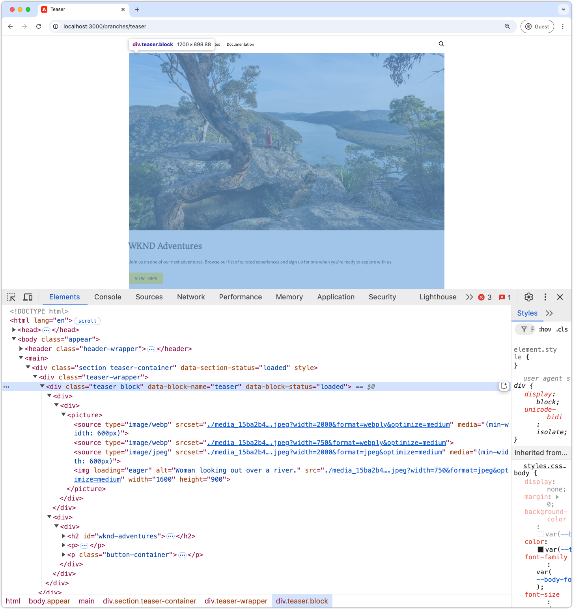
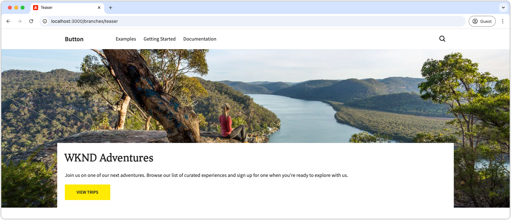
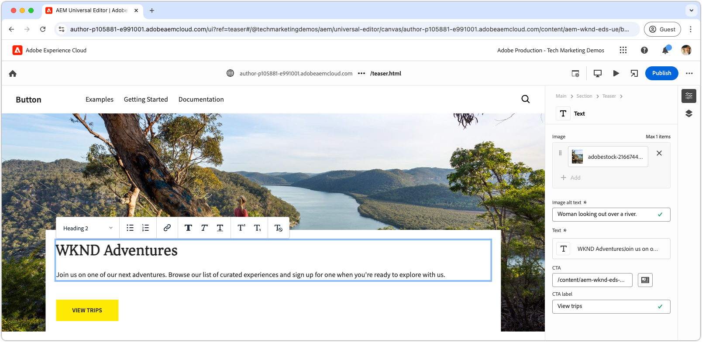

# Develop a block with CSS

Blocks in Edge Delivery Services are styled using CSS. The CSS file for a block is stored in the block's directory and has the same name as the block. For example, the CSS file for a block named `teaser` is located at `blocks/teaser/teaser.css`.

Ideally, a block should only need CSS for styling, without relying on JavaScript to modify the DOM or add CSS classes. The need for JavaScript depends on the block's [content modeling](./5-new-block.md#block-model) and its complexity. If needed, [block JavaScript](./7b-block-js-css.md) can be added.

Using a CSS-only approach, the (mostly) bare semantic HTML elements of the block are targeted and styled.

## Block HTML

To understand how to style a block, first review the DOM exposed by Edge Delivery Services, as it is what's available for styling. The DOM can be found by inspecting the block served by the AEM CLI's local development environment. Avoid using the Universal Editor's DOM, as it differs slightly.

>[!BEGINTABS]

>[!TAB DOM to style]

The following is the teaser block's DOM that is the target for styling.

Notice the `<p class="button-container">...` that is [automatically augmented](./4-website-branding.md#inferred-elements) as an inferred element by Edge Delivery Services JavaScript.

```html
...
<body>
    <header/>
    <main>
        <div>
            <!-- Start block HTML -->
            <div class="teaser block" data-block-name="teaser" data-block-status="loaded">
                <div>
                    <div>
                        <picture>
                            <source type="image/webp" srcset="./media_15ba2b455e29aca38c1ca653d24c40acaec8a008f.jpeg?width=2000&amp;format=webply&amp;optimize=medium" media="(min-width: 600px)">
                            <source type="image/webp" srcset="./media_15ba2b455e29aca38c1ca653d24c40acaec8a008f.jpeg?width=750&amp;format=webply&amp;optimize=medium">
                            <source type="image/jpeg" srcset="./media_15ba2b455e29aca38c1ca653d24c40acaec8a008f.jpeg?width=2000&amp;format=jpeg&amp;optimize=medium" media="(min-width: 600px)">
                            
                        </picture>
                    </div>
                </div>
                <div>
                    <div>
                        <h2 id="wknd-adventures">WKND Adventures</h2>
                        <p>Join us on one of our next adventures. Browse our list of curated experiences and sign up for one when you're ready to explore with us.</p>
                        <p class="button-container"><a href="/" title="View trips" class="button">View trips</a></p>
                    </div>
                </div>
            </div>     
            <!-- End block HTML -->
        </div>
    </main>
    <footer/>
</body>
...
```

>[!TAB How to find the DOM]

To find the DOM to style, open the page with the unstyled block in your local development environment, select the block, and inspect the DOM.



>[!ENDTABS]

## Block CSS

Create a new CSS file in the block's folder, using the block's name as the file name. For example, for the **teaser** block, the file is located at `/blocks/teaser/teaser.css`.

This CSS file is automatically loaded when Edge Delivery Services' JavaScript detects a DOM element on the page representing a teaser block.

[!BADGE /blocks/teaser/teaser.css]{type=Neutral tooltip="File name of code sample below."}

```css
/* /blocks/teaser/teaser.css */

/* Scope each selector in the block with `.block.teaser` to avoid accidental conflicts outside the block */
.block.teaser {
    animation: teaser-fade-in .6s;
    position: relative;
    width: 1600px;
    max-width: 100vw;
    left: 50%; 
    transform: translateX(-50%);
    height: 500px;
}

/* The image is rendered to the first div in the block */
.block.teaser picture {
    position: absolute;
    z-index: -1;
    inset: 0;
    box-sizing: border-box;
}

.block.teaser picture img {
    object-fit: cover;
    object-position: center;
    width: 100%;
    height: 100%;
}

/** 
The teaser's text is rendered to the second (also the last) div in the block.

These styles are scoped to the second (also the last) div in the block (.block.teaser > div:last-child).

This div order can be used to target different styles to the same semantic elements in the block. 
For example, if the block has two images, we could target the first image with `.block.teaser > div:first-child img`, 
and the second image with `.block.teaser > div:nth-child(2) img`.
**/
.block.teaser > div:last-child {
    position: absolute;
    bottom: 0;
    left: 50%;
    transform: translateX(-50%);
    background: var(--background-color);
    padding: 1.5rem 1.5rem 1rem;
    width: 80vw;
    max-width: 1200px;
}

/** 
The following elements reside within `.block.teaser > div:last-child` and could be scoped as such, for example:

 .block.teaser > div:last-child p { .. }

However since these element can only appear in the second/last div per our block's model, it's unnecessary to add this additional scope.
**/

/* Regardless of the authored heading level, we only want one style the heading */
.block.teaser h1,
.block.teaser h2,
.block.teaser h3,
.block.teaser h4,
.block.teaser h5,
.block.teaser h6 {
    font-size: var(--heading-font-size-xl);
    margin: 0;
}

.block.teaser h1::after,
.block.teaser h2::after,
.block.teaser h3::after,
.block.teaser h4::after,
.block.teaser h5::after,
.block.teaser h6::after {
    border-bottom: 0;
}

.block.teaser p {
    font-size: var(--body-font-size-s);
    margin-bottom: 1rem;
}

/* Add underlines to links in the text */
.block.teaser a:hover {
    text-decoration: underline;
}

/* Add specific spacing to buttons. These button CSS classes are automatically added by Edge Delivery Services. */
.block.teaser .button-container {
    margin: 0;
    padding: 0;
}

.block.teaser .button {
    background-color: var(--primary-color);
    border-radius: 0;
    color: var(--dark-color);
    font-size: var(--body-font-size-xs);
    font-weight: bold;
    padding: 1em 2.5em;
    margin: 0;
    text-transform: uppercase;
}

/** Animations 
    Scope the @keyframes to the block (teaser) to avoid accidental conflicts outside the block

    Global @keyframes can defines in styles/styles.css and used in this file.
**/

@keyframes teaser-fade-in {
    from {
        opacity: 0;
    }

    to {
        opacity: 1;
    }
}
```

## Development preview

As the CSS is written in the code project, the AEM CLI's hot reload's the changes, making it fast and easy to understand how the CSS is affecting the block.



## Lint your code

Make sure you [frequently lint](./3-local-development-environment.md#linting) your code changes to ensure it's clean and consistent. Linting helps catch issues early, and reduces overall development time. Remember, you can't merge your development work to `main` until your all linting issues are resolved!

```bash
# ~/Code/aem-wknd-eds-ue

$ npm run lint:css
```

## Preview in Universal Editor

To view changes in AEM's Universal Editor, add, commit, and push them to the Git repository branch used by the Universal Editor. This step helps ensure that the block implementation did not disrupt the authoring experience.

```bash
# ~/Code/aem-wknd-eds-ue

$ git add .
$ git commit -m "Add CSS-only implementation for teaser block"
$ git push origin teaser
```

Now, you can preview the changes in the Universal Editor, when you add the `?ref=teaser` query parameter.



