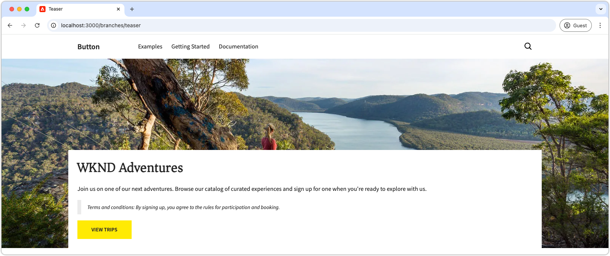
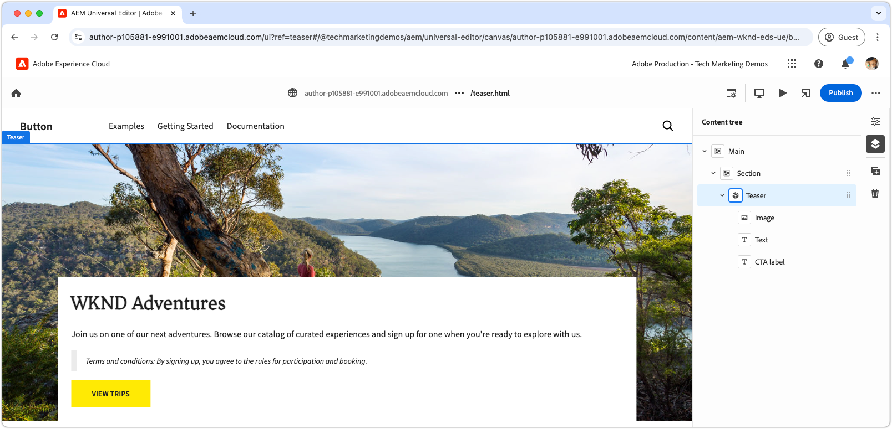

# Develop a block with CSS and JavaScript

In the [previous chapter](./7b-block-js-css.md), styling a block using only CSS was covered. Now, the focus shifts to developing a block with both JavaScript and CSS.

This example shows how to enhance a block in three ways:

1. Adding custom CSS classes.
1. Using event listeners to add movement.
1. Handling terms and conditions that can be optionally included in the teaser's text.
   
## Common use cases

This approach is particularly useful in the following scenarios:  

- **External CSS management:** When the block's CSS is managed outside Edge Delivery Services and does not align with its HTML structure.  
- **Additional attributes:** When extra attributes, such as [ARIA](https://developer.mozilla.org/en-US/docs/Web/Accessibility/ARIA) for accessibility or [microdata](https://developer.mozilla.org/en-US/docs/Web/HTML/Microdata), are required.  
- **JavaScript enhancements:** When interactive features, like event listeners, are necessary.  

This method relies on browser-native JavaScript DOM manipulation, but requires caution when modifying the DOM, especially when moving elements. Such changes can disrupt the Universal Editor's authoring experience. Ideally, the block's [content model](./5-new-block.md#block-model) should be thoughtfully designed to minimize the need for extensive DOM alterations. 

## Block HTML

To approach block development, start by reviewing the DOM exposed by Edge Delivery Services. The structure is enhanced with JavaScript and styled with CSS.

>[!BEGINTABS]

>[!TAB DOM to decorate ]

The following is the teaser block's DOM that is the target to decorate using JavaScript and CSS.

```html
...
<body>
    <header/>
    <main>
        <div>
            <!-- Start block HTML -->
            <div class="teaser block" data-block-name="teaser" data-block-status="loaded">
                <div>
                    <div>
                    <picture>
                        <source type="image/webp" srcset="./media_15ba2b455e29aca38c1ca653d24c40acaec8a008f.jpeg?width=2000&amp;format=webply&amp;optimize=medium" media="(min-width: 600px)">
                        <source type="image/webp" srcset="./media_15ba2b455e29aca38c1ca653d24c40acaec8a008f.jpeg?width=750&amp;format=webply&amp;optimize=medium">
                        <source type="image/jpeg" srcset="./media_15ba2b455e29aca38c1ca653d24c40acaec8a008f.jpeg?width=2000&amp;format=jpeg&amp;optimize=medium" media="(min-width: 600px)">
                        
                    </picture>
                    </div>
                </div>
                <div>
                    <div>
                    <h2 id="wknd-adventures">WKND Adventures</h2>
                    <p>Join us on one of our next adventures. Browse our list of curated experiences and sign up for one when you're ready to explore with us.</p>
                    <p class="button-container"><a href="/" title="View trips" class="button">View trips</a></p>
                    </div>
                </div>
            </div>     
            <!-- End block HTML -->
        </div>
    </main>
    <footer/>
</body>
...
```

>[!TAB How to find the DOM]

To find the DOM to decorate, open the page with the undecorated block in your local development environment, select the block, and inspect the DOM.


>[!ENDTABS]


## Block JavaScript

To add JavaScript functionality to a block, create a JavaScript file in the block's directory with the same name as the block, for example, `/blocks/teaser/teaser.js`.

The JavaScript file should export a default function:  

```javascript
export default function decorate(block) { ... }
```  

The default function takes the DOM element/tree representing the block in the Edge Delivery Services HTML and contains the custom JavaScript executed when the block is rendered.

This example JavaScript performs three main actions:

1. Adds an event listener to the CTA button, zooming the image on hover.
1. Adds semantic CSS classes to the block's elements, useful when integrating existing CSS design systems.
1. Adds a special CSS class to paragraphs that begin with `Terms and conditions:`.

[!BADGE /blocks/teaser/teaser.js]{type=Neutral tooltip="File name of code sample below."}

```javascript
/* /blocks/teaser/teaser.js */

/**
 * Adds a zoom effect to image using event listeners.
 *
 * When the CTA button is hovered over, the image zooms in.
 *
 * @param {HTMLElement} block represents the block's' DOM tree
 */
function addEventListeners(block) {
  block.querySelector('.button').addEventListener('mouseover', () => {
    block.querySelector('.image').classList.add('zoom');
  });

  block.querySelector('.button').addEventListener('mouseout', () => {
    block.querySelector('.image').classList.remove('zoom');
  });
}

/**
   * Entry point to block's JavaScript.
   * Must be exported as default and accept a block's DOM element.
   * This function is called by the project's style.js, and passed the block's element.
   *
   * @param {HTMLElement} block represents the block's' DOM element/tree
   */
export default function decorate(block) {
  /* This JavaScript makes minor adjustments to the block's DOM */

  // Dress the DOM elements with semantic CSS classes so it's obvious what they are.
  // If needed we could also add ARIA roles and attributes, or add/remove/move DOM elements.

  // Add a class to the first picture element to target it with CSS
  block.querySelector('picture').classList.add('image-wrapper');

  // Use previously applied classes to target new elements
  block.querySelector('.image-wrapper img').classList.add('image');

  // Mark the second/last div as the content area (white, bottom aligned box w/ text and cta)
  block.querySelector(':scope > div:last-child').classList.add('content');

  // Mark the first H1-H6 as a title
  block.querySelector('h1,h2,h3,h4,h5,h6').classList.add('title');

  // Process each paragraph and mark it as text or terms-and-conditions
  block.querySelectorAll('p').forEach((p) => {
    const innerHTML = p.innerHTML?.trim();

    // If the paragraph starts with Terms and conditions: then style it as such
    if (innerHTML?.startsWith("Terms and conditions:")) {
      /* If a paragraph starts with '*', add a special CSS class. */
      p.classList.add('terms-and-conditions');
    }
  });

  // Add event listeners to the block
  addEventListeners(block);
}
```

## Block CSS

If you created a `teaser.css` in the [previous chapter](./7a-block-css.md) delete it, or rename it to `teaser.css.bak`, as this chapter implements different CSS for the teaser block.

Create a `teaser.css` file in the block's folder. This file contains the CSS code that styles the block. This CSS code targets the block's elements and the specific, semantics CSS classes added by the JavaScript in `teaser.js`.

Bare elements can still be styled directly, or with the custom applied CSS classes. For more complex blocks, applying semantic CSS classes can help make the CSS more comprehensible and maintainable, especially when working with larger teams across longer periods of time.

[Like before](./7a-block-css.md#develop-a-block-with-css), scope the CSS to `.block.teaser` using [CSS nesting](https://developer.mozilla.org/en-US/docs/Web/CSS/CSS_nesting) to avoid conflict with other blocks.

[!BADGE /blocks/teaser/teaser.css]{type=Neutral tooltip="File name of code sample below."}

```css
/* /blocks/teaser/teaser.css */

/* Scope each selector in the block with `.block.teaser` to avoid accidental conflicts outside the block */
.block.teaser {
    animation: teaser-fade-in 1s;
    position: relative;
    width: 1600px;
    max-width: 100vw;
    left: 50%; 
    transform: translateX(-50%);
    height: 500px;
    overflow: hidden; 

    /* The teaser image */
    .image-wrapper {
        position: absolute;
        z-index: -1;
        inset: 0;
        box-sizing: border-box;
        overflow: hidden; 

        .image {
            object-fit: cover;
            object-position: center;
            width: 100%;
            height: 100%;
            transform: scale(1); 
            transition: transform 0.6s ease-in-out;

            .zoom {
                transform: scale(1.1);
            }            
        }
    }

    /* The teaser text content */
    .content {
        position: absolute;
        bottom: 0;
        left: 50%;
        transform: translateX(-50%);
        background: var(--background-color);
        padding: 1.5rem 1.5rem 1rem;
        width: 80vw;
        max-width: 1200px;
  
        .title {
            font-size: var(--heading-font-size-xl);
            margin: 0;
        }

        .title::after {
            border-bottom: 0;
        }

        p {
            font-size: var(--body-font-size-s);
            margin-bottom: 1rem;
            animation: teaser-fade-in .6s;
        
            &.terms-and-conditions {
                font-size: var(--body-font-size-xs);
                color: var(--secondary-color);
                padding: .5rem 1rem;
                font-style: italic;
                border: solid var(--light-color);
                border-width: 0 0 0 10px;
            }
        }

        /* Add underlines to links in the text */
        a:hover {
            text-decoration: underline;
        }

        /* Add specific spacing to buttons. These button CSS classes are automatically added by Edge Delivery Services. */
        .button-container {
            margin: 0;
            padding: 0;
        
            .button {   
                background-color: var(--primary-color);
                border-radius: 0;
                color: var(--dark-color);
                font-size: var(--body-font-size-xs);
                font-weight: bold;
                padding: 1em 2.5em;
                margin: 0;
                text-transform: uppercase;
            }
        }
    }
}

/** Animations 
    Scope the @keyframes to the block (teaser) to avoid accidental conflicts outside the block

    Global @keyframes can defines in styles/styles.css and used in this file.
**/
@keyframes teaser-fade-in {
    from {
        opacity: 0;
    }

    to {
        opacity: 1;
    }
}
```

## Add terms and conditions

The above implementation adds support for specially styling paragraphs that begin with the text `Terms and conditions:`. To validate this functionality, in Universal Editor, update the teaser block's text content to include terms and conditions.

Follow the steps in the [author a block](./6-author-block.md), and edit the text to include a **terms and conditions** paragraph at the end:

```
WKND Adventures

Join us on one of our next adventures. Browse our list of curated experiences and sign up for one when you're ready to explore with us.

Terms and conditions: By signing up, you agree to the rules for participation and booking.
```

Verify that the paragraph is rendered with the terms and conditions style on the local development environment. Remember, these code changes do not reflect in Universal Editor until they are [pushed to a branch on GitHub](#preview-in-universal-editor) that Universal Editor has been configured to use.

## Development preview

As the CSS and JavaScript are added, the AEM CLI's local development environment hot-reloads the changes, allowing for quick and easy visualization of how code impacts the block. Hover over the CTA and verify the teaser's image zooms in and out.



## Lint your code

Make sure to [frequently lint](./3-local-development-environment.md#linting) your code changes to keep it clean and consistent. Regular linting helps catch issues early, reducing overall development time. Remember, you cannot merge your development work into the `main` branch until all linting issues are resolved!  

```bash
# ~/Code/aem-wknd-eds-ue

$ npm run lint
```

## Preview in Universal Editor

To view changes in AEM's Universal Editor, add, commit, and push them to the Git repository branch used by the Universal Editor. Doing so ensures that the block implementation does not disrupt the authoring experience.

```bash
# ~/Code/aem-wknd-eds-ue

$ git add .
$ git commit -m "CSS and JavaScript implementation for teaser block"
$ git push origin teaser
```

Now, you can preview the changes in the Universal Editor, when you add the `?ref=teaser` query parameter.


