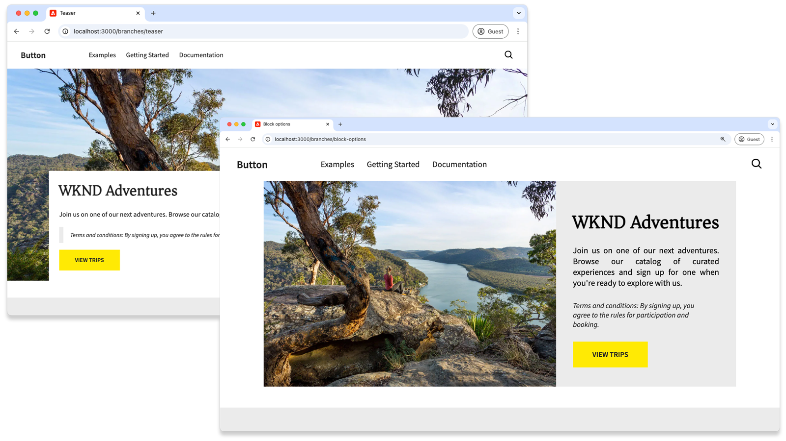
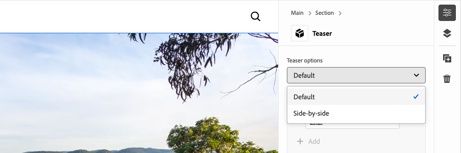
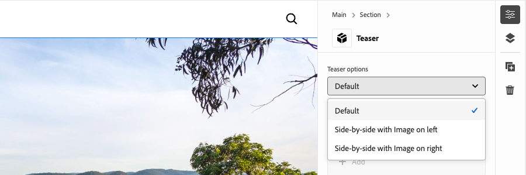
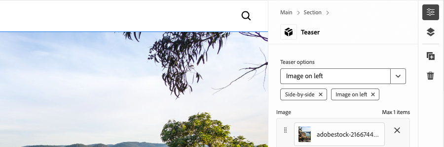
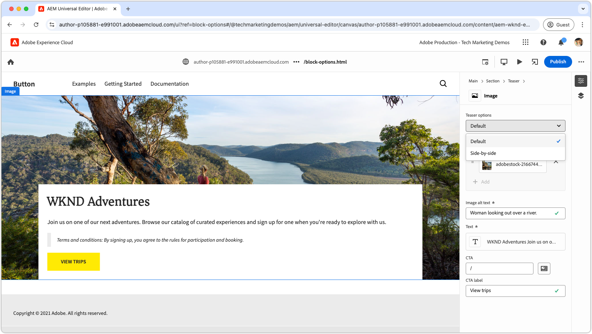
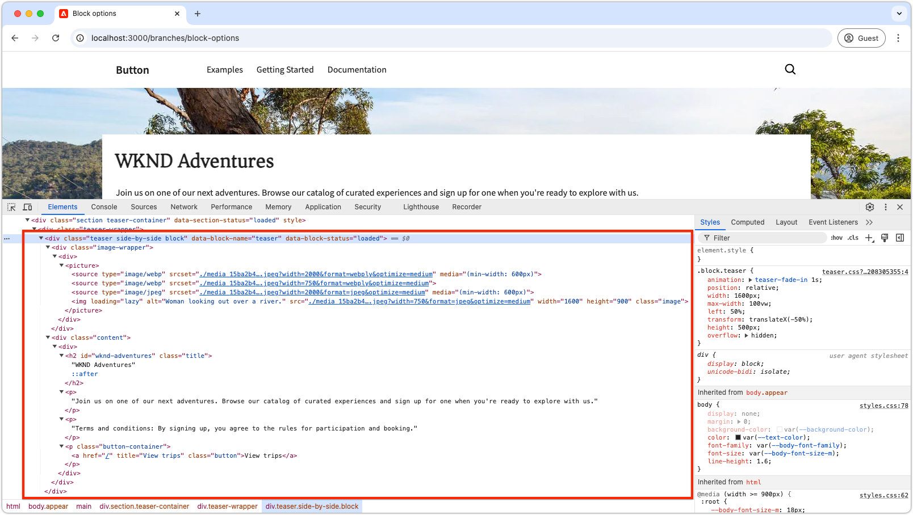
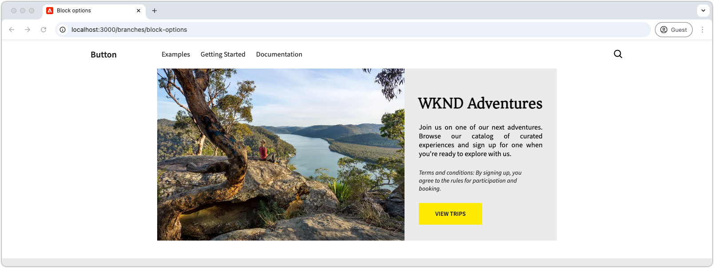
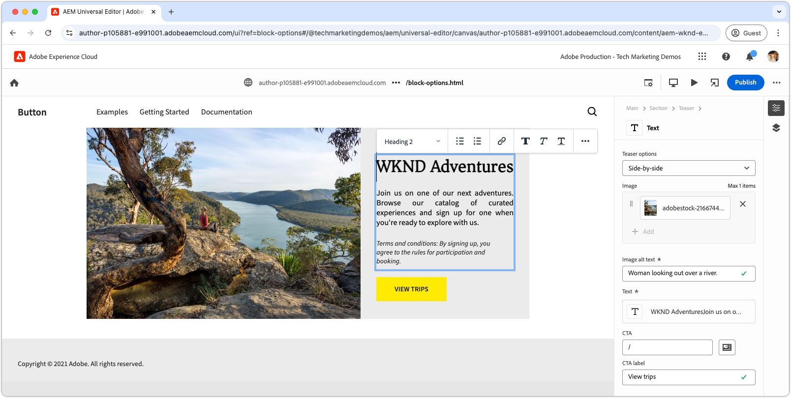

# Develop a block with options

This tutorial builds on the Edge Delivery Services and Universal Editor tutorial, guiding you through the process of adding block options to a block. By defining block options, you can customize a block's appearance and functionality, enabling different variations to suit various content needs. This allows for greater flexibility and reusability within your site's design system. 

{align="center"}

In this tutorial, you'll add block options to the Teaser block, allowing authors to choose between two display options: **Default** and **Side-by-side**. The **Default** option displays the image above and behind the text, while the **Side-by-side** option displays the image and text side-by-side.

## Common use cases

Common use cases for using **Block Options** in **Edge Delivery Services** and **Universal Editor** development include, but are not limited to:

1. **Layout variations:** Easily switch between layouts. For example, horizontal vs. vertical or grid vs. list.
2. **Styling variations:** Easily switch between themes, or visual treatments. For example, light vs. dark mode, or big vs. small text.
3. **Content display control:** Toggle visibility of elements or switch between content styles (compact vs. detailed).

These options give flexibility and efficiency in building dynamic and adaptable blocks.

This tutorial demonstrates the layout variations use case, where the Teaser block can be displayed in two different layouts: **Default** and **Side-by-side**.

## Block model 

To add block options to the Teaser block, open its JSON fragment at `/block/teaser/_teaser.json` and add a new field to the model definition. This field sets its `name` property to `classes`, which is a protected field used by AEM to store block options, which are applied to the block's Edge Delivery Services HTML.

### Field configurations

The tabs below illustrate various ways to configure block options in the block model, including single-select with single CSS class, single-select with multiple CSS classes, and multi-select with multiple CSS classes. This tutorial [implements the simpler approach](#field-configuration-for-this-tutorial) used in **select with single CSS class**.

>[!BEGINTABS]

>[!TAB Select with single CSS class]

This tutorial demonstrates how to use a `select` (dropdown) input type to let authors choose a single block option, which is then applied as a single, corresponding CSS class.  

{align="center"}

#### Block model

The **Default** option is represented by an empty string (`""`), while the **Side-by-Side** option uses `"side-by-side"`. The option's **name** and **value** do not have to be the same, but the **value** determines the CSS class(es) applied to the block's HTML. For example, the **Side-by-Side** option's value could be `layout-10` instead of `side-by-side`. However, it is best to use semantically meaningful names for CSS classes, ensuring clarity and consistency in option values.

[!BADGE /blocks/teaser/_teaser.json]{type=Neutral tooltip="File name of code sample below."}

```json{highlight="4,8,9-18"}
...
"fields": [
    {
        "component": "select",
        "name": "classes",
        "value": "",
        "label": "Teaser options",
        "valueType": "string",
        "options": [
            {
                "name": "Default",
                "value": ""
            },
            {
                "name": "Side-by-side",
                "value": "side-by-side"
            }
        ]
    }
]
...
```

#### Block HTML  

When the author selects an option, the corresponding value is added as a CSS class to the block's HTML:  

- If **Default** is selected:  

  ```html
  <div class="block teaser">
      <!-- Block content here -->
  </div>
  ```

- If **Side-by-side** is selected:  

  ```html
  <div class="block teaser side-by-side">
      <!-- Block content here -->
  </div>
  ```

This allows different styling and conditional JavaScript to be applied depending on the chosen open.  


>[!TAB Select with multiple CSS classes]

**This approach isn't used in this tutorial but illustrates an alternative method and advanced block options.**

The `select` input type allows authors to choose a single block option, which can optionally map to multiple CSS classes. To achieve this, list the CSS classes as space-delimited values.

{align="center"}

#### Block model  

For example, the **Side-by-Side** option can support variations where the image appears on the left (`side-by-side left`) or the right (`side-by-side right`).

[!BADGE /blocks/teaser/_teaser.json]{type=Neutral tooltip="File name of code sample below."}

```json{highlight="4,8,9-21"}
...
"fields": [
    {
        "component": "select",
        "name": "classes",
        "value": "",
        "label": "Teaser options",
        "valueType": "string",
        "options": [
            {
                "name": "Default",
                "value": ""
            },
            {
                "name": "Side-by-side with Image on left",
                "value": "side-by-side left"
            },
            {
                "name": "Side-by-side with Image on right",
                "value": "side-by-side right"
            }
        ]
    }
]
...
```

#### Block HTML  

When the author selects an option, the corresponding value is applied as a space-separated set of CSS classes in the block's HTML:  

- If **Default** is selected:  

  ```html
  <div class="block teaser">
      <!-- Block content here -->
  </div>
  ```

- If **Side-by-side with Image on left** is selected:  

  ```html
  <div class="block teaser side-by-side left">
      <!-- Block content here -->
  </div>
  ```

- If **Side-by-side with Image on right** is selected:  

  ```html
  <div class="block teaser side-by-side right">
      <!-- Block content here -->
  </div>
  ```

This allows different styling and conditional JavaScript to be applied depending on the chosen option.  


>[!TAB Multi-select with multiple CSS classes]

**This approach isn't used in this tutorial but illustrates an alternative method and advanced block options.**

The input type of `"component": "multiselect"` allows the author to select multiple options simultaneously. This enables complex permutations of the block's appearance by combining multiple design choices.  

{align="center"}

### Block model  

For example, the **Side-by-side**, **Image on left**, and **Image on right** can support variations where the image is positioned on the left (`side-by-side left`) or on the right (`side-by-side right`).  

[!BADGE /blocks/teaser/_teaser.json]{type=Neutral tooltip="File name of code sample below."}

```json{highlight="4,6,8,10-21"}
...
"fields": [
    {
        "component": "multiselect",
        "name": "classes",
        "value": [],
        "label": "Teaser options",
        "valueType": "array",
        "options": [
            {
                "name": "Side-by-side",
                "value": "side-by-side"
            },
            {
                "name": "Image on left",
                "value": "left"
            },
            {
                "name": "Image on right",
                "value": "right"
            }
        ]
    }
]
...
```

#### Block HTML  

When the author selects multiple options, the corresponding values are applied as space-separated CSS classes in the block's HTML:  

- If **Side-by-side** and **Image on left** are selected:  

  ```html{highlight="1"}
  <div class="block teaser side-by-side left">
      <!-- Block content here -->
  </div>
  ```

- If **Side-by-side** and **Image on right** are selected:  

  ```html{highlight="1"}
  <div class="block teaser side-by-side right">
      <!-- Block content here -->
  </div>
  ```

While multi-select offers flexibility, it introduces complexity in managing design permutations. Without restrictions, conflicting selections can lead to broken or off-brand experiences.

For example:

- **Image on left** or **Image on right** without selecting **Side-by-side** implicitly applies them to **Default**, which always sets the image as a background, so left and right alignment are irrelevant.
- Selecting both **Image on left** and **Image on right is** contradictory.
- Selecting **Side-by-side** without **Image on left** or **Image on right** may be considered ambiguous, as the image's position is unspecified.

To prevent issues, and author confusion when using multi-select, ensure options are well-planned and all permutations tested. Multi-select works best for simple, non-conflicting enhancements, like "large" or "highlight", rather than layout-altering choices.


>[!TAB Default option]

**This approach isn't used in this tutorial but illustrates an alternative method and advanced block options.**

Block options can be set as the default when adding a new block instance to a page in Universal Editor. This is done by setting the default value of the `classes` property in the [block's definition](../5-new-block.md#block-definition).  

#### Block definition  

In the example below, the default option is set to **Side-by-Side** by assigning the `value` property of the `classes` field to `side-by-side`. The corresponding block option input in the block model is optional.  

You can also define multiple entries for the same block, each with a different name and class. This allows Universal Editor to display distinct block entries, each pre-configured with a specific block option. While these appear as separate blocks in the editor, the codebase contains a single block that dynamically renders based on the selected option.

[!BADGE /blocks/teaser/_teaser.json]{type=Neutral tooltip="File name of code sample below."}

```json{highlight="12"}
{
    "definitions": [{
      "title": "Teaser",
      "id": "teaser",
      "plugins": {
        "xwalk": {
          "page": {
            "resourceType": "core/franklin/components/block/v1/block",
            "template": {
              "name": "Teaser",
              "model": "teaser",
              "classes": "side-by-side",
              "textContent_text": "<h2>Enter a title</h2><p>...and body text here!</p>",
              "textContent_cta": "/",
              "textContent_ctaText": "Click me!"
            }
          }
        }
      }
    }],
    "models": [... from previous section ...],
    "filters": []
}
```

>[!ENDTABS]


### Field configuration for this tutorial


In this tutorial, we'll use the select with single CSS class approach described above in the first tab, that allows for two discrete block options: **Default** and **Side-by-side**.

In the model definition within the block's JSON fragment, add a single select field for block options. This field lets authors choose between the default layout and a side-by-side layout.

[!BADGE /blocks/teaser/_teaser.json]{type=Neutral tooltip="File name of code sample below."}

```json{highlight="7-24"}
{
    "definitions": [...],
    "models": [
        {
            "id": "teaser", 
            "fields": [
                {
                    "component": "select",
                    "name": "classes",
                    "value": "",
                    "label": "Teaser options",
                    "description": "",
                    "valueType": "string",
                    "options": [
                        {
                            "name": "Default",
                            "value": ""
                        },
                        {
                            "name": "Side-by-side",
                            "value": "side-by-side"
                        }
                    ]
                },
                {
                    "component": "reference",
                    "valueType": "string",
                    "name": "image",
                    "label": "Image",
                    "multi": false
                },
                {
                    "component": "text",
                    "valueType": "string",
                    "name": "imageAlt",
                    "label": "Image alt text",
                    "required": true
                },
                {
                    "component": "richtext",
                    "name": "textContent_text",
                    "label": "Text",
                    "valueType": "string",
                    "required": true
                },
                {
                    "component": "aem-content",
                    "name": "textContent_cta",
                    "label": "CTA",
                    "valueType": "string"
                },
                {
                    "component": "text",
                    "name": "textContent_ctaText",
                    "label": "CTA label",
                    "valueType": "string"
                }
            ]
        }
    ],
    "filters": []
}
```

## Update block in Universal Editor

To make the updated block options input available in Universal Editor, deploy the JSON code changes to GitHub, create a new page, add and author the Teaser block with the **Side-by-Side** option, then publish the page to preview. Once published, load the page in the local development environment for coding.

### Push changes to GitHub

To make the updated block options input available in Universal Editor for setting block options and developing against the resulting HTML, the project must be linted, and the changes pushed to a GitHub branch— in this case, the `block-options` branch.

```bash
# ~/Code/aem-wknd-eds-ue

# Lint the changes to catch any syntax errors
$ npm run lint 

$ git add .
$ git commit -m "Add Teaser block option to JSON file so it is available in Universal Editor"
$ git push origin teaser
```

### Create a test page  

In the AEM Author service, create a new page to add the Teaser block for development. Following the convention in the [Author a Block](../6-author-block.md) chapter of the [Edge Delivery Services and Universal Editor Developer tutorial](../0-overview.md), create a test page under a `branches` page, naming it after the Git branch you're working on— in this case, `block-options`.

### Author the block 

Edit the new **Block Options** page in Universal Editor and add the **Teaser** block. Make sure to add the query parameter `?ref=block-options` to the URL to load the page using code from the `block-options` GitHub branch,

The block dialog now includes a **Teaser Options** dropdown with **Default** and **Side-by-Side** selections. Choose **Side-by-Side** and complete the remaining content authoring.

{align="center"}

Optionally, add two **Teaser** blocks—one set to **Default** and the other to **Side-by-Side**. This allows you to preview both options side by side during development and ensures that implementing **Side-by-Side** doesn't affect the **Default** option.

### Publish to preview  

Once the Teaser block is added to the page, [publish the page to preview](../6-author-block.md) using **Publish** button and choosing publish to **Preview** in Universal Editor.

## Block HTML

To begin block development, start by reviewing the DOM structure exposed by the Edge Delivery Services preview. The DOM is enhanced with JavaScript and styled with CSS, providing the foundation for building and customizing the block.

>[!BEGINTABS]

>[!TAB DOM to decorate ]

The following is the Teaser block's DOM, with the **Side-by-side** block option selected, that is the target to decorate using JavaScript and CSS.

```html{highlight="7"}
...
<body>
    <header/>
    <main>
        <div>
            <!-- Start block HTML -->
            <div class="teaser block side-by-side" data-block-name="teaser" data-block-status="loaded">
                <div>
                    <div>
                    <picture>
                        <source type="image/webp" srcset="./media_15ba2b455e29aca38c1ca653d24c40acaec8a008f.jpeg?width=2000&amp;format=webply&amp;optimize=medium" media="(min-width: 600px)">
                        <source type="image/webp" srcset="./media_15ba2b455e29aca38c1ca653d24c40acaec8a008f.jpeg?width=750&amp;format=webply&amp;optimize=medium">
                        <source type="image/jpeg" srcset="./media_15ba2b455e29aca38c1ca653d24c40acaec8a008f.jpeg?width=2000&amp;format=jpeg&amp;optimize=medium" media="(min-width: 600px)">
                        
                    </picture>
                    </div>
                </div>
                <div>
                    <div>
                    <h2 id="wknd-adventures">WKND Adventures</h2>
                    <p>Join us on one of our next adventures. Browse our list of curated experiences and sign up for one when you're ready to explore with us.</p>
                    <p>Terms and conditions: By signing up, you agree to the rules for participation and booking.</p>
                    <p class="button-container"><a href="/" title="View trips" class="button">View trips</a></p>
                    </div>
                </div>
            </div>     
            <!-- End block HTML -->
        </div>
    </main>
    <footer/>
</body>
...
```

>[!TAB How to find the DOM]

To find the DOM to decorate, open the page with the block in your local development environment, select the block using your web browser's developer tools, and inspect the DOM. This will allow you to identify the relevant elements to decorate.

{align="center"}

>[!ENDTABS]

## Block CSS  

Edit `blocks/teaser/teaser.css` to add specific CSS styles for the **Side-by-Side** option. This file contains the default CSS for the block.  

To modify styles for the **Side-by-Side** option, add a new scoped CSS rule in the `teaser.css` file that targets teaser blocks configured with the `side-by-side` class.

```css
.block.teaser.side-by-side { ... }
```

Alternatively, you can use CSS Nesting for a more concise version:

```css
.block.teaser {
    ... Default teaser block styles ...

    &.side-by-side {
        ... Side-by-side teaser block styles ...
    }
}
```

Within the `&.side-by-side` rule, add the necessary CSS properties to style the block when the `side-by-side` class is applied.  

A common approach is to reset default styles by applying `all: initial` to shared selectors, then adding the required styles for the `side-by-side` variant. If most of the styles are shared across options, overriding specific properties might be easier. However, if multiple selectors need changes, resetting all styles and reapplying only the necessary ones can make the code clearer and more maintainable.
[!BADGE /blocks/teaser/teaser.css]{type=Neutral tooltip="File name of code sample below."}

```css
/* /blocks/teaser/teaser.css */

/* Scope each selector in the block with `.block.teaser` to avoid accidental conflicts outside the block */
.block.teaser {
    animation: teaser-fade-in 1s;
    position: relative;
    width: 1600px;
    max-width: 100vw;
    left: 50%; 
    transform: translateX(-50%);
    height: 500px;
    overflow: hidden; 


    /* The teaser image */
    .image-wrapper {
        position: absolute;
        z-index: -1;
        inset: 0;
        box-sizing: border-box;
        overflow: hidden; 

        .image {
            object-fit: cover;
            object-position: center;
            width: 100%;
            height: 100%;
            transform: scale(1); 
            transition: transform 0.6s ease-in-out;

            .zoom {
                transform: scale(1.1);
            }            
        }
    }

    /* The teaser text content */
    .content {
        position: absolute;
        bottom: 0;
        left: 50%;
        transform: translateX(-50%);
        background: var(--background-color);
        padding: 1.5rem 1.5rem 1rem;
        width: 80vw;
        max-width: 1200px;
  
        .title {
            font-size: var(--heading-font-size-xl);
            margin: 0;
        }

        .title::after {
            border-bottom: 0;
        }

        p {
            font-size: var(--body-font-size-s);
            margin-bottom: 1rem;
            animation: teaser-fade-in .6s;
        }

        p.terms-and-conditions {
            font-size: var(--body-font-size-xs);
            color: var(--secondary-color);
            padding: .5rem 1rem;
            font-style: italic;
            border: solid var(--light-color);
            border-width: 0 0 0 10px;
        }

        /* Add underlines to links in the text */
        a:hover {
            text-decoration: underline;
        }

        /* Add specific spacing to buttons. These button CSS classes are automatically added by Edge Delivery Services. */
        .button-container {
            margin: 0;
            padding: 0;        

            .button {   
                background-color: var(--primary-color);
                border-radius: 0;
                color: var(--dark-color);
                font-size: var(--body-font-size-xs);
                font-weight: bold;
                padding: 1em 2.5em;
                margin: 0;
                text-transform: uppercase;
            }
        }
    }

    /**
    *  Add styling for the side-by-side variant 
    **/

    /* This evaluates to .block.teaser.side-by-side */
    &.side-by-side {    
        /* Since this default teaser option doesn't have a style (such as `.default`), we use `all: initial` to reset styles rather than overriding individual styles. */
        all: initial;
        display: flex;
        margin: auto;
        max-width: 900px;

        .image-wrapper {
            all: initial;
            flex: 2;
            overflow: hidden;                 
            
            * {
                height: 100%;
            }        

            .image {
                object-fit: cover;
                object-position: center;
                width: 100%;
                height: 100%;
                transform: scale(1); 
                transition: transform 0.6s ease-in-out;                

                &.zoom {
                    /* This option has a different zoom level than the default */
                    transform: scale(1.5);
                }
            }
        }

        .content {
            all: initial;
            flex: 1;
            background-color: var(--light-color);
            padding: 3.5em 2em 2em;
            font-size: var(--body-font-size-s);
            font-family: var(--body-font-family);
            text-align: justify;
            text-justify: newspaper;
            hyphens: auto;

            p.terms-and-conditions {
                border: solid var(--text-color);
                border-width: 0;
                padding-left: 0;
                text-align: left;
            }
        }

        /* Media query for mobile devices */
        @media (width <= 900px) {
            flex-direction: column; /* Stack elements vertically on mobile */
        }
    }
}

/** Animations 
    Scope the @keyframes to the block (teaser) to avoid accidental conflicts outside the block

    Global @keyframes can defines in styles/styles.css and used in this file.
**/
@keyframes teaser-fade-in {
    from {
        opacity: 0;
    }

    to {
        opacity: 1;
    }
}
```


## Block JavaScript

Identifying the active option(s) for the block is straightforward by checking the classes applied to the block element. In this example, we need to adjust where the `.image-wrapper` styles are applied depending on the active option.

The `getOptions` function returns an array of classes applied to the block, excluding `block` and `teaser` (since all blocks have the `block` class, and all Teaser blocks have the `teaser` class). Any remaining classes in the array indicate the active options. If the array is empty, the default option is applied.

```javascript
function getOptions(block) {
  // Get the block's classes, excluding 'block' and 'teaser'; anything remaining is a block option.
  return [...block.classList].filter((c) => !['block', 'teaser'].includes(c));
}
```

This options list can be used to conditionally execute custom logic in the block's JavaScript:

```javascript
if (getOptions(block).includes('side-by-side')) {
  /* For side-by-side teaser, add the image-wrapper to a higher-level div to support CSS */
  block.querySelector(':scope > div:first-child').classList.add('image-wrapper');
} else if (!getOptions(block)) {
  /* For the default option, add the image-wrapper to the picture element to support CSS */
  block.querySelector('picture').classList.add('image-wrapper');
}
```

The full updated JavaScript file for the teaser block with both Default and Side-by-Side options is as follows:

[!BADGE /blocks/teaser/teaser.js]{type=Neutral tooltip="File name of code sample below."}

```javascript
/* /blocks/teaser/teaser.js */

/**
 * Block options are applied as classes to the block's DOM element
 * alongside the `block` and `<block-name>` classes.
 *
 * @param {HTMLElement} block represents the block's DOM element/tree
 */
function getOptions(block) {
  // Get the block's classes, excluding 'block' and 'teaser'.
  return [...block.classList].filter((c) => !['block', 'teaser'].includes(c));
}

/**
 * Adds a zoom effect to the image using event listeners.
 *
 * When the CTA button is hovered over, the image zooms in.
 *
 * @param {HTMLElement} block represents the block's DOM tree
 */
function addEventListeners(block) {
  block.querySelector('.button').addEventListener('mouseover', () => {
    block.querySelector('.image').classList.add('zoom');
  });

  block.querySelector('.button').addEventListener('mouseout', () => {
    block.querySelector('.image').classList.remove('zoom');
  });
}

/**
 * Entry point to the block's JavaScript.
 * Must be exported as default and accept a block's DOM element.
 * This function is called by the project's style.js, passing the block's element.
 *
 * @param {HTMLElement} block represents the block's DOM element/tree
 */
export default function decorate(block) {
  /* Common treatments for all options */
  block.querySelector(':scope > div:last-child').classList.add('content');
  block.querySelector('h1,h2,h3,h4,h5,h6').classList.add('title');
  block.querySelector('img').classList.add('image');

  // Process each paragraph and mark it as text or terms-and-conditions
  block.querySelectorAll('p').forEach((p) => {
    const innerHTML = p.innerHTML?.trim();
    if (innerHTML?.startsWith('Terms and conditions:')) {
      p.classList.add('terms-and-conditions');
    }
  });

  /* Conditional treatments for specific options */
  if (getOptions(block).includes('side-by-side')) {
    /* For side-by-side teaser, add the image-wrapper to a higher-level div to support CSS */
    block.querySelector(':scope > div:first-child').classList.add('image-wrapper');
  } else if (!getOptions(block)) {
    /* For the default option, add the image-wrapper to the picture element to support CSS */
    block.querySelector('picture').classList.add('image-wrapper');
  }

  addEventListeners(block);
}
```

## Development preview

As the CSS and JavaScript are added, the AEM CLI's local development environment hot-reloads the changes, allowing for quick and easy visualization of how code impacts the block. Hover over the CTA and verify the teaser's image zooms in and out.



## Lint your code

Make sure to [frequently lint](../3-local-development-environment.md#linting) your code changes to keep it clean and consistent. Regular linting helps catch issues early, reducing overall development time. Remember, you cannot merge your development work into the `main` branch until all linting issues are resolved!  

```bash
# ~/Code/aem-wknd-eds-ue

$ npm run lint
```

## Preview in Universal Editor

To view changes in AEM's Universal Editor, add, commit, and push them to the Git repository branch used by the Universal Editor. Doing so ensures that the block implementation does not disrupt the authoring experience.

```bash
# ~/Code/aem-wknd-eds-ue

$ git add .
$ git commit -m "CSS and JavaScript implementation for Teaser block option Side-by-side"
# JSON files are compiled automatically and added to the commit via a Husky pre-commit hook
$ git push origin block-options
```

Now, the changes are visible in the Universal Editor when using the `?ref=block-options` query parameter.

{align="center"}


## Congratulations!  

You've now explored block options in Edge Delivery Services and Universal Editor, giving you the tools to customize and streamline content editing with greater flexibility. Start applying these options in your projects to improve efficiency and maintain consistency.  

For more best practices and advanced techniques, check out the [Universal Editor documentation](https://experienceleague.adobe.com/en/docs/experience-manager-cloud-service/content/edge-delivery/wysiwyg-authoring/create-block#block-options).
