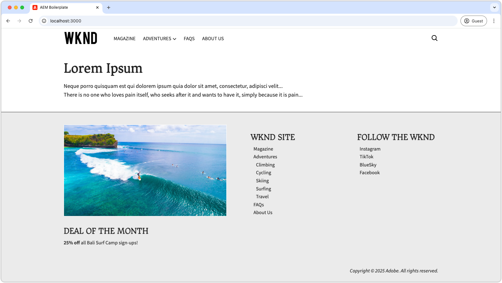
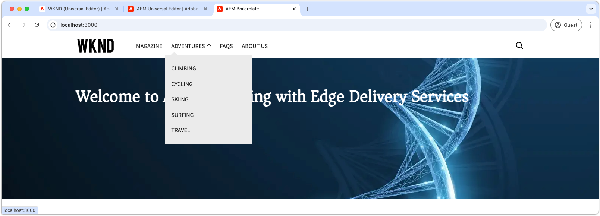
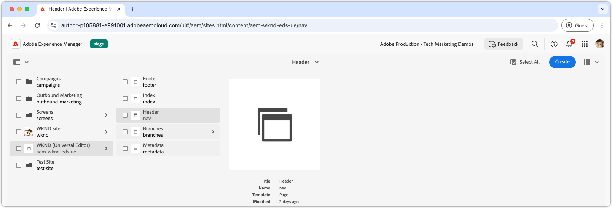
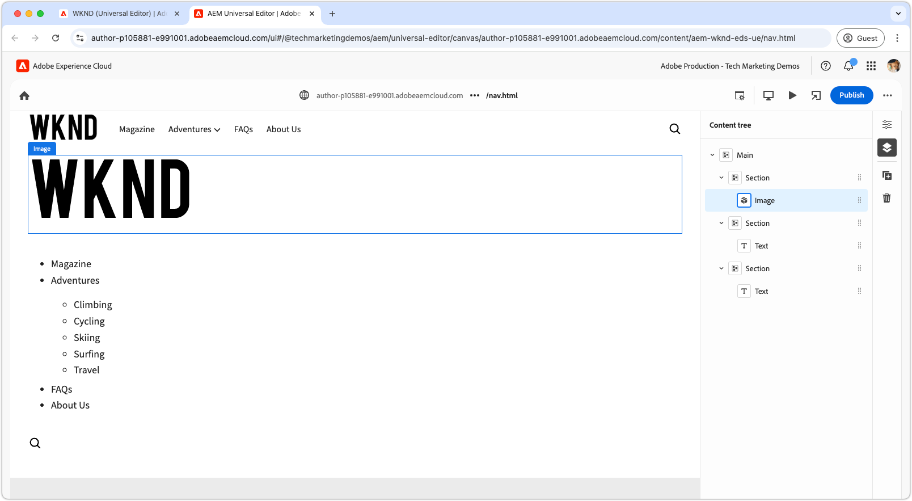
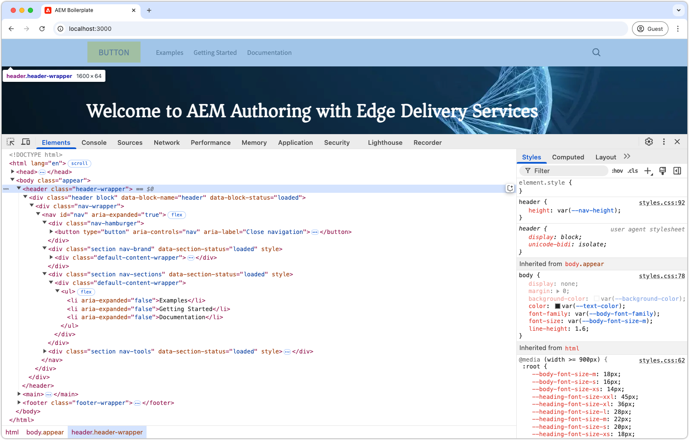
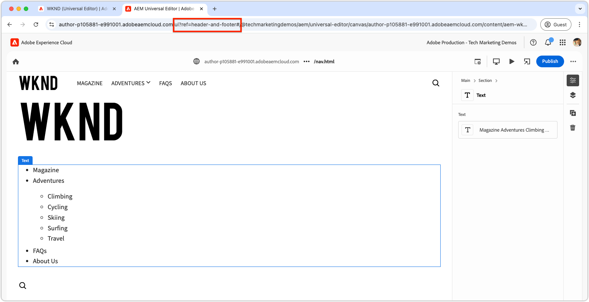
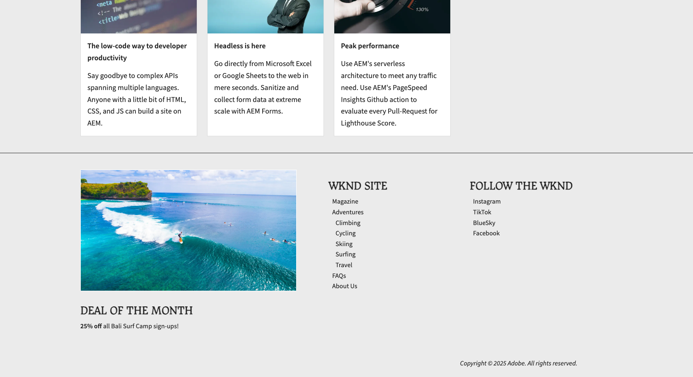
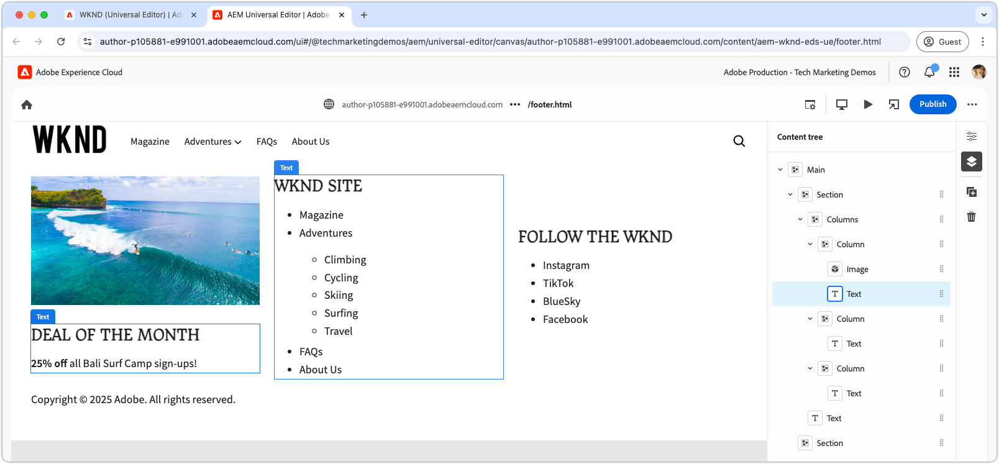

# Develop a header and footer

{align="center"}

Headers and footers play a unique role in Edge Delivery Services (EDS) as they are bound directly to the HTML `<header>` and `<footer>` elements. Unlike regular page content, they are managed separately and can be updated independently without needing to purge the entire page cache. While their implementation lives in the code project as blocks under `blocks/header` and `blocks/footer`, authors can edit their content through dedicated AEM pages that can contain any combination of blocks.

## Header block

{align="center"}

The header is a special block that is bound to the Edge Delivery Services HTML `<header>` element. 
The `<header>` element is delivered empty, and populated via XHR (AJAX) to a separate AEM page. 
This allows the header to be managed independently from page content, and to be updated without requiring a full cache purge of all pages. 

The header block is responsible for requesting the AEM page fragment that contains the header content, and rendering it in the `<header>` element.

[!BADGE /blocks/header/header.js]{type=Neutral tooltip="File name of code sample below."}

```javascript
import { getMetadata } from '../../scripts/aem.js';
import { loadFragment } from '../fragment/fragment.js';

...

export default async function decorate(block) {
  // load nav as fragment

  // Get the path to the AEM page fragment that defines the header content from the <meta name="nav"> tag. This is set via the site's Metadata file.
  const navMeta = getMetadata('nav');

  // If the navMeta is not defined, use the default path `/nav`.
  const navPath = navMeta ? new URL(navMeta, window.location).pathname : '/nav';

  // Make an XHR (AJAX) call to request the AEM page fragment and serialize it to a HTML DOM tree.
  const fragment = await loadFragment(navPath);
  
  // Add the content from the fragment HTML to the block and decorate it as needed
  ...
}
```

The  `loadFragment()` function makes an XHR (AJAX) request to `${navPath}.plain.html` which returns a EDS HTML rendition of the AEM page's HTML's that exists in the page's `<main>` tag, processes its content with any blocks it may contain, and returns the updated DOM tree.

## Author the header page

Before developing the header block, first author its content in the Universal Editor to have something to develop against.

The header content lives in a dedicated AEM page named `nav`. 

{align="center"}

To author the header:

1. Open the `nav` page in the Universal Editor
1. Replace the default button with an **Image block** containing the WKND logo
1. Update the navigation menu in the **Text block** by:
   - Adding your desired navigation links 
   - Creating sub-navigation items where needed
   - Setting all links to the home page (`/`) for now

{align="center"}

### Publish to preview  

With the Header page updated, [publish the page to preview](../6-author-block.md).

Since the header content lives on its own page (the `nav` page), you must publish that page specifically for header changes to take effect. Publishing other pages that use the header will not update the header content on Edge Delivery Services.

## Block HTML

To begin block development, start by reviewing the DOM structure exposed by the Edge Delivery Services preview. The DOM is enhanced with JavaScript and styled with CSS, providing the foundation for building and customizing the block.

Because the header is loaded as a fragment, we need to examine the HTML returned by the XHR request after it's been injected into the DOM and decorated via `loadFragment()`. This can be done by inspecting the DOM in the browser's developer tools.


>[!BEGINTABS]

>[!TAB DOM to decorate ]

The following is the header page's HTML after it has been loaded using the provided `header.js` and injected into the DOM:

```html
<header class="header-wrapper">
  <div class="header block" data-block-name="header" data-block-status="loaded">
    <div class="nav-wrapper">
      <nav id="nav" aria-expanded="true">
        <div class="nav-hamburger">
          <button type="button" aria-controls="nav" aria-label="Close navigation">
            <span class="nav-hamburger-icon"></span>
          </button>
        </div>
        <div class="section nav-brand" data-section-status="loaded" style="">
          <div class="default-content-wrapper">
            <p class="">
              <a href="#" title="Button" class="">Button</a>
            </p>
          </div>
        </div>
        <div class="section nav-sections" data-section-status="loaded" style="">
          <div class="default-content-wrapper">
            <ul>
              <li aria-expanded="false">Examples</li>
              <li aria-expanded="false">Getting Started</li>
              <li aria-expanded="false">Documentation</li>
            </ul>
          </div>
        </div>
        <div class="section nav-tools" data-section-status="loaded" style="">
          <div class="default-content-wrapper">
            <p>
              <span class="icon icon-search">
                
              </span>
            </p>
          </div>
        </div>
      </nav>
    </div>
  </div>
</header>
```

>[!TAB How to find the DOM]

To find and inspect the page's `<header>` element in the web browser's developer tools.

{align="center"}

>[!ENDTABS]


## Block JavaScript

The `/blocks/header/header.js` file from the [AEM Boilerplate XWalk project template](https://github.com/adobe-rnd/aem-boilerplate-xwalk) provides JavaScript for navigation, including dropdown menus and a responsive mobile view.  

While the `header.js` script is often heavily customized to match a site's design, it's essential to retain the first lines in `decorate()`, which retrieve and process the header page fragment. 

[!BADGE /blocks/header/header.js]{type=Neutral tooltip="File name of code sample below."}

```javascript
export default async function decorate(block) {
  // load nav as fragment
  const navMeta = getMetadata('nav');
  const navPath = navMeta ? new URL(navMeta, window.location).pathname : '/nav';
  const fragment = await loadFragment(navPath);
  ...
```

The remaining code can be modified to fit your project's needs.  

Depending on the header requirements, the boilerplate code can be adjusted or removed. In this tutorial, we'll use the provided code and enhance it by adding a hyperlink around the first authored image, linking it to the site's home page.  

The template's code processes the header page fragment, assuming it consists of three sections in the following order:  

1. **Brand section** – Contains the logo and is styled with the `.nav-brand` class.  
2. **Sections section** – Defines the site's main menu and is styled with `.nav-sections`.  
3. **Tools section** – Includes elements like search, login/logout, and profile, styled with `.nav-tools`.  

To hyperlink the logo image to the home page, we update the block JavaScript as follows:

>[!BEGINTABS]

>[!TAB Updated JavaScript]

The updated code wrapping the logo image with a link to the site's homepage (`/`) is shown below:

[!BADGE /blocks/header/header.js]{type=Neutral tooltip="File name of code sample below."}

```javascript
export default async function decorate(block) {

  ...
  const navBrand = nav.querySelector('.nav-brand');
  
  // WKND: Turn the picture (image) into a linked site logo
  const logo = navBrand.querySelector('picture');
  
  if (logo) {
    // Replace the first section's contents with the authored image wrapped with a link to '/' 
    navBrand.innerHTML = `<a href="/" aria-label="Home" title="Home" class="home">${logo.outerHTML}</a>`;
    // Make sure the logo is not lazy loaded as it's above the fold and can affect page load speed
    navBrand.querySelector('img').settAttribute('loading', 'eager');
  }

  const navSections = nav.querySelector('.nav-sections');
  if (navSections) {
    // WKND: Remove Edge Delivery Services button containers and buttons from the nav sections links
    navSections.querySelectorAll('.button-container, .button').forEach((button) => {
      button.classList = '';
    });

    ...
  }
  ...
}
```

>[!TAB Original JavaScript]

Below is the original `header.js` generated from the template:

[!BADGE /blocks/header/header.js]{type=Neutral tooltip="File name of code sample below."}

```javascript
export default async function decorate(block) {
  ...
  const navBrand = nav.querySelector('.nav-brand');
  const brandLink = navBrand.querySelector('.button');
  if (brandLink) {
    brandLink.className = '';
    brandLink.closest('.button-container').className = '';
  }

  const navSections = nav.querySelector('.nav-sections');
  if (navSections) {
    navSections.querySelectorAll(':scope .default-content-wrapper > ul > li').forEach((navSection) => {
      if (navSection.querySelector('ul')) navSection.classList.add('nav-drop');
      navSection.addEventListener('click', () => {
        if (isDesktop.matches) {
          const expanded = navSection.getAttribute('aria-expanded') === 'true';
          toggleAllNavSections(navSections);
          navSection.setAttribute('aria-expanded', expanded ? 'false' : 'true');
        }
      });
    });
  }
  ...
}
```

>[!ENDTABS]


## Block CSS  

Update the `/blocks/header/header.css` to style it in accordance to WKND's brand. 

We will add the custom CSS to the bottom of `header.css` to make the tutorial changes easier to see and understand. While these styles could be integrated directly into the template's CSS rules, keeping them separate helps illustrate what was modified.

Since we are adding our new rules after the original set, we'll wrap them with a `header .header.block nav` CSS selector to ensure they take precedence over the template rules.

[!BADGE /blocks/header/header.css]{type=Neutral tooltip="File name of code sample below."}

```css
/* /blocks/header/header.css */

... Existing CSS generated by the template ...

/* Add the following CSS to the end of the header.css */

/** 
* WKND customizations to the header 
* 
* These overrides can be incorporated into the provided CSS,
* however they are included discretely in thus tutorial for clarity and ease of addition.
* 
* Because these are added discretely
* - They are added to the bottom to override previous styles.
* - They are wrapped in a header .header.block nav selector to ensure they have more specificity than the provided CSS.
* 
**/

header .header.block nav {
  /* Set the height of the logo image.
     Chrome natively sets the width based on the images aspect ratio */
  .nav-brand img {
    height: calc(var(--nav-height) * .75);
    width: auto;
    margin-top: 5px;
  }
  
  .nav-sections {
    /* Update menu items display properties */
    a {
      text-transform: uppercase;
      background-color: transparent;
      color: var(--text-color);
      font-weight: 500;
      font-size: var(--body-font-size-s);
    
      &:hover {
        background-color: auto;
      }
    }

    /* Adjust some spacing and positioning of the dropdown nav */
    .nav-drop {
      &::after {
        transform: translateY(-50%) rotate(135deg);
      }
      
      &[aria-expanded='true']::after {
        transform: translateY(50%) rotate(-45deg);
      }

      & > ul {
        top: 2rem;
        left: -1rem;      
       }
    }
  }

```

## Development preview

As the CSS and JavaScript are developed, the AEM CLI's local development environment hot-reloads the changes, allowing for quick and easy visualization of how code impacts the block. Hover over the CTA and verify the teaser's image zooms in and out.

{align="center"}

## Lint your code

Make sure to [frequently lint](../3-local-development-environment.md#linting) your code changes to keep it clean and consistent. Regular linting helps catch issues early, reducing overall development time. Remember, you cannot merge your development work into the `main` branch until all linting issues are resolved!  

```bash
# ~/Code/aem-wknd-eds-ue

$ npm run lint
```

## Preview in Universal Editor

To view changes in AEM's Universal Editor, add, commit, and push them to the Git repository branch used by the Universal Editor. Doing so ensures that the block implementation does not disrupt the authoring experience.

```bash
# ~/Code/aem-wknd-eds-ue

$ git add .
$ git commit -m "CSS and JavaScript implementation for Header block"
# JSON files are compiled automatically and added to the commit via a Husky pre-commit hook
$ git push origin header-and-footer
```

Now, the changes are visible in the Universal Editor when using the `?ref=header-and-footer` query parameter.

{align="center"}

## Footer

Like the header, the footer content is authored on a dedicated AEM page - in this case, the Footer page (`footer`). The footer follows the same pattern of being loaded as a fragment and decorated with CSS and JavaScript.

>[!BEGINTABS]

>[!TAB Footer]

The footer should be implemented with a three-column layout containing:

- A left column featuring a promotion (image and text)
- A middle column with navigation links
- A right column with social media links
- A row at the bottom spanning all three columns with the copyright

{align="center"}

>[!TAB Author the footer]

Use columns block in the Footer page to create the three-column effect.

| Column 1 | Column 2       | Column 3      |
| ---------|----------------|---------------|
| Image    | Heading 3      | Heading 3     |
| Text     | List of links  | List of links |

{align="center"}

>[!TAB Footer code]

The CSS below styles the footer block with a three-column layout, consistent spacing, and typography. The footer implementation uses only the JavaScript provided by the template.

[!BADGE /blocks/footer/footer.css]{type=Neutral tooltip="File name of code sample below."}

```css

/* /blocks/footer/footer.css */

footer {
  background-color: var(--light-color);

  .block.footer {
    border-top: solid 1px var(--dark-color);
    font-size: var(--body-font-size-s);

    a { 
      all: unset;
      
      &:hover {
        text-decoration: underline;
        cursor: pointer;
      }
    }

    img {
      width: 100%;
      height: 100%;
      object-fit: cover;
      border: solid 1px white;
    }

    p {
      margin: 0;
    }

    ul {
      list-style: none;
      padding: 0;
      margin: 0;

      li {
        padding-left: .5rem;
      }
    }

    & > div {
      margin: auto;
      max-width: 1200px;
    }

    .columns > div {
      gap: 5rem;
      align-items: flex-start;

      & > div:first-child {
        flex: 2;
      }
    }

    .default-content-wrapper {
      padding-top: 2rem;
      margin-top: 2rem;
      font-style: italic;
      text-align: right;
    }
  }
}

@media (width >= 900px) {
  footer .block.footer > div {
    padding: 40px 32px 24px;
  }
}

```


>[!ENDTABS]

## Congratulations!  

You've now explored how headers and footers are managed and developed in Edge Delivery Services and Universal Editor. You've learned how they are:

- Authored on dedicated AEM pages separate from the main content
- Loaded asynchronously as fragments to enable independent updates
- Decorated with JavaScript and CSS to create responsive navigation experiences
- Integrated seamlessly with the Universal Editor for easy content management

This pattern provides a flexible and maintainable approach for implementing site-wide navigation components.

For more best practices and advanced techniques, check out the [Universal Editor documentation](https://experienceleague.adobe.com/en/docs/experience-manager-cloud-service/content/edge-delivery/wysiwyg-authoring/create-block#block-options).
