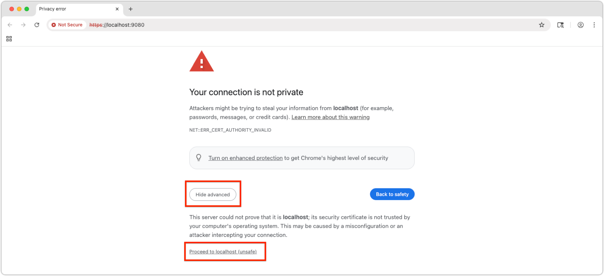
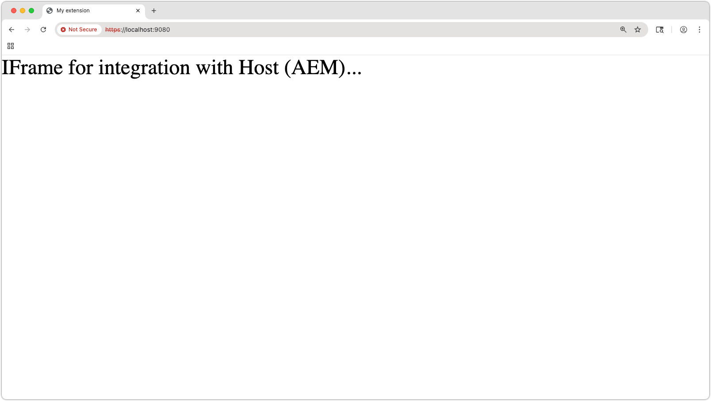
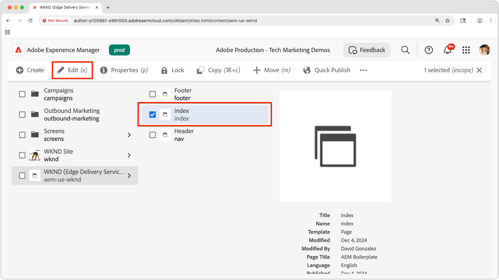
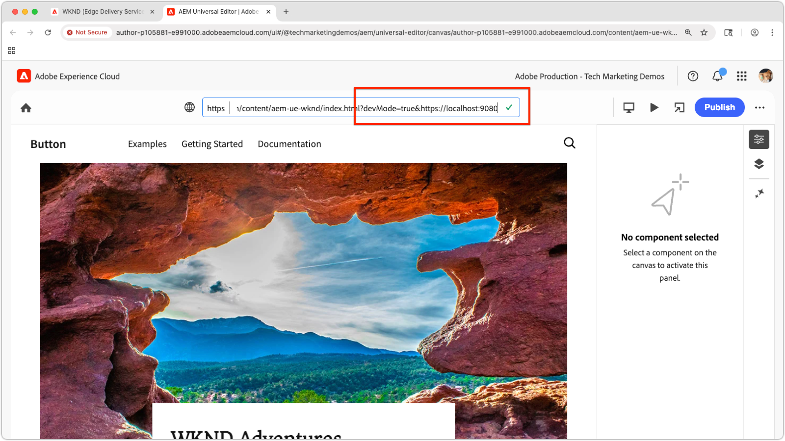
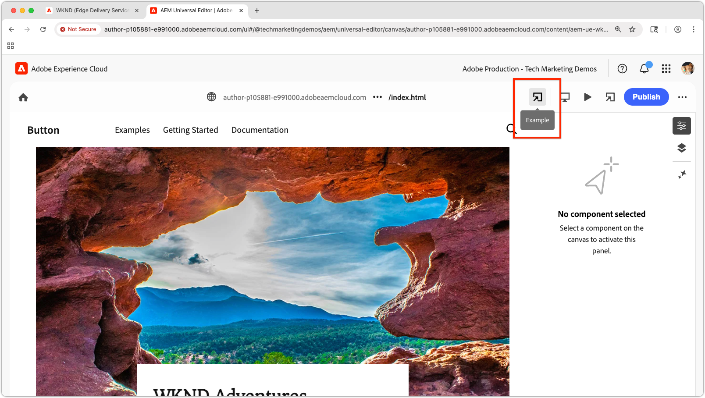

# Preview a local Universal Editor extension

>[!TIP]
> Learn how to [create a Universal Editor extension](https://developer.adobe.com/uix/docs/services/aem-universal-editor/).

To preview a Universal Editor extension during development, you need to:

1. Run the extension locally.
2. Accept the self-signed certificate.
3. Open a page in Universal Editor.
4. Update the location URL to load the local extension.

## Run the extension locally

This assumes you have already created a [Universal Editor extension](https://developer.adobe.com/uix/docs/services/aem-universal-editor/) and want to preview it while testing and developing locally.

Start your Universal Editor extension with:

```bash
$ aio app run
```

You’ll see output like:

```
To view your local application:
  -> https://localhost:9080
To view your deployed application in the Experience Cloud shell:
  -> https://experience.adobe.com/?devMode=true#/custom-apps/?localDevUrl=https://localhost:9080
```

This runs your extension at `https://localhost:9080` by default.


## Accept the self-signed certificate

Universal Editor requires HTTPS to load extensions. Since local development uses a self-signed certificate, your browser must explicitly trust it.

Open a new browser tab and navigate to the local extension URL output by the `aio app run` command:

```
https://localhost:9080
```

Your browser will show a certificate warning. Accept the certificate to proceed.



Once accepted, you’ll see the local extension’s placeholder page:




## Open a page in Universal Editor

Open Universal Editor via the [Universal Editor console](https://experience.adobe.com/#/@myOrg/aem/editor/canvas/) or by editing a page in AEM Sites that uses Universal Editor:




## Load the extension

In Universal Editor, locate the **Location** field at the top center of the interface. Expand it and update the **URL in the Location field**, **not the browser address bar**.

Append the following query parameters:

* `devMode=true` – Enables development mode for Universal Editor.
* `ext=https://localhost:9080` – Loads your locally running extension.

Example:

```
https://author-pXXX-eXXX.adobeaemcloud.com/content/aem-ue-wknd/index.html?devMode=true&ext=https://localhost:9080
```




## Preview the extension

Perform a **hard reload** of the browser to ensure the updated URL is used.

Universal Editor will now load your local extension—only in your browser session.

Any code changes you make locally will be reflected immediately.



