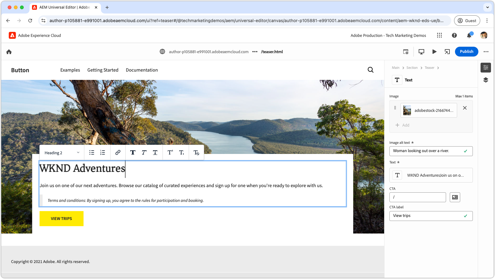

# Edge Delivery Services videos

Learn how to make web sites fast with Edge Delivery Services.

>[!VIDEO](https://video.tv.adobe.com/v/3427989/?learn=on)

Review the [documentation](https://experienceleague.adobe.com/en/docs/experience-manager-cloud-service/content/edge-delivery/overview) for complete details of Edge Delivery Services and its capabilities.

## Edge Delivery Services developer tutorials

<!-- 
CARDS

* https://experienceleague.adobe.com/en/docs/experience-manager-cloud-service/content/edge-delivery/build/tutorial
  {title = Document-based authoring and Edge Delivery Services tutorial}
  {description = Learn how to create Edge Delivery Services web sites authored using Document-based authoring.}
  {cta = Start the tutorial}

* ./developing/universal-editor/0-overview.md
  {title = Universal Editor and Edge Delivery Services tutorial}
  {description = Learn the basics of creating an Edge Delivery Services web sites authored with Universal Editor.}
  {cta = Start the tutorial}

-->
<!-- START CARDS HTML - DO NOT MODIFY BY HAND -->

    

        

            

                <figure class="image x-is-16by9">
                    
                </figure>
            

            

                

                    

                        <a href="https://experienceleague.adobe.com/en/docs/experience-manager-cloud-service/content/edge-delivery/build/tutorial" target="_blank" rel="referrer" title="Document-based authoring and Edge Delivery Services tutorial">Document-based authoring and Edge Delivery Services tutorial</a>
                    

                    
Learn how to create Edge Delivery Services web sites authored using Document-based authoring.

                

                <a href="https://experienceleague.adobe.com/en/docs/experience-manager-cloud-service/content/edge-delivery/build/tutorial" target="_blank" rel="referrer" class="spectrum-Button spectrum-Button--outline spectrum-Button--primary spectrum-Button--sizeM" style="align-self: flex-start; margin-top: 1rem;">
                    Start the tutorial
                </a>
            

        

    

    

        

            

                <figure class="image x-is-16by9">
                    
                </figure>
            

            

                

                    

                        <a href="./developing/universal-editor/0-overview.md" target="_blank" rel="referrer" title="Universal Editor and Edge Delivery Services tutorial">Universal Editor and Edge Delivery Services tutorial</a>
                    

                    
Learn the basics of creating an Edge Delivery Services web sites authored with Universal Editor.

                

                <a href="./developing/universal-editor/0-overview.md" target="_blank" rel="referrer" class="spectrum-Button spectrum-Button--outline spectrum-Button--primary spectrum-Button--sizeM" style="align-self: flex-start; margin-top: 1rem;">
                    Start the tutorial
                </a>
            

        

    

<!-- END CARDS HTML - DO NOT MODIFY BY HAND -->

## Getting started with Edge Delivery Services

    <!-- Prerequisites -->
    

      

        

          <figure class="image is-16by9">
            
          </figure>
        

        

          

            
5 minutes

            

              <a href="./developing/prerequisites.md" title="Prerequisites">Developer prerequisites</a>
            

            
What you will need to start developing with Edge Delivery Services.

            <a href="./developing/prerequisites.md" class="spectrum-Button
              spectrum-Button--outline spectrum-Button--primary
              spectrum-Button--sizeM">
              Watch the video
            </a>
          

        

      

    
 
    <!-- Setting up your Repository-->
    

      

        

          <figure class="image is-16by9">
            
          </figure>
        

        

          

            
1 minute

            

              <a href="./developing/aem-boilerplate.md" title="Use Boilerplate Template">AEM Boilerplate</a>
            

            
Use the AEM Boilerplate template to setup code repository.

            <a href="./developing/aem-boilerplate.md" class="spectrum-Button
              spectrum-Button--outline spectrum-Button--primary
              spectrum-Button--sizeM">
              Watch the video
            </a>
          

        

      

    

    <!-- Linking Google Drive -->
    

      

        

          <figure class="image is-16by9">
            
          </figure>
        

        

          

            
1 minute

            

              <a href="./developing/content-repository.md" title="Link Google Drive">Link Google Drive</a>
            

            
Use Google Drive as the repository for all content.

            <a href="./developing/content-repository.md" class="spectrum-Button
              spectrum-Button--outline spectrum-Button--primary
              spectrum-Button--sizeM">
              Watch the video
            </a>
          

        

      

    

    <!-- Link Sharepoint --->
    

      

        

          <figure class="image is-16by9">
            
          </figure>
        

        

          

            
1 minute

            

              <a href="./developing/content-repository.md" title="Link Sharepoint">Link SharePoint</a>
            

            
Use SharePoint as the repository for all of your content.

            <a href="./developing/content-repository.md"
              class="spectrum-Button spectrum-Button--outline
              spectrum-Button--primary spectrum-Button--sizeM">
              Watch the video
            </a>
          

        

      

    

    <!-- Previewing and Publishing Content -->
    

      

        

          <figure class="image is-16by9">
            
          </figure>
        

        

          

            
1 minute

            

              <a href="./developing/preview-and-publish.md" title="Preview and Publish Content">Preview and publish content</a>
            

            
Preview and publish content using the AEM Sidekick.

            <a href="./developing/preview-and-publish.md" class="spectrum-Button
              spectrum-Button--outline spectrum-Button--primary
              spectrum-Button--sizeM">
              Watch the video
            </a>
          

        

      

    

    <!-- Using the Sidekick -->
    

      

        

          <figure class="image is-16by9">
            
          </figure>
        

        

          

            
1 minute

            

              <a href="./developing/sidekick.md" title="Using the Sidekick">Use the AEM Sidekick</a>
            

            
Learn how to use the AEM Sidekick.

            <a href="./developing/sidekick.md" class="spectrum-Button
              spectrum-Button--outline spectrum-Button--primary
              spectrum-Button--sizeM">
              Watch the video
            </a>
          

        

      

    

 <!-- Document Structure -->
    

      

        

          <figure class="image is-16by9">
            
          </figure>
        

        

          

            
1 minute

            

              <a href="./developing/document-structure.md" title="Document Structure">Document structure</a>
            

            
Explore the document structure including default content, sections and blocks 

            <a href="./developing/document-structure.md" class="spectrum-Button
              spectrum-Button--outline spectrum-Button--primary
              spectrum-Button--sizeM">
              Watch the video
            </a>
          

        

      

    
  
     <!--Local Development -->
    

      

        

          <figure class="image is-16by9">
            
          </figure>
        

        

          

            
2 minutes

            

              <a href="./developing/local-development.md" title="Local Development">Local development</a>
            

            
Configure your local development environment.

            <a href="./developing/local-development.md" class="spectrum-Button
              spectrum-Button--outline spectrum-Button--primary
              spectrum-Button--sizeM">
              Watch the video
            </a>
          

        

      

    

    <!--Integrate with Git -->
    

      

        

          <figure class="image is-16by9">
            
          </figure>
        

        

          

            
2 minutes

            

              <a href="./developing/git.md" title="Integrate with Git">Integrate with Git</a>
            

            
Configure Git and Edge Delivery Services.

            <a href="./developing/git.md" class="spectrum-Button
              spectrum-Button--outline spectrum-Button--primary
              spectrum-Button--sizeM">
              Watch the video
            </a>
          

        

      

    

    

## How-to videos

    <!--Create RSS Feeds -->
    

      

        

          <figure class="image is-16by9">
            
          </figure>
        

        

          

            
2 minutes

            

              <a href="./how-to/rss.md" title="Create RSS Feeds">Create RSS feeds</a>
            

            
Learn how to create RSS feeds.

            <a href="./how-to/rss.md" class="spectrum-Button
              spectrum-Button--outline spectrum-Button--primary
              spectrum-Button--sizeM">
              Watch the video
            </a>
          

        

      

    

    <!--Social Media Sharing -->
    

      

        

          <figure class="image is-16by9">
            
          </figure>
        

        

          

            
2 minutes

            

              <a href="./how-to/social-media-sharing.md" title="Social Media Sharing">Social Media Sharing</a>
            

            
Learn how to optimize your content for social media sharing.

            <a href="./how-to/social-media-sharing.md" class="spectrum-Button
              spectrum-Button--outline spectrum-Button--primary
              spectrum-Button--sizeM">
              Watch the video
            </a>
          

        

      

    

    <!--Delete a Page -->
    

      

        

          <figure class="image is-16by9">
            
          </figure>
        

        

          

            
2 minutes

            

              <a href="./how-to/delete-page.md" title="Deleting Pages">Deleting Pages</a>
            

            
Learn how to delete pages.

            <a href="./how-to/delete-page.md" class="spectrum-Button
              spectrum-Button--outline spectrum-Button--primary
              spectrum-Button--sizeM">
              Watch the video
            </a>
          

        

      

    
    
  

